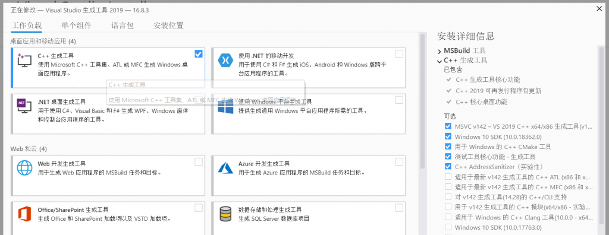
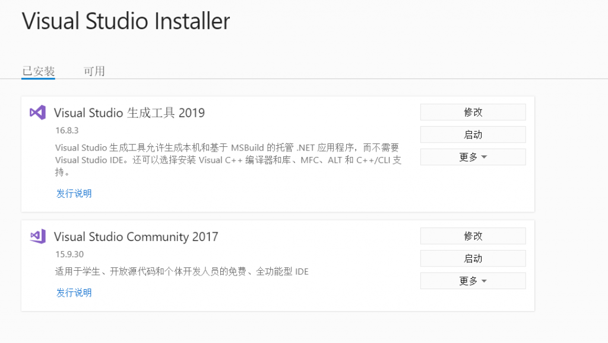
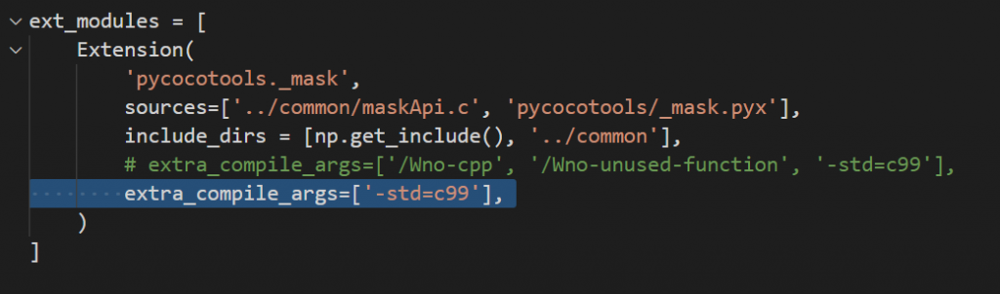
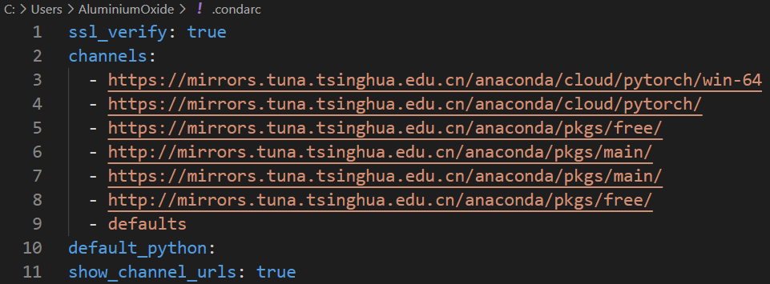
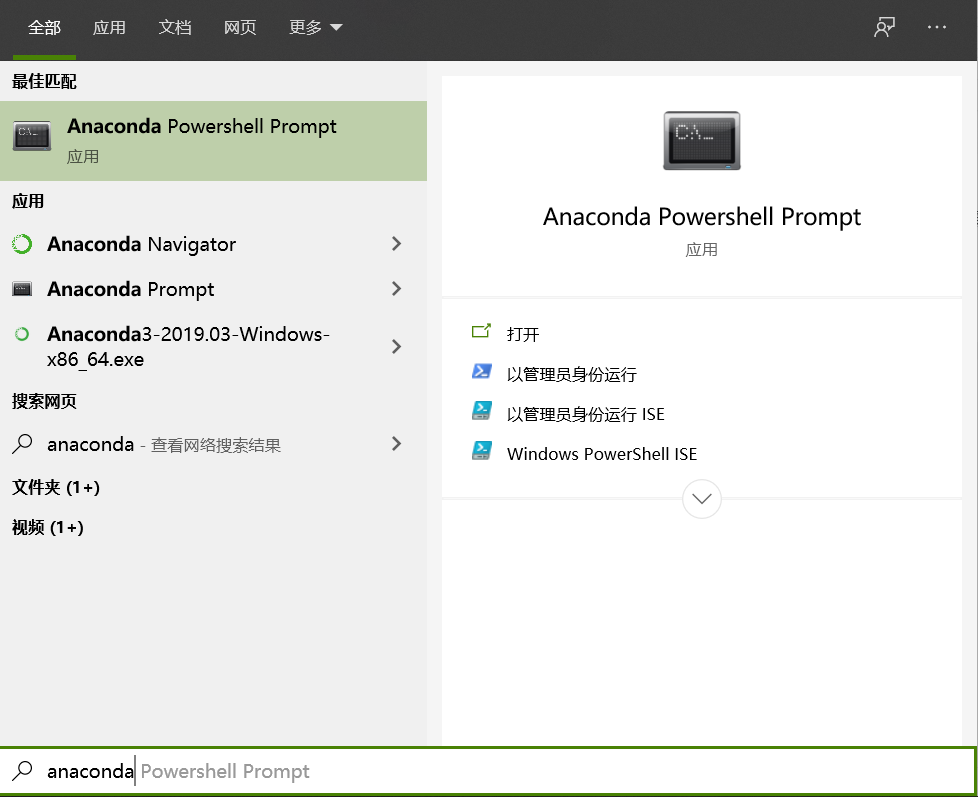
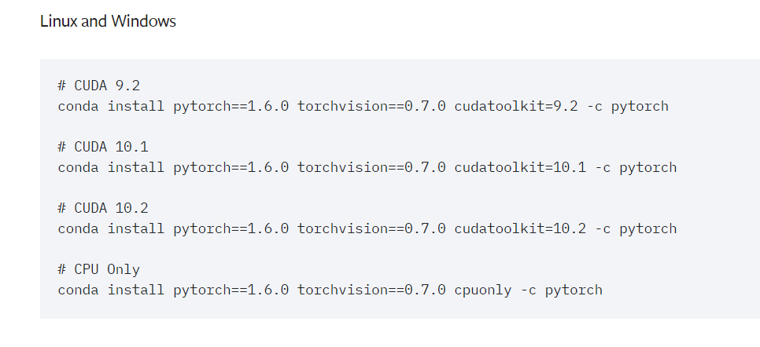
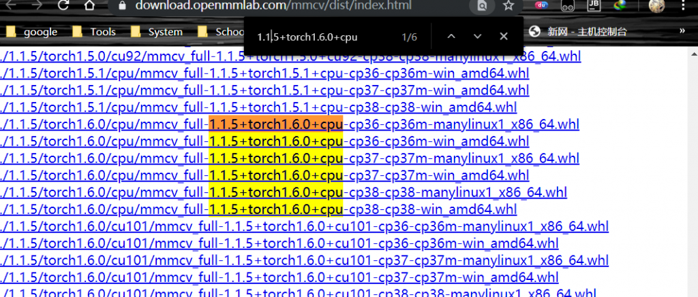
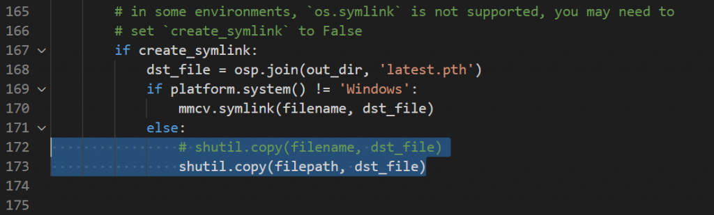
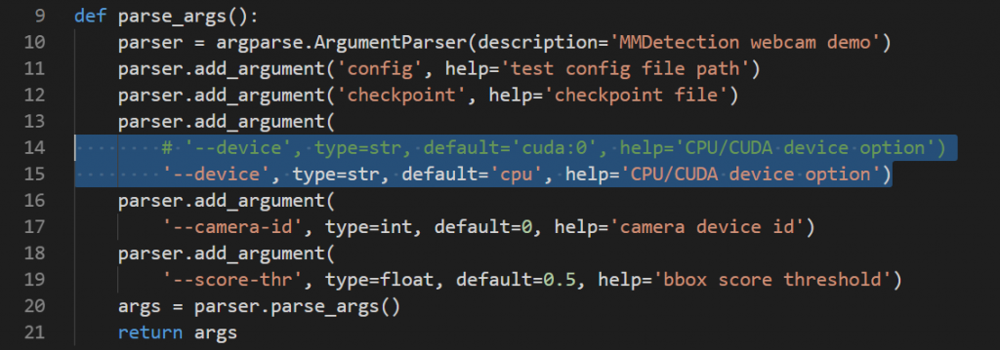
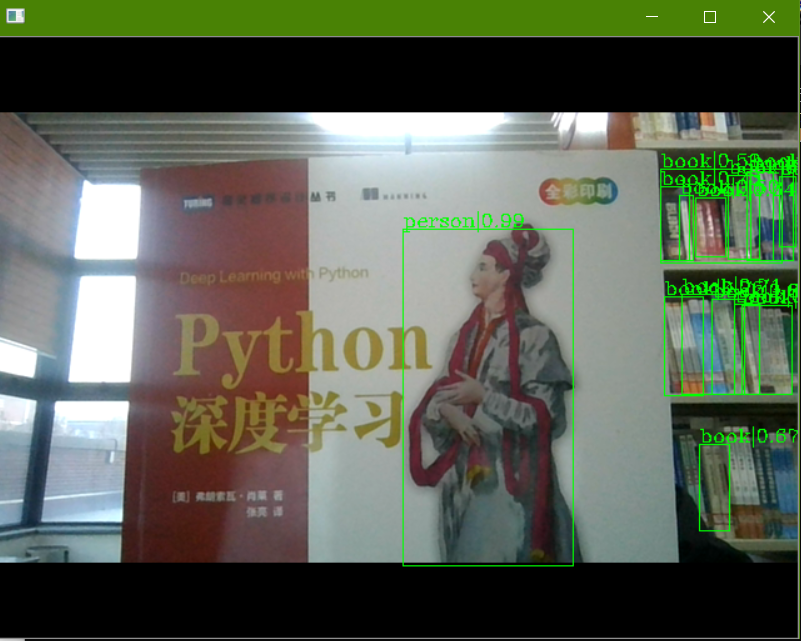

**请参考Github文档（所有链接坏了请左转链接虚拟私有网，或者找可能附带大礼包的安装程序）**禁止转载

### **安装vistual studio**

都上微软官网下载[vistual studio installer](https://visualstudio.microsoft.com/zh-hans/visual-cpp-build-tools/)然后在安装C++生成工具，默认的就行，我的是这样，大概需要下载几G

这里给一下 Microsoft Visual C++ 版本：  
         **Visual Studio 2013 ---> 12  
         Visual Studio 2015 ---> 14  
         Visual Studio 2017 ---> 15**

 python3 是用 VC++ 14 编译的, python27 是 VC++ 9 编译的, 安装 python3 的包需要编译的也是要 VC++ 14 以上支持的.（直接2019搞上）



别问我怎么知到的，你可以考虑所有后续操作后结束后，谁便运行一波然后

```
ImportError: No module named 'pycocotools'
```

而且你要是没安上面那个你pip install pycocotools会直接报错

说正事：安完之后如下，（忽略后面那个vs2017，那是大一上C语言安的）



首先打开安装至少2019版本的[anaconda](https://www.anaconda.com/products/individual)（前提是要保证anaconda有python3.7）至于这玩意怎么安装？左转一路默认

安装完后记得把环境变量添加上：C:\\Program Files (x86)\\Microsoft Visual Studio\\2019\\BuildTools\\VC\\Tools\\MSVC\\14.28.29333\\bin\\Hostx86\\x64（添加不会去看你python安装时如何添加系统路径的！要是现在安装程序能自动添加了去问wamp、lingo这堆软件怎么安装的）在powershell输出cl不出现没有这个文件或路径就行

### **安装 pycocotools**

从 https://github.com/pdollar/coco.git 这个网址下载源码（直接把压缩包下下来），解压到本地放在一个英文路径下，保险起见只有英文（和anaconda要求一样，不过我建议连 \_ 也不要有，我和前辈一样扔在这里Anaconda3/Tools/cocoapi-master）

进入cocoapi-master/PythonAPI文件夹，在此处打开Powershell窗口（shift+鼠标右键，就能看到），运行命令：

```
python setup.py build_ext --inplace
```

如果运行不报错更好，报错的话如果是cl: 命令行 error D8021 :无效的数值参数“/Wno-cpp” 和 cl: 命令行 error D8021 :无效的数值参数“/Wno-unused-function”，不用担心，打开此目录下setup.py文件，直接删除这两个参数就可以。



然后再运行上面的命令，就没问题了。

上一步没问题后，继续在Powershell窗口运行命令：

```
python setup.py build_ext install
```

完成安装后说正事

### **conda镜像**

这就和小鸡炖技术的一样了，如果哪里出问题再补

先搞上镜像，要是没有，（我知道你们不爱用powershell，黑脸）这是我的conda镜像，pip除了多了一个阿里的基本都一样，在你的用户文件夹下创建一个.condarc文件用记事本打开复制下面内容保存



.condarc

```
ssl_verify: true
channels:
  - https://mirrors.tuna.tsinghua.edu.cn/anaconda/cloud/pytorch/win-64
  - https://mirrors.tuna.tsinghua.edu.cn/anaconda/cloud/pytorch/
  - https://mirrors.tuna.tsinghua.edu.cn/anaconda/pkgs/free/
  - http://mirrors.tuna.tsinghua.edu.cn/anaconda/pkgs/main/
  - https://mirrors.tuna.tsinghua.edu.cn/anaconda/pkgs/main/
  - http://mirrors.tuna.tsinghua.edu.cn/anaconda/pkgs/free/
  - defaults
default_python:
show_channel_urls: true
```

### 制作conda虚拟环境

直接win + anaconda 打开anaconda powershell prompt（别问为啥用这个，你要是喜欢没有自动填充和高亮，每敲一句都在跟你说这个工具马上就要淘汰了，那就去点开那个没有powershell 的,,,我还想用virualvenv呢!）



执行以下命令（conda env list查看当前文件）

```
conda create -n protoMmdetection26 python=3.7
conda activate protoMmdetection26
```

和小鸡炖技术的一样，不过留个心眼，后面咱们是没有cuda的打工人，没有GPU的打工人需要执行以下代码，安装 Pytorch，根据需要安装支持 CUDA 或不支持 CUDA 版本，根据目前的测试，至少需要安装 1.6.0 以上版本的 Pytorch，关于正确下载指令请参考[pytorch官网](https://pytorch.org/get-started/previous-versions/)，执行以下安装无1.6pytorch CPU版本



```
conda install pytorch==1.6.0 torchvision==0.7.0 cpuonly -c pytorch
```

我认为你已经成功创建了虚拟环境，而且也在里面安装了pytorch

建议此时退出虚拟环境创建一个可以随便搞的（不爱搞也可以选择忽略）

```
conda deactivate
conda create -n mmdetection26 --clone protoMmdetection26
conda activate mmdetection26
```

然后我默认你的powershell里是这样

```
(mmdetection) PS C:\Users\你的用户名>
```

### 安装MMCV

建议直接翻[官方文档](https://github.com/open-mmlab/mmdetection/blob/master/docs/get_started.md)根据你要安装的MMdetection 选定MMCV版本，要是选择2.6.0，那就安装1.1.5到1.3的MMCV

| MMDetection version | MMCV version |
| --- | --- |
| master | mmcv-full>=1.1.5, <1.3 |
| 2.7.0 | mmcv-full>=1.1.5, <1.3 |
| 2.6.0 | mmcv-full>=1.1.5, <1.3 |
| 2.5.0 | mmcv-full>=1.1.5, <1.3 |
| 2.4.0 | mmcv-full>=1.1.1, <1.3 |
| 2.3.0 | mmcv-full==1.0.5 |
| 2.3.0rc0 | mmcv-full>=1.0.2 |
| 2.2.1 | mmcv==0.6.2 |
| 2.2.0 | mmcv==0.6.2 |
| 2.1.0 | mmcv>=0.5.9, <=0.6.1 |
| 2.0.0 | mmcv>=0.5.1, <=0.5.8 |

而且如果是pytorch+CPU，那么直接抄下面指令就OK

```
pip install mmcv-full==1.1.5+torch1.6.0+cpu -f https://download.openmmlab.com/mmcv/dist/index.html --trusted-host download.openmmlab.com
```

要是你认为你的电脑能直接下载，那可以直接删掉--trusted-host和后面的内容，要是你认为你的电脑网络环境实在太差，那直接[来这](https://download.openmmlab.com/mmcv/dist/index.html)搜索，下载对应windows的whl文件，比如咱用python3.7的，那就下载mmcv\_full-1.1.5+torch1.6.0+cpu-cp37-cp37m-win\_amd64.whl



下载完后扔在C盘根目录执行

```
pip install C:\mmcv_full-1.1.5+torch1.6.0+cpu-cp37-cp37m-win_amd64.whl
```

### **安装mmdetection2.6**

一路cd 目录到你在github下载的[mmdetection](https://github.com/open-mmlab/mmdetection)，要是没有点击链接下载zip 或者执行下面两句直接在当前目录克隆

```
git clone https://github.com/open-mmlab/mmdetection.git
cd mmdetection
```

然后执行这两句的一个（看你下的是哪个）

```
pip install -r requirements.txt                    //这个是小鸡炖技术的
pip install -r requirements/build.txt              //这个是直接原版镜像的
```

然后执行下面两句中的一个，我推荐直接python setup.py develop

```
pip install -v -e . 
python setup.py develop
```

补充：小鸡的代码还需执行这句：`pip install opencv-python==4.2.0.34`

以及无论是哪个mmdetection,在\\Anaconda3\\envs\\mmd26\\Lib\\site-packages\\mmcv\\runner\\epoch\_based\_runner.py 把filename改成filepath



### **验证**

原版：为了验证MMDetection和所需的环境是否正确安装，我们可以运行示例python代码来初始化检测器并推断出演示图像：(老谷鸽翻译了)

```
from mmdet.apis import init_detector, inference_detector

config_file = 'configs/faster_rcnn/faster_rcnn_r50_fpn_1x_coco.py'
# device = 'cuda:0'  # 这个没有gpu的cpu们一定要改!

device = 'cpu'
# init a detector
model = init_detector(config_file, device=device)
# inference the demo image
inference_detector(model, 'demo/demo.jpg')
```

要是能运行就OK

小鸡：powershell执行以下代码，执行之前需要把./demo/webcam\_demo.py中的这里改一下（毕竟是没有GPU的打工人嘛）



```
python demo/webcam_demo.py configs/faster_rcnn/faster_rcnn_r50_fpn_1x_coco.py checkpoints/faster_rcnn_r50_fpn_1x_coco_20200130-047c8118.pth
```

能正常出图就ok(就如同下面这样一样)



前提是你的cpu能跑得动，当faster rcnn处理一张图片直接卡死后(8250u处理一张图要20多秒)就该考虑趁早换个gpu了。
