MMCV 是一个面向计算机视觉的基础库，它支持了很多开源项目，提供了众多功能，

并且MMCV 有两个版本：  
|-**\-- mmcv-full**: 完整版，包含所有的特性以及丰富的开箱即用的 CUDA 算子。注意完整版本可能需要更长时间来编译。  
|--- **mmcv**: 精简版，不包含 CUDA 算子但包含其余所有特性和功能，类似 MMCV 1.0 之前的版本。如果你不需要使用 CUDA 算子的话，精简版可以作为一个考虑选项。

但是由于在使用安装最新版本时（来自[MMCV的github](https://github.com/open-mmlab/mmcv/blob/master/README.md)）

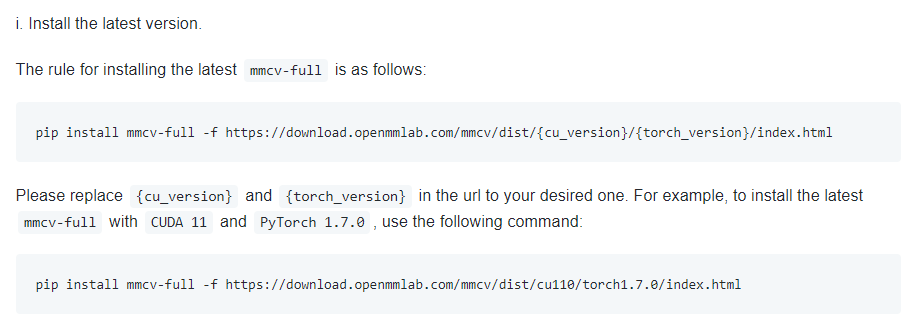

但当你打开https://download.openmmlab.com/mmcv/dist/ 寻找windows的轮子时

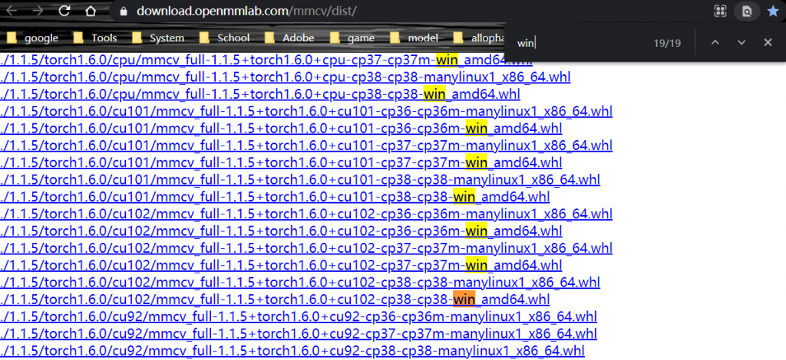

并且看到这个鬼东西

| MMDetection version | MMCV version |
| --- | --- |
| master | mmcv-full>=1.3.3, <1.4.0 |
| 2.12.0 | mmcv-full>=1.3.3, <1.4.0 |
| 2.11.0 | mmcv-full>=1.2.4, <1.4.0 |
| 2.10.0 | mmcv-full>=1.2.4, <1.4.0 |
| 2.9.0 | mmcv-full>=1.2.4, <1.4.0 |
| 2.8.0 | mmcv-full>=1.2.4, <1.4.0 |
| 2.7.0 | mmcv-full>=1.1.5, <1.4.0 |
| 2.6.0 | mmcv-full>=1.1.5, <1.4.0 |
| 2.5.0 | mmcv-full>=1.1.5, <1.4.0 |
| 2.4.0 | mmcv-full>=1.1.1, <1.4.0 |

那岂不是说win10最多只能装到2.7吗？匹配的mmcls、mmdet、mmseg都没法安装新版本，没法安装最新版本就说明没有那些更新的模型，没有更新的模型就没法装13，没法装13就不快乐，没有快乐，我，，，啊这


起初我也以为win10不配玩open-mmlab，直到看到了[MMCV的文档](https://mmcv.readthedocs.io/)，起飞。

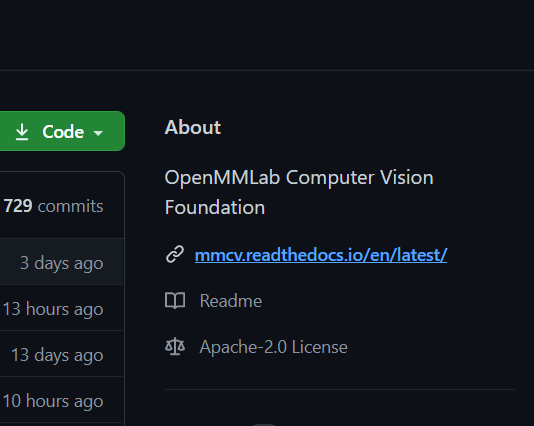

直接快进到[windows源码编译](https://mmcv.readthedocs.io/en/latest/build.html#build-on-windows)

首先需要设置python基础环境  
默认能看到这篇文章已安装以下环境**（算了，根本没人看(╯‵□′)╯︵┻━┻）**  
|---anaconda # 当然，只要能有python3.6以上的环境也行，  
|---cuda10.2 # 没有N卡那就直接玩CPU的吧，不过对8250u来说，拿faster-RCNN测试（没错，是测试不是训练）一张都需要10秒，安装与升级看[这篇文章](http://aluminium/allophane.com/index.php/2021/05/04/about_cuda_install/)  
|---cudnn # cuda加速工具，反正注册不要钱，不安也不会死的

根据描述，你需要安装Git、VS2019、conda、CUDA

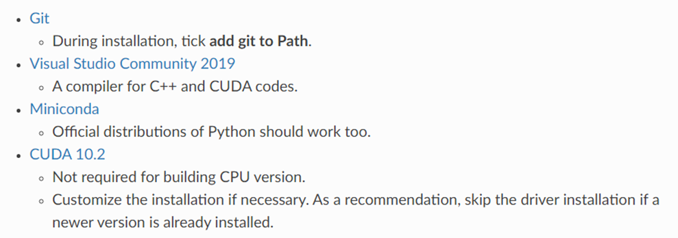

这里解释一下  
git 不爱装(不会装)，没必要安装，除非你想安装(似乎我除了一年前玩laravel时用git，退坑PHP就再也没碰过这玩意(╯‵□′)╯︵┻━┻)  
VS2019 你可以只装VC++编译工具(毕竟咱只要C++环境，不会吧不会吧，不会现在有人玩python不用pycharm或VS code去用Vistual studio吧)，除非你特别想安装VS系列产品 ——那个新手不清楚功能安装导致比安了一堆环境AndroidStudio还大的恐怖存在  
conda 你头铁不用anaconda也可以，只要你不怕炸环境  
CUDA 你可以不装，用CPU跑又不是不行（一杯咖啡一核显，一个网络跑一天）

vc++生成工具MSVC，下载来[这里](https://visualstudio.microsoft.com/zh-hans/visual-cpp-build-tools/)，或者直接度娘，至于具体操作，看我之前安装[mmdet2.6的CPU版本](http://aluminium/allophane.com/index.php/2020/12/09/mmdetection2-6-win10-without-cuda-install/)


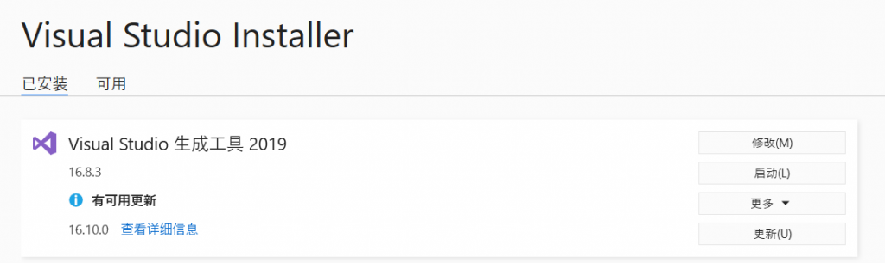

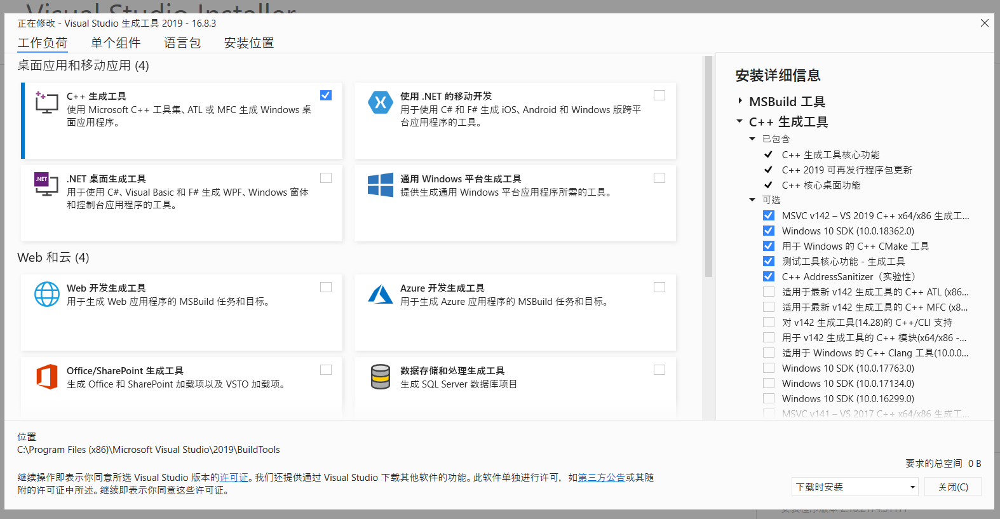

并设置MSVC编译器，保证这条环境变量存在，且：为了兼容性，我们使用x86托管和x64定位的编译器。`Hostx86\x64`在路径中注意。

```
C:\Program Files (x86)\Microsoft Visual Studio\2019\Community\VC\Tools\MSVC\14.27.29110\bin\Hostx86\x64
```

上面那行环境变量来自文档，不过你们添加时注意一下，版本不一定是14.27.29110，而且C++生成工具和VS2019的细节路径不太一样，主要就是为了：so that `**cl.exe**` will be available in prompt, as shown below. 也就是保证cl.exe在环境变量下，能被prompt调用。

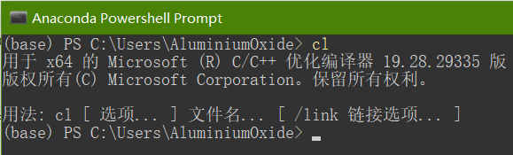

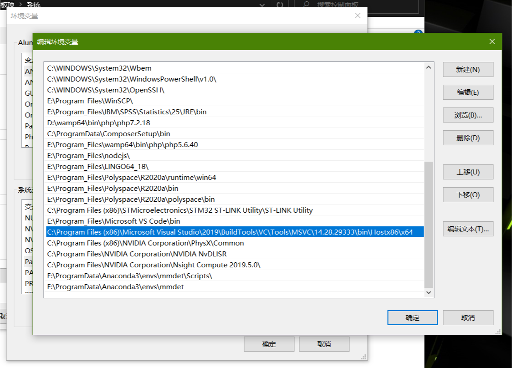

以下这句官方文档机翻：您可能需要将系统语言更改为英语，因为pytorch会解析来自的文本输出`cl.exe`以检查其版本。但是，只能识别utf-8。导航到控制面板->区域->管理->非Unicode程序的语言，并将其更改为英语。

官方文档里有3中编译方法，mmcv、mmcv-full-cpu、mmcv-full-cuda  
我直接快进到Build MMCV (full version with CUDA)

确保CUDA\_PATH或CUDA\_HOME已通过via设置，所需的输出如下所示：ls env（这是MMCV文档里说的）

```
(base) PS C:\Users\WRH> ls env:

Name                           Value
---- -----
<... omit some lines ...>
CUDA_PATH                      C:\Program Files\NVIDIA GPU Computing Toolkit\CUDA\v10.2
CUDA_PATH_V10_1                C:\Program Files\NVIDIA GPU Computing Toolkit\CUDA\v10.1
CUDA_PATH_V10_2                C:\Program Files\NVIDIA GPU Computing Toolkit\CUDA\v10.2
<... omit some lines ...>
```

说成人话就是CUDA\_PATH和CUDA\_HOME在环境变量里，而且这俩变量如果不搞些奇怪的事，或者专门删，在安装CUDA时会已经添加在环境变量里

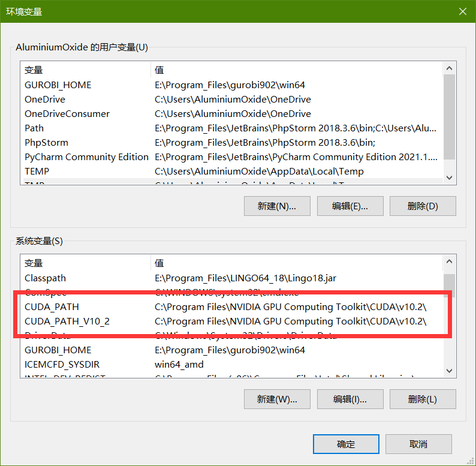

并根据你的N卡设置CUDA target arch（说人话就是别让卡跑炸了，先做点限制）

\# Suppose you are using GTX 1080, which is of capability 6.1  
# 滚啦，我的XM150只能参考GeForce GTX650Ti=3.0根据提示只能设置3.5(╯‵□′)╯︵┻━┻
$env:TORCH\_CUDA\_ARCH\_LIST="6.1"
# OR build all suppoted arch, will be slow
$env:TORCH\_CUDA\_ARCH\_LIST="3.5 3.7 5.0 5.2 6.0 6.1 7.0 7.5"

查看GPU性能参考[这里](https://developer.nvidia.com/cuda-gpus)

\# 这里是对CPU编译进行的设置，虽然感觉可能对于有N卡的玩家没必要，不过还是建议都设置一下
$env:MMCV\_WITH\_OPS = 1
$env:MAX\_JOBS = 8  _\# based on available number of CPU cores and amount of memory_
# 但考虑到我的8250u是四核8线程，所以这里只能设置4 (╯‵□′)╯︵┻━┻

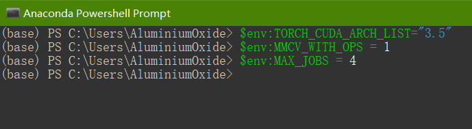

以上是我的笔记本设置（无处不体现出18年轻薄本的拉跨(╬▔皿▔)凸）

然后就可以开开心心安装MMCV啦

先创建conda环境

```
conda create -n openmmlab python=3.7
conda activate openmmlab
```

然后开始下载pytorch版本，注意在MMCV的github里对应支持关系，比如我现在安装的CUDA是10.2，对应的torch版本在1.5~1.8，去[pytorch官网](https://pytorch.org/get-started/previous-versions/)找对应的版本

| CUDA | torch 1.8 | torch 1.7 | torch 1.6 | torch 1.5 | torch 1.4 | torch 1.3 |
| --- | --- | --- | --- | --- | --- | --- |
| 11.1 |  install |  |  |  |  |  |
| 11.0 |  |  install |  |  |  |  |
| 10.2 |  install |  install |  install |  install |  |  |
| 10.1 |  install |  install |  install |  install |  install |  install |
| 9.2 |  |  install |  install |  install |  install |  install |
| cpu |  install |  install |  install |  install |  install |  install |

根据B站大神WZ佬的描述，1.6才加入了混合精度（AMP）训练，反正我是建议最好安1.6以上的，就算不用mmcv，复现别人的实例也不用再建一个环境  
那我直接安装1.8（用pip还是conda看你自己喜好，我个人感觉pip快点，看个人习惯，左转[pip加镜像](http://aluminium/allophane.com/index.php/2020/12/14/china-pip-image/)）

```
# 使用conda 安装 CUDA 10.2 （两句代码用一个就行）
conda install pytorch==1.8.0 torchvision==0.9.0 torchaudio==0.8.0 cudatoolkit=10.2 -c pytorch
# 使用 pip 安装 CUDA 10.2
pip install torch==1.8.0 torchvision==0.9.0 torchaudio==0.8.0
```

然后就是下载MMCV了，没有git，直接进[github](https://github.com/open-mmlab/mmcv)\>code>download ZIP

```
git clone https://github.com/open-mmlab/mmcv.git
```

打开prompt进入conda环境，进入到你下载MMCV的文件夹(就是进入解压后得到的mmcv-master文件夹内)

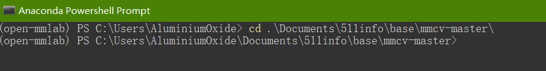

然后根据描述执行编译和启动，编译出问题的话请检查VC++有没有成功添加到路径，这两步都需要一段时间(也可能是我的电脑拉跨)

```
# build
python setup.py build_ext # if success, cl will be launched to compile ops
# install
python setup.py develop
# check
pip list
```

最后只要pip list能检查到mmcv-full成功安装就成功了（忽略cls、det、seg，这些玩意以后有空再说）

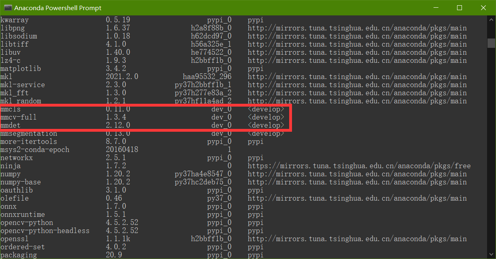

最后补上MMCV文档下面的机翻  
**注意**：如果你就是硬着头皮页要用PyTorch1.6.0编译，一定会在pytorch里遇到[这个问题](https://github.com/pytorch/pytorch/issues/42467)。按照[这里的提示](https://github.com/pytorch/pytorch/pull/43380/files)在本地安装的PyTorch中修改源代码。  
如果您在运行或编译mmcv时遇到问题，商汤科技的大佬们将在[TROUBLESHOOTING中](https://mmcv.readthedocs.io/en/latest/trouble_shooting.html)列出一些常见问题。
