大致分为：

### - 配置虚拟局域网

### - windows安装

### - Linux安装

1.配置虚拟局域网

首先进入[官网](https://www.zerotier.com/)

[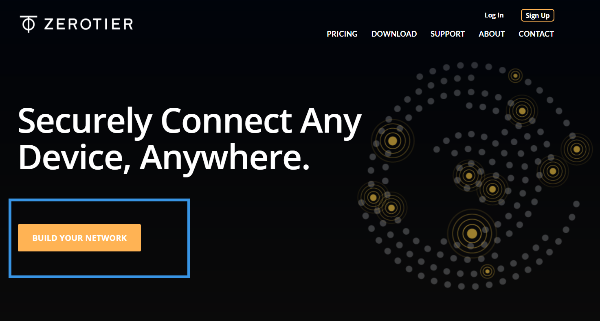](https://www.zerotier.com/)

进入建立局域网页面，这里会让你注册，不过这个可以使用微软账号，拿这不乱注册？（虽然用不到）


登陆后会自动跳转到[这个页面](https://my.zerotier.com/)点击创建一个新的网络，创建后会在线面显示。

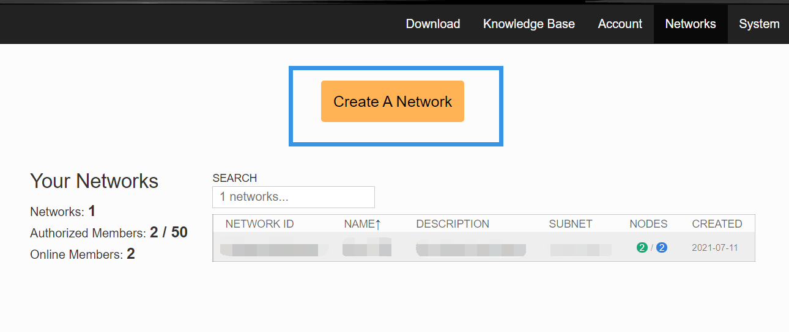

创建后进入，进行相关设置，不多说了，都在图上

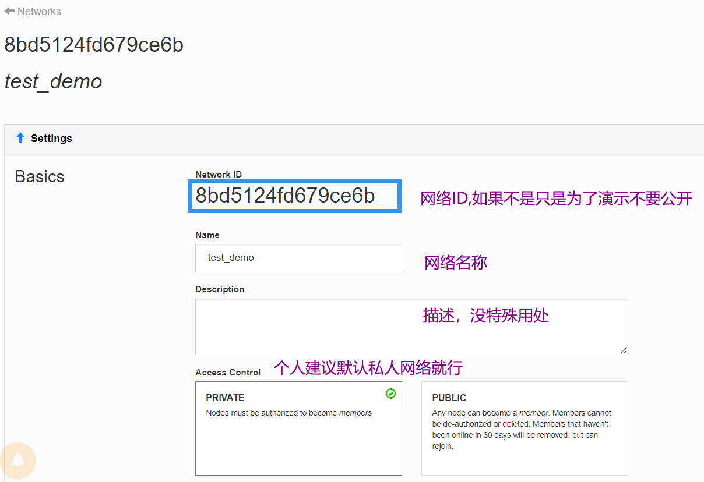

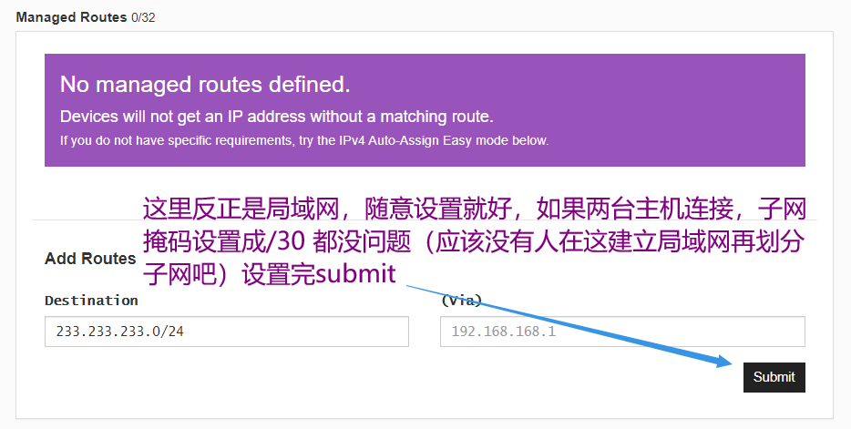


，不是，还真可能有生物这么干(╯‵□′)╯︵┻━┻

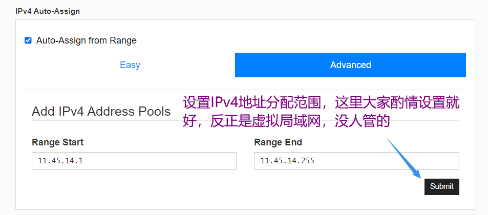

我这里相当于把地址分配为：11.45.14.1~11.45.14.255

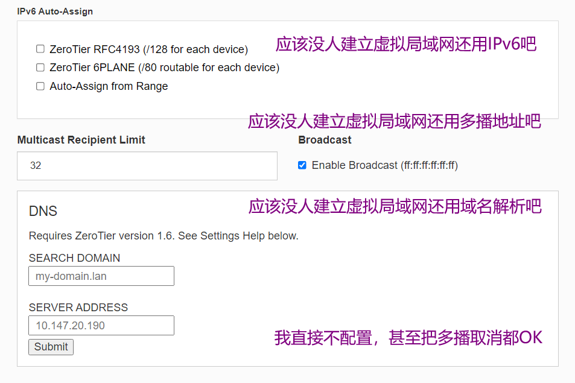

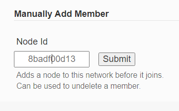

这个添加成员可以手动添加一会你在电脑上安装客户端产生的ID，也可以选择使用客户端添加网络ID加入网络，我的建议是通过客户端添加网络ID

2.Windows安装

不是这个用讲？进[网站](https://www.zerotier.com/download/)

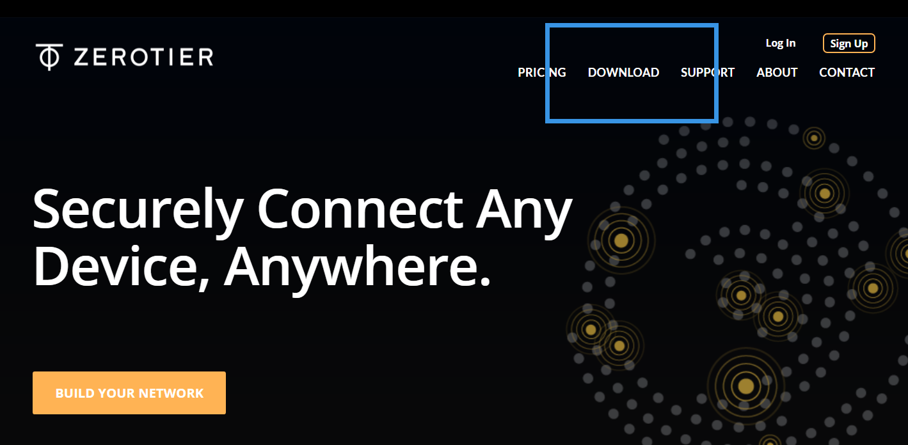

直接点这个图标就行，或者你直接点这个图片，下载msi的安装文件

[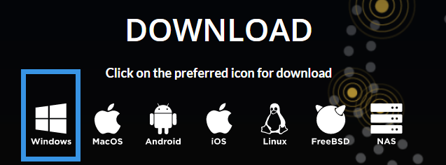](https://download.zerotier.com/dist/ZeroTier%20One.msi)

安装过程是真的太简单以至于没得说了，点击启动

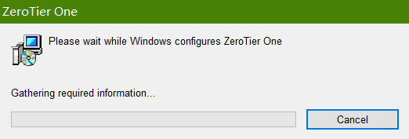

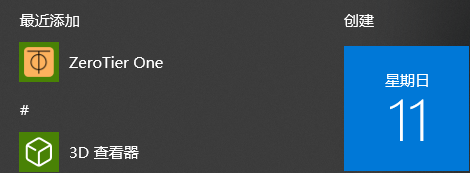

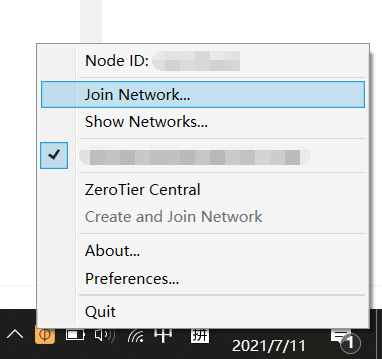

启动会有你的NodeID，你可以选择在刚才建立网络的地方添加ID号，也可以点击join Network加入局域网，这里点击后添加Network ID：8bd5124fd679ce6b

记得勾选allow Global，DNS可以忽略，域名解析不需要！

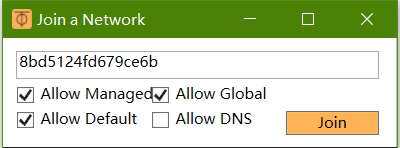


加入后会提示网络发现，确认，随后这里会出现新的已加入列表

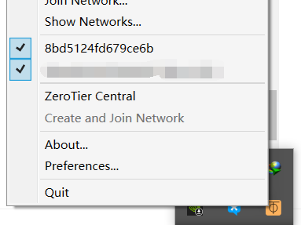

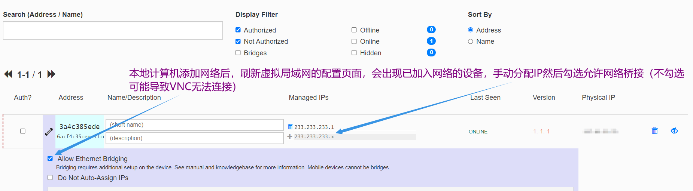

不要在意我的版本没有显示(￣﹏￣；)

3.Linux安装(Ubuntu)

事实上应用商店能直接安装，那我还说吗？而且这介绍界面连带着安装和使用都写了(╯‵□′)╯︵┻━┻

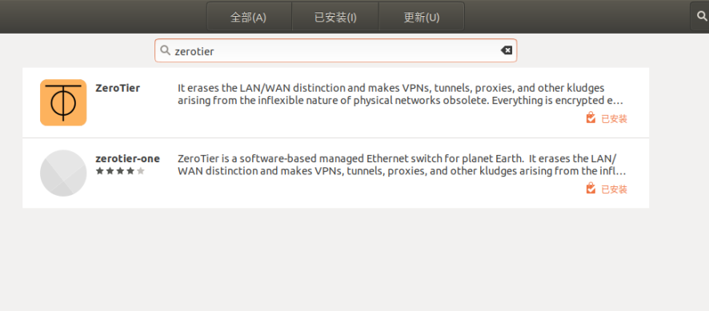

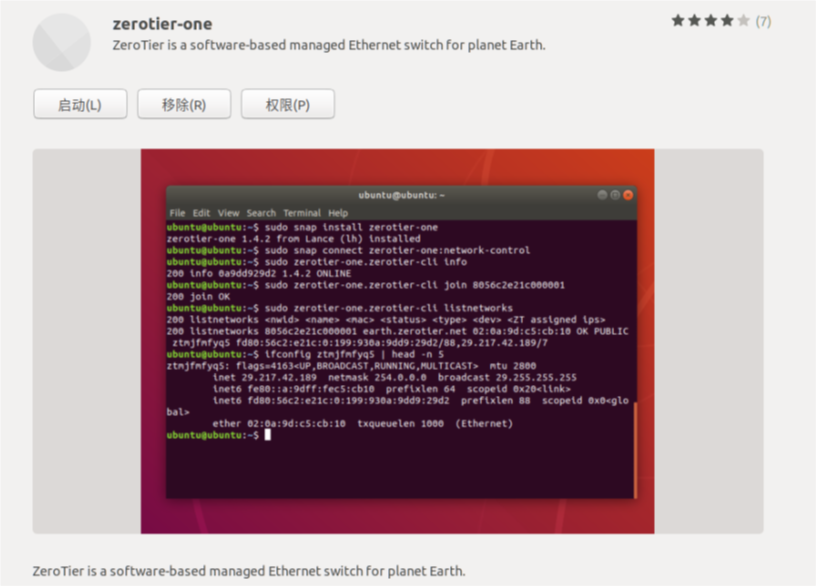

咳咳，说正经的 Ctrl+Alt+T 输入以下代码安装

```
curl -s https://install.zerotier.com | sudo bash
```

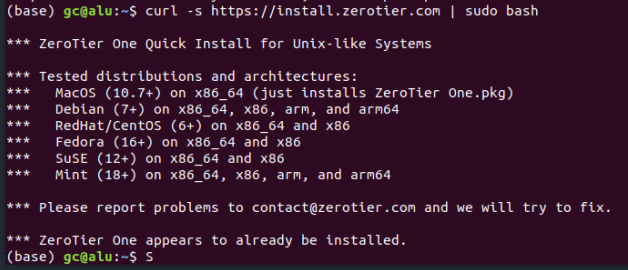

然后不要像网上提示一样检查状态，直接检查不到var里的文件我也管不到，直接根据提示加入网络

```
sudo zerotier.zerotier-cli join <你的网络ID>
```

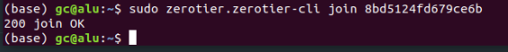

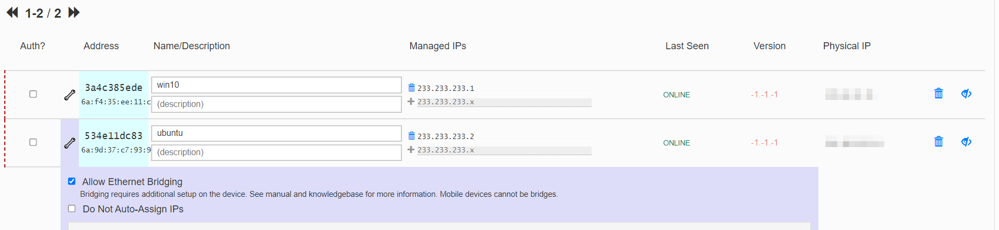

加入后操作同刚才windows加入网络，允许桥接并设置IP  
理论上现在已经配置完了，不确定可以去ifconfig看一下是不是多出了新的网络

4.VNC连接，或者远程桌面连接

略，VNC viewer直接连接你设置给服务器的Managed IP 就可以了，当然，ssh也可以，不过好像需要额外的工具

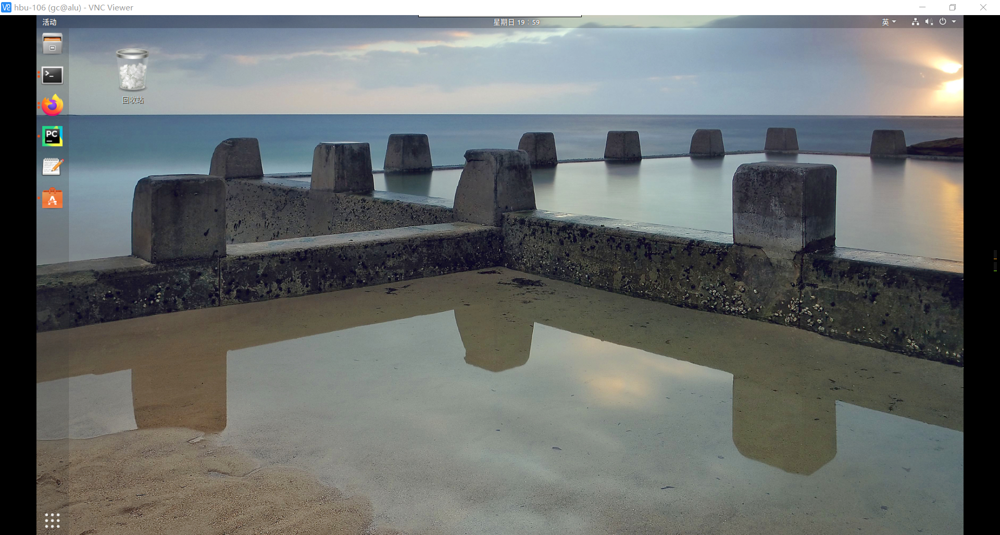
