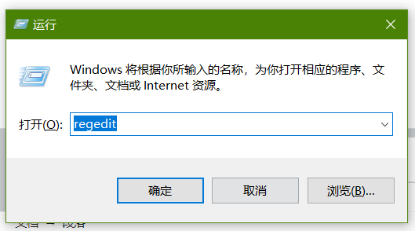
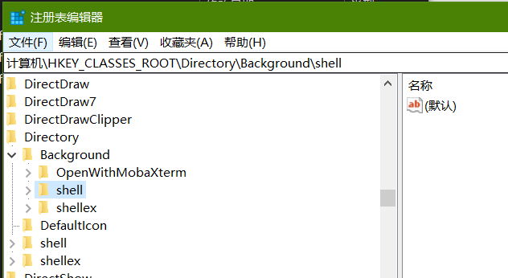
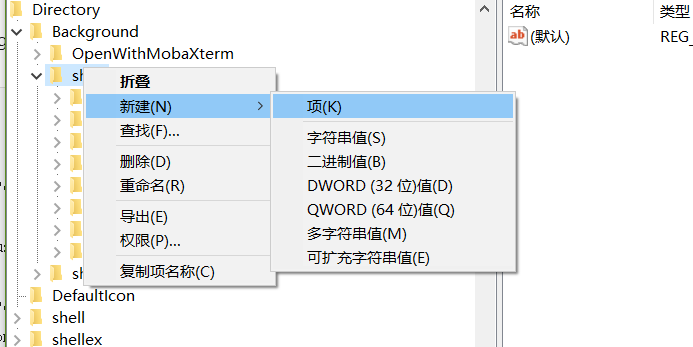
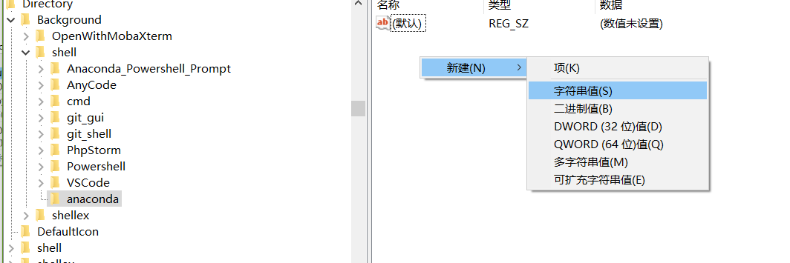
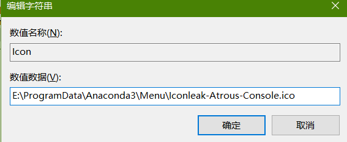
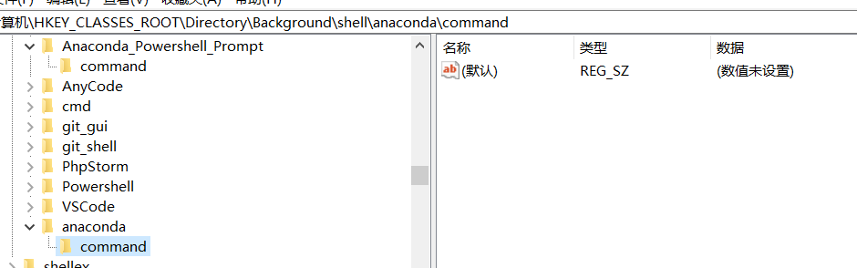
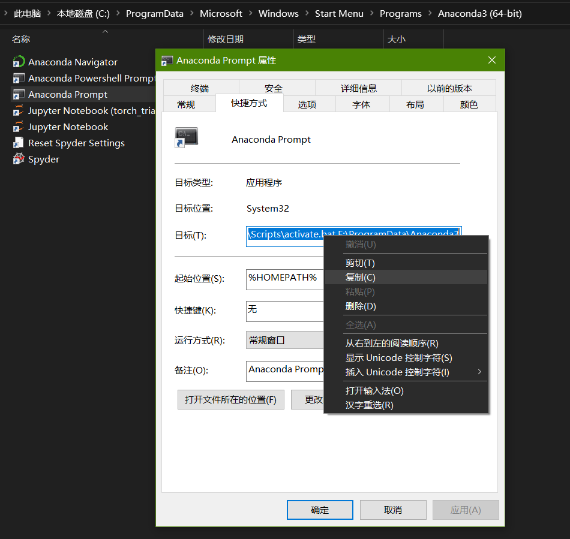
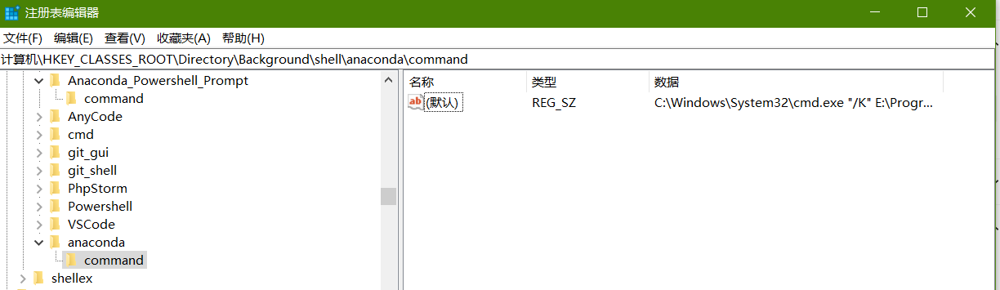
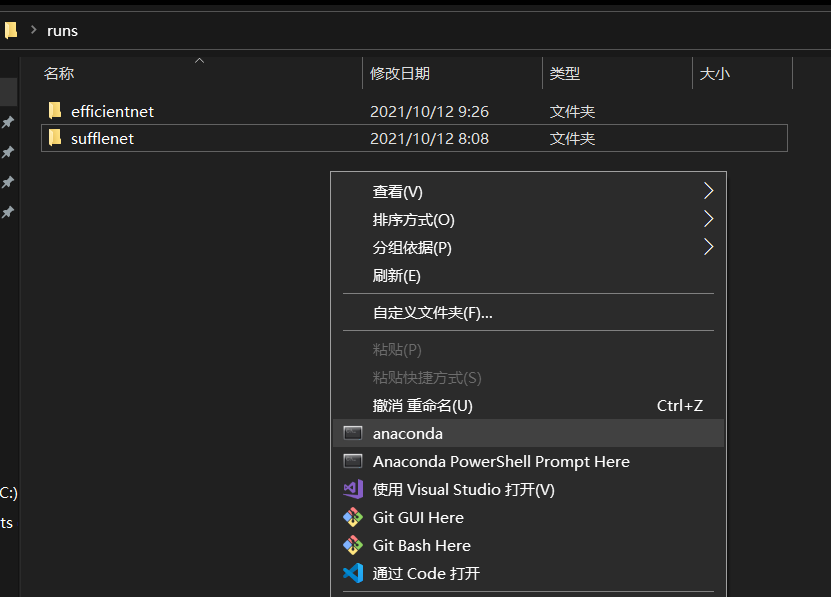
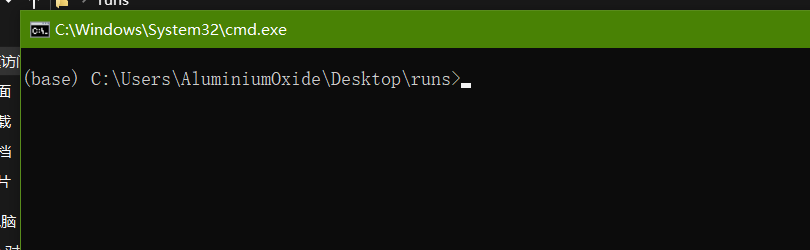

闲到没事给右键添加个prompt玩玩

先打win+r 输入regedit



然后找到 \\HKEY\_CLASSES\_ROOT\\Directory\\Background\\shell



可以考虑直接写一个注册表文件加载进去  
先创建一个记事本，把下面的代码复制进去，然后把txt后缀改成reg直接双击运行，就可以往右键添加了

```
Windows Registry Editor Version 5.00

[HKEY_CLASSES_ROOT\Directory\Background\shell\Anaconda_Powershell_Prompt]
@="Anaconda PowerShell Prompt Here"
"Icon"="E:\\ProgramData\\Anaconda3\\Menu\\Iconleak-Atrous-PSConsole.ico"

[HKEY_CLASSES_ROOT\Directory\Background\shell\Anaconda_Powershell_Prompt\command]
@="powershell.exe 'E:\\ProgramData\\Anaconda3\\shell\\condabin\\conda-hook.ps1' ; conda activate 'E:\\ProgramData\\Anaconda3'"
```

也可以直接新建项



然后在里面添加值（拿anaconda这个名称的举例）



Icon是图标的路径我这里是 E:\\ProgramData\\Anaconda3\\Menu\\Iconleak-Atrous-Console.ico 也可以不建这个值



然后再这层底下建command项



里面的默认值改成快捷方式的，我这里是 %windir%\\System32\\cmd.exe "/K" E:\\ProgramData\\Anaconda3\\Scripts\\activate.bat E:\\ProgramData\\Anaconda3

然后需要改的是%windir% 改成绝对路径 C:\\Windows\\System32\\cmd.exe 或 cmd.exe



所以说command里的默认值可以是

cmd.exe "/K" E:\\ProgramData\\Anaconda3\\Scripts\\activate.bat E:\\ProgramData\\Anaconda3

也可以是

C:\\Windows\\System32\\cmd.exe "/K" E:\\ProgramData\\Anaconda3\\Scripts\\activate.bat E:\\ProgramData\\Anaconda3



然后右键就可以出现类似linux文件夹启动命令行的窗口





此贴完结
