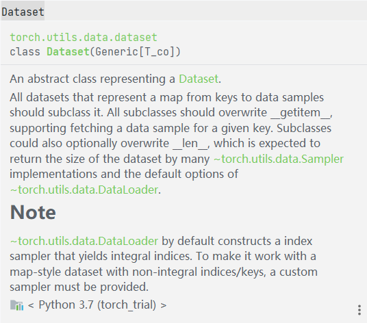
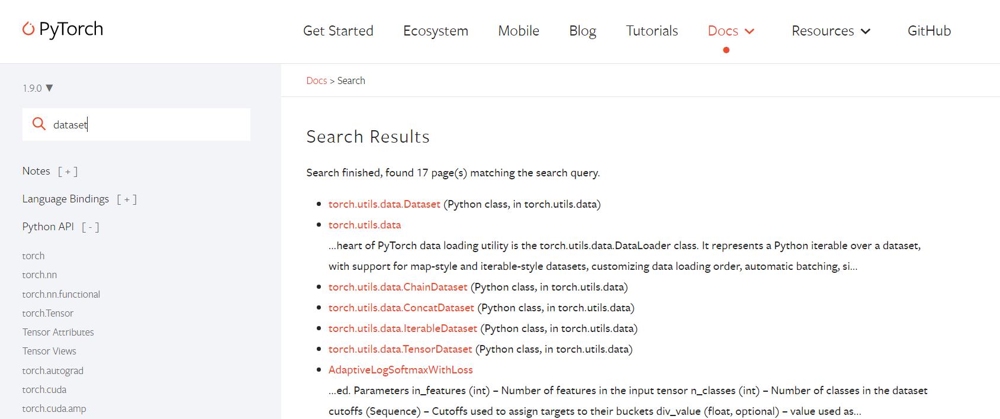
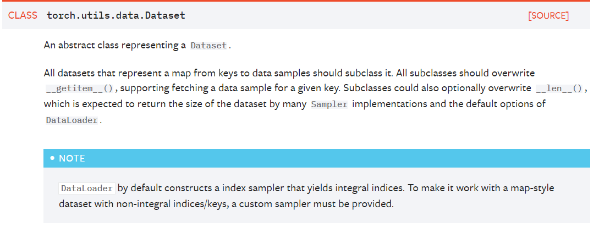
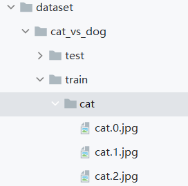
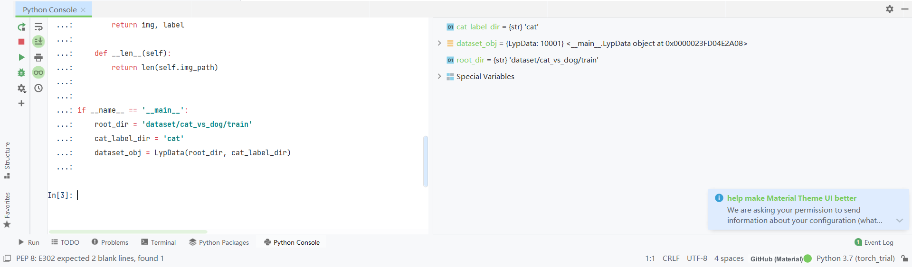
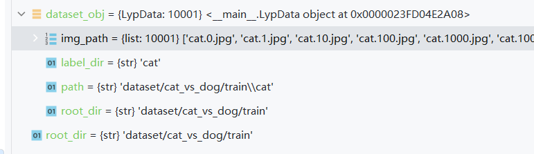
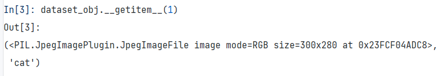

首先是数据方面

1读取数据

Dataset类  
引入：

```
from torch.utils.data import Dataset
```

然后ctrl进去或者直接在提示里查看



也可以直接在[官网](https://pytorch.org/)查看，直接搜索dataset，可以查看到torch.utils.data.Dataset的描述





该类是一个抽象类，如果继承，所有子类都需要覆写\_\_**getitem**\_\_方法  
比如我们重新写一个dataset\_lyp类

```
class LypData(Dataset):
    def __init__(self,root_dir, label_dir):
        self.root_dir = root_dir  # 根目录
        self.label_dir = label_dir  # 每类的名称
        self.path = os.path.join(self.root_dir, self.label_dir)  # 每类的目录
        self.img_path = os.listdir(self.path)  # 每张图片名称

    def __getitem__(self, item):
        img_name = self.img_path[item]
        img_item_path = os.path.join(self.root_dir, self.label_dir, img_name)
        img = Image.open(img_item_path)
        label = self.label_dir
        return img, label

    def __len__(self):
        return len(self.img_path)
```

以上处理的是类似以下目录的数据集



然后 init不用多说了，传入根目录和标签目录  
设置几个属性  
**\_\_getitem**\_\_方法通过传入索引，来返回一个图像和对应标签，  
**\_\_len\_\_**方法返回读取目录的数据长度  
由于在\_\_**getitem\_\_**中有文件操作和图片读取,需要引入

```
from PIL import Image
import os
```

追加实例化代码

```
if __name__ == '__main__':
    root_dir = 'dataset/cat_vs_dog/train'
    cat_label_dir = 'cat'
    dataset_obj = LypData(root_dir, cat_label_dir)
```

先说一下关于相对路径和绝对路径，推荐使用相对路径，因为绝对路径可能会因为转义符导致出现问题

\# C:\\Users\\AluminiumOxide\\Documents\\python\\torch\_trial\\dataset\\cat\_vs\_dog\\train\\cat\\cat.0.jpg  
# dataset/cat\_vs\_dog/train/cat/cat.0.jpg

然后完整的代码:

```
from torch.utils.data import Dataset
from PIL import Image
import os

class LypData(Dataset):
    def __init__(self,root_dir, label_dir):
        self.root_dir = root_dir  # 根目录
        self.label_dir = label_dir  # 每类的名称
        self.path = os.path.join(self.root_dir, self.label_dir)  # 每类的目录
        self.img_path = os.listdir(self.path)  # 每张图片名称

    def __getitem__(self, item):
        img_name = self.img_path[item]
        img_item_path = os.path.join(self.root_dir, self.label_dir, img_name)
        img = Image.open(img_item_path)
        label = self.label_dir
        return img, label

    def __len__(self):
        return len(self.img_path)


if __name__ == '__main__':
    root_dir = 'dataset/cat_vs_dog/train'
    cat_label_dir = 'cat'
    dataset_obj = LypData(root_dir, cat_label_dir)
```

在console里运行可以得到





在console里输入getitem方法(item为1),可以发现返回了一个PIL图像文件和标签文件


