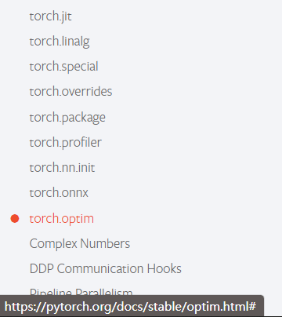
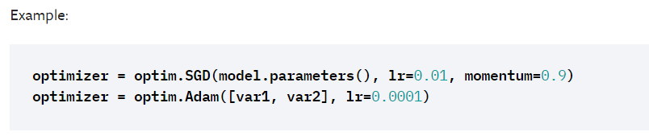
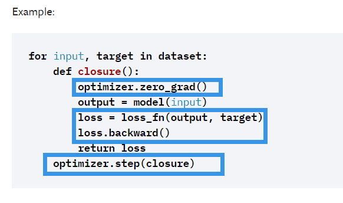
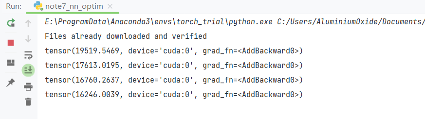
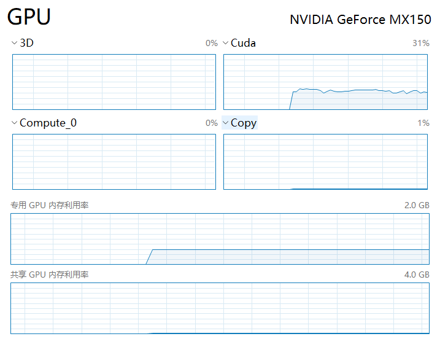

使用优化器,接收损失函数的结果,并调整网络参数,完成反向传播



根据示例



```
optimizer = torch.optim.SGD(module.parameters(), lr=0.01, momentum=0.9)
```

然后根据提示,清空梯度>网络前传>计算损失>反向传播>优化网络参数



在运行区域引入库和之前的Module

```
if __name__ == '__main__':
    module = Module()
    loss = nn.CrossEntropyLoss()
    optimizer = torch.optim.SGD(module.parameters(), lr=0.01, momentum=0.9)

    running_loss = 0.0
    for imgs, targets in dataloader:
        optimizer.zero_grad()
        outputs = module(imgs)
        result_loss = loss(outputs, targets)
        result_loss.backward()
        optimizer.step()

        running_loss = running_loss + result_loss
    print(running_loss)
```

再因为优化器一般不只是优化一次,迭代完所有训练集只是完成了网络（对于该数据集）的一次优化,优化的次数就是俗称的epoch,一般都是在外面再写个循环完成迭代

```
if __name__ == '__main__':
    module = Module()
    loss = nn.CrossEntropyLoss()

    optimizer = torch.optim.SGD(module.parameters(), lr=0.01, momentum=0.9)

    for epoch in range(12):
        running_loss = 0.0
        for imgs, targets in dataloader:
            optimizer.zero_grad()
            outputs = module(imgs)
            result_loss = loss(outputs, targets)
            result_loss.backward()
            optimizer.step()

            running_loss = running_loss + result_loss
        print(running_loss)
```

运行获得以下结果



然后由于CPU实在是太慢,加入GPU

```
if __name__ == '__main__':
    module = Module()
    loss = nn.CrossEntropyLoss()
    if torch.cuda.is_available():
        module = module.cuda()
        loss = loss.cuda()
    optimizer = torch.optim.SGD(module.parameters(), lr=0.01, momentum=0.9)

    for epoch in range(12):
        running_loss = 0.0
        for imgs, targets in dataloader:
            if torch.cuda.is_available():
                imgs = imgs.cuda()
                targets = targets.cuda()
                
            optimizer.zero_grad()
            outputs = module(imgs)
            result_loss = loss(outputs, targets)
            result_loss.backward()
            optimizer.step()

            running_loss = running_loss + result_loss
        print(running_loss)
```



最后放一下完整的代码

```
import torch
import torchvision
from torch import nn
from torch.nn import Sequential, Conv2d, MaxPool2d, Flatten, Linear
from torch.utils.data import DataLoader

dataset = torchvision.datasets.CIFAR10("CIFAR10", train=False, transform=torchvision.transforms.ToTensor(),download=True)

dataloader = DataLoader(dataset, batch_size=1)


class Module(nn.Module):
    def __init__(self):
        super(Module, self).__init__()
        self.model = Sequential(
            Conv2d(3, 16, 5),
            MaxPool2d(2, 2),
            Conv2d(16, 32, 5),
            MaxPool2d(2, 2),
            Flatten(),  # 注意一下,线性层需要进行展平处理
            Linear(32*5*5, 120),
            Linear(120, 84),
            Linear(84, 10)
        )

    def forward(self, x):
        x = self.model(x)
        return x
```
