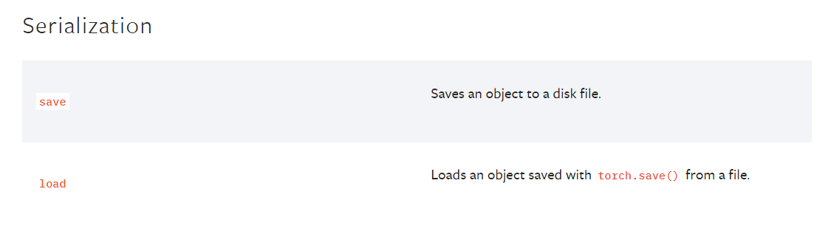
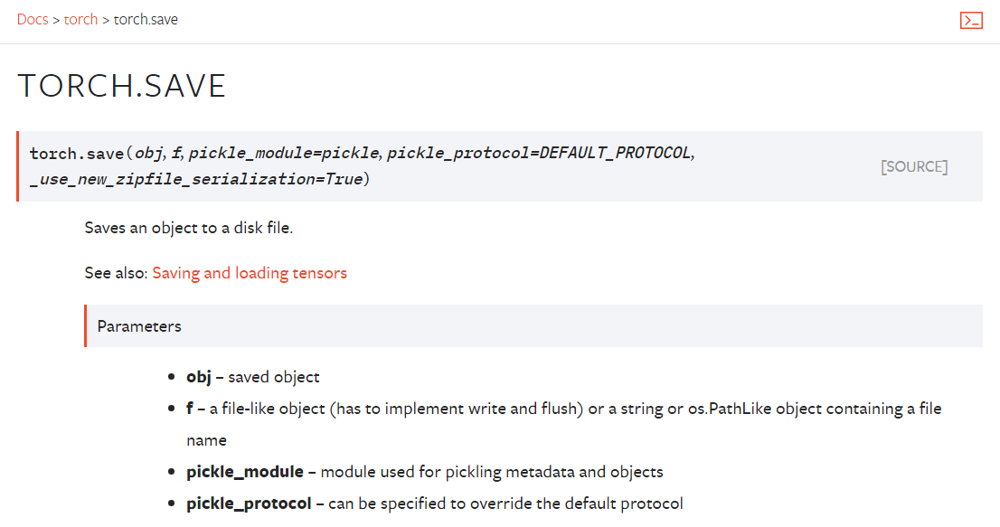
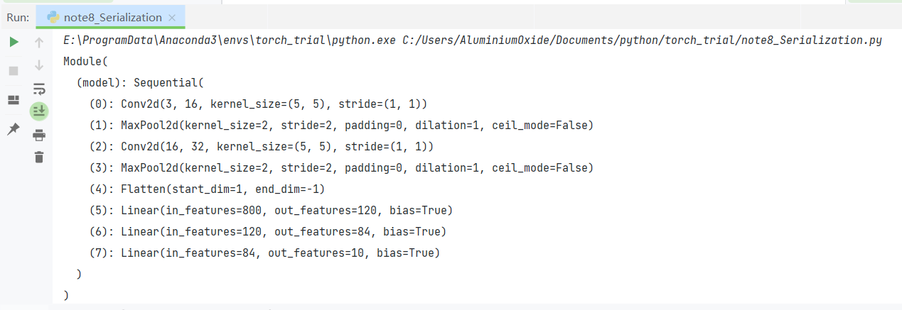

模型的保存和加载都在系列化的模块下



先看保存的



更详细的可以参考这里https://pytorch.org/docs/stable/notes/serialization.html#preserve-storage-sharing  
torch.save()并torch.load()让您轻松保存和加载张量：最简单的就是

```
t = torch.tensor([1., 2.])
torch.save(t, 'tensor.pth')
torch.load('tensor.pth')
```

按照惯例，PyTorch 文件通常使用“.pt”或“.pth”扩展名编写。  
torch.save()并torch.load()默认使用 Python 的 pickle，因此您还可以将多个张量保存为 Python 对象（如元组、列表和字典）的一部分：

```
>>> d = {'a': torch.tensor([1., 2.]), 'b': torch.tensor([3., 4.])}
>>> torch.save(d, 'tensor_dict.pth')
>>> torch.load('tensor_dict.pth')
{'a': tensor([1., 2.]), 'b': tensor([3., 4.])}
```

如果数据结构是pickle允许的格式，也可以保存包含 PyTorch 张量的自定义数据结构。

保存张量并保留视图关系

```
>>> numbers = torch.arange(1, 10)
>>> evens = numbers[1::2]
>>> torch.save([numbers, evens], 'tensors.pt')
>>> loaded_numbers, loaded_evens = torch.load('tensors.pt')
>>> loaded_evens *= 2
>>> loaded_numbers
tensor([ 1,  4,  3,  8,  5, 12,  7, 16,  9])
```

当 PyTorch 保存张量时，会分别保存模型和张量数据。  
在某些情况下，保存模型可能是不必要的，并且会创建过大的文件。在以下代码段中，将比保存的张量大得多的模型写入文件：

```
>>> large = torch.arange(1, 1000)
>>> small = large[0:5]
>>> torch.save(small, 'small.pth')
>>> loaded_small = torch.load('small.pth')
>>> loaded_small.storage().size()
999
```

在仅保存5个张量的“small.pth”储存999个值也进行了保存与加载。

当保存元素少于其存储对象的张量时，可以通过首先克隆张量来减小保存文件的大小。克隆张量会产生一个新的张量，并带有一个仅包含张量中值的新存储对象：

```
>>> large = torch.arange(1, 1000)
>>> small = large[0:5]
>>> torch.save(small.clone(), 'small.pth')  # saves a clone of small
>>> loaded_small = torch.load('small.pth')
>>> loaded_small.storage().size()
5
```

然而，由于克隆的张量彼此独立，因此它们没有原始张量所具有的任何视图关系。

## 保存和加载 torch.nn.Modules

在 PyTorch 中，模块的状态经常使用“状态字典”进行序列化。模块的状态字典包含其所有参数和持续缓冲区：

```
>>> bn = torch.nn.BatchNorm1d(3, track_running_stats=True)
>>> list(bn.named_parameters())
[('weight', Parameter containing: tensor([1., 1., 1.], requires_grad=True)),
 ('bias', Parameter containing: tensor([0., 0., 0.], requires_grad=True))]

>>> list(bn.named_buffers())
[('running_mean', tensor([0., 0., 0.])),
 ('running_var', tensor([1., 1., 1.])),
 ('num_batches_tracked', tensor(0))]

>>> bn.state_dict()
OrderedDict([('weight', tensor([1., 1., 1.])),
             ('bias', tensor([0., 0., 0.])),
             ('running_mean', tensor([0., 0., 0.])),
             ('running_var', tensor([1., 1., 1.])),
             ('num_batches_tracked', tensor(0))])
```

出于兼容性原因，建议不要直接保存模块，而是只保存其状态字典。Python 模块的load\_state\_dict()可以从状态字典中恢复它们的状态：

```
>>> torch.save(bn.state_dict(), 'bn.pth')
>>> bn_state_dict = torch.load('bn.pth')
>>> new_bn = torch.nn.BatchNorm1d(3, track_running_stats=True)
>>> new_bn.load_state_dict(bn_state_dict)
<All keys matched successfully>
```

注意state\_dict先从其文件中加载torch.load()然后使用load\_state\_dict() 自定义模块和包含其他模块的模块也有state\_dict并且可以使用这种模式：

```
# A module with two linear layers
>>> class MyModule(torch.nn.Module):
      def __init__(self):
        super(MyModule, self).__init__()
        self.l0 = torch.nn.Linear(4, 2)
        self.l1 = torch.nn.Linear(2, 1)

      def forward(self, input):
        out0 = self.l0(input)
        out0_relu = torch.nn.functional.relu(out0)
        return self.l1(out0_relu)

>>> m = MyModule()
>>> m.state_dict()
OrderedDict([('l0.weight', tensor([[ 0.1400, 0.4563, -0.0271, -0.4406],
                                   [-0.3289, 0.2827, 0.4588, 0.2031]])),
             ('l0.bias', tensor([ 0.0300, -0.1316])),
             ('l1.weight', tensor([[0.6533, 0.3413]])),
             ('l1.bias', tensor([-0.1112]))])

>>> torch.save(m.state_dict(), 'mymodule.pt')
>>> m_state_dict = torch.load('mymodule.pt')
>>> new_m = MyModule()
>>> new_m.load_state_dict(m_state_dict)
<All keys matched successfully>
```

算了,上面都是文档  
先有如下已经用烂的模型

```
import torch
from torch import nn


class Module(nn.Module):
    def __init__(self):
        super(Module, self).__init__()
        self.model = nn.Sequential(
            nn.Conv2d(3, 16, 5),
            nn.MaxPool2d(2, 2),
            nn.Conv2d(16, 32, 5),
            nn.MaxPool2d(2, 2),
            nn.Flatten(),  # 注意一下,线性层需要进行展平处理
            nn.Linear(32*5*5, 120),
            nn.Linear(120, 84),
            nn.Linear(84, 10)
        )

    def forward(self, x):
        x = self.model(x)
        return x
```

然后用以下方法加载和保存

```
Module = Module()
# 保存方式1,模型结构+张量
torch.save(Module, "module.pth")
# 保存方式2，张量（推荐）
torch.save(Module.state_dict(), "module_state_dict.pth")

# 加载方式1 对应保存方式1,同时加载模型结构+张量
load_module = torch.load("module.pth")
# 加载方式2 对应保存方式2,加载模型后加载张量(必须先实例化模型)
Module.load_state_dict(torch.load("module_state_dict.pth"))
print(module) 
```



至于完整的操作在下面一节统一说
