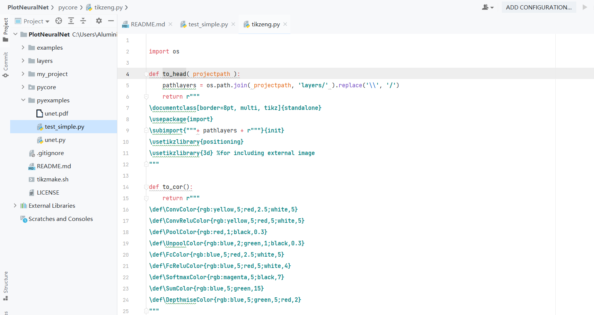
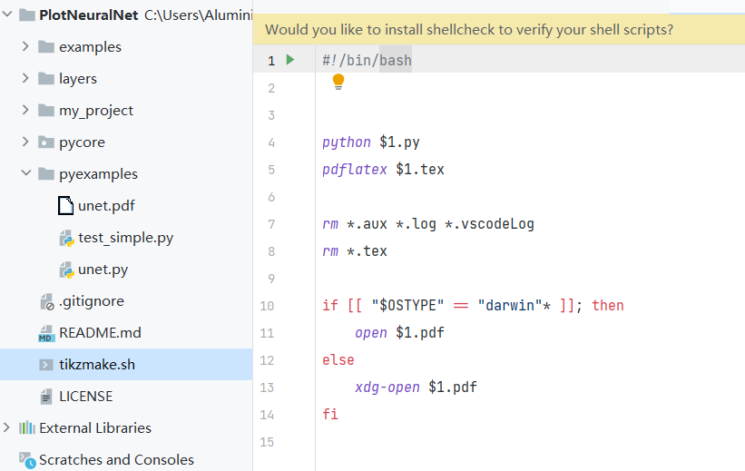
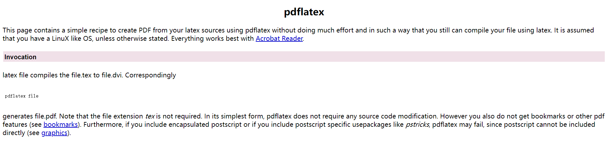
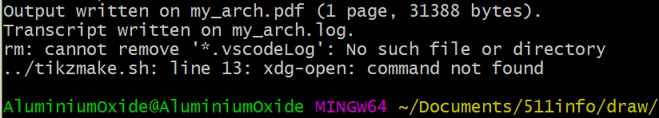

## 1\. python函数

先看一下这个代码哈

```

import sys
sys.path.append('../')
from pycore.tikzeng import *

# defined your arch
arch = [
    to_head( '..' ),
    to_cor(),
    to_begin(),
    to_Conv("conv1", 512, 64, offset="(0,0,0)", to="(0,0,0)", height=64, depth=64, width=2 ),
    to_Pool("pool1", offset="(0,0,0)", to="(conv1-east)"),
    to_Conv("conv2", 128, 64, offset="(1,0,0)", to="(pool1-east)", height=32, depth=32, width=2 ),
    to_connection( "pool1", "conv2"), 
    to_Pool("pool2", offset="(0,0,0)", to="(conv2-east)", height=28, depth=28, width=1),
    to_SoftMax("soft1", 10 ,"(3,0,0)", "(pool1-east)", caption="SOFT"  ),
    to_connection("pool2", "soft1"),    
    to_Sum("sum1", offset="(1.5,0,0)", to="(soft1-east)", radius=2.5, opacity=0.6),
    to_connection("soft1", "sum1"),
    to_end()
    ]

def main():
    namefile = str(sys.argv[0]).split('.')[0]
    to_generate(arch, namefile + '.tex' )

if __name__ == '__main__':
    main()
```

可以看到一个相当强有趣的事，并没有其他的库，咱再把pycore.tikzeng这玩意打开



看得出来，这里的函数普遍都是没啥操作，根据提示返回字符串，根据这个字符串数组调用to\_generate()函数  
然而这个函数也就是产生一个tex文件，，，等等，tex？！嗯？！

```
def to_generate( arch, pathname="file.tex" ):
    with open(pathname, "w") as f: 
        for c in arch:
            print(c)
            f.write( c )
```

## 2\. shell文件

那咱们回来看看shell文件里都干了什么吧



这里科普一下$

$0 就是编写的shell脚本本身的名字  
$1 是在运行shell脚本传的第一个参数  
$2 是在运行shell脚本传的第二个参数

根据4、5段，可以认为是通过python，使用对应脚本生成同名tex文件，再用pdflatex，从tex生成pdf文件，有关pdflatex，请参考[这里](http://www.math.rug.nl/~trentelman/jacob/pdflatex/pdflatex.html)，就相当于编译pdf文件（具体不说了，反正我参加美赛又没写过文章）



中间rm这个被玩烂的命令应该不必多说了，没玩过建议装个linux虚拟机，terminal里直接 sudo rm -rf / 

后面相当于一个选择语句

```
if [ expression ]
then
   Statement(s) to be executed if expression is true
else
   Statement(s) to be executed if expression is not true
fi
```

对于判断内容我愿意引用这篇[文章](https://www.jianshu.com/p/c91563b1961b)

也就是说，"$OSTYPE" = ”darwin“\* 用来判断是否属于MAC系统，并用不同打开命令把生成的同名PDF文件打开  
能从这里看出写这个脚本的玩家有多不上心了（这命令根本没法在Git Bash里使用吧！）  
本人建议直接点，把原脚本10~15行直接删了！



那么这里就可以思考，python有没有什么工具，自动将tex文件转成pdf呢？那样就可以忽略shell脚本，直接使用python文件完成一整套流程岂不是更好吗？  
不要跟我提linux多么牛逼！我这个菜鸡只想在win里搞！！！（狗头）
