根据两个例程，我们可以稍微了解一下这里面自带的参数都是干什么的

首先是to\_head，只需要调用一个项目路径，根据描述，应该是说，从该文件到layers目录的路径，就像例程的文件存放与layers的存放路径，直接到上级目录

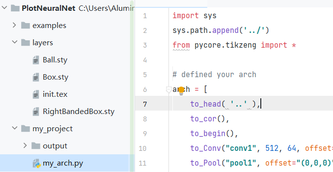

```
def to_head( projectpath ):
    pathlayers = os.path.join( projectpath, 'layers/' ).replace('\\', '/')
    return r"""
\documentclass[border=8pt, multi, tikz]{standalone} 
\usepackage{import}
\subimport{"""+ pathlayers + r"""}{init}
\usetikzlibrary{positioning}
\usetikzlibrary{3d} %for including external image 
"""
```

然后对于to\_cor()和to\_head()分别是引入颜色地图和初始化，而对于to\_input()相当于引入一个图片

def to\_input( pathfile, to=**'(-3,0,0)'**, width=8, height=8, name=**"temp"** ):

- pathfile 图像的路径
- to 默认位置(相对于\*-west进行左偏移3个单位)
- width 图像拉伸宽度
- height 图像拉伸高度
- name 图像名称

to\_Conv( name, s\_filer=256, n\_filer=64, offset=**"(0,0,0)"**, to=**"(0,0,0)"**, width=1, height=40, depth=40, caption=**" "** )

- name str 该模块名称
- s\_filer int 该模块显示(仅数字)的W和H (根据函数里描述这个只能是长宽一样的)
- n\_filer int 该模块显示(仅数字)的C (俗称通道数或者厚度)
- offset str 偏移值, 1\*3元组形状的字符串, (X轴,Y轴,Z轴) # 右手系
- to str 起始位置 默认为(0,0,0) 也可相对不同的模块设置方向
    - <模块名称>-east 最常见，原模块右侧中心点对齐新模块左侧中心点
    - <模块名称>-west 原模块左侧中心点，对齐新模块左侧中心点
    - <模块名称>-north 原模块上方中心点，对齐新模块左侧中心点
    - <模块名称>-south 原模块下方中心点，对齐新模块左侧中心点
    - <模块名称>-near 原模块前侧中心点，对齐新模块左侧中心点
    - <模块名称>-far 原模块后侧中心点，对齐新模块左侧中心点
- width int 模块的X轴长度(均为模块显示长度)
- height int 模块的Y轴长度(均为模块显示长度)
- depth int 模块的Z轴长度(均为模块显示长度)
- caption str 模块打印时展示的文字

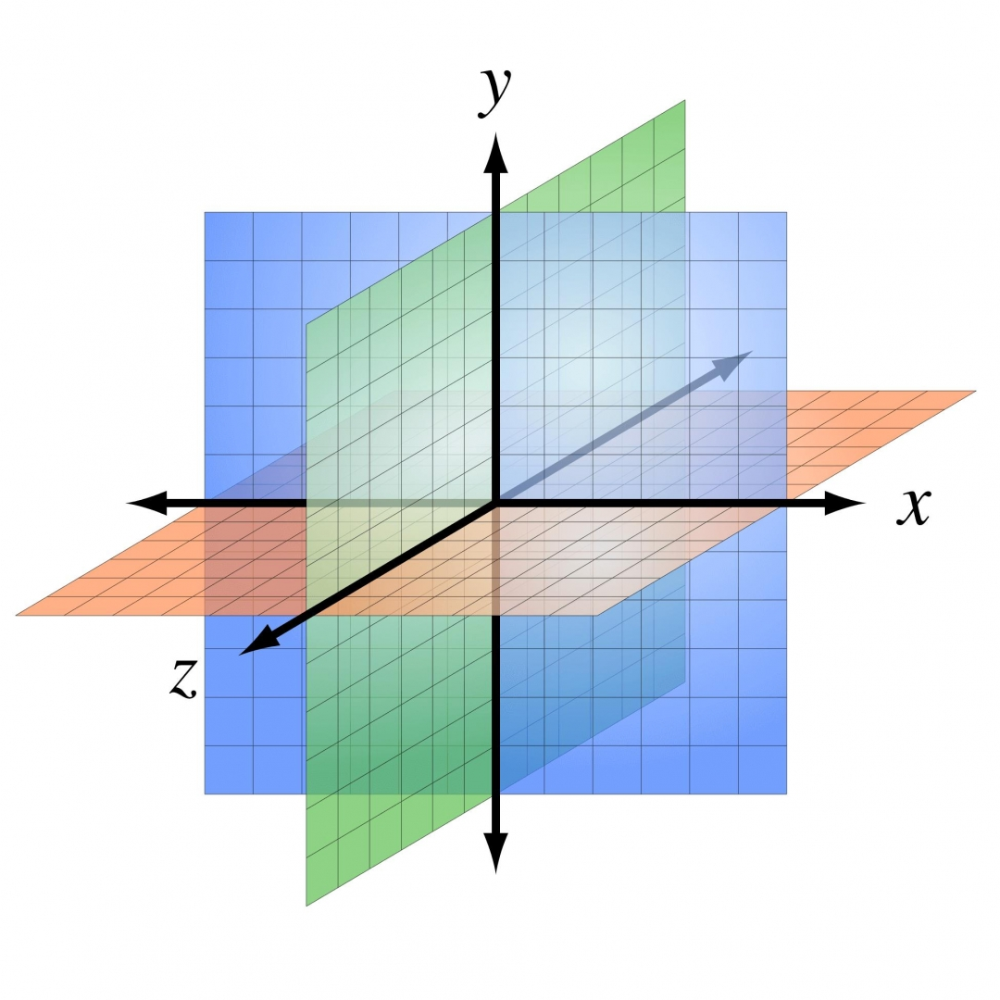

```
arch = [
    to_head( '..' ),
    to_cor(),
    to_begin(),
    to_input('./output/myIcon.png'),
    to_Conv("conv1", 32, 48, offset="(0,0,0)", to="(0,0,0)", height=32, depth=32, width=48, caption="main"),
    to_Conv("conv1_1", 16, 10, offset="(0,0,0)", to="(conv1-east)", height=16, depth=16, width=10, caption="main-east"),
    to_Conv("conv1_2", 16, 10, offset="(0,0,0)", to="(conv1-west)", height=16, depth=16, width=10, caption="main-west"),
    to_Conv("conv1_3", 16, 10, offset="(0,0,0)", to="(conv1-north)", height=16, depth=16, width=10, caption="main-north"),
    to_Conv("conv1_4", 16, 10, offset="(0,0,0)", to="(conv1-south)", height=16, depth=16, width=10, caption="main-south"),
    to_Conv("conv1_5", 16, 10, offset="(0,0,0)", to="(conv1-far)", height=16, depth=16, width=10, caption="main-far"),
    to_Conv("conv1_6", 16, 10, offset="(0,0,0)", to="(conv1-near)", height=16, depth=16, width=10, caption="main-near"),
    to_end()
]
```

有关 to 参数举例，使用左面的代码生成结构，可以生成下图的网络结构

注意：这个图里设置的s\_filer、nfiler和width、height、depth保持一致，有时候为了表现美观，没必要保证严格一致

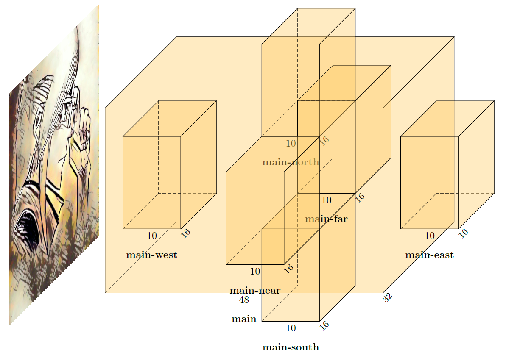

此外，展示offset参数在x、y、z轴上的偏移(仅举例说明)

```
arch = [
    to_head( '..' ),
    to_cor(),
    to_begin(),
    to_input('./output/myIcon.png'),
    to_Conv("conv1", 48, 10, offset="(0,0,0)", to="(0,0,0)", height=48, depth=48, width=10, caption="main"),
    to_Conv("conv1_1", 16, 10, offset="(0,0,0)", to="(conv1-east)", height=16, depth=16, width=10, caption="without-offset"),
    to_Conv("conv1_1", 16, 10, offset="(3,0,0)", to="(conv1-east)", height=16, depth=16, width=10, caption="offset x+3"),
    to_Conv("conv1_1", 16, 10, offset="(0,6,0)", to="(conv1-east)", height=16, depth=16, width=10, caption="offset y+6"),
    to_Conv("conv1_1", 16, 10, offset="(0,0,6)", to="(conv1-east)", height=16, depth=16, width=10, caption="offset z+6"),
    to_end()
    ]
```

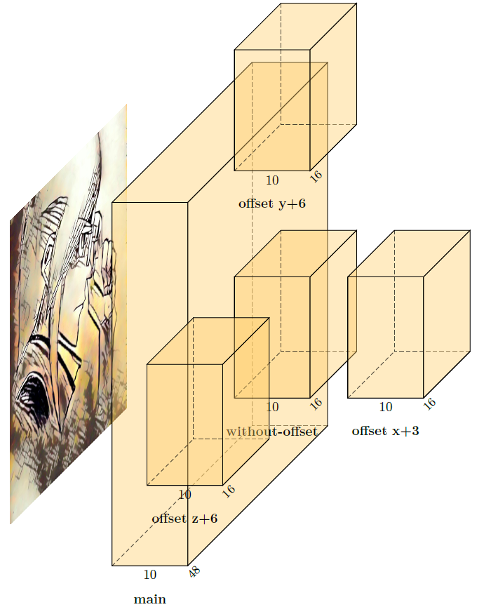

to\_ConvConvRelu( name, s\_filer=256, n\_filer=(64,64), offset=**"(0,0,0)"**, to=**"(0,0,0)"**, width=(2,2), height=40, depth=40, caption=**" "** )

这个本质上就是在原有的加一些更改，相当于两层贴一块(给n\_filer和width传一个元组)，然后加一个bandfill参数设置成对应的颜色(该颜色在to\_cor()函数内实现)

```
    to_ConvConvRelu("conv1"),
```

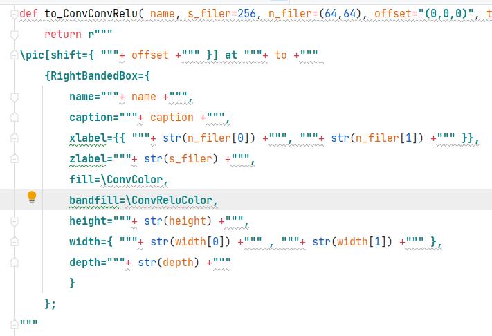

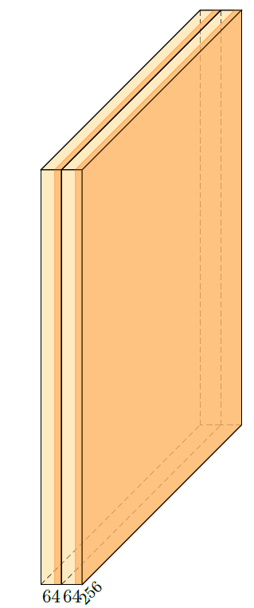

to\_Pool(name, offset=**"(0,0,0)"**, to=**"(0,0,0)"**, width=1, height=32, depth=32, opacity=0.5, caption=**" "**)

池化层的函数基本没有啥别的，多了一个透明度opacity

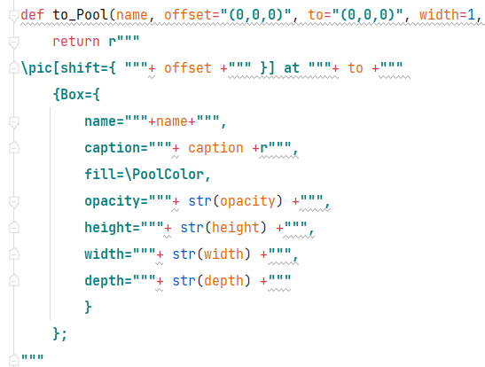

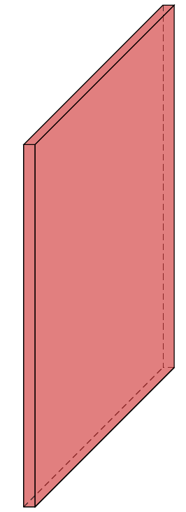

to\_UnPool(name, offset=**"(0,0,0)"**, to=**"(0,0,0)"**, width=1, height=32, depth=32, opacity=0.5, caption=**" "**)

同上，不能说一摸一样，只能说换了个色，剩下的都一样

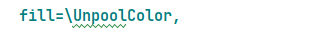

to\_ConvRes( name, s\_filer=256, n\_filer=64, offset=**"(0,0,0)"**, to=**"(0,0,0)"**, width=6, height=40, depth=40, opacity=0.2, caption=**" "** )

参考to\_ConvConvRelu，换了个颜色，剩下的毫无亮点

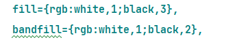

to\_ConvSoftMax( name, s\_filer=40, offset=**"(0,0,0)"**, to=**"(0,0,0)"**, width=1, height=40, depth=40, caption=**" "** )

同上，创新点全无


to\_SoftMax( name, s\_filer=10, offset=**"(0,0,0)"**, to=**"(0,0,0)"**, width=1.5, height=3, depth=25, opacity=0.8, caption=**" "** )

同上，创新点全无

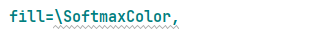

to\_Sum( name, offset=**"(0,0,0)"**, to=**"(0,0,0)"**, radius=2.5, opacity=0.6)

这个是画那个求和符号的，其中radius代表了半径  
注意这里面函数里多了一个logo参数，传入了+，如果之后需要点乘算子，可以直接在改这个地方(当然，直接加入×会报错不能处理 Invalid UTF-8 byte ，大家可以找一下解决方法，笑，反正是右图的效果，大不了看我下一篇博文嘛)

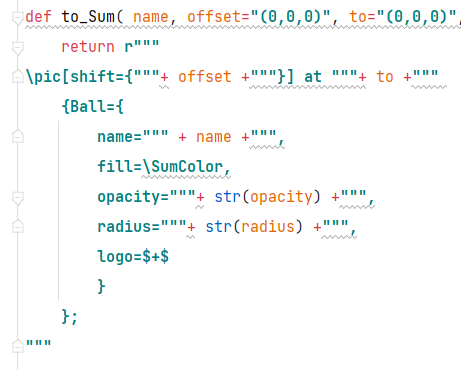

如果只是下面的代码，就会得到下面生成的第一个+号

```
arch = [
    to_head( '..' ),
    to_cor(),
    to_begin(),
    to_Sum("sum"),
    to_end()
]
```

- 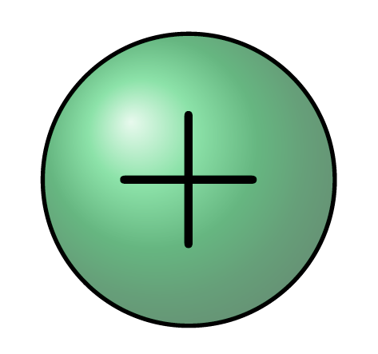
    
- 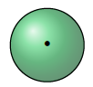
    
- 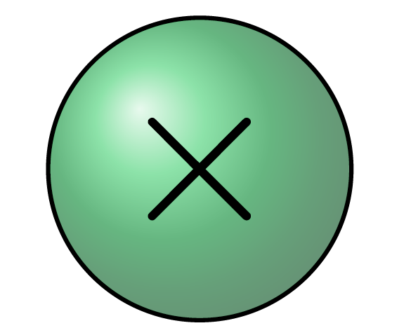
    

最后是这个

to\_connection( of, to)

从name为of的右侧中心点，连接到name为to的左侧中心点，且为直线连接，如果要全直角连接还需要额外操作，那么先看下面的演示

```
arch = [
    to_head( '..' ),
    to_cor(),
    to_begin(),
    to_input( './output/myIcon.png'),
    to_ConvConvRelu("conv1", 16, (10,10), offset="(0,0,0)", to="(0,0,0)", height=16, depth=16, width=(10,10), caption="main"),
    to_Conv("conv2_1", 16, 10, offset="(2,0,0)", to="(conv1-east)", height=16, depth=16, width=10, caption="conv\_1"),
    to_Conv("conv2_2", 16, 10, offset="(2,4,0)", to="(conv1-east)", height=16, depth=16, width=10, caption="conv\_up"),
    to_Conv("conv2_3", 16, 10, offset="(2,-4,0)", to="(conv1-east)", height=16, depth=16, width=10, caption="conv\_down"),
    to_connection( "conv1", "conv2_1"),
    to_connection( "conv1", "conv2_2"),
    to_connection( "conv1", "conv2_3"),
    to_end()
]
```

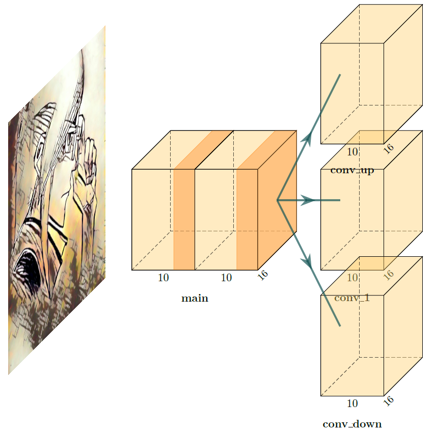

不过显然，这很不优雅，至少对于我来说不优雅，那么现在有什么好方法给它掰成直角呢？ ，，，，，，当然有啦~（笑，下个博文再说）

项目作者里给了我们一个画U-Net的

to\_skip( of, to, pos=1.25)

从name为of的右上中心点，连接到name为to的上方中心点，其中pos为偏移值，如果是正数会正常偏移，负数会产生相当生草的效果

```
arch = [
    to_head( '..' ),
    to_cor(),
    to_begin(),
    to_input( './output/myIcon.png'),
    to_ConvConvRelu("conv1", 16, (10,10), offset="(0,0,0)", to="(0,0,0)", height=16, depth=16, width=(10,10), caption="conv\_1"),
    to_Conv("conv2", 16, 10, offset="(2,0,0)", to="(conv1-east)", height=16, depth=16, width=10, caption="conv\_2"),
    to_Conv("conv3", 16, 10, offset="(2,0,0)", to="(conv2-east)", height=16, depth=16, width=10, caption="conv\_3"),
    to_connection( "conv1", "conv2"),
    to_connection( "conv2", "conv3"),
    to_skip("conv1", "conv2" , pos=1.25),
    to_skip("conv2", "conv3" , pos=-1.25),
    to_end()
]
```

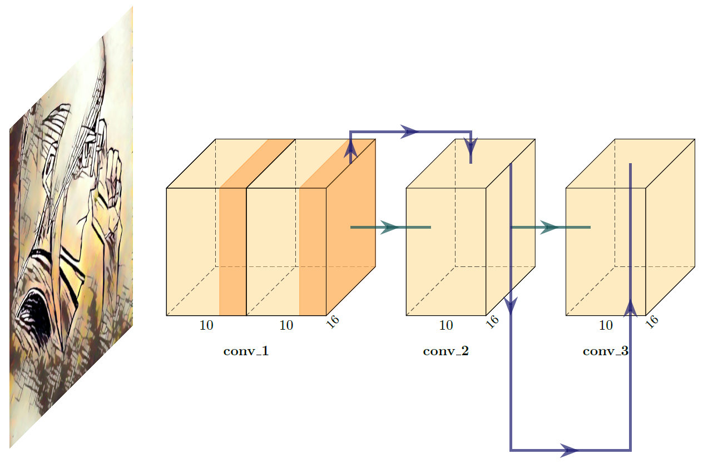

可见，图还是不错的（欣赏输入图像ing）就是这连接线画的有点草，这-1.25出现的连接线是什么鬼！！！，至于怎么改，咱下个博文再说（笑）

最后的to\_end()和to\_generate()之前说了，没啥可讲的

def to\_end():  
    return **r"""  
****\\end{tikzpicture}  
****\\end{document}  
****"""**

def to\_generate( arch, pathname=**"file.tex"** ):  
    with open(pathname, **"w"**) as f:   
        for c in arch:  
            print(c)  
            f.write( c )

先写这么多，pycore/blocks.py的本质上就是将几个这里面的模块都写成一个，都是重复内容，而且无法从根本上解决画图问题，有空再说。
