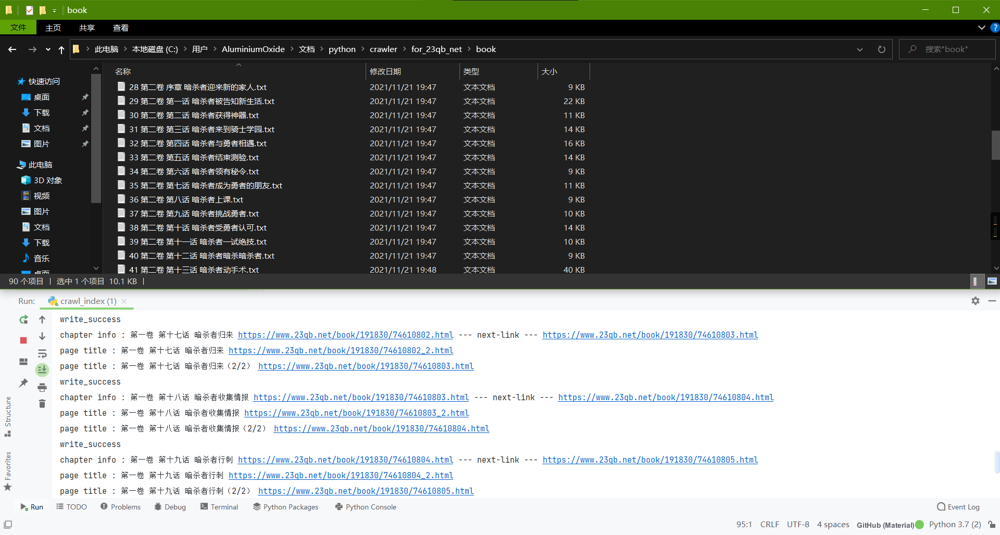

[The World's Finest Assassin Gets Reincarnated in Another World as an Aristocrat](https://www.mobinovels.com/the-worlds-finest-assassin-gets-reincarnated-in-another-world-as-an-aristocrat/)

[ACG资源网](https://zy.tpsugar.cn/archives/218.html)

这里备份一下这两天爬某个暗杀者的小说的爬虫，省着忘了，刚开始第一个网站反爬实在太好了，随机请求头都爬过几个就给你屏蔽了，只能换个别的  
网站是找的[这个](https://www.23qb.net/book/191830/)

首先是需要的库（time可忽视）

```
from lxml import etree
import requests
import os
import random
import time
```

为了保证扒多了不被403，随机请求头

```
def random_header():
    user_agent = [
        'Mozilla/5.0 (Windows NT 10.0; Win64; x64) AppleWebKit/537.36 (KHTML, like Gecko) Chrome/95.0.4638.69 Safari/537.36 Edg/95.0.1020.53',
        'Mozilla/5.0 (Windows NT 10.0; WOW64) AppleWebKit/537.36 (KHTML, like Gecko) Chrome/51.0.2704.63 Safari/537.36',
        # 上面是自己加的
        "Mozilla/5.0 (Macintosh; U; Intel Mac OS X 10_6_8; en-us) AppleWebKit/534.50 (KHTML, like Gecko) Version/5.1 Safari/534.50",
        "Mozilla/5.0 (Windows; U; Windows NT 6.1; en-us) AppleWebKit/534.50 (KHTML, like Gecko) Version/5.1 Safari/534.50",
        "Mozilla/5.0 (Windows NT 10.0; WOW64; rv:38.0) Gecko/20100101 Firefox/38.0",
        "Mozilla/5.0 (Windows NT 10.0; WOW64; Trident/7.0; .NET4.0C; .NET4.0E; .NET CLR 2.0.50727; .NET CLR 3.0.30729; .NET CLR 3.5.30729; InfoPath.3; rv:11.0) like Gecko",
        "Mozilla/5.0 (compatible; MSIE 9.0; Windows NT 6.1; Trident/5.0)",
        "Mozilla/4.0 (compatible; MSIE 8.0; Windows NT 6.0; Trident/4.0)",
        "Mozilla/4.0 (compatible; MSIE 7.0; Windows NT 6.0)",
        "Mozilla/4.0 (compatible; MSIE 6.0; Windows NT 5.1)",
        "Mozilla/5.0 (Macintosh; Intel Mac OS X 10.6; rv:2.0.1) Gecko/20100101 Firefox/4.0.1",
        "Mozilla/5.0 (Windows NT 6.1; rv:2.0.1) Gecko/20100101 Firefox/4.0.1",
        "Opera/9.80 (Macintosh; Intel Mac OS X 10.6.8; U; en) Presto/2.8.131 Version/11.11",
        "Opera/9.80 (Windows NT 6.1; U; en) Presto/2.8.131 Version/11.11",
        "Mozilla/5.0 (Macintosh; Intel Mac OS X 10_7_0) AppleWebKit/535.11 (KHTML, like Gecko) Chrome/17.0.963.56 Safari/535.11",
        "Mozilla/4.0 (compatible; MSIE 7.0; Windows NT 5.1; Maxthon 2.0)",
        "Mozilla/4.0 (compatible; MSIE 7.0; Windows NT 5.1; TencentTraveler 4.0)",
        "Mozilla/4.0 (compatible; MSIE 7.0; Windows NT 5.1)",
        "Mozilla/4.0 (compatible; MSIE 7.0; Windows NT 5.1; The World)",
        "Mozilla/4.0 (compatible; MSIE 7.0; Windows NT 5.1; Trident/4.0; SE 2.X MetaSr 1.0; SE 2.X MetaSr 1.0; .NET CLR 2.0.50727; SE 2.X MetaSr 1.0)",
        "Mozilla/4.0 (compatible; MSIE 7.0; Windows NT 5.1; 360SE)",
        "Mozilla/4.0 (compatible; MSIE 7.0; Windows NT 5.1; Avant Browser)",
        "Mozilla/4.0 (compatible; MSIE 7.0; Windows NT 5.1)",
        "Mozilla/5.0 (iPhone; U; CPU iPhone OS 4_3_3 like Mac OS X; en-us) AppleWebKit/533.17.9 (KHTML, like Gecko) Version/5.0.2 Mobile/8J2 Safari/6533.18.5",
        "Mozilla/5.0 (iPod; U; CPU iPhone OS 4_3_3 like Mac OS X; en-us) AppleWebKit/533.17.9 (KHTML, like Gecko) Version/5.0.2 Mobile/8J2 Safari/6533.18.5",
        "Mozilla/5.0 (iPad; U; CPU OS 4_3_3 like Mac OS X; en-us) AppleWebKit/533.17.9 (KHTML, like Gecko) Version/5.0.2 Mobile/8J2 Safari/6533.18.5",
        "Mozilla/5.0 (Linux; U; Android 2.3.7; en-us; Nexus One Build/FRF91) AppleWebKit/533.1 (KHTML, like Gecko) Version/4.0 Mobile Safari/533.1",
        "MQQBrowser/26 Mozilla/5.0 (Linux; U; Android 2.3.7; zh-cn; MB200 Build/GRJ22; CyanogenMod-7) AppleWebKit/533.1 (KHTML, like Gecko) Version/4.0 Mobile Safari/533.1",
        "Opera/9.80 (Android 2.3.4; Linux; Opera Mobi/build-1107180945; U; en-GB) Presto/2.8.149 Version/11.10",
        "Mozilla/5.0 (Linux; U; Android 3.0; en-us; Xoom Build/HRI39) AppleWebKit/534.13 (KHTML, like Gecko) Version/4.0 Safari/534.13",
        "Mozilla/5.0 (BlackBerry; U; BlackBerry 9800; en) AppleWebKit/534.1+ (KHTML, like Gecko) Version/6.0.0.337 Mobile Safari/534.1+",
        "Mozilla/5.0 (hp-tablet; Linux; hpwOS/3.0.0; U; en-US) AppleWebKit/534.6 (KHTML, like Gecko) wOSBrowser/233.70 Safari/534.6 TouchPad/1.0",
        "Mozilla/5.0 (SymbianOS/9.4; Series60/5.0 NokiaN97-1/20.0.019; Profile/MIDP-2.1 Configuration/CLDC-1.1) AppleWebKit/525 (KHTML, like Gecko) BrowserNG/7.1.18124",
        "Mozilla/5.0 (compatible; MSIE 9.0; Windows Phone OS 7.5; Trident/5.0; IEMobile/9.0; HTC; Titan)",
        "UCWEB7.0.2.37/28/999",
        "NOKIA5700/ UCWEB7.0.2.37/28/999",
        "Openwave/ UCWEB7.0.2.37/28/999",
        "Mozilla/4.0 (compatible; MSIE 6.0; ) Opera/UCWEB7.0.2.37/28/999",
    ]
    headers = {'User-Agent': random.choice(user_agent)}
    return headers
```

获取目录页

```
def get_index_html(url):

    headers = random_header()   # 获取随机请求头
    r = requests.get(url, headers = headers, timeout = 30)
    with open('index.html', 'w', encoding="gbk" ) as f:
       f.write(r.text)   # 列表页html保存备份
```

获取章节列表

```
def get_chapter_list(main_url):
    f = open('index.html', 'r', encoding="gbk")  # 打开，注意编码和get_index_html()保持一致
    index_html = f.read()
    f.close()

    index_html = etree.HTML(index_html)   # 解析成html树

    ul = index_html.xpath("//ul[@class='chaw_c']")[-1]    # 定位文章列表位置

    ul_str = str(etree.tostring(ul, encoding="unicode"))  # 需要重新转成字符串再实例化成html对象就离谱
    ul = etree.HTML(ul_str)

    links = ul.xpath("//a/@href")  # 获得连接
    titles = ul.xpath("//a/text()")  # 获得标题

    if len(titles) == len(links):  # 检查标题和链接的完整性，然后拼接成数组
        print("check success")
        lines = []
        for i in range(len(links)):
            link = main_url + links[i]
            title = titles[i]
            line = "{},{}\n".format(title, link)
            # print(line)
            lines.append(line)

        with open('chapter_list.txt', 'w', encoding="utf-8" ) as f: # 保存
           f.writelines(lines)
```

重新拼接列表信息

```
def remix_list_info(chapter_url):
    with open('chapter_list.txt', 'r', encoding="utf-8") as f:
        lines = f.readlines()

    lines.append(chapter_url) # 在列表后加一个目录的路径，一会有用

    collect_info = []    #  创建一个列表，整理出 标题、链接、下一个链接的列表(最后加的刚好对应上返回目录)
    for i in range(len(lines)-1):
        title = lines[i].split(",")[0]
        link = lines[i].split(",")[-1].split("\n")[0]
        if lines[i+1]:
            next_link = lines[i+1].split(",")[-1].split("\n")[0]   # print("{} {} {}".format(title,link,next_link))
        collect_info.append((title,link,next_link))

    return collect_info   # 最后返回列表
```

获取一个文章页的信息

```
def deal_with_chapter(title,link,next_link, main_url):

    headers = random_header()
    r = requests.get(link, headers = headers, timeout = 60) # 请求本页信息
    index_html = r.text  # 获取本页html信息

    # with open('halt_chapter_info.html', 'w', encoding="gbk") as f:  # 这块是之前测试时保存至本地的备份测试
    #     f.write(index_html)  # 文件的写操作
    # f = open('halt_chapter_info.html', 'r', encoding="gbk")
    # index_html = f.read()
    # f.close()

    page_next_url = main_url + index_html.split("url_next:'")[1].split("'")[0]  # 本页的下一页链接

    index_html = etree.HTML(index_html)

    page_title = index_html.xpath("//div[@id='mlfy_main_text']/h1/text()")[0]    # 本页的文章内容

    page_p_list = index_html.xpath("//div[@id='mlfy_main_text']/div[@id='TextContent']/p/text()")  # 获得所有段

    page_paragraph = ""   # 这块其实就是删了最后两行并判断到没到，写的不太好，但是没有别的判断方法了，总之是拼接该页所有文本到 page_paragraph
    for i in range(len(page_p_list)):
        if page_p_list[i] == '铅笔小说 23qb.net' or page_p_list[i] ==  '（继续下一页）':
            continue
        # print(page_p_list[i])
        if page_p_list[i+1] ==  '（继续下一页）':
            page_paragraph = page_paragraph + page_p_list[i]
            break
        page_paragraph = page_paragraph + page_p_list[i] + '\n'

    return page_next_url, page_title, page_paragraph
```

获取一章节所有页（整理）的信息

```
def get_whole_info(title,link,next_link,main_url):

    print("chapter info : {} {} --- next-link --- {}".format(title, link, next_link))  # 先打印章节信息 章节标题、本页链接，下一页链接
    whole_chapter_info = ""
    while True:

        page_next_url, page_title, page_paragraph = deal_with_chapter(title, link, next_link, main_url)   # 获得当前页的标题、下一页、段落文本信息

        print("page title : {} {}".format(page_title, page_next_url))
        # whole_chapter_info = whole_chapter_info + '<b>' + page_title + "</b>\n"
        whole_chapter_info = whole_chapter_info + page_paragraph  # 收集该页信息
        if page_next_url == next_link:  # 如果这页之后的是下一节的，那走出循环
            break
        else:  # 如果不是，那就将下一页的url替换成这一节的url
            link = page_next_url

    return whole_chapter_info  # 返回章节所有文本信息
```

把上面的函数拼起来

```
if __name__ == '__main__':
    main_url = 'https://www.23qb.net'  # 主地址
    chapter_url = main_url + '/book/191830/'   # 小说章节列表地址


    get_index_html(chapter_url)  # 获取book页,保存为 index.html

    get_chapter_list(main_url) # 获得章节名称和标签 chapter_list.txt

    collect_info = remix_list_info(chapter_url)  # 获得名称、本章链接、下一章链接 的列表

    path = './book/'   # 设置存储路径
    if not os.path.exists(path):  # 如果不存在就先创建
        os.makedirs(path)

    for book_index,(title,link,next_link) in enumerate(collect_info):  # 把拼接好的信息循环收集

        whole_chapter_info = get_whole_info(title, link, next_link, main_url)  # 拼接一章的文本信息

        with open(path +str(book_index+1)+ ' ' + title+'.txt', 'w', encoding="utf-8") as f:  #
            f.write(whole_chapter_info)  # 文件写入

        print('write_success')

        # time.sleep(10)   # 这个sleep可以忽略
```


