## 严重声明：由于网页代码经常会变，所以本文只是提供思路，不保证该方法长久有效！！！

此帖仅讨论如何让网页unity游戏在本地正常游玩的方法，并不包含正常网页小游戏swf文件获取方法（swf网页直接拿，暴力扒链解千愁，单个文件易分享，随手带过都嫌多）

考虑到大部分玩家还是4399开始的，那么直接拿4399开刀，小时候特别喜欢一个black sun 的游戏，拿它做示例

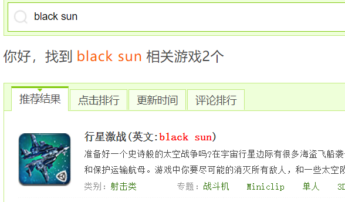

首先就是万恶的实名认证，那我们直接在进入前打开F12

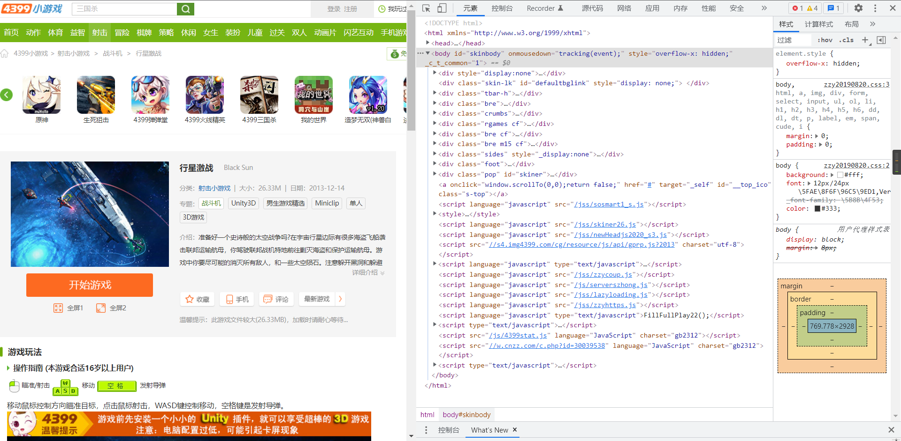

然后就点开游戏，这里网页看到我们打开F12就停止加载防扒都是小问题

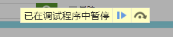

F12继续开着，换个思路 ctrl + U 直接搞源代码，毕竟是传统网页游戏，先定位 iframe 找到游戏位置，注意哈，网页unity游戏运行是需要加载一系列unity相关函数的，大都会在一个独立的页面统一加载游戏，再放到游戏网站的一个iframe里，这也是咱们需要扒的页面只要把里面的网页扒到了，那就OK了

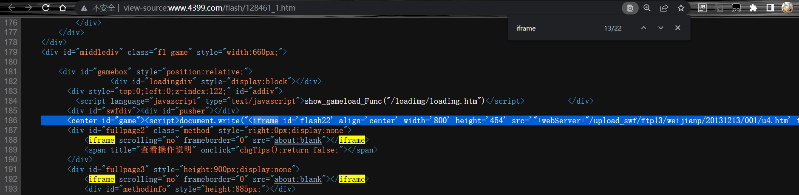

可以看到，iframe的来源是 **src='"+webServer+"/upload\_swf/ftp13/weijianp/20131213/001/u4 .htm'**  
因此现在找 webServer就行了， 蛋是找不到，那大概率是该网站把server文件藏到了其他的js文件里（注意前面是document.write直接写的）  
此外，拿 ’‘ 套 “” 竖中指ing

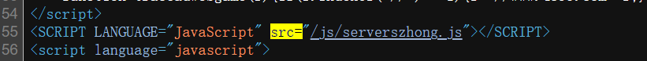

寻找js链接，然后找到了/js/serverszhong.js 里面就这点东西，写的太露骨了，受不了受不了

```
var webServer = "//szhong.4399.com/4399swf";
var sPicServer = "img.4399.net:8080";
```

那么就好拼接了，拼接成目标地址为

```
szhong.4399.com/4399swf/upload_swf/ftp13/weijianp/20131213/001/u4.htm
```

但是，现在遇到了个问题，真棒《优美的中国话》，放护做的不错，但是不知大家还记不记得，咱F12还开着！

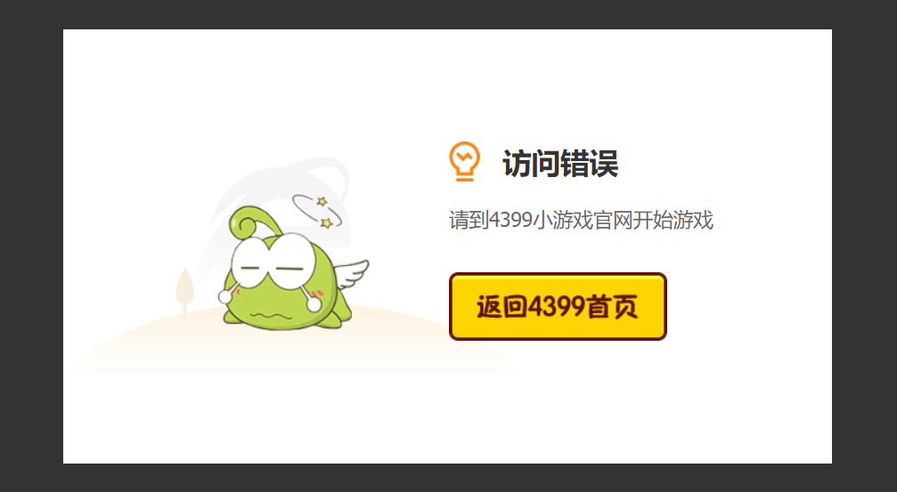

我直接进入 源代码 下的 网页 把整个代码搬走！直接复制到本地，然后看代码

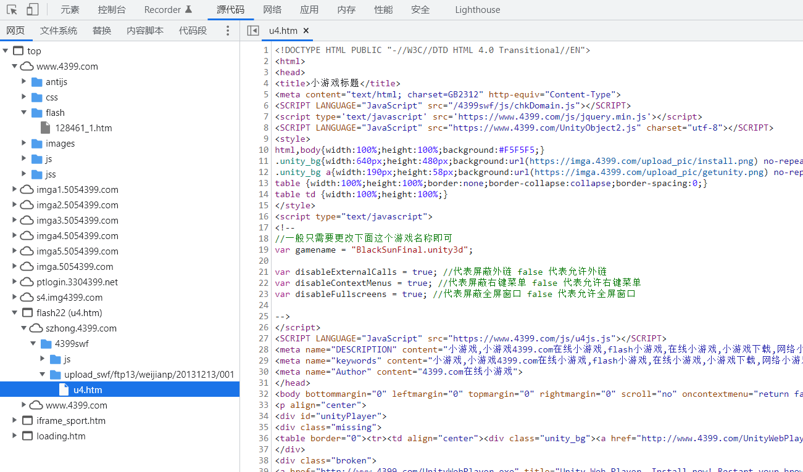

估计是这个万恶的chkDomain在检查访问源，先删了！  
看到jq和unity的常用代码我先放过它  
（不会它真的直接把往jq源代码里面塞吧）  
两个图片也直接放过


然后，现在的网站这么勇的吗？

```
<script type="text/javascript">
<!--
//一般只需要更改下面这个游戏名称即可
var gamename = "BlackSunFinal.unity3d";

var disableExternalCalls = true; //代表屏蔽外链 false 代表允许外链
var disableContextMenus = true; //代表屏蔽右键菜单 false 代表允许右键菜单
var disableFullscreens = true; //代表屏蔽全屏窗口 false 代表允许全屏窗口

-->
</script>
```

那么我门现在要找的就是这个 gamename 啦

本页面找不到，在找本页js文件 szhong.4399.com/4399swf/js/chkDomain.js 和 https://www.4399.com/js/u4js.js 在后者中发现了相关语句

```
u.initPlugin(jQuery("#unityPlayer")[0], gamename);
```

```
var u = new UnityObject2(config);
```

那么直接上网搜索，UnityObject2 和 initPlugin

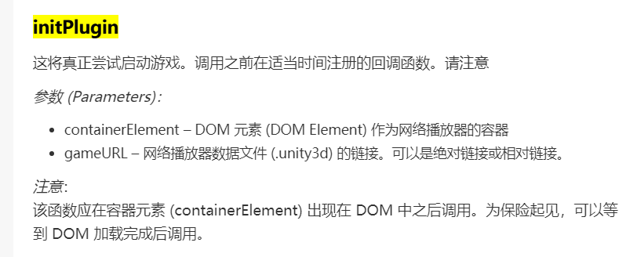

它敢这么明目张胆用原文件名，那我们也不客气，毕竟，这限制根本不让我好好玩游戏  
基本可以确定是在同名目录直接启动游戏了，那么根据之前个给的名字，咱们可以直接

```
http://szhong.4399.com/4399swf/upload_swf/ftp13/weijianp/20131213/001/BlackSunFinal.unity3d
```

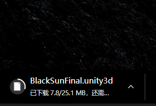

OK，基本上现在本地运行的方程式已经集齐了

再把刚才拷下来的htm相关库都拷到本地并把原来的u4.htm改成index.html，于是变成了

```
<!DOCTYPE HTML PUBLIC "-//W3C//DTD HTML 4.0 Transitional//EN">
<html>
<head>
<title>title</title>
<meta content="text/html; charset=UTF-8" http-equiv="Content-Type">
<script type='text/javascript' src='./js/jquery.min.js'></script>
<SCRIPT LANGUAGE="JavaScript" src="./UnityObject2.js" charset="utf-8"></SCRIPT>
<style>
html,body{width:100%;height:100%;background:#F5F5F5;}
</style>
<script type="text/javascript">
<!--
//一般只需要更改下面这个游戏名称即可
var gamename = "BlackSunFinal.unity3d";

var disableExternalCalls = true; //代表屏蔽外链 false 代表允许外链
var disableContextMenus = true; //代表屏蔽右键菜单 false 代表允许右键菜单
var disableFullscreens = true; //代表屏蔽全屏窗口 false 代表允许全屏窗口

-->
</script>
<SCRIPT LANGUAGE="JavaScript" src="./js/u4js.js"></SCRIPT>
</head>
<body bottommargin="0" leftmargin="0" topmargin="0" rightmargin="0" scroll="no" oncontextmenu="return false" ondragstart="return false" onselectstart="return false" onselect="document.selection.empty()">
<p align="center">

<div id="unityPlayer">
  <div class="missing">
    <a title="Missing..."></a>
  </div>
  <div class="broken">
    <a title="Need Unity Web Player. Install now! Restart your browser after install."></a>
  </div>
无法加载Unity3D游戏，请确认你的浏览器开启了JAVASCRIPT支持.</div>
</p>
</body>
</html>
```

以及以上的目录结构

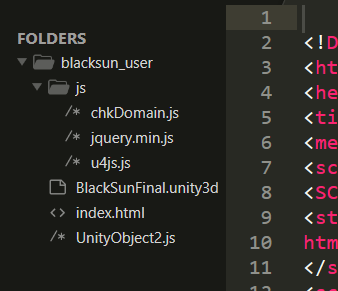

然后本地打开index.html就可以快乐游戏啦~ 想玩blacksun的可以直接移步[这里](http://aluminium/allophane.com/index.php/2021/07/05/rebulid_black_sun/)

[github链接](https://github.com/AluminiumOxide/localization_web_unity_game)

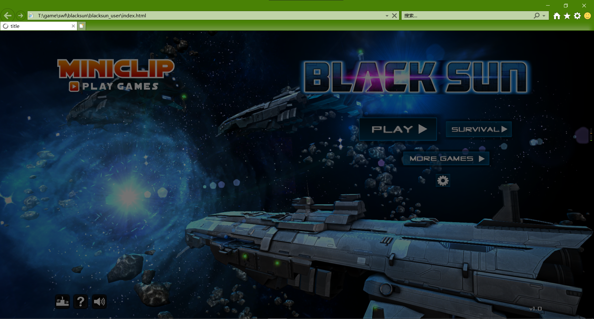

  
其他网页unity文件可以直接按这个模板搞，  
此贴完结
