来，这里是debug按钮，这个是step into，这个是step out，这个是step over，这个是step to next cursor，变量和命令行分别出现在这里，好了你现在已经充分了解了debug的游戏规则，下面可以开始你快乐的调试工作了。

然后cycleGAN的代码直接拿[朱佬的官方版本](https://github.com/junyanz/pytorch-CycleGAN-and-pix2pix)

首先克隆仓库，然后安装依赖项我就不赘述了

```
git clone https://github.com/junyanz/pytorch-CycleGAN-and-pix2pix
pip install -r requirements.txt
```

注意！别尝试拿conda下载visdom(项目里面的一个依赖库)，我试了半天也没找到包，换源也找不到，但是pip直接就下载了，很奇妙  
然后克隆数据集

```
bash ./datasets/download_cyclegan_dataset.sh maps
```

如果说看过我之前使用[PlotNeuralNet魔性文章](http://aluminium/allophane.com/index.php/2021/11/14/plotneuralnet_3_retrench/) 应该已经对bash这玩意有免疫力了，直接打开sh文件(当然，我觉得吧，安装了git，直接在bash里运行倒也OK，反正运行一次就完事了)

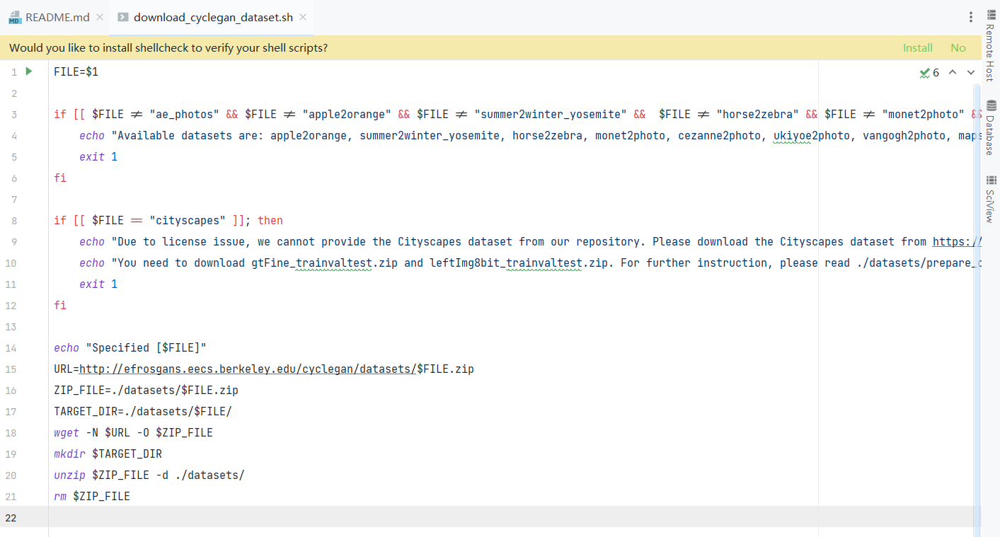

众所周知，wget能下载几乎所有的东西，$1表示shell脚本后第一个参数名，也就是这个脚本是先判断一下你的数据集名称对不对，然后到https://people.eecs.berkeley.edu/~taesung\_park/CycleGAN/datasets/  
下载数据集名称的zip文件到本项目的./datasets/目录下，解压然后删除压缩包

那我直接下崽不久可以了吗？进网页进网页

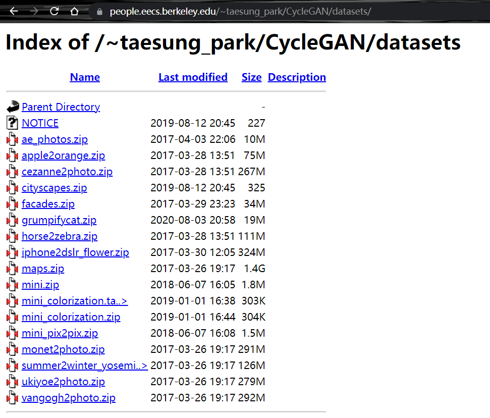

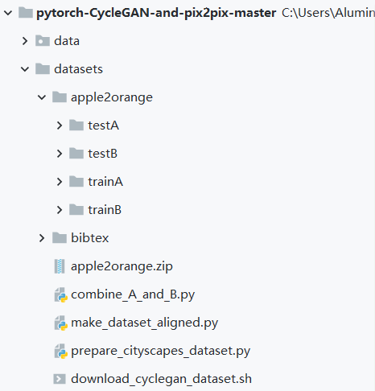

直接下载解压，反正是直链，大不了直接IDM32线程(后仰)，这里反正是演示一下流程，直接拿个苹果橘子的开刀吧，解压完类似这样。

然后，由下图可得，如果想保证训练正常运行，得先python -m visdom.server，启动服务器（可以，有tensorboard那味儿了）

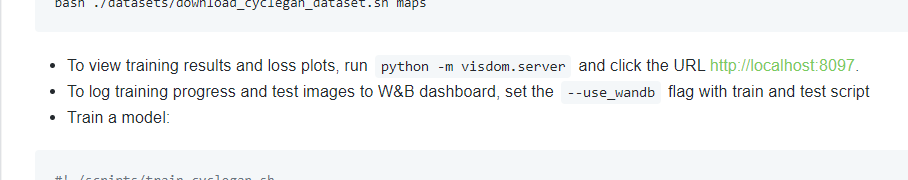

那就在terminal开一下，如下图所示

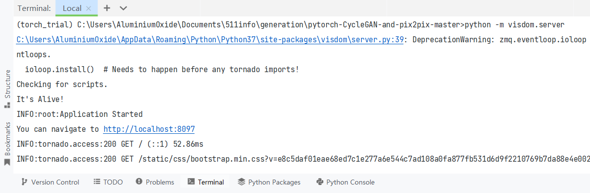

然后看一下这个训练参数设置

```
python train.py --dataroot ./datasets/maps --name maps_cyclegan --model cycle_gan
```

这里说一下以前没说的，类似这种附加参数在pycharm里打开文件后(注意现在活跃的脚本和你想添加参数的脚本要一致) run/Edit Configurations/

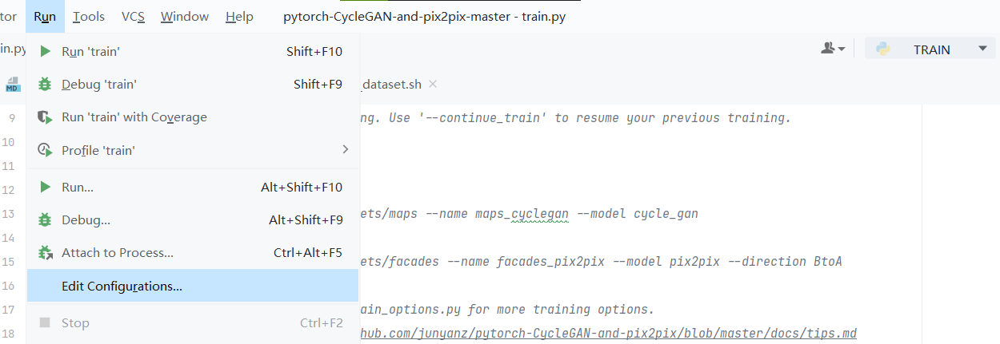

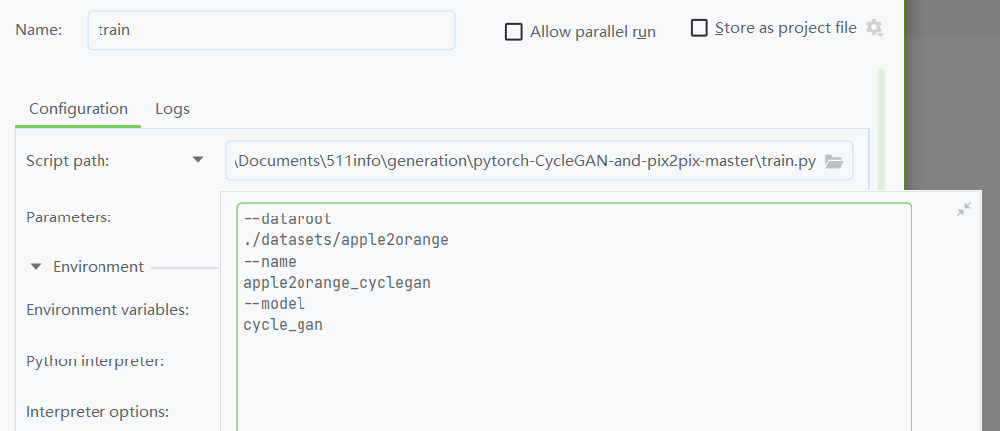

打开然后把后面的参数塞到里面，当然，因为数据集不同，所以需要稍微改改

```
--dataroot ./datasets/apple2orange --name apple2orange_cyclegan --model cycle_gan
```

然后直接训练

当然，喜闻乐见的出问题了

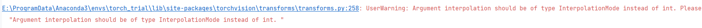

第一个

UserWarning: Argument interpolation should be of type InterpolationMode instead of int. Please, use InterpolationMode enum.  
"Argument interpolation should be of type InterpolationMode instead of int. "

关于这个问题，在[网上](https://blog.csdn.net/qq_39220334/article/details/122223288)找了一圈，在base\_dataset添加InterpolationMode，并代替PIL.Image。  
你说它没事插什么值啊！

```
from torchvision.transforms import InterpolationMode
```

定位到dataset的transform里(base\_dataset.py)，添加引用，然后改一下

```
def get_transform(opt, params=None, grayscale=False, method=Image.BICUBIC, convert=True):
```

原81行

```
def get_transform(opt, params=None, grayscale=False, method=InterpolationMode.BICUBIC, convert=True):
```

改81行

第二个

UserWarning: Detected call of lr\_scheduler.step() before optimizer.step(). In PyTorch 1.1.0 and later, you should call them in the opposite order: optimizer.step() before lr\_scheduler.step(). Failure to do this will result in PyTorch skipping the first value of the learning rate schedule.

这说的就很明白了，就是说pytorch1.1.0之后，优化器的更新要放到学习率更新的前面，定位到就在train里（还好这俩玩意没被放一块）把学习率更新扔后面

```
        # model.update_learning_rate()    # update learning rates in the beginning of every epoch.
```

注释掉train43行

```
        model.update_learning_rate()    # update learning rates in the ending of every epoch.
```

放到78行运行完一个epoch后

第三个  
最喜闻乐见的（这个我估计大家应该不会有问题吧）

RuntimeError: CUDA out of memory. Tried to allocate 16.00 MiB (GPU 0; 2.00 GiB total capacity; 1.09 GiB already allocated; 0 bytes free; 1.20 GiB reserved in total by PyTorch)

batchsize已经=1了，，，想连服务器也挺卡的，只能缩减网络参数了，反正，，，G\_net里面的9个res块都一样，那就压缩到1个意思意思得了

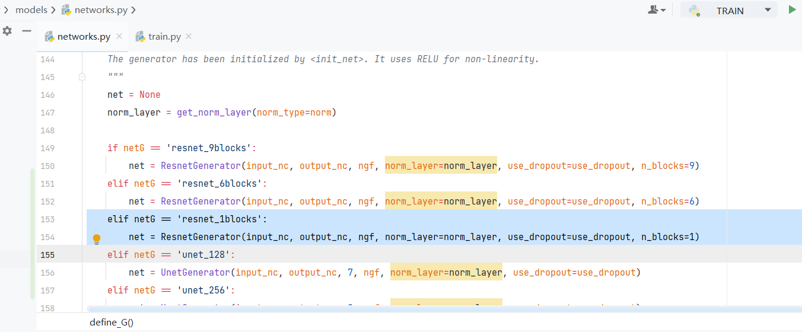

在model/networks.py里找到定义G网络的函数，添加一个只带1个res的设置  
然后在输入参数里添加netG的

```
--dataroot ./datasets/apple2orange --name apple2orange_cyclegan --model cycle_gan --netG resnet_1blocks
```

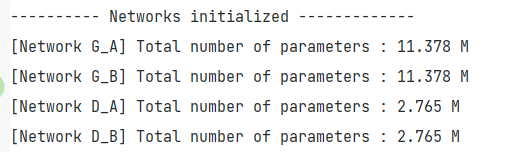

改前

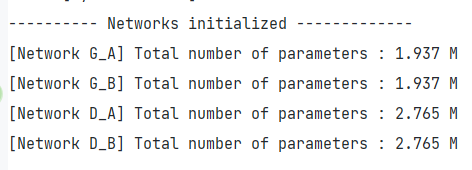

改后

然后就应该没问题可以正常运行了，代码分析看[下一篇](http://aluminium/allophane.com/index.php/2022/03/26/simple_debug_cyclegan/)
