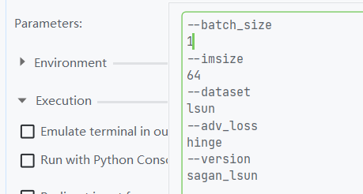
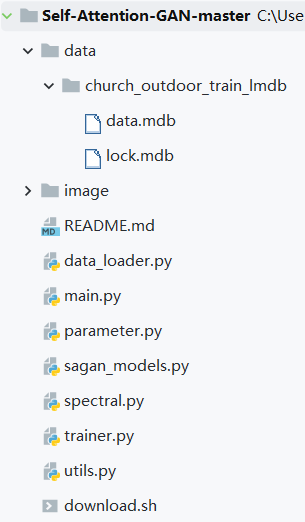
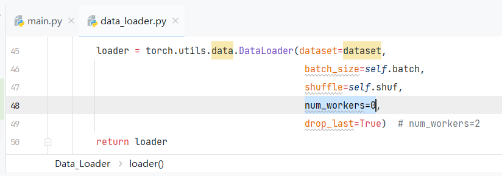
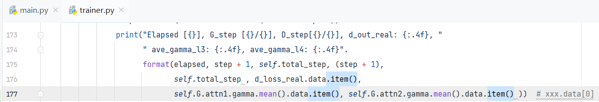
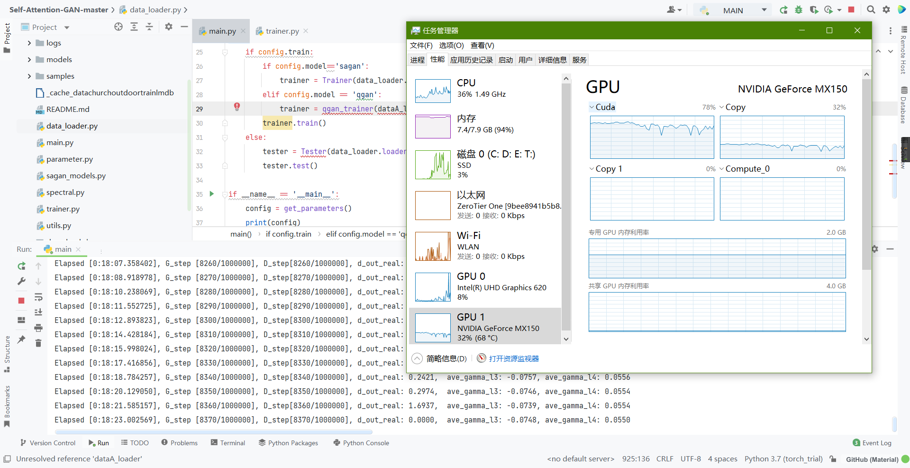

那么跟着[上文](http://aluminium/allophane.com/index.php/2022/04/03/dataset_lsun_for_sagan/)  
老流程了，直接一个偷

```
git clone https://github.com/heykeetae/Self-Attention-GAN.git
cd Self-Attention-GAN
```

然后按照优秀的数据集下载机制，，，建议直接查看[上文](http://aluminium/allophane.com/index.php/2022/04/03/dataset_lsun_for_sagan/)

然后查看训练脚本

```
python python main.py --batch_size 64 --imsize 64 --dataset lsun --adv_loss hinge --version sagan_lsun
```

那么开始喜闻乐见的 本 地 化 调 整 ！  
右键运行main.py然后瞬间掐掉，并且把参数添加到config里，众所周知，--batch\_size 那肯定是1才对！（狗头）

现在参数里应该是下图所示



目前大家的目录应该是类似左图的样子



喜闻乐见的报错

trainer.py", line 74, in train data\_iter = iter(self.data\_loader)  
TypeError: can't pickle Environment objects  
PermissionError: \[WinError 5\] 拒绝访问。

大致原因是win上多进程multiprocessing不能像linux一样序列化，直接把dataloader里面改成 num\_workers=0



然后

trainer.py", line 176, in train self.total\_step , d\_loss\_real.data\[0\],  
IndexError: invalid index of a 0-dim tensor. Use `tensor.item()` in Python or `tensor.item<T>()` in C++ to convert a 0-dim tensor to a number

就按照字面意思，在对应位置改一下

```
print("Elapsed [{}], G_step [{}/{}], D_step[{}/{}], d_out_real: {:.4f}, "
      " ave_gamma_l3: {:.4f}, ave_gamma_l4: {:.4f}".
      format(elapsed, step + 1, self.total_step, (step + 1),
             self.total_step , d_loss_real.data[0],
             self.G.attn1.gamma.mean().data[0], self.G.attn2.gamma.mean().data[0] ))
```

修改为

```
print("Elapsed [{}], G_step [{}/{}], D_step[{}/{}], d_out_real: {:.4f}, "
      " ave_gamma_l3: {:.4f}, ave_gamma_l4: {:.4f}".
      format(elapsed, step + 1, self.total_step, (step + 1),
             self.total_step , d_loss_real.data.item(),
             self.G.attn1.gamma.mean().data.item(), self.G.attn2.gamma.mean().data.item() ))
```



然后应该就可以正常跑了



你可以看到，它，，，甚至，，，没有测试集的脚本（后仰）
