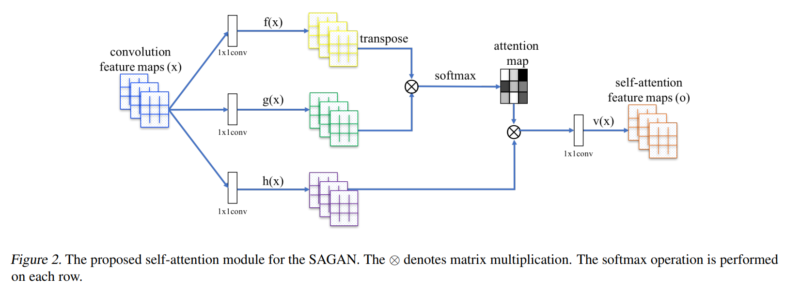

细节懒的说了,(这代码写的真的是稀烂!)  
Transform有centercrop(160)>resize()>ToTensor()>Normalize()  
优化器G和D用的都是adam  
大概就是:  
使用数据集里给出真的图片,生成器G用给的随机数生成假的图片, 调教鉴别器D  
鉴别器D让生成器G用随机数生成假的图片越来越接近真实图片

鉴别器D

real\_Image (BN,3,64,64)  
real\_images = tensor2var(real\_images) # 扔cuda  
**d\_out\_real,dr1,dr2 = self.D(real\_images)**  
d\_out\_real (BN) # 好像是只有BN个数  
dr1 (BN,64,64)  
dr2 (BN,16,16)  
z = tensor2var(torch.randn(real\_images.size(0), self.z\_dim))  
z (BN,128)  
**fake\_images,gf1,gf2 = self.G(z)**  
fake\_images (BN,3,64,64)  
gf1 (BN,256,256)  
gf2 (BN,1024.1024)  
**d\_out\_fake,df1,df2 = self.D(fake\_images)**  
d\_out\_fake (BN)  
df1 (BN,64,64)  
df2 (BN,16,16)

  
d\_loss\_real = torch.nn.ReLU()(1.0 - d\_out\_real).mean()  
d\_loss\_fake = torch.nn.ReLU()(1.0 + d\_out\_fake).mean()  
d\_loss = d\_loss\_real + d\_loss\_fake  
self.reset\_grad()  
d\_loss.backward()  
self.d\_optimizer.step()

生成器G

z = tensor2var(torch.randn(real\_images.size(0), self.z\_dim))  
z (BN,128) #真的就是随机生成  
**fake\_images,\_,\_ = self.G(z)**  
fake\_images (BN,3,64,64)  
**g\_out\_fake,\_,\_= self.D(fake\_images)**  
g\_out\_fake (BN)  

g\_loss\_fake = - g\_out\_fake.mean()  
self.reset\_grad()  
g\_loss\_fake.backward()  
self.g\_optimizer.step()

主要还是说一下它这里面的SA机制吧(恼)



先放个图,明天继续

大概这个玩意就是分成l1~l4、last、attn1~2个东西

<table><tbody><tr><td>生成器G</td><td>鉴别器D</td></tr><tr><td>(l1): Sequential(<br>(0): SpectralNorm(<br>(module): ConvTranspose2d(128, 512, kernel_size=(4, 4), stride=(1, 1))<br>)<br>(1): BatchNorm2d(512, eps=1e-05, momentum=0.1, affine=True, track_running_stats=True)<br>(2): ReLU()<br>)</td><td>(l1): Sequential(<br>(0): SpectralNorm(<br>(module): Conv2d(3, 64, kernel_size=(4, 4), stride=(2, 2), padding=(1, 1))<br>)<br>(1): LeakyReLU(negative_slope=0.1)<br>)</td></tr><tr><td>(l2): Sequential(<br>(0): SpectralNorm(<br>(module): ConvTranspose2d(512, 256, kernel_size=(4, 4), stride=(2, 2), padding=(1, 1))<br>)<br>(1): BatchNorm2d(256, eps=1e-05, momentum=0.1, affine=True, track_running_stats=True)<br>(2): ReLU()<br>)</td><td>(l2): Sequential(<br>(0): SpectralNorm(<br>(module): Conv2d(64, 128, kernel_size=(4, 4), stride=(2, 2), padding=(1, 1))<br>)<br>(1): LeakyReLU(negative_slope=0.1)<br>)</td></tr><tr><td>(l3): Sequential(<br>(0): SpectralNorm(<br>(module): ConvTranspose2d(256, 128, kernel_size=(4, 4), stride=(2, 2), padding=(1, 1))<br>)<br>(1): BatchNorm2d(128, eps=1e-05, momentum=0.1, affine=True, track_running_stats=True)<br>(2): ReLU()<br>)</td><td>(l3): Sequential(<br>(0): SpectralNorm(<br>(module): Conv2d(128, 256, kernel_size=(4, 4), stride=(2, 2), padding=(1, 1))<br>)<br>(1): LeakyReLU(negative_slope=0.1)<br>)</td></tr><tr><td>(l4): Sequential(<br>(0): SpectralNorm(<br>(module): ConvTranspose2d(128, 64, kernel_size=(4, 4), stride=(2, 2), padding=(1, 1))<br>)<br>(1): BatchNorm2d(64, eps=1e-05, momentum=0.1, affine=True, track_running_stats=True)<br>(2): ReLU()<br>)</td><td>(l4): Sequential(<br>(0): SpectralNorm(<br>(module): Conv2d(256, 512, kernel_size=(4, 4), stride=(2, 2), padding=(1, 1))<br>)<br>(1): LeakyReLU(negative_slope=0.1)<br>)</td></tr><tr><td>(last): Sequential(<br>(0): ConvTranspose2d(64, 3, kernel_size=(4, 4), stride=(2, 2), padding=(1, 1))<br>(1): Tanh()<br>)</td><td>(last): Sequential(<br>(0): Conv2d(512, 1, kernel_size=(4, 4), stride=(1, 1))<br>)</td></tr><tr><td>(attn1): Self_Attn(<br>(query_conv): Conv2d(128, 16, kernel_size=(1, 1), stride=(1, 1))<br>(key_conv): Conv2d(128, 16, kernel_size=(1, 1), stride=(1, 1))<br>(value_conv): Conv2d(128, 128, kernel_size=(1, 1), stride=(1, 1))<br>(softmax): Softmax(dim=-1)<br>)</td><td>(attn1): Self_Attn(<br>(query_conv): Conv2d(256, 32, kernel_size=(1, 1), stride=(1, 1))<br>(key_conv): Conv2d(256, 32, kernel_size=(1, 1), stride=(1, 1))<br>(value_conv): Conv2d(256, 256, kernel_size=(1, 1), stride=(1, 1))<br>(softmax): Softmax(dim=-1)<br>)</td></tr><tr><td>(attn2): Self_Attn(<br>(query_conv): Conv2d(64, 8, kernel_size=(1, 1), stride=(1, 1))<br>(key_conv): Conv2d(64, 8, kernel_size=(1, 1), stride=(1, 1))<br>(value_conv): Conv2d(64, 64, kernel_size=(1, 1), stride=(1, 1))<br>(softmax): Softmax(dim=-1)<br>)</td><td>(attn2): Self_Attn(<br>(query_conv): Conv2d(512, 64, kernel_size=(1, 1), stride=(1, 1))<br>(key_conv): Conv2d(512, 64, kernel_size=(1, 1), stride=(1, 1))<br>(value_conv): Conv2d(512, 512, kernel_size=(1, 1), stride=(1, 1))<br>(softmax): Softmax(dim=-1)<br>)</td></tr></tbody></table>

传播下来基本一致，都是

l1 > l2 > l3 > attn1 > l4 > attn2 > last

顺带着attn还会把关系矩阵输出出来

然后可以卡到上面这俩网络都引用了SpectralNorm(),这个俗称: 谱归一化,我看他是自己写个函数实现的

**SpectralNorm()**

**在初始化时候**  
先生成  
u =(height) 大小，均值为0 方差为1分布的随机数  
v =(width_kernel_kernel) 大小，均值为0 方差为1分布的随机数  
然后这俩l2正则化  
使得u和v现在这俩玩意的2范数为 1

**在迭代的时候**  
weight变成 (H,W_K_K)的  
再转置 (WKK,H) 后和 u(H)做叉乘 再进行正则化 得到新v (WKK, )  
weight变成 (H,WKK) 和v(WKK) 做叉乘 再进行正则化 得到新 u(H)

W(H,WKK) \* V(WKK) (H)  
sigma = V(H) 点乘 W(H,WKK) \* V(WKK) (1)

然后 W = W ./ sigma (H,W,K,K)  
再把这个输出出去

然后说一下attn的,  
算了懒的说了,自己按照代码画完和他们画的图片差不多,就按他们的看吧  
具体看

```
    def forward(self, x):
        """
            inputs :
                x : input feature maps( B X C X W X H)
            returns :
                out : self attention value + input feature
                attention: B X N X N (N is Width*Height)
        """
        m_batchsize, C, width, height = x.size()
        proj_query = self.query_conv(x).view(m_batchsize, -1, width * height).permute(0, 2, 1)  # B X CX(N)
        proj_key = self.key_conv(x).view(m_batchsize, -1, width * height)  # B X C x (*W*H)
        energy = torch.bmm(proj_query, proj_key)  # transpose check
        attention = self.softmax(energy)  # BX (N) X (N)
        proj_value = self.value_conv(x).view(m_batchsize, -1, width * height)  # B X C X N

        out = torch.bmm(proj_value, attention.permute(0, 2, 1))
        out = out.view(m_batchsize, C, width, height)

        out = self.gamma * out + x
        return out, attention
```

由于只是想把Attn用到cycleGAN上,(反正die码都已经可以跑了嘛,而且我也真的不想继续观摩这个作者的die码(不仅一堆该引的不直接引用,还放一堆没实现或者说它可能根本没写,它自定义的那个谱归一化还污染conv的内置参数(我个人很难接受一个正常卷积里平白无故外挂了一堆weight,关键是这些weight只是按照你需要的分布随机生成的))
