## StarGAN v1

第一眼真的很容易直接把cycleGAN那些套过去！

即使是换了画图的方式，，，也

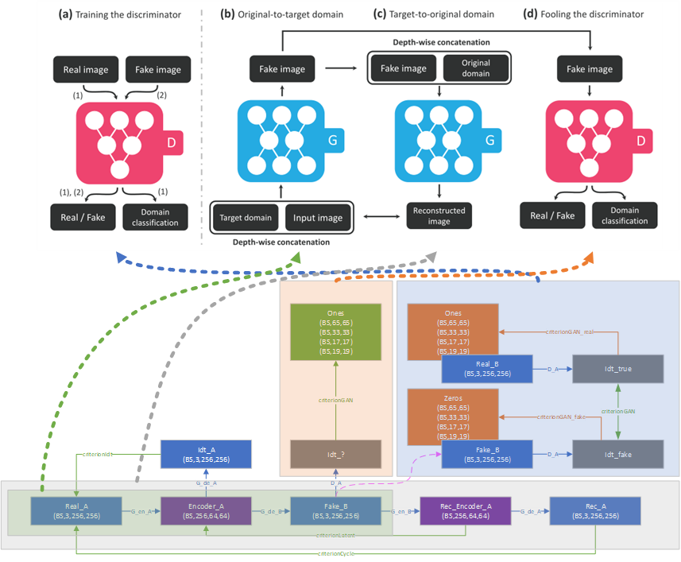

StarGAN，由两个模块组成，一个鉴别器D和一个生成器G。

（a）鉴别器D 学习区分真实图像和虚假图像，并将真实图像分类到其相应的域。

（b）生成器G 接收**图像imput**和**目标域标签target domain**，生成**伪图fake**。目标域标签在空间上复制并与输入图像连接（也就是说这俩是一起往生成器里送的）。

（c）生成器G尝试使用**原始域标签original domain**和**伪图Fake image** 重建**原始图像Reconstructed image**。

（d）生成器G试图生成与真实图像无法区分的**伪图**，并欺骗 鉴别器D分类为目标域。

然后这个图里面表达了用CelebA和RaFD一起训练时的StarGAN概述。  
（a）∼ （d） 显示了使用CelebA的培训过程 人种  
（e）∼ （h） 显示了使用RaFD的训练过程 表情

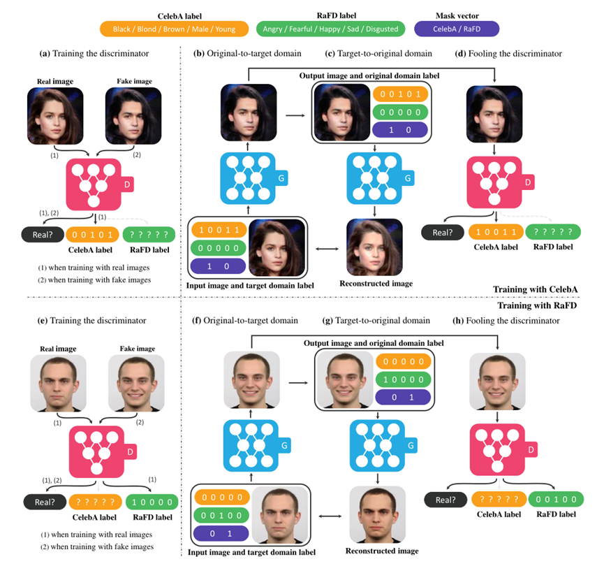

（a）、（e）鉴别器D学习区分真图像和假图像，并仅最小化已知标签的分类误差（包括学习是否图像是真实图像，以及类型或心情的掩码是否一致）  
（b~d）当掩码向量（紫色）为\[1,0\]时，生成器G学习聚焦于CelebA标签（黄色）并忽略RaFD标签（绿色）以执行图像到图像的转换  
（f~h） 反之亦然

《反正这个图也是从上面那个图改的，就不细说了，反正和之前的图都能对上》

## StarGAN v2

按照本子里面说的， v2主要在解决这俩玩意儿  
1） 生成图像的多样性和  
2）跨多个域的可伸缩性。

StarGANv1 仍然学习每个域的确定性映射，这并不能捕获数据分布的多模态特性  
生成器接收固定标签（例如，one-hot vector）作为输入，因此，在给定源图像的情况下，它不可避免地为每个域生成相同的输出。

主要变化在：一个映射网络和一个样式编码器。a **mapping network** and a **style encoder**  
映射网络学习将随机高斯噪声转换为样式码，  
而编码器学习从给定参考图像中提取样式码。  
考虑到多个域，两个模块都有多个输出分支，每个分支都提供特定域的样式代码。

利用这些样式代码，我们的生成器学习在多个域上成功合成不同的图像

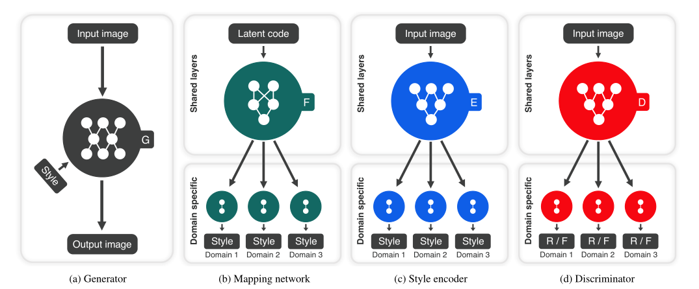

（a） **G 生成器** 将输入图像转换为反映域特定样式代码的输出图像。  
（b） **F 映射网络** 将潜在代码转换为多个域的样式代码，其中一个域在训练期间随机选择。  
（c） **E 样式编码器** 提取图像的样式代码，允许生成器执行参考导向图像合成。  
（d）**D 鉴别器** 区分来自多个域的真实图像和假图像。请注意，除生成器之外的所有模块都包含多个输出分支，其中一个在训练相应的域时选择。

- Generator 将输入图像x转换为反映特定于域的**样式代码s**的**输出图像G（x，s）**，该代码由**映射网络F**或**样式编码器E**提供。使用自适应实例归一化（AdaIN）将s注入到G中。
- Mapping network 给定一个**latent code z**和一个**风格域y**，映射网络F生成一个**样式代码 s=F y（z）**，其中**Fy（·）表示对应于域y的F的输出**。
    - F 由一个具有多个输出分支的MLP组成，以提供所有可用域的样式代码。
    - F 通过对 **latent code z ∈ Z** 和 **y∈ Y** 随机采样，产生不同样式的代码。starGAN允许F高效地学习所有领域的风格表示
- Style encoder 给定**图像x**及其对应的**风格域y**，编码器E 提取x的**样式代码s=Ey（x）**
    - Ey（·）表示对应于域y的E的输出
    - E 可以使用不同的参考图像生成不同的样式代码。这允许G合成反映参考图像x的样式s的输出图像。
- Discriminator 鉴别器D是一个多任务鉴别器，由多个输出分支组成。每个分支Dy学习二值分类，确定图像x是其域y的真实图像还是由G产生的伪图像G（x，s）

### 损失函数

定义了4个分别是 Adversarial objective Loss、Style reconstruction Loss、Style diversification Loss、Preserving source characteristics Loss

#### Adversarial objective Loss

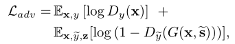

这个就相当于是针对鉴别器的，上面认为是真的图片鉴别成真的  
下面的D(G(X,S))就相当于生成伪图，再经过鉴别器判断成假的，用1减这个值就相当于给它颠倒一下，让整个损失方向一致

#### Style reconstruction Loss

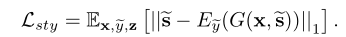

嘿？这就是传说中的编码器损失嘛？  
相当于目标风格S 与 伪图经过编码器E后生成的风格 之间求解损失

#### Style diversification Loss

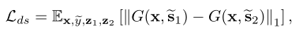

为了进一步使生成器G能够生成不同的图像，我们使用对多样性敏感的损失显式地正则化G

虽然是机翻，但是确实是这个意思，也就是不同风格间的伪图应该差异足够大，这个损失函数在后面是越大越好《只有这一个越大越好！拼接的时候加了负号》

样式码s1、s2由两个随机的 latent codes z1 和 z2 经过 **映射网络 F** 生成  
最大化正则化项迫使G探索图像空间并发现有意义的风格特征以生成不同的图像

#### Preserving source characteristics Loss

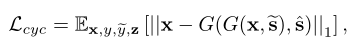

循环一致性损失，哦~我的老朋友，cycleLoss，欢迎回来！（误）

最后这四个损失按照以下拼接，其中λ是权重，这里似乎都是1

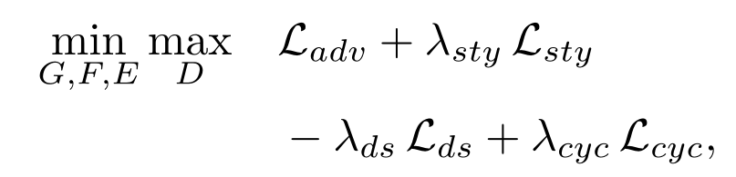

评价时用了  
Frechet inception distance（FID）表示真实图像和生成图像的两个分布之间的距离（越低越好），  
learned perceptual image patch similarity（LPIPS）学习感知图像块相似性 用来测量生成图像的多样性（越高越好）

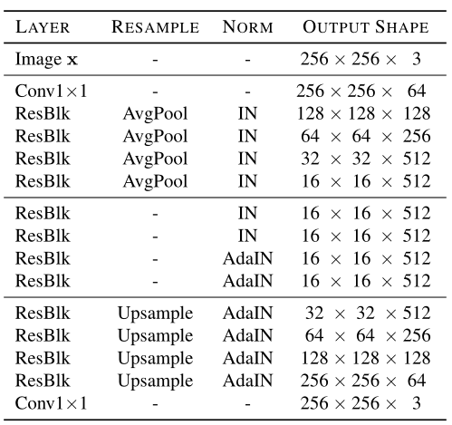

**G 生成器**  
《虽然没说，但是这里AdaIN开始融合style特征(作为解码器)，前面算是编码器》

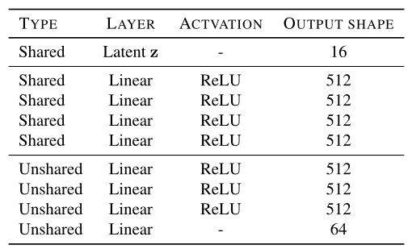

**F 映射网络**

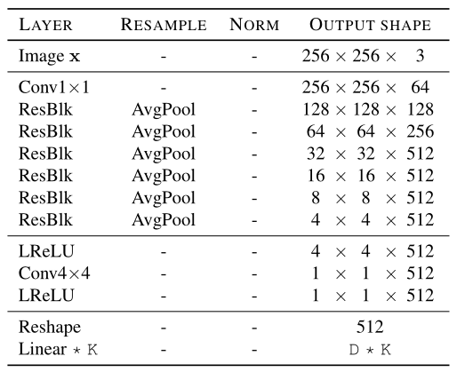

**E 样式编码器** 和 **D 鉴别器** (这俩结构中间都是一样滴捏)  
D:输出维度大小(E=64,D=1) K:风格数量Domain  
《不过最终的输出E 和 D还是有不一样的地方，放在最后的笔记里一起收拾》

然后实验部分？算了算了，直接开始看[代码](https://github.com/clovaai/stargan-v2)
