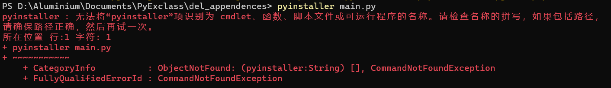
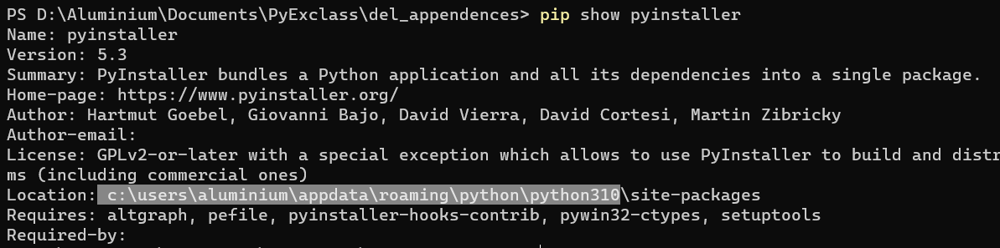
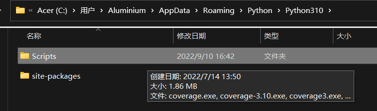
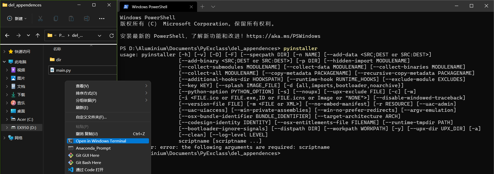
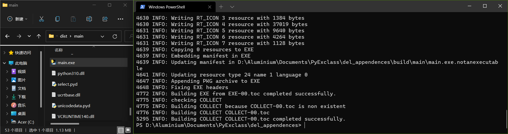

首先安装

```
pip install pyinstaller
```

然后一般来说右键terminal直接使用会遇到



排除安装失败，需要pip install --user pyinstaller之外，直接然后copy路径(注意我没复制全路径哈，进入上级目录就行)

```
pip show pyinstaller
```



进来之后进入script下复制路径(因为那些可执行文件就在script下啊)，对于我来说就是



```
C:\Users\Aluminium\AppData\Roaming\Python\Python310\Scripts
```

然后把这个路径塞到系统变量下(该过程略，说好几次了)，对于我这个路径来说，不塞系统路径直接往用户路径塞也行  
然后 enjoy the lib



至于说介绍参数就可以忽略了，可以加个-F 免去到dist/main/里寻找dist/main/<input python script name>.exe的过程（把其他文件直接删了）


