用于绘制流程图，也可治疗偏头痛，[官网](http://graphviz.org/)，[Github](https://github.com/xflr6/graphviz)，[readthedoc](https://graphviz.readthedocs.io)

### 安装

首先直接

```
pip install graphviz
```

并且为了渲染 DOT source code, you also need to install [Graphviz](https://www.graphviz.org/) ([download page](https://www.graphviz.org/download/), [archived versions](https://www2.graphviz.org/Archive/stable/), [installation procedure for Windows](https://forum.graphviz.org/t/new-simplified-installation-procedure-on-windows/224)).  
Make sure that 这货已经添加到系统路径了 (sometimes done by the installer; setting on [Linux](https://stackoverflow.com/questions/14637979/how-to-permanently-set-path-on-linux-unix), [Mac](https://stackoverflow.com/questions/22465332/setting-path-environment-variable-in-osx-permanently), and [Windows](https://www.computerhope.com/issues/ch000549.htm)).

使用conda安装  
[Anaconda](https://docs.anaconda.com/anaconda/install/): see the [conda-forge](https://conda-forge.org/) package [conda-forge/python-graphviz](https://anaconda.org/conda-forge/python-graphviz) ([feedstock](https://github.com/conda-forge/python-graphviz-feedstock)), which should automatically `conda install` [conda-forge/graphviz](https://anaconda.org/conda-forge/graphviz) ([feedstock](https://github.com/conda-forge/graphviz-feedstock)) as dependency.  
向conda添加以下内容，可以从conda进行安装

```
conda config --add channels conda-forge
conda config --set channel_priority strict
```

启用通道后

```
conda install graphviz
```

## Quickstart

[graphviz](https://graphviz.readthedocs.io/en/stable/api.html)包提供两个主要类：graphviz.Graph和graphviz.Digraph。分别用[DOT](https://www.graphviz.org/doc/info/lang.html)语言为无向图和有向图创建图描述。它们具有相同的 [API](https://graphviz.readthedocs.io/en/stable/api.html)。

通过实例化新的Graph或Digraph创建图形：

1\. Create a graph object:  
它们的构造函数允许设置图形的名称标识符，DOT源和呈现的图形的文件名，第一个源代码行的可选注释等

```
import graphviz
dot = graphviz.Digraph(comment='The Round Table')
```

2\. Add nodes and edges:  
使用其node()和edges()方法将节点和边缘添加到图形对象中：

node()方法将标识符name作为第一个参数，第二个参数的label是可选的  
edge()方法采用起始节点和结束节点的name  
edges() 采用name对的可迭代名称(也就是直接把两个name串起来)

```
dot.node('A', 'Oxide')  
dot.node('B', 'Aluminium')
dot.node('L', 'AluminiumOxide')

dot.edges(['AB', 'AL'])
dot.edge('B', 'L', constraint='false')
```

3\. Check the generated source code:

```
print(dot.source)  
```

4.1 Save and render the source code:  
使用 render()方法保存 DOT 源代码，并使用默认布局引擎呈现它（有关使用其他布局引擎的信息，请参阅[用户指南 — 图形 0.20.1 文档 (graphviz.readthedocs.io)](https://graphviz.readthedocs.io/en/stable/manual.html#engines)

```
dot.render('doctest-output/round-table.gv').replace('\\', '/')
```

4.2 Save and render and view the result:  
传递将使用系统针对所呈现的文件类型的默认查看器应用程序自动打开生成的（PDF、SVG、PNG 等）文件

```
dot.render('doctest-output/round-table.gv', view=True)  
```

那最后的代码是这样的

```
import graphviz
dot = graphviz.Digraph(comment='The Round Table')

dot.node('A', 'Oxide')
dot.node('B', 'Aluminium')
dot.node('L', 'AluminiumOxide')

dot.edges(['AB', 'AL'])
dot.edge('B', 'L', constraint='false')

print(dot.source)

dot.render('doctest-output/round-table.gv', view=True)
```

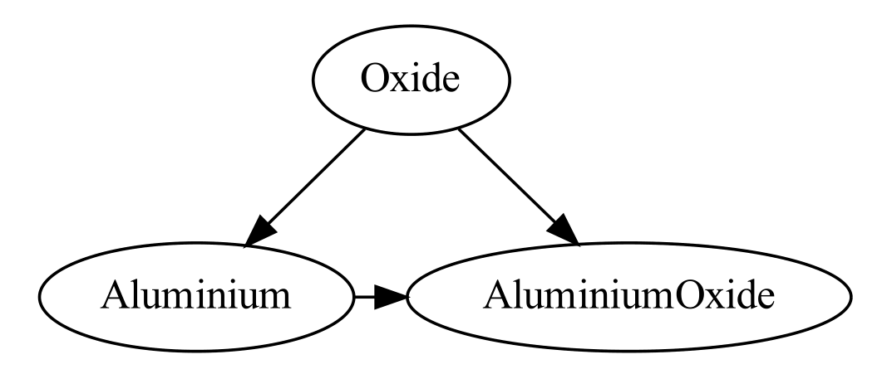

输出

警告: 反斜杠转义和形式的字符串在 [DOT](https://www.graphviz.org/doc/info/lang.html) 语言中具有特殊含义，目前由此库按原样传递。如果您需要按字面意思呈现任意字符串（例如，从用户输入），请考虑首先使用 [`graphviz.escape（）`](https://graphviz.readthedocs.io/en/stable/api.html#graphviz.escape) 函数包装它们。有关详细信息，请参阅下面的[反斜杠转义](https://graphviz.readthedocs.io/en/stable/manual.html#backslash-escapes)[和引用以及类似 HTML 的标签](https://graphviz.readthedocs.io/en/stable/manual.html#quoting-and-html-like-labels)部分。

## 格式

要使用与默认 PDF 不同的输出文件格式，您可以在创建对象时使用该参数：

```
import graphviz
g = graphviz.Graph(format='png')  
```

您还可以更改现有图形对象上的格式属性：

dot = graphviz.Digraph('hello')
dot.edge('hello', 'world')
dot.format = 'svg'
dot.render(directory='doctest-output').replace('**\\\\**', '/')

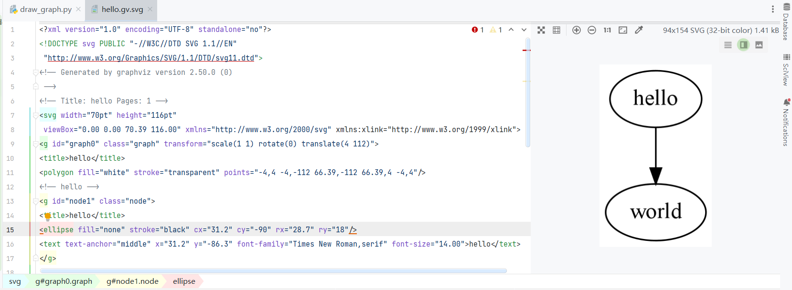

## Piped output

相当于直接从编辑器中输出图像了,不进行储存,使用pipe()方法

```
import graphviz
h = graphviz.Graph('hello', format='svg')  
h.edge('Hello', 'World')
h.pipe(format='pdf')[:4]
print(h.pipe(encoding='utf-8'))  
```

pipe() 的输出缓冲在内存中，因此，如果数据大小很大，请避免使用此方法。

由于两类对象具有 [\_repr\_mimebundle\_()](https://graphviz.readthedocs.io/en/stable/api.html#graphviz.Graph._repr_mimebundle_)方法，因此可以直接在 [Jupyter 笔记本](https://jupyter.org/)中呈现和显示它们。

## Styling

Use the **graph\_attr,** **node\_attr**, and **edge\_attr** arguments of the Graph and Digraph constuctors to change the default attributes for your graph, nodes, and edges.

```
import graphviz  
ps = graphviz.Digraph('pet-shop', node_attr={'shape': 'plaintext'},format='png')
ps.node('parrot')
ps.node('dead')
ps.edge('parrot', 'dead')
```

After creation, the [`graph_attr`](https://graphviz.readthedocs.io/en/stable/api.html#graphviz.Graph.graph_attr), [`node_attr`](https://graphviz.readthedocs.io/en/stable/api.html#graphviz.Graph.node_attr), and [`edge_attr`](https://graphviz.readthedocs.io/en/stable/api.html#graphviz.Graph.edge_attr) attributes be edited on instances

```
ps.graph_attr['rankdir'] = 'LR'  
ps.edge_attr.update(arrowhead='vee', arrowsize='2')
print(ps.source)  
ps.render(directory='doctest-output')
```

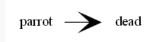

## Attributes

属性Attr()语句影响同一（子）图中的所有**后续**图形、节点或边。

```
import graphviz
ni = graphviz.Graph('ni')  
ni.attr('node', shape='rarrow')
ni.node('1', 'Ni!')
ni.node('2', 'Ni!')
ni.node('3', 'Ni!', shape='egg')
ni.attr('node', shape='star')
ni.node('4', 'Ni!')
ni.node('5', 'Ni!')
```

如果省略第一个 attr()参数，则该方法可用于将任意属性设置为针对当前（子）图的键值对

```
ni.attr(rankdir='LR')  
ni.edges(['12', '23', '34', '45'])
print(ni.source) 
ni.render(directory='doctest-output')
```

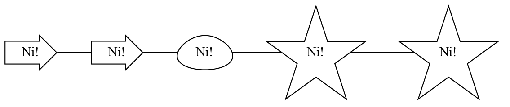

## Node ports & compass

使用 冒号分隔的格式node\[:port\[:compass\]\] 对于tail和head节点。这允许指定一个可选节点以及一个可选点，边缘应针对给定的尾部或头节点

```
import graphviz  

cpp = graphviz.Digraph('C++')

cpp.node('A', 'std::string')
cpp.node('B', '"spam"')

cpp.edge('A', 'B')

print(cpp.source)  
```

digraph "C++" {
    A \[label="std::string"\]
    B \[label="\\"spam\\""\]
    A -> B
}

## 反斜杠转义

`\n`, `\l`, `\r` 用于放置多行标签：_居中_、_左_对齐、_右_对齐  
`\N`, `\G`, `\L`_节点_名称、_图形_名称、对象_标签_  
为了能够从这个库中使用它们（例如，对于标签），字符串中的反斜杠（大多数）是**按原样**传递的

这意味着**文本**反斜杠需要由用户**转义**（加倍）。由于反斜杠在Python[`字符串`](https://docs.python.org/3/library/stdtypes.html#str)文本中也很特殊，因此需要**第二**级加倍

通过使用[原始字符串文本](https://docs.python.org/3/reference/lexical_analysis.html#string-and-bytes-literals) （） 可以避免反斜杠加倍。

```
import graphviz  

e = graphviz.Digraph('escapes')

e.node('backslash', label=r'\\')
e.node('multi_line', label=r'centered\nleft\lright\r')

print(e.source)  
```


要禁用字符串中的任何特殊字符含义（例如，从用户输入中按字面意思呈现），请使用 [`graphviz.escape（）`](https://graphviz.readthedocs.io/en/stable/api.html#graphviz.escape) 函数

```
bs = graphviz.Digraph('literal_backslash')  

bs.node(graphviz.escape('\\'))

print(bs.source)  

bs.render(format='svg', directory='doctest-output').replace('\\', '/')
```

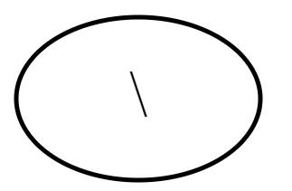

为了防止破坏内部引用机制，自此0.14库版本以来，作为反斜杠转义引用的特殊含义已被禁用

## 引用和类似 HTML 的标签

```
import graphviz  

q = graphviz.Digraph()

q.edge('spam', 'eggs eggs')
q.edge('node', '"here\'s a quote"')

print(q.source)  
```

如果字符串以<开头和>结尾 ，则按**原样**传递，即不引用/转义：[Graphviz](https://www.graphviz.org/) 布局[引擎](https://graphviz.org/docs/layouts/)将尖括号之间的内容视为可用于[类似 HTML 的标签的特殊 HTML](https://graphviz.org/doc/info/shapes.html#html) **字符串**：

```
h = graphviz.Graph('html_table')  

h.node('tab', label='''<<TABLE>
 <TR>
   <TD>left</TD>
   <TD>right</TD>
 </TR>
</TABLE>>''')
```

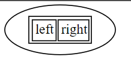

对于字面上存在html的字符串，请使用 [`graphviz.nohtml（）`](https://graphviz.readthedocs.io/en/stable/api.html#graphviz.nohtml) 函数禁用倾斜括号的特殊含义并应用正常引用/转义

```
d = graphviz.Digraph('diamond', format='svg')  

d.node('diamond', label=graphviz.nohtml('<>'))
d.render(directory='doctest-output').replace('\\', '/')
```

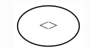

这样就能正常产生<>标签了而不是作为html

## 子图和集群

两类对象具有用于向实例添加子图的子图的方法

有两种方法可以使用它：使用与唯一参数相同类型的现成实例（其内容作为子图添加）或省略graph参数（返回上下文管理器以在 with-block 中更优雅地定义子图内容）

第一种，graph作为唯一的参数：

```
import graphviz  

p = graphviz.Graph(name='parent')
p.edge('spam', 'eggs')

c = graphviz.Graph(name='child', node_attr={'shape': 'box'})
c.edge('foo', 'bar')

p.subgraph(c)
```

第二种用法

```
p = graphviz.Graph('parent')  
p.edge('spam', 'eggs')

with p.subgraph(name='child', node_attr={'shape': 'box'}) as c:
   c.edge('foo', 'bar')
```

两者都产生相同的结果：

```
print(p.source)  
```

graph parent {
    spam -- eggs
    subgraph child {
        node \[shape=box\]
        foo -- bar
    }
}

如果子图name的开头为'cluster' （全部小写），则布局引擎会将其视为特殊的**集群**子图（[示例](https://graphviz.readthedocs.io/en/stable/examples.html#cluster-py) ）

当 [`subgraph（）`](https://graphviz.readthedocs.io/en/stable/api.html#graphviz.Graph.subgraph) 用strict=None作上下文管理器时，将创建新的图形实例，并复制`directory`, `engine`, `format`, `renderer`, `formatter`, and `encoding`的**父图形值**

```
doctest_mark_exe()

p = graphviz.Graph('parent', directory='doctest-output')

with p.subgraph(name='child') as c:
   c.edge('bacon', 'eggs')
   c.render().replace('\\', '/')
```

'doctest-output/child.gv.pdf'

这些复制的属性仅与从 with-block 内**独立**呈现子图（即作为独立图）相关。

## Engines

若要在呈现图形时使用与默认值不同的[布局引擎](https://graphviz.org/docs/layouts/)

```
import graphviz  
g = graphviz.Graph(engine='neato')
```

您还可以更改现有实例上的[`引擎`](https://graphviz.readthedocs.io/en/stable/api.html#graphviz.Graph.engine)属性：

```
g.engine = 'circo'  
```

## `neato` no-op flag[¶](https://graphviz.readthedocs.io/en/stable/manual.html#neato-no-op-flag)

[neato](https://graphviz.org/docs/layouts/neato/) 布局引擎支持一个附加[的渲染标志](https://www.graphviz.org/doc/info/command.html#-n)，该标志允许通过 [pos](https://graphviz.org/docs/attrs/pos/)、[重叠](https://graphviz.org/docs/attrs/overlap/)和[样条曲线](https://graphviz.org/docs/attrs/splines/)属性更好地控制节点定位和边缘布局。

```
doctest_mark_exe()
import graphviz
n = graphviz.Digraph(name='splines', engine='neato',
                     graph_attr={'splines': 'true'},
                     node_attr={'shape': 'point'})
n.node('a', pos='0,0!', color='blue')
n.node('b', pos='100,0!', color='green')
n.node('c', pos='50,50!', color='red')
n.edge('a', 'b', pos='0,0 30,66 70,60 100,0')
n.render(neato_no_op=2, directory='doctest-output').replace('\\', '/')
```


## Unflatten

使用[非平坦](https://graphviz.readthedocs.io/en/stable/DOTunflatten)的预处理器（[手册页](https://linux.die.net/man/1/unflatten)，[PDF](https://www.graphviz.org/pdf/unflatten.1.pdf)）

```
import graphviz  

w = graphviz.Digraph('wide')
w.edges(('0', str(i)) for i in range(1, 10))

w.view()  
```

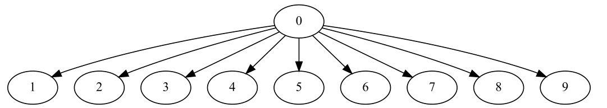

[`unflatten（）`](https://graphviz.readthedocs.io/en/stable/api.html#graphviz.Graph.unflatten) 改进了具有许多叶子或断开连接节点的图形的纵横比。

```
u = w.unflatten(stagger=3)  

u.view()  
```

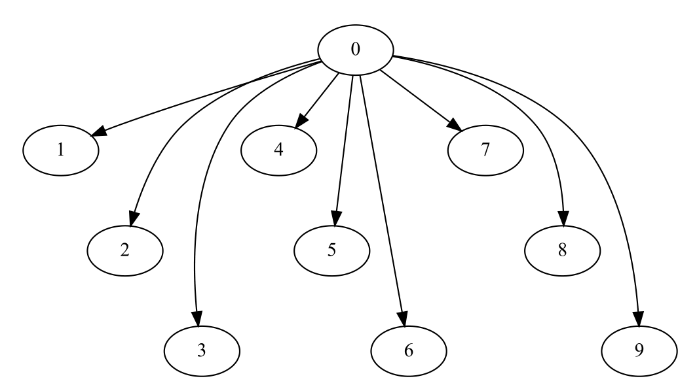

该方法返回一个 [`Source`](https://graphviz.readthedocs.io/en/stable/api.html#graphviz.Source) 对象，您可以使用与[`graph`](https://graphviz.readthedocs.io/en/stable/api.html#graphviz.Graph)或 [`Digraph`](https://graphviz.readthedocs.io/en/stable/api.html#graphviz.Digraph) 对象相同的基本 API 呈现该对象

```
u = w.unflatten(stagger=2)  
u.view()  
```

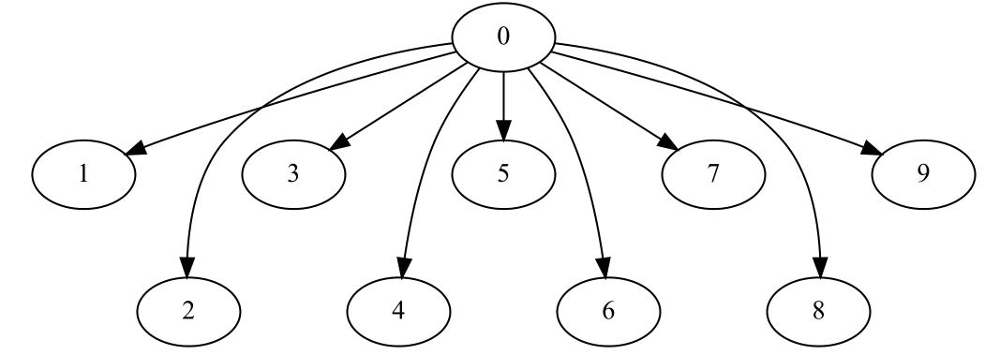

## 自定义 DOT 语句

若要将任意语句添加到创建的 [DOT](https://www.graphviz.org/doc/info/lang.html) 源，可以使用 [`body`](https://graphviz.readthedocs.io/en/stable/api.html#graphviz.Graph.body) 属性

```
import graphviz

rt = graphviz.Digraph(comment='The Round Table')  

rt.body.append('\t"King Arthur" -> {\n\t\t"Sir Bedevere", "Sir Lancelot"\n\t}\n')
rt.edge('Sir Bedevere', 'Sir Lancelot', constraint='false')

print(rt.source)  
```

请注意，使用此方法时，您可能需要正确地将包含空格或其他特殊字符的标识符和字符串括起来/转义。

## Using raw DOT

若要呈现现成的 [DOT](https://www.graphviz.org/doc/info/lang.html) 源代码字符串，请创建一个[](https://graphviz.readthedocs.io/en/stable/api.html#graphviz.Source)``[`graphviz.Source`](https://graphviz.readthedocs.io/en/stable/api.html#graphviz.Source)`` 保存 DOT 字符串的源对象：

```
import graphviz  

src = graphviz.Source('digraph "the holy hand grenade" { rankdir=LR; 1 -> 2 -> 3 -> lob }')
```

使用 [`render（）`](https://graphviz.readthedocs.io/en/stable/api.html#graphviz.Source.render) 方法保存并呈现它：

```
src.render('doctest-output/holy-grenade.gv', view=True).replace('\\', '/')  
```

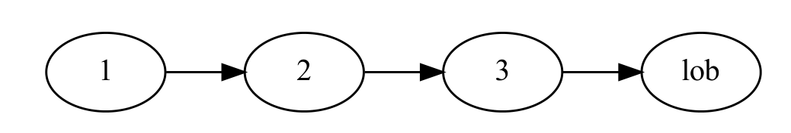

除了缺少编辑方法[`之外，源`](https://graphviz.readthedocs.io/en/stable/api.html#graphviz.Source)对象还具有与更高级别graph、Digraph对象相同的基本API，（例如[`保存（）`](https://graphviz.readthedocs.io/en/stable/api.html#graphviz.Source.save)，[`渲染（）`](https://graphviz.readthedocs.io/en/stable/api.html#graphviz.Source.render)，[`视图（）`](https://graphviz.readthedocs.io/en/stable/api.html#graphviz.Source.view)，[`管道（）`](https://graphviz.readthedocs.io/en/stable/api.html#graphviz.Source.pipe)方法，参阅 [`API文档`](https://graphviz.readthedocs.io/en/stable/api.html#graphviz.Source)）

## 渲染现有文件

要直接渲染现有的 [DOT](https://www.graphviz.org/doc/info/lang.html) 源文件（例如，使用其他工具创建），可以使用 [`graphviz.render（）`](https://graphviz.readthedocs.io/en/stable/api.html#graphviz.render) 函数。

```
import pathlib
import graphviz

src = 'digraph "the holy hand grenade" { rankdir=LR; 1 -> 2 -> 3 -> lob }'
filepath = pathlib.Path('doctest-output/the-holy-hand-grenade.gv')
filepath.write_text(src, encoding='ascii')


graphviz.render('dot', 'png', filepath).replace('\\', '/')
```

要在 Jupyter [笔记本](https://jupyter.org/)或 [Qt 控制台](https://qtconsole.readthedocs.io/)中直接显示现有 [DOT](https://www.graphviz.org/doc/info/lang.html) 源文件的呈现可视化效果，可以使用 [`graphviz。Source.from_file（）`](https://graphviz.readthedocs.io/en/stable/api.html#graphviz.Source.from_file)（替代构造函数）

## 与查看器集成

```
import tempfile  
import graphviz

g = graphviz.Graph()
g.node('spam')
g.view(tempfile.mktemp('.gv'))  
```
