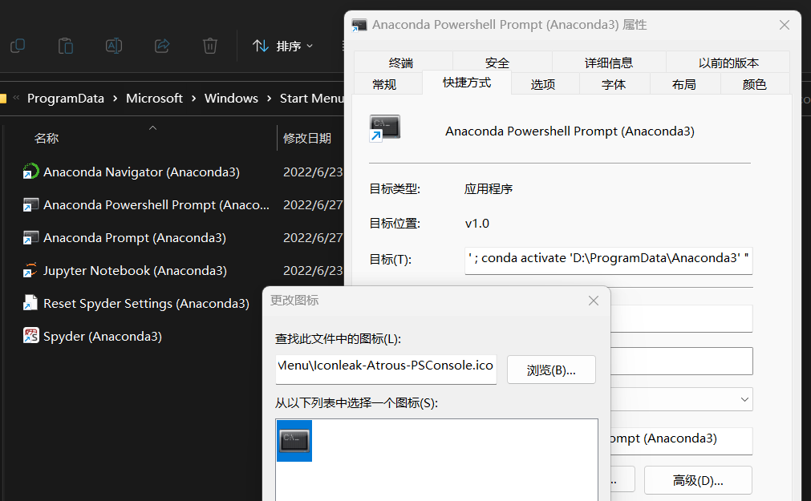
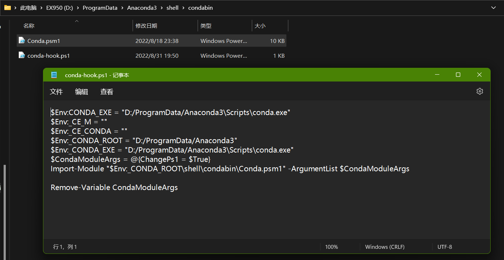
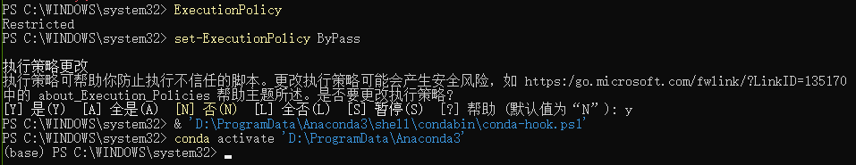

承接上文[win\_add\_powershell\_prompt\_in\_right\_click – 水铝英石 (aluminium/allophane.com)](http://aluminium/allophane.com/index.php/2021/10/12/win_add_powershell_prompt_in_right_click/)

Win+R regedit

进\\HKEY\_CLASSES\_ROOT\\Directory\\Background\\shell\\里添加**runas**项，再在里面添加**command**项

- \\HKEY\_CLASSES\_ROOT\\Directory\\Background\\shell\\
    - runas
        - commad

然后在**runas**项里新建字符串值和DWORD值：

<table><tbody><tr><td>名称</td><td>类型</td><td>数据</td></tr><tr><td>默认</td><td>REG_SZ</td><td>ps_prompt_admin</td></tr><tr><td>Icon</td><td>REG_SZ</td><td>D:\ProgramData\Anaconda3\Menu\Iconleak-Atrous-PSConsole.ico</td></tr><tr><td><s>ShowBasedOnVelocityId</s></td><td><s>REG_DWORD</s></td><td><s>639bc8</s></td></tr></tbody></table>

在**command**里添加字符串值

<table><tbody><tr><td>名称</td><td>类型</td><td>数据</td></tr><tr><td>默认</td><td>REG_SZ</td><td>powershell.exe -ExecutionPolicy ByPass -NoExit -Command "&amp; 'D:\ProgramData\Anaconda3\shell\condabin\conda-hook.ps1' ; conda activate 'D:\ProgramData\Anaconda3' ; Set-Location -literalPath '%V'"</td></tr></tbody></table>

ShowBasedOnVelocityId 这个值用来更改显示状态与隐藏状态(HideBasedOnVelocityId)，其实不添加也可以。

其中 runas的 Icon 和 command 的默认值 可以从快捷方式中的 **目标** 和 **图标** 中获取，并且需要修改 **目标** 中的代码



icon没什么好说的，主要**解释一下脚本：**

这个是powershell prompt原脚本的内容

```
powershell.exe -ExecutionPolicy ByPass -NoExit -Command "& 'D:\ProgramData\Anaconda3\shell\condabin\conda-hook.ps1' ; conda activate 'D:\ProgramData\Anaconda3' "
```

<table><tbody><tr><td>powershell.exe</td><td>调用</td></tr><tr><td>-ExecutionPolicy ByPass</td><td>powershell对于脚本的执行有着严格的安全限制,<br>策略 Policies状态分类：Restricted / AllSigned / RemoteSigned / Unrestricted / Bypass / Undefined<br>设置成Bypass相当于临时使用模式，执行策略权限较低</td></tr><tr><td>-NoExit</td><td>相当于打开命令行后不退出窗口</td></tr><tr><td>-Command</td><td>相当于直接执行后续的脚本内容，<br>“<strong>&amp;</strong>”运算符可以定义为调用 PowerShell 中的命令、脚本文件、函数和可操作程序的运算符<br>相当于：<br>1. 执行conda-hook.ps1的脚本，配置anaconda环境变量<br>2. conda activate 这句相当于启动默认的base环境<br></td></tr></tbody></table>



其中conda-hook.ps1可以认为是配置anaconda环境，很类似之前mmcv硬件编译前的配置，这里就不细讲了



而一般来说如果管理员调用的话，会直接蹦到system32目录，这也是难以避免的，但是我们其实更希望打开就在目录下  
于是在此基础上添加Set-Location，将当前PowerShell的工作位置设置为指定位置  
\-LiteralPath参数用于指定一个或多个位置的路径。

```
Set-Location -literalPath '%V'
```

最后得到上面表格里的形式

```
powershell.exe -ExecutionPolicy ByPass -NoExit -Command "& 'D:\ProgramData\Anaconda3\shell\condabin\conda-hook.ps1' ; conda activate 'D:\ProgramData\Anaconda3' ; Set-Location -literalPath '%V'"
```

bins

[Windows10文件目录下 Shift+右键菜单添加打开管理员Powershell窗口 - 雾灯 - 博客园 (cnblogs.com)](https://www.cnblogs.com/Chaoschm/p/12763457.html)

[Win10添加右键打开cmd和Powershell窗口（管理员/非管理员）\_cxrsdn的博客-CSDN博客\_右键添加powershell](https://blog.csdn.net/cxrsdn/article/details/84538767?spm=1001.2101.3001.6650.1&utm_medium=distribute.pc_relevant.none-task-blog-2%7Edefault%7ECTRLIST%7ERate-1-84538767-blog-86777087.pc_relevant_3mothn_strategy_recovery&depth_1-utm_source=distribute.pc_relevant.none-task-blog-2%7Edefault%7ECTRLIST%7ERate-1-84538767-blog-86777087.pc_relevant_3mothn_strategy_recovery&utm_relevant_index=2)

[win11添加右键在此处打开命令窗口\_C+J+PP的博客-CSDN博客\_鼠标右键在此处打开命令窗口](https://blog.csdn.net/qq_39682204/article/details/123506660)

```
start-process PowerShell -verb runas
```
