进入[labelImg文档](https://github.com/tzutalin/labelImg)，克隆

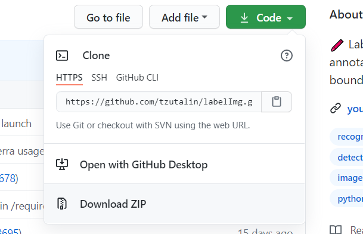

解压后如下

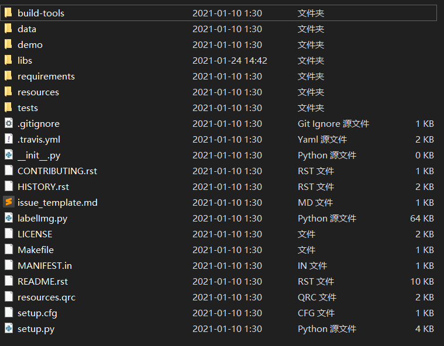

然后我假设已经安装了anaconda打开prompt并进入该文件夹下

```
conda create -n labelImg python=3.7   # 创建虚拟环境
conda activate labelimg
pip install labelImg
```

按理来说这里运行官网提示的运行python labelImg.py就行，但是需要提前整一下pyqt5

pip install PyQt5\_tools  # 这里还需要pip install PyQt5，pip install lxml但是我再安装labelImg时被一起安上了
pyrcc5 -o libs/resources.py resources.qrc   把Qt文件格式转为Python格式

然后将生成的resource.py方到lib目录下

- 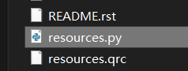
    
- 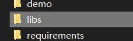
    

之后运行以下代码即可打开labelImg

python labelImg.py
python labelImg.py \[IMAGE\_PATH\] \[PRE-DEFINED CLASS FILE\]

若没指定文件路径，则打开后需要自行打开；若没有选择类别文件，则打开后默认为data/predefined\_classes.txt（也可以直接修改这货）

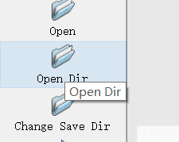

若提前指定了文件夹或者之后指定了图片文件夹会出现如下列表

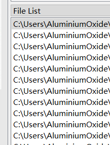

点击进行标框，并可以设置是否困难识别

- 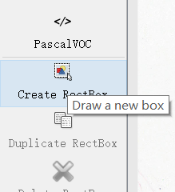
    
- 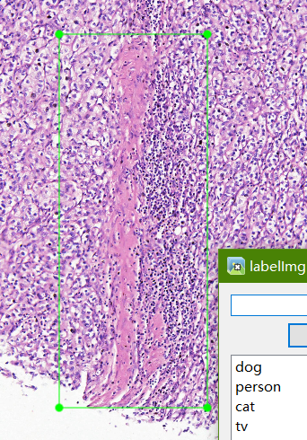
    
- 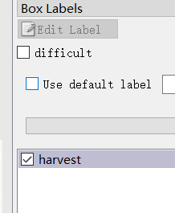
    

在change save dir更换保存目录，保存后该目录下会出现以标注图片命名的标注信息

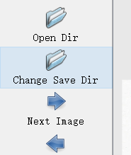

```
<annotation>
	<folder>10X</folder>
	<filename>F080201.JPG</filename>
	<path>C:\Users\AluminiumOxide\Documents\511info\E6_F10\10X\F080201.JPG</path>
	<source>
		<database>Unknown</database>
	</source>
	<size>
		<width>7590</width>
		<height>3314</height>
		<depth>3</depth>
	</size>
	<segmented>0</segmented>
	<object>
		<name>harvest</name>
		<pose>Unspecified</pose>
		<truncated>0</truncated>
		<difficult>0</difficult>
		<bndbox>
			<xmin>2764</xmin>
			<ymin>579</ymin>
			<xmax>3681</xmax>
			<ymax>2890</ymax>
		</bndbox>
	</object>
</annotation>
```

如果标注格式，可以换成yolo和createML格式

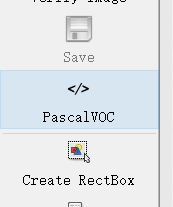

反正也没人看在乎啥格式
