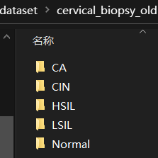
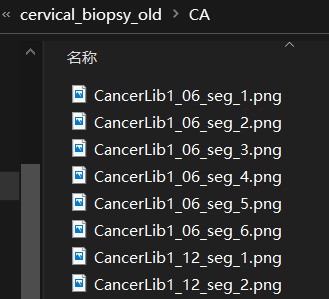
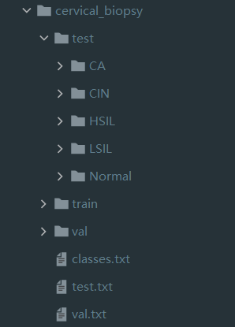
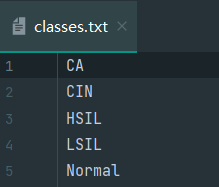
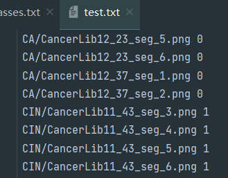
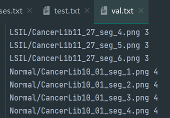
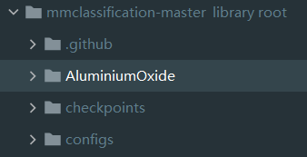
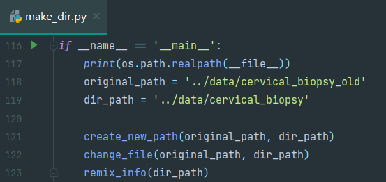
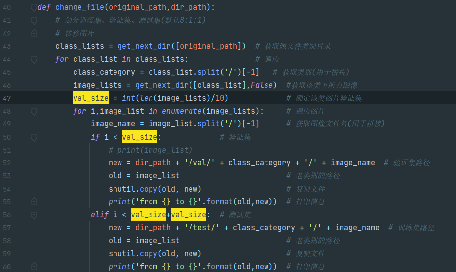

首先需要准备数据集，大多数分类数据都是ImageNet数据集，但是在上一篇完全无用的文章中也可以了解到，ImageNet数据集是，，，真的大？（对普通玩家来说）  
所以说按照ImageNet数据集格式自己模仿数据集摆放方式也是一种方法（说白了就是不会自己创建类，过于菜）

前两张图这是我原收集的数据摆放方式，每个分类下对应着图片，而ImageNet数据集要求以第三张图这种方式摆放。分为test、train、val三个目录，每个目录下存在对应的类别（这里只是展开测试集的目录，分为5类，并且每类下也是存放与之前相同的图片）此外，在同目录下还存在classes.txt、test.txt、val.txt几个文件，这几个文件分别存放类别信息、测试集文件路径和类别、测试集文件路径和类别，下面开始详细说。

classes里面存放对应类别数据

test里存放在测试集文件下图片的路径，以及图片的类别，比如说这里CA的类别是0，CIN类别是1，索引根据classes的顺序从0开始排序

val里test，存放验证集的路径和索引，此外需要说明，训练集不需要额外的该文件

我在mmcls的目录下自建了一个问价下存放自己用的代码，如果想使用可[下载](http://aluminium/allophane.com/wp-content/uploads/2021/07/AluminiumOxide.zip)，解压到mmcls目录下

如果你的数据存放方式和我一样的话（把自己的数据集放在mmcls的data目录下）只需要更改original\_path和dir\_path即可

此外，我默认训练集：验证集：测试集 = 8：1：1 (淦，我都看不下去了(╯‵□′)╯︵┻━┻，这个代码一定要慎用，写代码时有一堆考试，完全是暴力分的，建议参考之后跑mmseg的代码！ 应该可能差不多大概而且还很快就能更吧？)

运行之后会获得本帖第一栏第三个图的数据存放结构，下面开始配置config文件。
