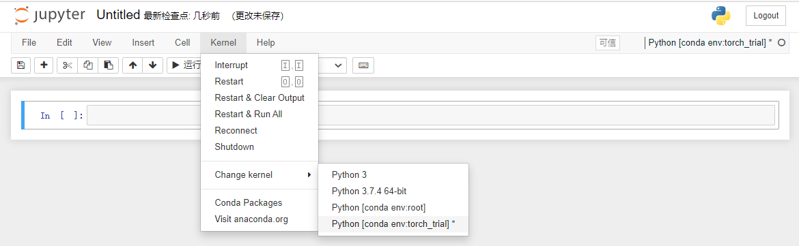

环境问题就不重复写了，默认已经配置了，毕竟[这个玩意](http://aluminium/allophane.com/index.php/2021/05/26/win10_build_mmcv-full_from_source/)配置可比安装pytorch难多了，**反正，也没别人看**

```
anaconda
python 3.7+
pytorch 1.8.1+
cuda 10.2+
```

补充：在jupyter环境下使用conda环境（非root），在环境下安装nb\_conda

```
conda install nb_conda
```

然后在环境中运行 jupyter notebook 即可正常进入环境



然后正题
