先登录[Kwave网站](http://www.k-wave.org/download.php)为敬

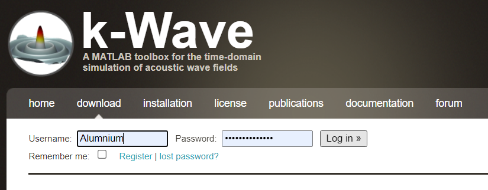

根据提示，先把工具箱下载到本地（其实就是封装的成吨MATLAB函数）

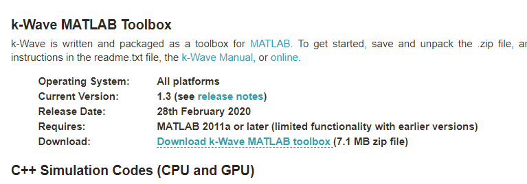

然后解压，放到你想放置的目录(不要在意这个上级文件名)，然后在matlab里面的 主页>环境>设置路径>添加并包含子文件夹 ，把储存的目录加入进去

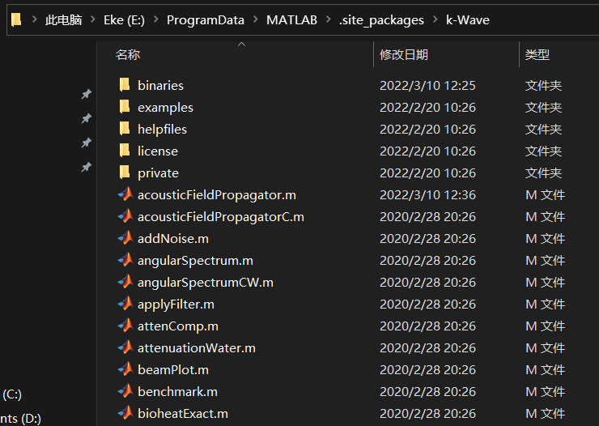

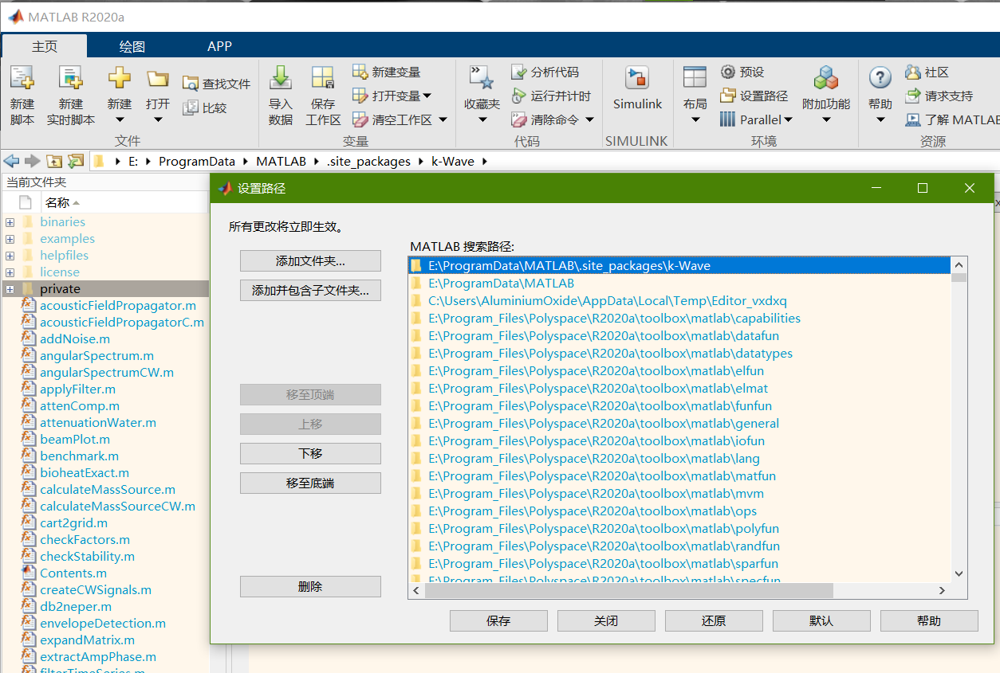

众所周知，成功加入环境的函数都是随便用的，根据[K-wave 用户手册](http://www.k-wave.org/manual/k-wave_user_manual_1.1.pdf)描述，根据3章First-Order Simulation Functions的提示运行代码

```
% create the computational grid
Nx = 128; % number of grid points in the x (row) direction
Ny = 256; % number of grid points in the y (column) direction
dx = 50e-6; % grid point spacing in the x direction [m]
dy = 50e-6; % grid point spacing in the y direction [m]
kgrid = makeGrid(Nx, dx, Ny, dy);
% define the medium properties
medium.sound_speed = 1500*ones(Nx, Ny); % [m/s]
medium.sound_speed(1:50, :) = 1800; % [m/s]
medium.density = 1040; % [kg/m^3]
% define an initial pressure using makeDisc
disc_x_pos = 75; % [grid points]
disc_y_pos = 120; % [grid points]
disc_radius = 8; % [grid points]
disc_mag = 3; % [Pa]
source.p0 = disc_mag*makeDisc(Nx, Ny, disc_x_pos, disc_y_pos, disc_radius);
% define a Cartesian sensor mask of a centered circle with 50 sensor elements
sensor_radius = 2.5e-3; % [m]
num_sensor_points = 50;
sensor.mask = makeCartCircle(sensor_radius, num_sensor_points);
% run the simulation
sensor_data = kspaceFirstOrder2D(kgrid, medium, source, sensor);
```

如果不出意外运行效果如下

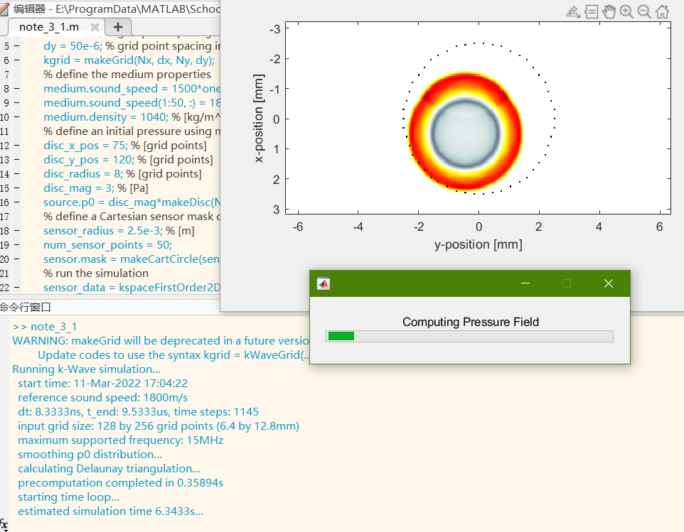

然后就是GPU的部分，按照它的话，就是将编译后的二进制文件(Compiled Binary Files)放到 k-Wave函数目录中名为binaries的文件夹中，(有大佬[使用源码编译生成](https://zhuanlan.zhihu.com/p/478237038?utm_source=wechat_timeline&utm_medium=social&s_r=0#showWechatShareTip)，但是我这因为cuda10.2安装MSBuildExtensions会出现问题，即使预先提取到VS2019里也会导致cuda C++出现成吨问题，暂时没有成功，就直接把编译完的拿来用了)

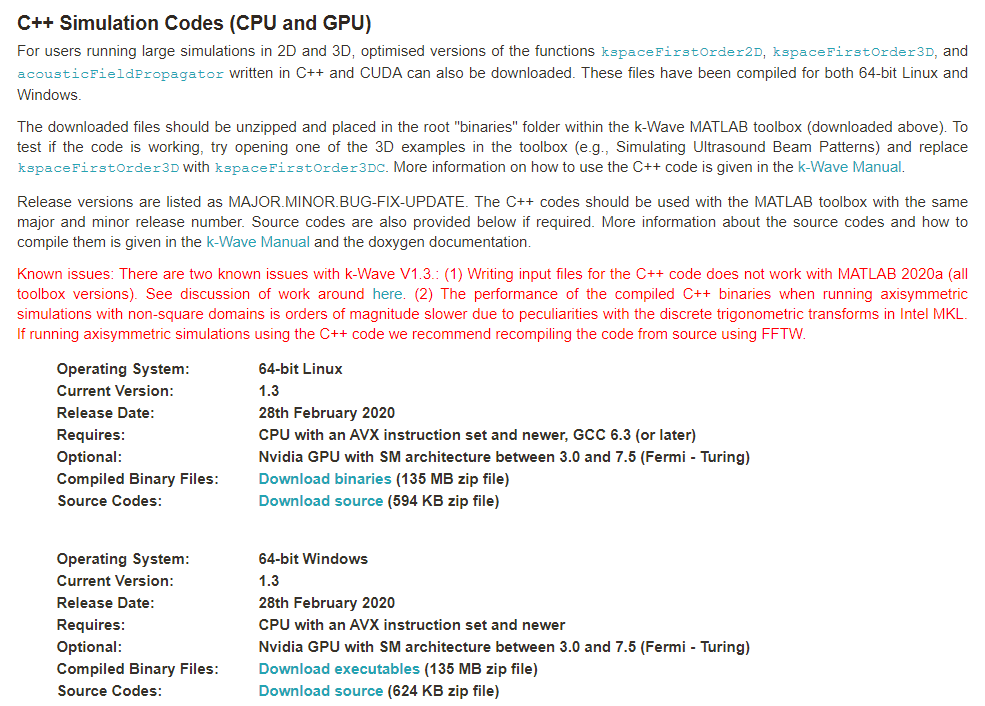

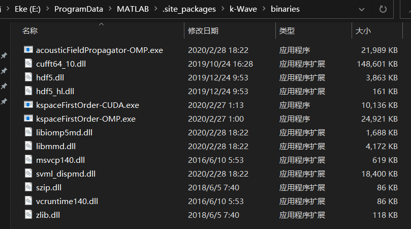

下载完放到对应目录如上图所示

然后，然后啊，2020以下版本玩家可以退出文章了，2020a以上的matlab玩家继续

根据[提示文章](http://www.k-wave.org/forum/topic/error-reading-h5-files-when-using-binaries) 由于函数 `h5writeatt` 在 MATLAB 2020a 中将`'TextEncoding'`的默认值从`'system'`改为`'UTF-8'`，会影响 使用C++ 代码的 HDF5 输入文件 的函数

解决方法是：

1.在 k-Wave 中打开`acousticFieldPropagator`、`writeAttributes`和。`writeMatrix`

2\. 对于所有调用`h5writeatt`的函数，函数追加参数`'TextEncoding', 'system'`

按照提示所说就是下面这种改动

```
h5writeatt(save_to_disk, '/', FILE_MAJOR_VER_ATT_NAME, FBP_FILE_MAJOR_VERSION);
```

```
h5writeatt(save_to_disk, '/', FILE_MAJOR_VER_ATT_NAME, FBP_FILE_MAJOR_VERSION, 'TextEncoding', 'system');
```

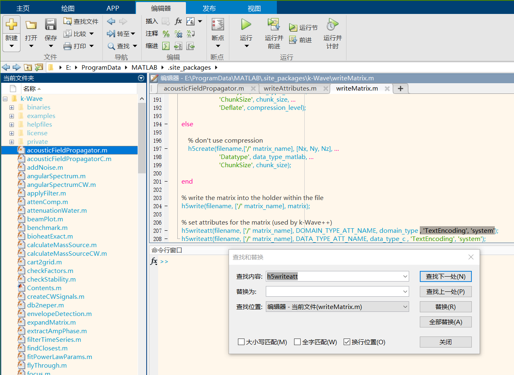

3\. 下载 [补丁文件](http://www.k-wave.org/downloads/h5writeatt.m) h5writeatt 替换 MATLAB 2020a 中的版本，或将其放在 MATLAB 路径中的某个位。我个人的建议是直接放到Kwave的目录里面去（就像下图）

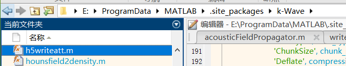

然后如果不出意外，就可以正常运行GPU代码了

当然，可能还需要安装[HDF5](https://www.hdfgroup.org/downloads/hdf5)，得去把对应设备的预编译二进制文件下载了(得注册个免费账号)默认安装就好。

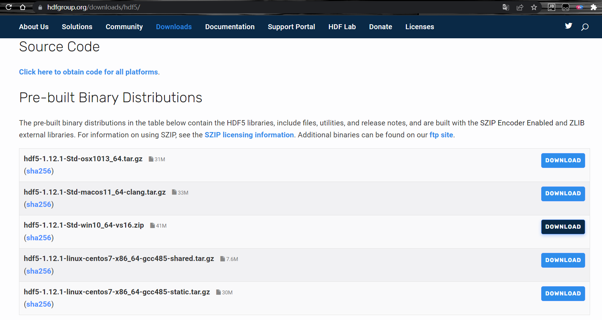

然后啊，将上例的函数进行部分修改（后面加G）

注意：在GPU中放置传感器位置时，不能使用之前的笛卡尔点，只能使用和网格点相同大小的矩阵，否则会报错(文档还没读到?不知道为什么)

错误使用 kspaceFirstOrder\_saveToDisk (line 36)  
Optional input 'SaveToDisk' only supported for sensor masks defined as a binary matrix or the opposing  
corners of a rectangle (2D) or cuboid (3D).

因此还需要将原传感器定义方式从笛卡尔点(左)改为矩阵定义(右) 其实就是追加了一个cart2grid函数。

```
% define a Cartesian sensor mask of a centered circle with 50 sensor elements
sensor_radius = 2.5e-3; % [m]
num_sensor_points = 50;
sensor.mask = makeCartCircle(sensor_radius, num_sensor_points);
```

```
% define a Cartesian sensor mask of a centered circle with 50 sensor elements
sensor_radius = 2.5e-3; % [m]
num_sensor_points = 50;
cart_data = makeCartCircle(sensor_radius, num_sensor_points);
[grid_data, order_index, reorder_index] = cart2grid(kgrid, cart_data); %  Trans a set of Cartesian points onto a binary grid.
sensor.mask = grid_data;
```

最后的3.1章的例程修改为如下所示

```
% create the computational grid
Nx = 128; % number of grid points in the x (row) direction
Ny = 256; % number of grid points in the y (column) direction
dx = 50e-6; % grid point spacing in the x direction [m]
dy = 50e-6; % grid point spacing in the y direction [m]
kgrid = makeGrid(Nx, dx, Ny, dy);
% define the medium properties
medium.sound_speed = 1500*ones(Nx, Ny); % [m/s]
medium.sound_speed(1:50, :) = 1800; % [m/s]
medium.density = 1040; % [kg/m^3]
% define an initial pressure using makeDisc
disc_x_pos = 75; % [grid points]
disc_y_pos = 120; % [grid points]
disc_radius = 8; % [grid points]
disc_mag = 3; % [Pa]
source.p0 = disc_mag*makeDisc(Nx, Ny, disc_x_pos, disc_y_pos, disc_radius);
% define a Cartesian sensor mask of a centered circle with 50 sensor elements
sensor_radius = 2.5e-3; % [m]
num_sensor_points = 50;
cart_data = makeCartCircle(sensor_radius, num_sensor_points);
[grid_data, order_index, reorder_index] = cart2grid(kgrid, cart_data);
sensor.mask = grid_data;
% run the simulation
sensor_data = kspaceFirstOrder2DG(kgrid, medium, source, sensor);
```

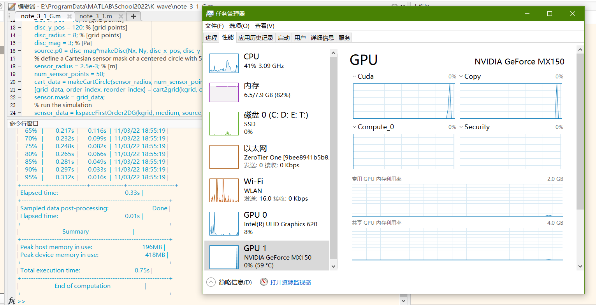

运行代码可以看到N卡确实正常运行了（当然，这里因为网格大小比较小，一秒直接运行完毕了，一般网格比较大的时候，使用cuda计算会有明显优势）
