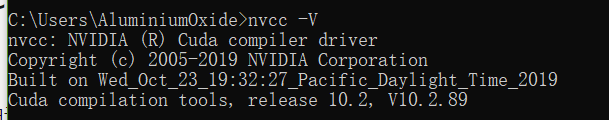
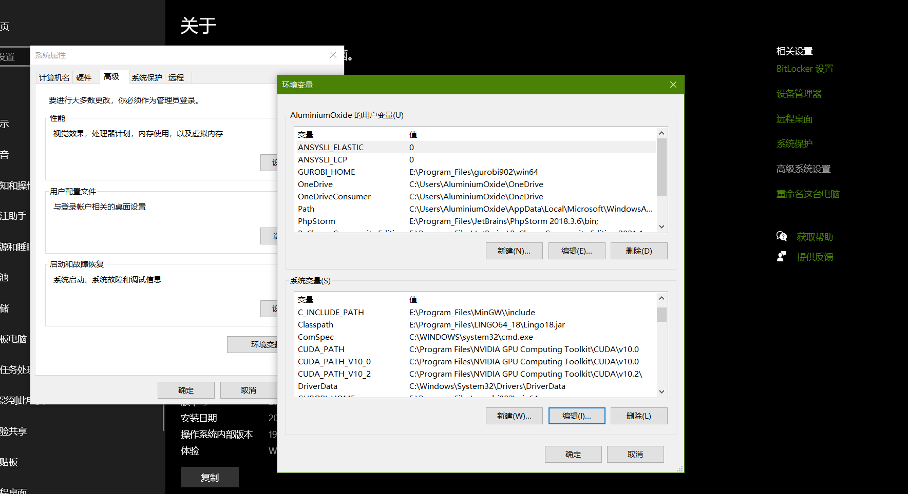
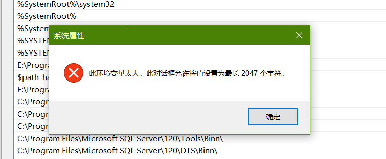
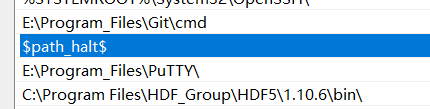
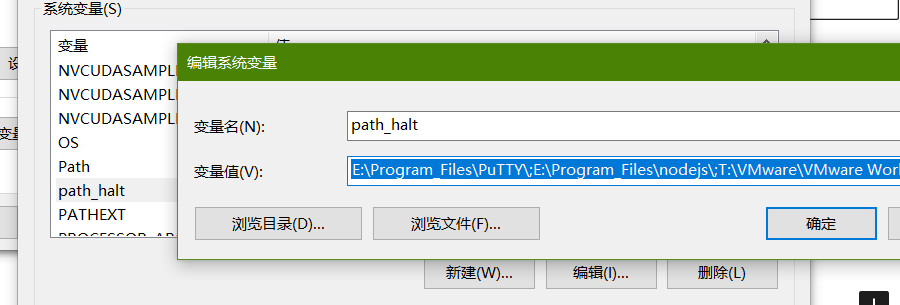
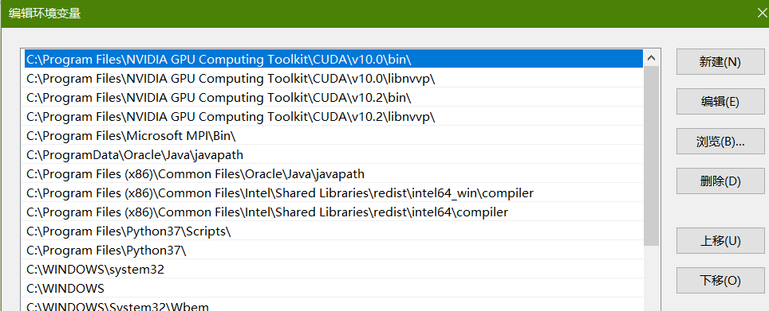
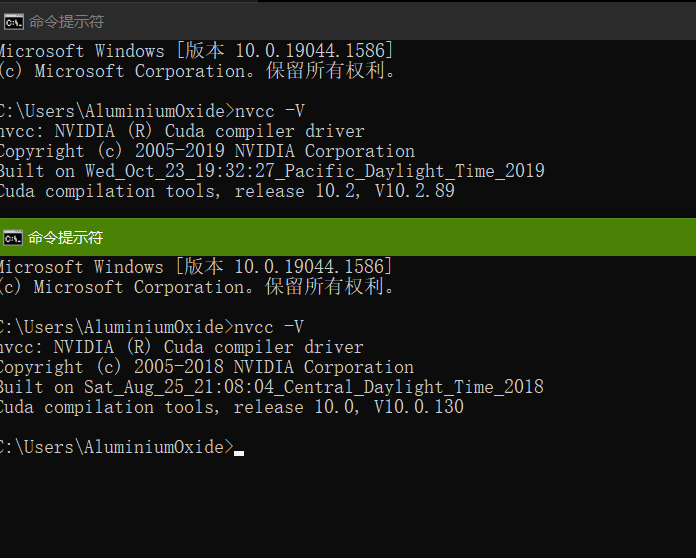

由于最近需要使用tensorflow，突然发现以前安的cuda10.2好臭啊！！！！！！！

重新安了cuda10.0（略，具体请查看[先前文章](http://aluminium/allophane.com/index.php/2021/05/04/about_cuda_install/)）

然后系统变量里cudapath换成10.0

顺带着说一下环境变量太大了怎么办

创建一个别的环境变量然后把没用的扔进去

然后把cuda10.0塞到前面（嚣张）

OK，记得切一个新的cmd测试

