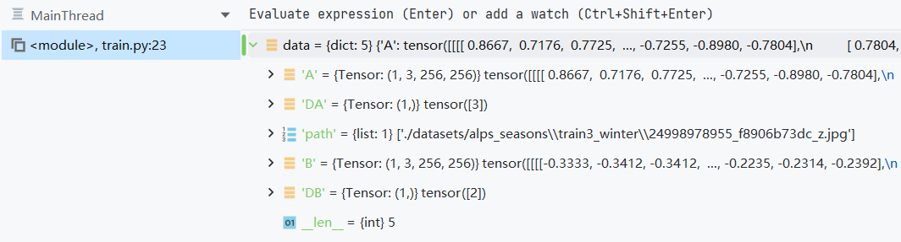
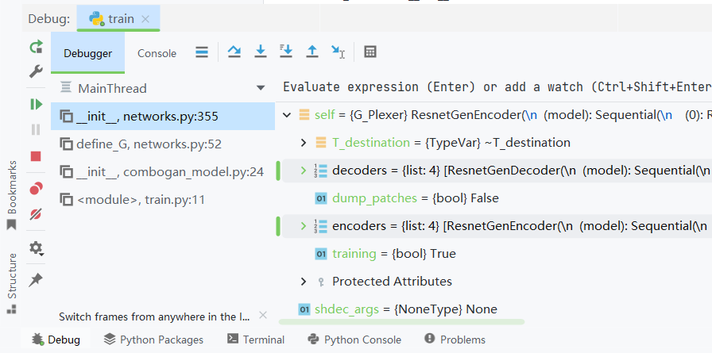
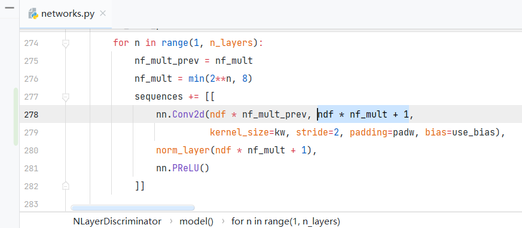
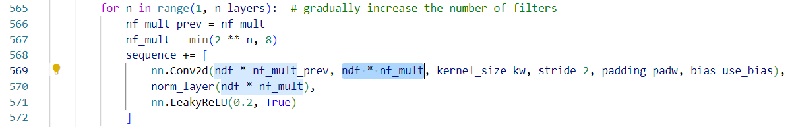
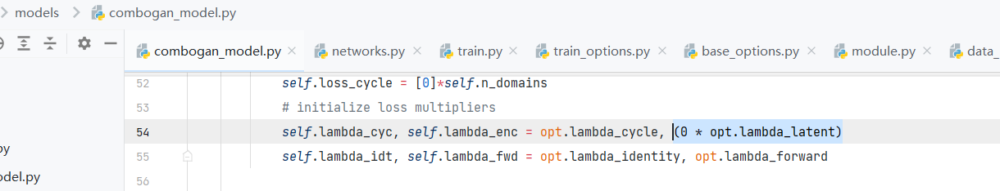
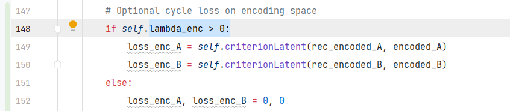

那么现在来开始调试

不过有了之前CycleGAN的食用经验，这里就重点说变动

## 先看数据集

```
dataset = DataLoader(opt)
```

还是 UnalignedDataset  
主要变动是这里  
self.dirs = sorted(glob.glob(datapath)) 在原本的datapath下遍历对应不同风格的目录  
self.paths = \[sorted(make\_dataset(d)) for d in self.dirs\] 储存在self.paths里  
self.sizes = \[len(p) for p in self.paths\] 存放每类的长度

然后在 def \_\_getitem\_\_(self, index): 中  
本质上没有特别大变换.并不是一次拿出来4个,而是一次拿出来两个随机的(大雾!)  
DA, DB = random.sample(range(len(self.dirs)), 2) 随机获取0~N-1的索引值 比如这里是四类就是0~3中间的两个数  
index\_A = random.randint(0, self.sizes\[DA\] - 1) 获取该类别下的一个索引  
A\_img, A\_path = self.load\_image(DA, index\_A) 通过类别和索引获取A图片和路径信息  
bundle = {'A': A\_img, 'DA': DA, 'path': A\_path} 打包组成字典  
B图同上, 不过  
bundle.update( {'B': B\_img, 'DB': DB} ) 没有添加B图的路径B\_path,有点怪,不过本来也没用的上不管了



调用\_\_getitem\_\_最后给到data里的结果

## 然后进模型：

```
model = ComboGANModel(opt)
```

其实主要变动只是这里  
**定义网络结构**

<table><tbody><tr><td>train.py</td><td>model = ComboGANModel(opt)</td><td>实例化ComboGAN的模型类</td></tr><tr><td>models/combogan_model.py</td><td>class ComboGANModel(BaseModel)</td><td>主要需要看的是定义生成器 <strong>self.netG</strong> = networks.define_G</td></tr><tr><td>models/networks.py</td><td>def define_G()</td><td>生成器定义函数,主要是个组合参数的工具函数<br>返回生成好的 <strong>plex_netG</strong> 对象 给 <strong>self.netG</strong></td></tr><tr><td>models/networks.py</td><td>class G_Plexer(Plexer):</td><td>真正的生成器定义函数 <s>生成器复用器</s><br><strong>n_domains 风格数量 字面意思一个int<br>encoder 编码器类 ResnetGenEncoder<br>enc_args 编码器参数 元组 enc_args<br>decoder 解码器类 ResnetGenDecoder<br>dec_args 解码器参数 元组 dec_args</strong></td></tr><tr><td>models/networks.py</td><td>class ResnetGenEncoder()<br>class ResnetGenDecoder()</td><td>编码器和解码器定义使用的类<br>定义方式很原生torch,就不细讲了<br>简单来说就是一个model数组不断叠,最后甩个序列化</td></tr><tr><td>models/networks.py</td><td>class ResnetBlock()</td><td>言简意赅......</td></tr></tbody></table>

1. **define\_G()内部**
    1. 首先选择norm\_layer
2. 1. n\_blocks\_enc 定义编码器残差快数量
    2. n\_blocks\_dec 定义解码器残差快数量
3. 1. dup\_args 相关dropout,norm\_layer,bias等参数 元组格式
    2. enc\_args 编码器参数 元组格式
    3. dec\_args 解码器参数 元组格式
4. 1. plex\_netG = G\_Plexer() 进行定义(好家伙才开始) 然后**看右面**
5. 1. 设置有关cuda,权重初始化等并**返回 plex\_netG 对象**

1. **G\_Plexer(Plexer)内部**
    1. **encoders** 通过 **encoder** 和 **enc\_args** 配合 组成一个**n\_domains**长度的列表
    2. **decoders** 同上
    3. **networks** 把 **encoders** 和 **decoders** 合并



定义生成器后定义鉴别器**self.netD**  
这个就不细说了,因为它根本没改就是之前CycleGAN的 **NLayerDiscriminator**  
大概也是**self.netD** > define\_D() > D\_Plexer > NLayerDiscriminator

**但是这里有一部分我没有看懂,该函数分为一个model\_gray和一个model\_rgb两个都有这个问题  
这里我以model\_rgb举例**

```
 (model_rgb): SequentialOutput(
    (0): Sequential(
      (0): Conv2d(3, 64, kernel_size=(4, 4), stride=(2, 2), padding=(2, 2))
      (1): PReLU(num_parameters=1)
    )
    (1): Sequential(
      (0): Conv2d(64, 129, kernel_size=(4, 4), stride=(2, 2), padding=(2, 2))
      (1): InstanceNorm2d(129, eps=1e-05, momentum=0.1, affine=False, track_running_stats=False)
      (2): PReLU(num_parameters=1)
    )  # ------output------
    (2): Sequential(
      (0): Conv2d(128, 257, kernel_size=(4, 4), stride=(2, 2), padding=(2, 2))
      (1): InstanceNorm2d(257, eps=1e-05, momentum=0.1, affine=False, track_running_stats=False)
      (2): PReLU(num_parameters=1)
    )  # ------output------
    (3): Sequential(
      (0): Conv2d(256, 513, kernel_size=(4, 4), stride=(2, 2), padding=(2, 2))
      (1): InstanceNorm2d(513, eps=1e-05, momentum=0.1, affine=False, track_running_stats=False)
      (2): PReLU(num_parameters=1)
    )  # ------output------
    (4): Sequential(
      (0): Conv2d(512, 512, kernel_size=(4, 4), stride=(1, 1), padding=(2, 2))
      (1): InstanceNorm2d(512, eps=1e-05, momentum=0.1, affine=False, track_running_stats=False)
      (2): PReLU(num_parameters=1)
      (3): Conv2d(512, 1, kernel_size=(4, 4), stride=(1, 1), padding=(2, 2))
    )
  )
)  # ------output------
```

如果没记错,stride>1有裕量时向下取整  
出 = floor((入-核+2\*边)/步)+1

首先是自带函数中刻意错开了通道  
可以很明显看出, 如果是 1,3,156,256的输入  
conv2d(3,64) > 1,64,129,129  
conv2d(64,129) > 1,129,65,65  
conv2d(128,257) > 1,257,33,33  
conv2d(256,513) > 1,513,17,17  
conv2d(512,512) > 1,512,18,18  
conv2d(512,1) > 1,1,19,19  
这每个都是特意+1错开一个让我十分看不懂



ComboGAN中的鉴别器部分

而且后面输出的时候会直接经过这个序列化对象直接出4个数组，分别是(当然，在经历一次在维度1的拼接，第一维度的长度会变成2倍)  
1,65,65  
1,33,33  
1,17,17  
1,19,19  
我怀疑这种刻意不匹配会导致在左式标记 # ------output------ 部分输出的  
(当然,不一定准),而且作者并没有仔细论述这里如此处理的必要性!



CycleGAN中的鉴别器部分

# **_This is 《The discriminators remain untouched in your experiment》？！_**

**定义损失函数**

<table><tbody><tr><td>criterionCycle</td><td>torch.nn.SmoothL1Loss() 简单来说就是介于L1和MSE之间的一个损失函数, 损失小于某值使用MSE计算,损失大于某值使用L1计算</td></tr><tr><td>*criterionIdt</td><td>经过调整的 torch.nn.SmoothL1Loss() 本质同上 # 需要 --lambda_identity 设置为非 0 元素</td></tr><tr><td>*criterionLatent</td><td>经过调整的 torch.nn.SmoothL1Loss()本质同上 # 两个中间经过编码后的(BN,256.64.64)数组求损失</td></tr><tr><td>criterionGAN</td><td>GANLoss() 和本质我看了一下代码 经过了魔改不过 本质还是个可以根据真图和伪图计算的MSE</td></tr></tbody></table>

但是部分地方出现了问题，criterionLatent想使用，必须要求lambda\_enc大于0  
疑惑,为啥还特意×0，是怕使用这个损失嘛？那我就不试毒了



lambda\_enc是怎么定义的



criterionLatent的唯一指定使用条件

**定义优化器**

均为Adam 没什么多说的,直接引用的函数

## 最后进迭代

额，怎么说呢，默认是不使用idt的前向G的时候  
包括了 criterionGAN 和 criterionCycle 代替 G\_Loss 和 Cycle\_Loss  
当前向D的时候  
直接用 criterionGAN 代替 D\_Loss

这个我觉得之后视频会更仔细说说，等做出来再说咯
