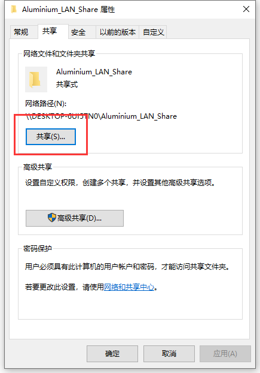
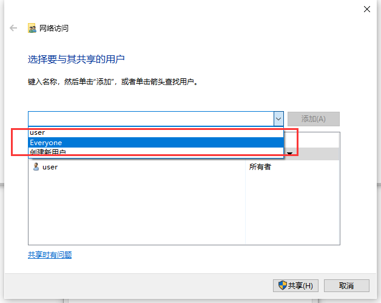
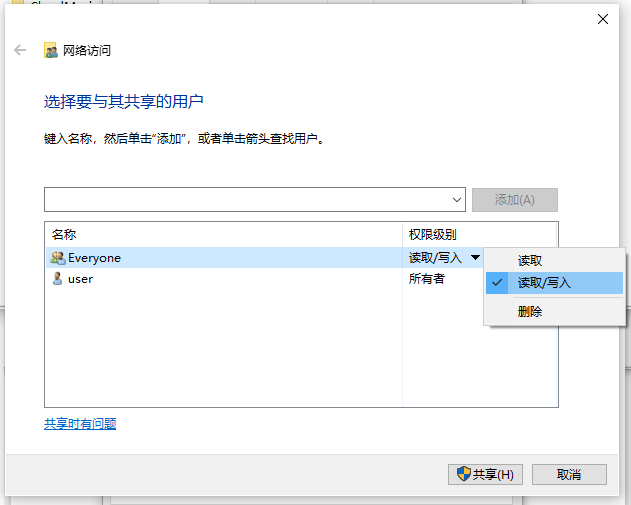
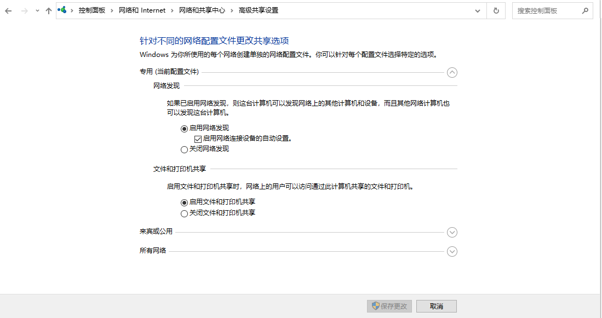
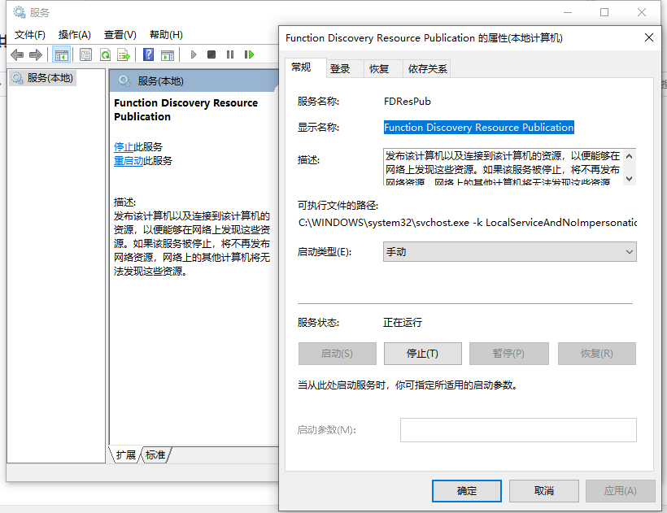
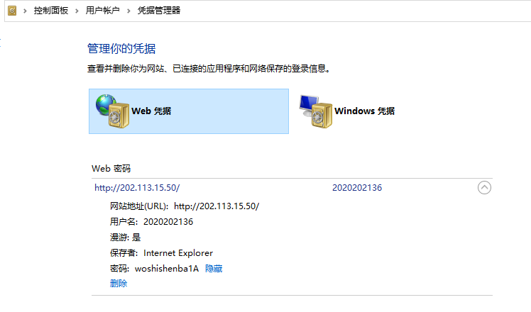

> [两台电脑在同一局域网内怎样实现文件互相传输或实现文件共享 - 知乎 (zhihu.com)](https://zhuanlan.zhihu.com/p/134148445)
>
> [win10网络显示不了别人的计算机,win10共享网上邻居看不到怎么办_win10网上邻居找不到其它电脑的解决方法..._高傲的大白杨的博客-CSDN博客](https://blog.csdn.net/weixin_42509507/article/details/117974841)
>
> [电脑及网络安全知识-Windows下清除访问共享文件夹时相关登录信息（缓存的用户名密码） - 哔哩哔哩 (bilibili.com)](https://www.bilibili.com/read/cv18776303/)
>
> [win10：如何更改电脑在局域网上的名称-百度经验 (baidu.com)](https://jingyan.baidu.com/article/b2c186c81c7ea0c46ef6ff2a.html)

首先这里来备份一下局域网文件互传

（在从机或您的主机）创建一个文件夹，右键打开共享，并在这里面选择everyone用户，最后点击共享







同时进入 **网络和共享中心** 打开 **网络发现**



想要发现的从机，需要保证 **服务** 中的  **Function Discovery Resource Publication** 启动(这个很玄学，因为这东西不开只是在网络发现里显示不出来，但是可以靠直接连接IP地址访问到)



现在在局域网内的其他主机点击**网络** 就能够查看到您刚才设置的局域网的用户以及分享的文件夹了，您的从机随时可以把该文件夹下的everyone用户权限取消

#### 补充

查看ip配置（注意不是linux的ifconfig）

```
ipconfig
```

查看本机的共享登录信息

```
net use
```

注意不是 **net user**，这条是查看您自己的用户，而不是查看您登陆别人的

删除单个或全部连接信息

```
net use \192.168.0.8 /delete
```

删除全部的用户

```
net use * /delete
```

或者您可以打开

控制面板->用户帐户->凭据管理器

注意别碰web凭据！这玩意是局域网网关的！掐了猫就宕了




