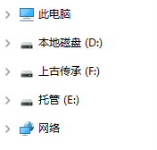
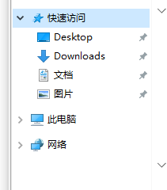

参考[Win10左侧导航栏本地磁盘重复显示的解决方法](https://www.cnblogs.com/xiaoguan1993/p/14256454.html)



Win+R，运行 regedit 打开 注册表编辑器，定位到：

```
HKEY_LOCAL_MACHINE\SOFTWARE\Microsoft\Windows\CurrentVersion\Explorer\Desktop\NameSpace/DelegateFolders\
```

把

```
 {F5FB2C77-0E2F-4A16-A381-3E560C68BC83} 
```

项重命名为：

```
-{F5FB2C77-0E2F-4A16-A381-3E560C68BC83} 
```

（前面加了“-”号）

