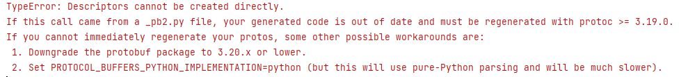
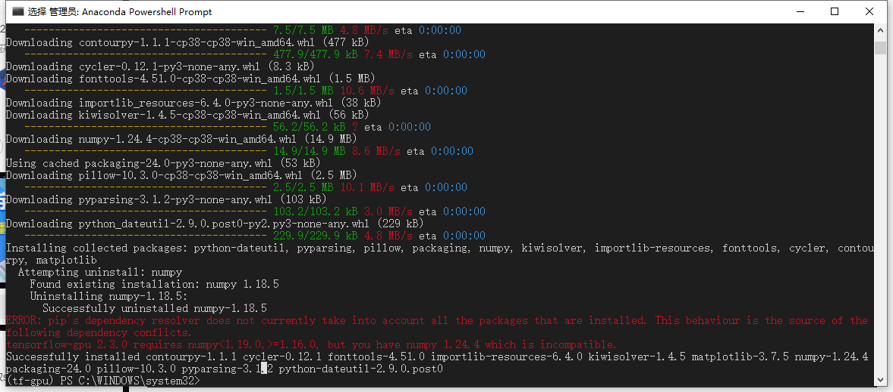
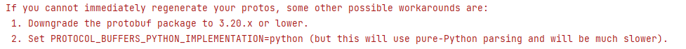

### 配置tensorflowGPU环境

#### conda配置

**必须得强调，conda环境和pip环境是两个不同的！和环境相关的往conda里塞，不用怎么配置的python库就别用conda整**

首先找到tensorFlow GPU对应的版本

[Build from source on Windows  | TensorFlow (google.cn)](https://tensorflow.google.cn/install/source_windows#gpu)

| Version               | Python version | Compiler           | Build tools         | cuDNN | CUDA |
| :-------------------- | :------------- | :----------------- | :------------------ | :---- | :--- |
| tensorflow_gpu-2.10.0 | 3.7-3.10       | MSVC 2019          | Bazel 5.1.1         | 8.1   | 11.2 |
| tensorflow_gpu-2.9.0  | 3.7-3.10       | MSVC 2019          | Bazel 5.0.0         | 8.1   | 11.2 |
| tensorflow_gpu-2.8.0  | 3.7-3.10       | MSVC 2019          | Bazel 4.2.1         | 8.1   | 11.2 |
| tensorflow_gpu-2.7.0  | 3.7-3.9        | MSVC 2019          | Bazel 3.7.2         | 8.1   | 11.2 |
| tensorflow_gpu-2.6.0  | 3.6-3.9        | MSVC 2019          | Bazel 3.7.2         | 8.1   | 11.2 |
| tensorflow_gpu-2.5.0  | 3.6-3.9        | MSVC 2019          | Bazel 3.7.2         | 8.1   | 11.2 |
| tensorflow_gpu-2.4.0  | 3.6-3.8        | MSVC 2019          | Bazel 3.1.0         | 8.0   | 11.0 |
| tensorflow_gpu-2.3.0  | 3.5-3.8        | MSVC 2019          | Bazel 3.1.0         | 7.6   | 10.1 |
| tensorflow_gpu-2.2.0  | 3.5-3.8        | MSVC 2019          | Bazel 2.0.0         | 7.6   | 10.1 |
| tensorflow_gpu-2.1.0  | 3.5-3.7        | MSVC 2019          | Bazel 0.27.1-0.29.1 | 7.6   | 10.1 |
| tensorflow_gpu-2.0.0  | 3.5-3.7        | MSVC 2017          | Bazel 0.26.1        | 7.4   | 10   |
| tensorflow_gpu-1.15.0 | 3.5-3.7        | MSVC 2017          | Bazel 0.26.1        | 7.4   | 10   |
| tensorflow_gpu-1.14.0 | 3.5-3.7        | MSVC 2017          | Bazel 0.24.1-0.25.2 | 7.4   | 10   |
| tensorflow_gpu-1.13.0 | 3.5-3.7        | MSVC 2015 update 3 | Bazel 0.19.0-0.21.0 | 7.4   | 10   |
| tensorflow_gpu-1.12.0 | 3.5-3.6        | MSVC 2015 update 3 | Bazel 0.15.0        | 7.2   | 9.0  |
| tensorflow_gpu-1.11.0 | 3.5-3.6        | MSVC 2015 update 3 | Bazel 0.15.0        | 7     | 9    |
| tensorflow_gpu-1.10.0 | 3.5-3.6        | MSVC 2015 update 3 | Cmake v3.6.3        | 7     | 9    |
| tensorflow_gpu-1.9.0  | 3.5-3.6        | MSVC 2015 update 3 | Cmake v3.6.3        | 7     | 9    |
| tensorflow_gpu-1.8.0  | 3.5-3.6        | MSVC 2015 update 3 | Cmake v3.6.3        | 7     | 9    |
| tensorflow_gpu-1.7.0  | 3.5-3.6        | MSVC 2015 update 3 | Cmake v3.6.3        | 7     | 9    |
| tensorflow_gpu-1.6.0  | 3.5-3.6        | MSVC 2015 update 3 | Cmake v3.6.3        | 7     | 9    |
| tensorflow_gpu-1.5.0  | 3.5-3.6        | MSVC 2015 update 3 | Cmake v3.6.3        | 7     | 9    |
| tensorflow_gpu-1.4.0  | 3.5-3.6        | MSVC 2015 update 3 | Cmake v3.6.3        | 6     | 8    |
| tensorflow_gpu-1.3.0  | 3.5-3.6        | MSVC 2015 update 3 | Cmake v3.6.3        | 6     | 8    |
| tensorflow_gpu-1.2.0  | 3.5-3.6        | MSVC 2015 update 3 | Cmake v3.6.3        | 5.1   | 8    |
| tensorflow_gpu-1.1.0  | 3.5            | MSVC 2015 update 3 | Cmake v3.6.3        | 5.1   | 8    |
| tensorflow_gpu-1.0.0  | 3.5            | MSVC 2015 update 3 | Cmake v3.6.3        | 5.1   | 8    |

按照python版本创建conda环境

这里以安装tensorflow2.5为例

```
conda create -n tf2.5-gpu python=3.8
conda activate tf2.5-gpu
```

安装cuda

```
conda install cudatoolkit=11.2
```

安装cudnn

```
conda install cudnn=8.1
```

#### python配置

配置完工作环境，下面往python里塞各种安装包，别用conda了，我真不想再崩env

```
pip install tensorflow-gpu==2.5.0
```

以及因为可能导致的各种版本不兼容问题，替换版本，如：



```
pip install -U protobuf==3.19.6
```



```
pip install -U numpy==1.18.5
pip install -U matplotlib==3.3.3
```

以上

#### 报错提示

##### 1

默认的找不到，添加conda-forge到搜索路径


```
conda config --append channels conda-forge
conda install 包名
```

如果还找不到，直接找所有可找到的版本，然后下载一个最近的版本

```
conda search cudnn
```

##### 2



```
pip install -U protobuf==3.19.0
```

麻了你会在tensorflow见到如山的warning，但是无所谓了

