好的这里是氧化铝，这次说说怎么使用cubeMX从头配置一下H750的keil工程，本项目使用了包括但不限于以下工具链：

- cubeMX+keil+TouchGFX
- AC5
- hal

> 注意：本文侧重于个人笔记，一些基础操作相关的内容并没有介绍，可能会在后续补充

本篇使用反客的H750核心板，对于这个板子来说(或者对于所有H750来说)，因为H750是H743的阉割版，片内flash按常理来说只有128k(H743有2M)，由于片内flash太小，得使用SDRAM向片外烧录（非学习和省钱不建议碰H750！直接用743不用考虑这么倒霉的问题）

因为需要向片外烧录，得配置算法包(flash驱动的抽象层)，算法包(flm)介绍以及自定义配置作为番外内容，在后续补充，这里直接使用反客提供的flm算法包(他们参考的安富莱)

目前的核心板上直接提供了W25Q64外置flash，内置8MB闪存，分128个64KB的块，块包含16个4KB的扇区，即：每个块0xF000字节，每个扇区0x400字节（块大小需要记一下，后面可能要考，狗头）

**那么：本篇内容将一共包含以下几个部分内容 ，旨在配置这些内容之后，再添加一些驱动层代码即可让RGB屏幕正常使用**

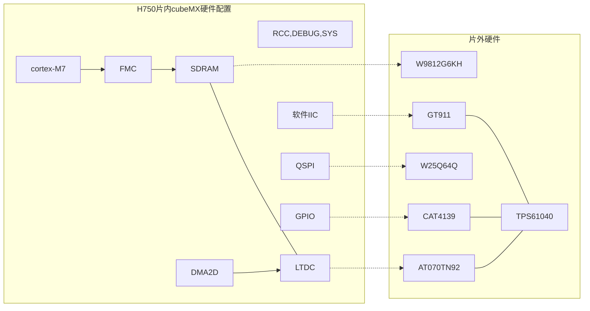
```mermaid
flowchart LR
A0[RCC,DEBUG,SYS]
A1[cortex-M7];A2[FMC];A3[SDRAM];
B1[DMA2D];B2[LTDC];
C1[软件IIC];
D1[QSPI];
E1[GPIO];

out1[W9812G6KH];out2[AT070TN92];out2[AT070TN92];out3[GT911];
out4[CAT4139];out5[TPS61040];out6[W25Q64Q]

subgraph step_1[H750片内cubeMX硬件配置]
direction TB
A0;
B1 --> B2;
A1 --> A2 --> A3;

C1;
E1;
D1;
end


subgraph step_2[片外硬件]
direction TB
out1;out2;out3;out4;out5;out6;
end


A3 -.-> out1;
B2 -.-> out2;
C1 -.-> out3;
D1 -.-> out6;
E1 -.-> out4;
out2 --- out5;
out3 --- out5;
out4 --- out5;
A3 ---B2

```

## 0. whine：例程烧录配置

首先先说一下生成流程吧，大体是：

- 通过CubeMX配置项目并生成代码
- 通过TouchGFX打开项目配置页面并再次生成代码
- 通过keil配置生成的项目

这几条反复更新，但是由于部分版本的cubeMX生成后，keil重新加载会导致MDK项目忘记之前魔法棒里的配置（我的工位电脑会刷新掉，但是自己的笔记本不会）仅修改参数还好，可以直接忽略，但是添加了一些新的驱动后，你不接受就得手动导入新的头文件，那可就是另一个故事了

因此，着重把每次生成之后，可能需要重新配置的内容在前面先说明一下，方便在后面反复配置，反复回来看

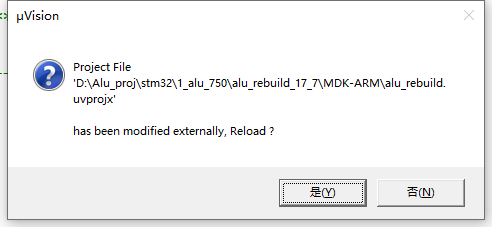


### 0.1 Option > Target

由于这个核心板，在存在片内不够用的情况下，需要使用QSPI协议向片外烧录（一般来说，使用了freeRTOS和TouchGFX是肯定不够用的），参考[STM32H7参考手册](https://www.stmcu.com.cn/Designresource/detail/document/699642)的内存映射，由于该核心板的算法包使用QSPI协议与W25Q64通讯，需要将flash的地址跳转到0x90000000

> 各类文档获取建议左转[意法半导体文档](https://www.stmcu.com.cn/Designresource/list/STM32%20MCU/document)

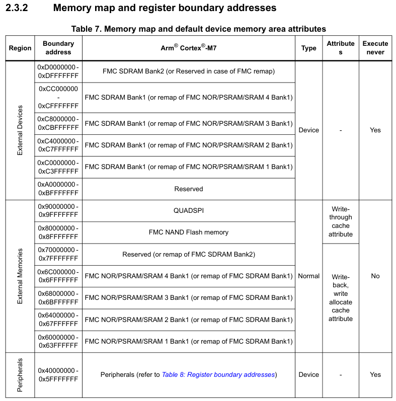

因此：需更改只读存储ROM范围，从0x90000000开始，大小8M，**记得把片内flash的IROM1的取消**

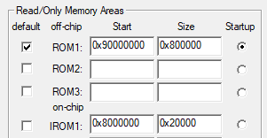

| default | start      | size     | startup |
| ------- | ---------- | -------- | ------- |
| True    | 0x90000000 | 0x800000 | True    |

同时，**建议**使用ARMCC5版本的编译器(AC6倒是也可以用，但是warnning山你喜欢吗？反正我不喜欢)
由于后续有使用TouchGFX开发界面，C++代码不建议勾选MicroLIB

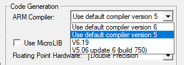

对于随机存储RAM的范围，不用管，按照默认的配置走就好

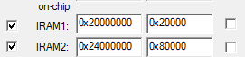

###   0.2 Option > output

**建议**取消勾选Browse infomation（编译太慢了），实在想看函数关系建议使用VScode（这玩意后续再说）

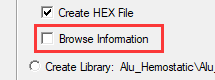

### 0.3 Option > C/C++

如果需要，添加头文件目录（后续配置文件时，会添加一些自定义的BSP内容）

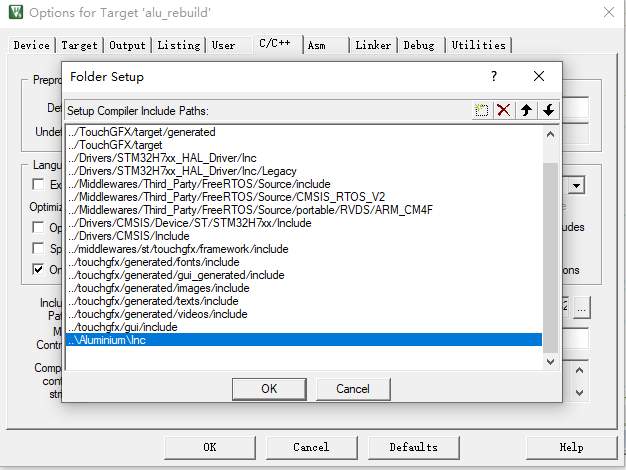

再添加Src下的文件，右键项目Add Group(这里的两个文件用于实现触摸操作)

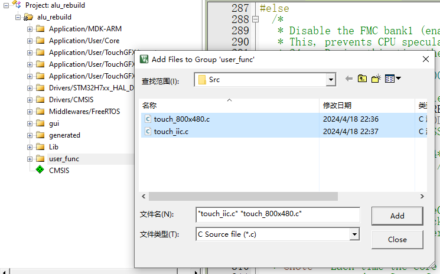

### 0.4 Option > Debug

选择调试器为ST-Link Debugger 然后进setting

点到Flash Download下面，修改算法包，并更改RAM范围块大小64K(0xF000)

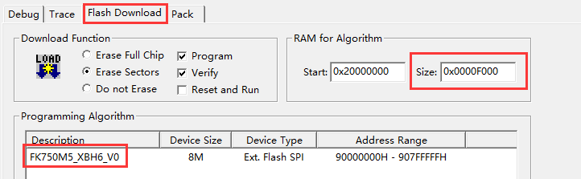

| Size | 0x0000F000 |
| ---- | ---------- |

算法包可以直接来自反客提供的flm文件，或者按照`Keil_v5\ARM\Flash\_Template`的项目模板，配置并生成通讯算法，这里直接将flm文件复制到`Keil_v5\ARM\Flash\`目录下，即可在keil中使用

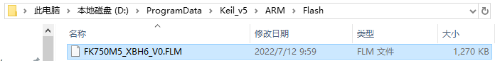

### 0.5 打开 system_stm32h7xx.c

实际上这个应该是之后再加入的内容，但是还是先说一下吧

找到 SystemInit()函数，找到该函数的结尾，将 **SCB->VTOR** 的值改为**外部 flash 的地址** 也就是下面第三行

```C
#endif /*DUAL_CORE && CORE_CM4*/
SCB->VTOR = 0X90000000;       /* Vector Table Relocation in SDRAM */
}
```

但是考虑到stm32执行Reset_Handler()、SystemInit()、SystemCoreClockUpdate()之后才会进入main()， 因此可以在main()的开头直接添加这句，用于向量表地址偏移（对于32的boolloader启动流程，我建议去看硬汉嵌入式的博文，是真的牛（好吧，硬汉哥本来就是安富莱的））

```c
/* USER CODE BEGIN 1 */
SCB->VTOR = 0X90000000;       /* Vector Table Relocation in SDRAM */
/* USER CODE END 1 */
```

## 1. 基础片内设备

好的，那么回到正题，现在从头开始使用CubeMX，希望你的cubeMX不会每次都让你重新配置一遍0.x的内容

选型号就懒的说了

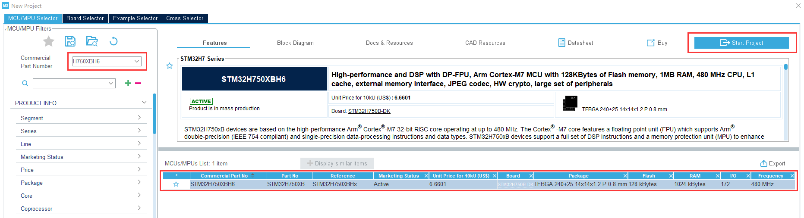

对于Cortex-M7内核的会在开始提示你是否要配置一些默认设备，这个其实可以直接选No，因为这里只是给你配置了CortexM7配置页内的东西，完全可以自己配

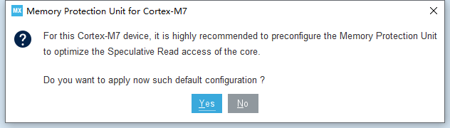


### 1.1 配置RCC SYS DEBUG CORTEX_M7

#### 1.1.1RCC

RCC懒的说了，是个教程都有，因为用的核心板包括了复位和晶振相关，直接点开HSE外部晶振（LSE想点就点外部晶振，不想点就忽略）

别忘记外面时钟树需要调整到25MHz（当然，时钟树这个不急，之后一起搞）

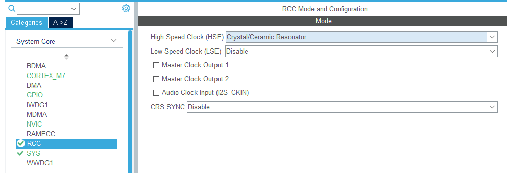

下面的参数都不用动，GPIO看一下，保证HSE、LSE输入输出和核心板的原理图一致（一般来说默认就是）

原理图上分别使用了PC14、PC15、PH0、PH1

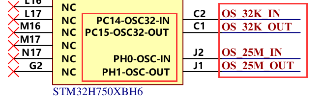

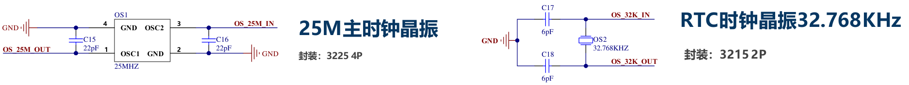

cubeMX与原理图配置一致（如果你的cubeMX无法选择原理图的引脚，请确认单片机型号没错之后尽快和淘宝商品页选择退货退款（不是））

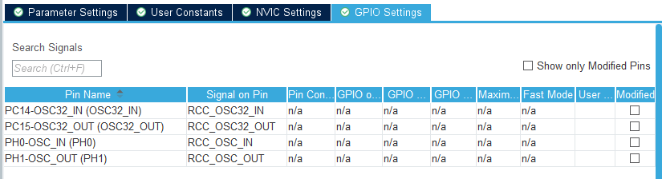

#### 1.1.2 DEBUG

DEBUG也得打开，不然SWD调试出问题当我没说(103原来直接在SYS里,不知道为什么750挪地方了)，

直接打开，剩下的什么都不用动（一般也都是PA13和PA14）

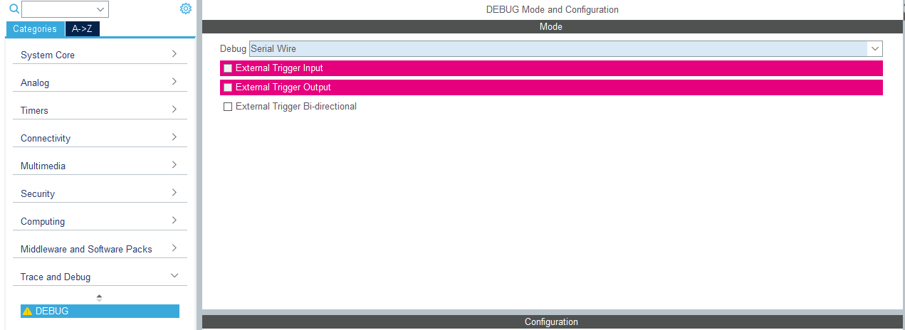

#### 1.1.3 SYS

由于后面使用freertos, SYS时钟需要从SysTick改成定时器（为了防止freertos的中断和系统中断冲突）

> 你如果开启了freertos，你不改这里，他们之后也会提醒你

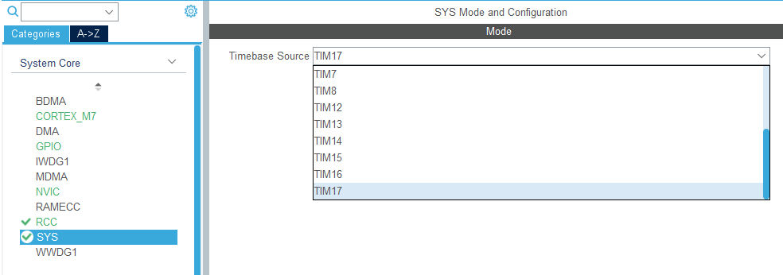

#### 1.1.4 CORTEX_M7

核心板外置了片外SDRAM，使用FMC(Flexible Memory Controller) 控制W9812G6KH或W9825G6KH（这里按32MB配置）
配置改项目可能是为了保证后续和FreeRTOS不同task的堆栈水位值足够用，**但是实际上似乎没用到**(但缓冲区还是得开)

因此需要配置Cortex-M7的FMC相关内容，然后再配置FMC

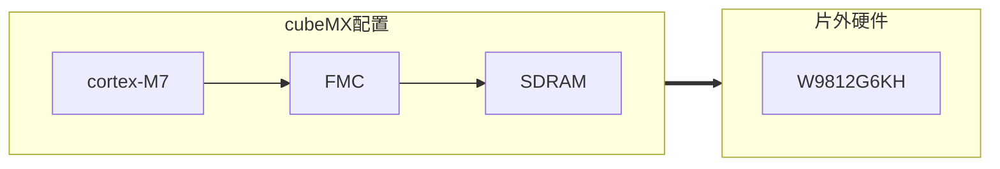
```mermaid
flowchart LR
A1[cortex-M7];A2[FMC];A3[SDRAM];A4[W9812G6KH] 

subgraph step_1[cubeMX配置]
direction LR
A1 --> A2
A2 --> A3
end

subgraph step_2[片外硬件]
direction TB
A4
end

step_1==>step_2
```

同时，因为后续使用TouchGFX，不开cache屏幕会有明显操作卡顿，强烈建议就算不使用SDRAM，也至少把cache和背景区域开启（下面这张图的前两个红框）

这部分目前先参考[他人的博文](https://blog.csdn.net/wallace89/article/details/117233443)，以及[编程手册](https://www.stmcu.com.cn/Designresource/detail/document/664255)，[STMCU中文官网](https://www.stmcu.com.cn/Designresource/list/STM32H7/document/PM)，具体介绍之后再补

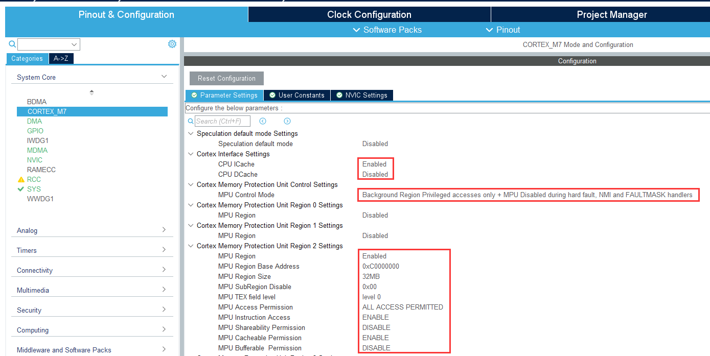

上图三部分分别是：

- 使能高速缓冲区
- 设置内存保护单元控制模式
- 配置内核区域（）

至于说这里内存区序号为甚么选择Region_2，参考[他人的博文 ](https://shequ.stmicroelectronics.cn/thread-632589-1-1.html)和[编程手册](https://www.stmcu.com.cn/Designresource/detail/document/664255)的**MPU_RNR**（因为region选择实际上是控制这个寄存器）相关内容，仅仅是之前的例程这么设置的，反正只是优先级相关，该改改

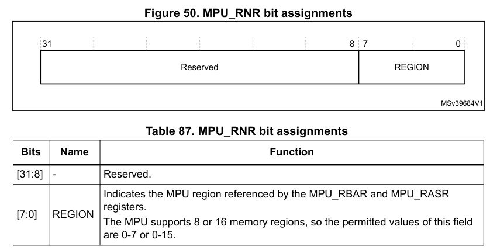

##### 1.1.4.1 cache

Icache表示指令缓存，Dcache表示数据缓存，

启用这两个能够加速CPU运行效率（最直观的就是TouchGFX的页面不卡顿了），但是Dcache由于使用了FreeRtOS，SDMMC必须使用DMA才能使用，疑似Dcache和MDMA导致FatFS通讯出现问题（按照反客的提示，需要把SDMMC分频降低，这个后续再尝试，暂时为了后续的程序均能够正常进行，**将Dcache关闭**）

##### 1.1.4.2 Cortex Memory Protection Unit Control Settings（内存保护单元控制设置）

通过控制模式的设置，配置MPU_CTRL寄存器

- PRIVDEFENA ：使能软件对默认内存映射的访问（使能背景区域，你可以理解为这个区域是region_-1，谁都可以占）
- HFNMIENA：使能在硬件故障，NMI与FAULTMASK中断程序里操作MPU

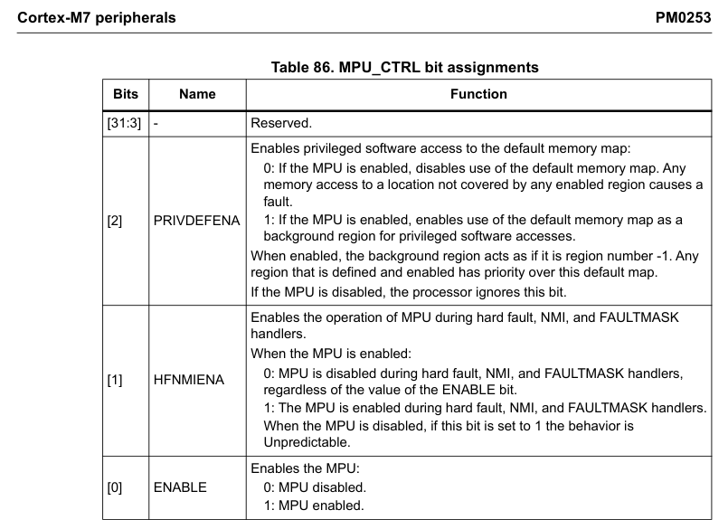

cubeMX中的对应选项分别表示将以上两位置0还是置1，对应关系如下：

- Background Region Access Not Allowed + MPU Disable during hard fault , NMI and FAULTMASK handlers **(PRIVDEFENA = 0 + HFNMIENA = 0)**
- Background Region Access Not Allowed + MPU Enable during hard fault , NMI and FAULTMASK handers **(PRIVDEFENA = 0 + HFNMIENA = 1)**
- Background Region Privileged access only + MPU Disable during hard fault , NMI and FAULTMASK handlers **(PRIVDEFENA = 1 + HFNMIENA = 0)**
- Background Region Privileged access only + MPU Enable during hard fault , NMI and FAULTMASK handers **(PRIVDEFENA = 1 + HFNMIENA = 1)**

我们这里就喜闻乐见选择**(PRIVDEFENA = 1 + HFNMIENA = 0)**，后续有空再详细说明，**至少PRIVDEFENA建议置1**

##### 1.1.4.3 MPU Control Mode （配置内核控制FMC的区域，可选择性忽略）

还是像之前那样，通过内核配置FMC相关内容

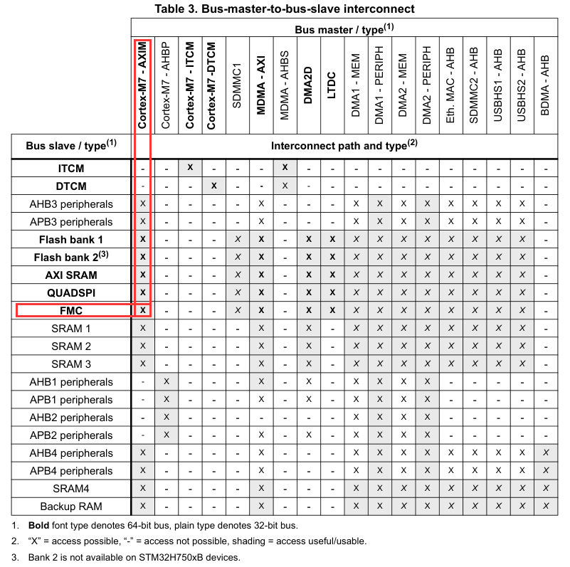

|                             |                      |                                                              |
| --------------------------- | -------------------- | ------------------------------------------------------------ |
| MPU Region Base Address     | 0xC0000000           | FMC首地址                                                    |
| MPU Region Size             | 32MB                 | FMC大小(和您使用的SDRAM大小保持一致)                         |
| MPU SubRegion Disable       | 0x00                 | 不划分子区域                                                 |
| MPU TEX field level         | level0               | 配置MPU_RASR寄存器的TEX段是000、001、010，[参考野火文档](https://doc.embedfire.com/mcu/i.mxrt/i.mxrt1052/zh/latest/doc/chapter40/chapter40.html) |
| MPU Access Permission       | ALL ACCESS PERMITTED | MPU访问权限配置为不受限制 (全部交给Cache)                    |
| MPU Instruction Access      | ENABLE               | 开启MPU指令访问                                              |
| MPU Shareability Permission | DISABLE              | 关闭MPU共享许可                                              |
| MPU Cacheable Permission    | ENABLE               | 开启MPU可缓存权限                                            |
| MPU Bufferable Permission   | DISABLE              | 关闭保护区域的缓冲状态                                       |

MPU Region Base Address必须设置成SDRAM存储区1的起始地址0xC0000000，原因详见[参考手册](https://www.stmcu.com.cn/Designresource/detail/document/699642)FMC存储区域

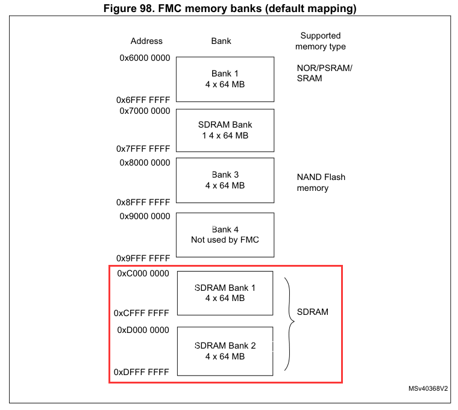

### 1.2 配置FMC（可选择性忽略）

#### 1.2.1 参数配置

打开配置页进行参数配置

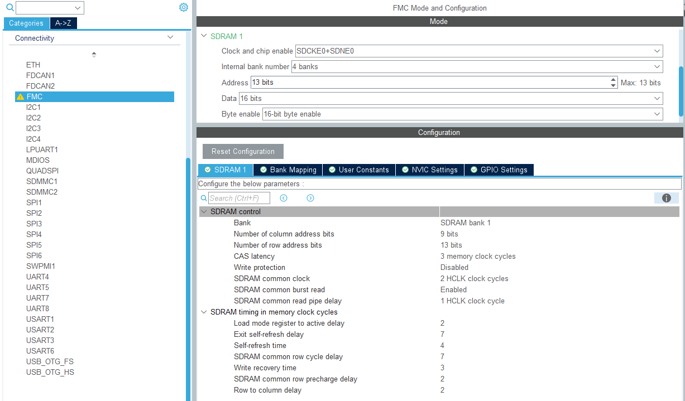

对应sdram.c中MX_FMC_Init中的配置项

```C
hsdram1.Init.SDBank = FMC_SDRAM_BANK1;							   // 选择BANK区
hsdram1.Init.ColumnBitsNumber = FMC_SDRAM_COLUMN_BITS_NUM_9;	   // 行地址宽度
hsdram1.Init.RowBitsNumber = FMC_SDRAM_ROW_BITS_NUM_13;			   // 列地址线宽度
hsdram1.Init.MemoryDataWidth = FMC_SDRAM_MEM_BUS_WIDTH_16;		   // 数据宽度
hsdram1.Init.InternalBankNumber = FMC_SDRAM_INTERN_BANKS_NUM_4;	   // bank数量
hsdram1.Init.CASLatency = FMC_SDRAM_CAS_LATENCY_3;				   // CAS
hsdram1.Init.WriteProtection = FMC_SDRAM_WRITE_PROTECTION_DISABLE; // 禁止写保护
hsdram1.Init.SDClockPeriod = FMC_SDRAM_CLOCK_PERIOD_2;			   // 分频
hsdram1.Init.ReadBurst = FMC_SDRAM_RBURST_ENABLE;				   // 突发模式
hsdram1.Init.ReadPipeDelay = FMC_SDRAM_RPIPE_DELAY_1;			   // 读延迟

/* SdramTiming */
SdramTiming.LoadToActiveDelay = 2;
SdramTiming.ExitSelfRefreshDelay = 7;
SdramTiming.SelfRefreshTime = 4;
SdramTiming.RowCycleDelay = 7;
SdramTiming.WriteRecoveryTime = 3;
SdramTiming.RPDelay = 2;
SdramTiming.RCDDelay = 2;
```

这里的内容参考[他人的博文](https://blog.csdn.net/as480133937/article/details/123455833)、[W9825G6KH手册](https://atta.szlcsc.com/upload/public/pdf/source/20170316/1489630415513.pdf)和原理图，我这里也说一下

| SDRAM1                |                      |                                                              |
| --------------------- | -------------------- | ------------------------------------------------------------ |
| Clock and chip enable | FMC_SDCKE0+FMC_SDNE0 | 回到上面FMC存储区域，SDRAM区域有两个Bank，既然Cortex中配置的是**0xC0000000**，那么我们这里应选择Bank0，对应**0xC000 0000-0xCFFF FFFF** |
| internal bank numbers | 4 banks              | SDRAM有几个BANK存储单元，我们就填几个，这里填4个             |
| Address               | 13bit                | 地址线长度                                                   |
| data                  | 16bit                | 数据线长度                                                   |
| Byte Enable           | enable               | 是否使能数据掩码                                             |


internal bank numbers参考[W9825G6KH手册](https://atta.szlcsc.com/upload/public/pdf/source/20170316/1489630415513.pdf) 或[W9812G6KH手册](https://docs.rs-online.com/b318/0900766b8170403d.pdf)（无所谓，这两个都是4bank）

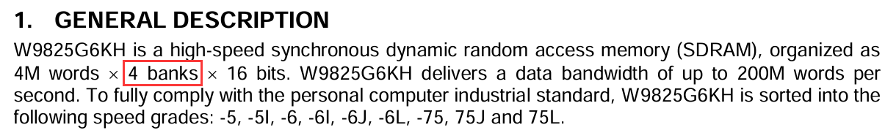

地址和数据线长度参考原理图或者[W9825G6KH手册](https://atta.szlcsc.com/upload/public/pdf/source/20170316/1489630415513.pdf)

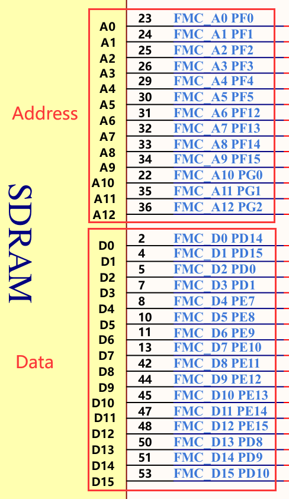

| SDRAM control                 |                    |                                                              |
| ----------------------------- | ------------------ | ------------------------------------------------------------ |
| bank                          | SDRAM bank 1       | 这个没得选                                                   |
| Number of column address bits | 9                  | 列地址（[W9825G6KH手册](https://atta.szlcsc.com/upload/public/pdf/source/20170316/1489630415513.pdf) PIN DESCRIPTION） |
| Number of row address bits    | 13                 | 行地址（[W9825G6KH手册](https://atta.szlcsc.com/upload/public/pdf/source/20170316/1489630415513.pdf) PIN DESCRIPTION） |
| CAS latency                   | 3                  | 列地址选通延迟，发出读命令后，等待几个时钟周期，数据线 Data才会输出有效数据，一般2或3 |
| Write protection              | disable            | 是否使能写保护                                               |
| SDRAM common clock            | 2 HCLK clock cycle | FMC 与外部 SDRAM 通讯时的时钟频率（这里是2分频）             |
| SDRAM common burst read       | enable             | 是否使能突发读取模式                                         |
| SDRAM common read pipe delay  | 1 HCLK clock cycle | CASLatency 地址选通延迟后，再等待多少个 HCLK 时钟周期才进行数据采样（能用的前提下越小越好） |

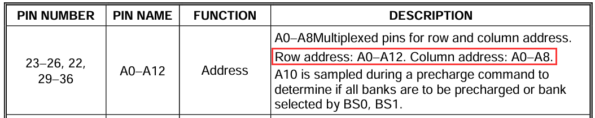

对于各个寄存器的时间控制部分

| SDRAM timing in memory clock cycle |      |                                                     |
| ---------------------------------- | ---- | --------------------------------------------------- |
| Load mode register to active delay | 2    | tRSC 加载模式寄存器命令与行有效或刷新命令之间的延迟 |
| Exit self-refresh delay            | 7    | tXSR 退出自我刷新到行有效命令之间的延迟             |
| Self-refresh time                  | 4    | tRAS 自刷新周期                                     |
| SDRAM common row cycle delay       | 7    | tRC 刷新命令和激活命令之间的延迟                    |
| Write recovery time                | 3    | tWR 写命令和预充电命令之间的延迟                    |
| SDRAM common row precharge delay   | 2    | tRP 义预充电命令与其它命令之间的延迟                |
| Row to column delay tRCD           | 2    | tRCD 定义行有效命令与读/写命令之间的延迟            |

这部分具体解释建议直接看cubeMX自带的描述，以及[W9825G6KH手册](https://atta.szlcsc.com/upload/public/pdf/source/20170316/1489630415513.pdf)的AC Characteristics and Operating Condition

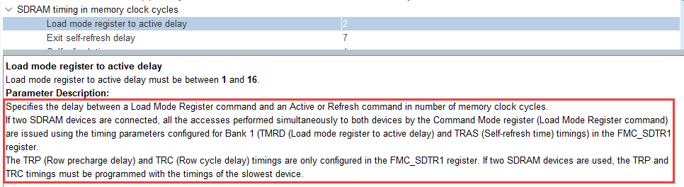

#### 1.2.2 GPIO配置

参数配置完确定GPIO

大部分不用更改,除了这两个 改成PH2 和 PH3，时钟使能和片选按照原理图的CKE和CS脚选

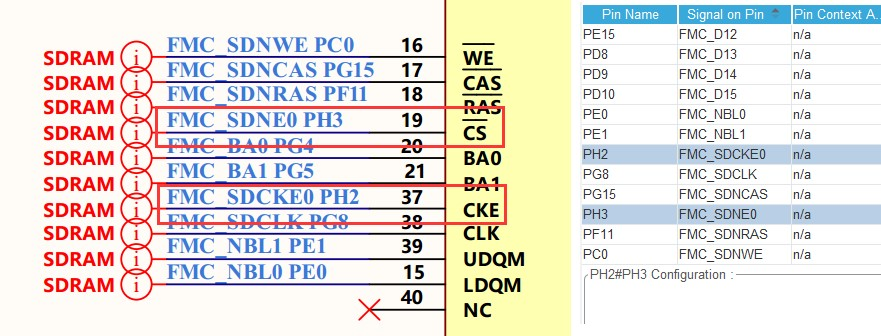

为了防止默认引脚更改，这里列出目前核心板sdram.c中的引脚配置

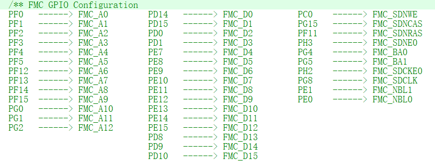

#### 1.2.3 代码修改

生成代码，并在fmc.c里添加代码(设置SDRAM)
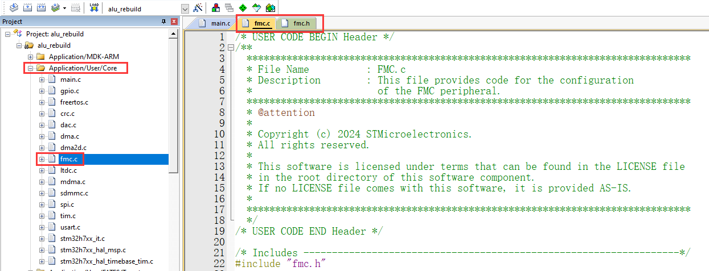

fmc.c 添加SDRAM相关宏定义（更推荐在fmc.h中添加）

```c
/* USER CODE BEGIN 0 */
FMC_SDRAM_CommandTypeDef command;	// 控制指令
#define SDRAM_TIMEOUT     ((uint32_t)0x1000) 						// 超时判断时间
#define SDRAM_MODEREG_BURST_LENGTH_1             ((uint16_t)0x0000)
#define SDRAM_MODEREG_BURST_LENGTH_2             ((uint16_t)0x0001)
#define SDRAM_MODEREG_BURST_LENGTH_4             ((uint16_t)0x0002)
#define SDRAM_MODEREG_BURST_LENGTH_8             ((uint16_t)0x0004)
#define SDRAM_MODEREG_BURST_TYPE_SEQUENTIAL      ((uint16_t)0x0000)
#define SDRAM_MODEREG_BURST_TYPE_INTERLEAVED     ((uint16_t)0x0008)
#define SDRAM_MODEREG_CAS_LATENCY_2              ((uint16_t)0x0020)
#define SDRAM_MODEREG_CAS_LATENCY_3              ((uint16_t)0x0030)
#define SDRAM_MODEREG_OPERATING_MODE_STANDARD    ((uint16_t)0x0000)
#define SDRAM_MODEREG_WRITEBURST_MODE_PROGRAMMED ((uint16_t)0x0000)
#define SDRAM_MODEREG_WRITEBURST_MODE_SINGLE     ((uint16_t)0x0200) 
```

fmc.c 初始化部分添加SDRAM初始化代码

```c
/* USER CODE BEGIN FMC_Init 2 */
__IO uint32_t tmpmrd = 0;

/* Configure a clock configuration enable command */
command.CommandMode = FMC_SDRAM_CMD_CLK_ENABLE;		// 开启SDRAM时钟
command.CommandTarget = FMC_SDRAM_CMD_TARGET_BANK1; // 选择要控制的区域
command.AutoRefreshNumber = 1;
command.ModeRegisterDefinition = 0;
HAL_SDRAM_SendCommand(&hsdram1, &command, SDRAM_TIMEOUT); // 发送控制指令,第3个是等待时间
HAL_Delay(1);	// 延时等待 这个没事,反正也不在freertos的线程里运行

/* Configure a PALL (precharge all) command */
command.CommandMode = FMC_SDRAM_CMD_PALL;			// 预充电命令
command.CommandTarget = FMC_SDRAM_CMD_TARGET_BANK1; // 选择要控制的区域
command.AutoRefreshNumber = 1;
command.ModeRegisterDefinition = 0;
HAL_SDRAM_SendCommand(&hsdram1, &command, SDRAM_TIMEOUT); // 发送控制指令

/* Configure a Auto-Refresh command */
command.CommandMode = FMC_SDRAM_CMD_AUTOREFRESH_MODE; // 使用自动刷新
command.CommandTarget = FMC_SDRAM_CMD_TARGET_BANK1;	  // 选择要控制的区域
command.AutoRefreshNumber = 8;						  // 自动刷新次数
command.ModeRegisterDefinition = 0;
HAL_SDRAM_SendCommand(&hsdram1, &command, SDRAM_TIMEOUT); // 发送控制指令

/* Program the external memory mode register */
tmpmrd = (uint32_t)SDRAM_MODEREG_BURST_LENGTH_2 | SDRAM_MODEREG_BURST_TYPE_SEQUENTIAL | SDRAM_MODEREG_CAS_LATENCY_3 | SDRAM_MODEREG_OPERATING_MODE_STANDARD | SDRAM_MODEREG_WRITEBURST_MODE_SINGLE;
command.CommandMode = FMC_SDRAM_CMD_LOAD_MODE;		// 加载模式寄存器命令
command.CommandTarget = FMC_SDRAM_CMD_TARGET_BANK1; // 选择要控制的区域
command.AutoRefreshNumber = 1;
command.ModeRegisterDefinition = tmpmrd;
HAL_SDRAM_SendCommand(&hsdram1, &command, SDRAM_TIMEOUT); // 发送控制指令

HAL_SDRAM_ProgramRefreshRate(&hsdram1, 918); // 配置刷新率
```

以上配置参考反客SDRAM例程以及[该文章](https://blog.csdn.net/as480133937/article/details/123791568)

### 1.3 配置DMA2D

由于要使用RGB屏，保证LTDC传输效率的需要，这里配置DMA2D来加速信号传输效率；发展的（什么玩意？论文看魔怔了？），因为后续会使用touchGFX，为了保证反应速度，也建议开启该设备

先开启DMA2D并配置如下：

需要注意的不多，为了传输保证效率，这里使用**RGB565**颜色模式

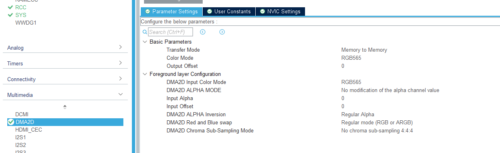

然后在NVIC setting页面打开DMA2D的全局中断(建议去NVIC配置页中启用，那里还能顺路调优先级)

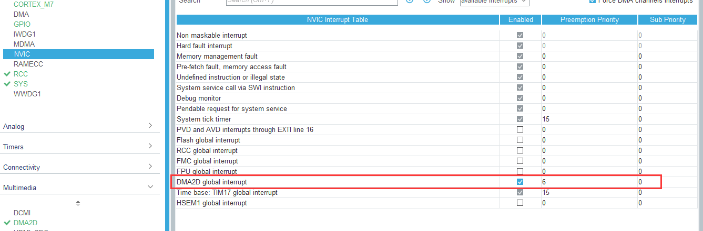

### 1.4 配置LTDC

屏幕使用的是反客的一体化7寸屏，已经将驱动电路包含在内，不考虑底层硬件逻辑，直接使用单片机输出的LTDC即可控制该屏幕显示触摸，硬件组成如下：后续配置参考反客提供的原理图和数据手册

| 硬件组成 | 使用型号  |
| :------: | :-------: |
|   裸屏   | AT070TN92 |
| 背光驱动 |  CAT4139  |
|  触摸IC  |   GT911   |
| 供电稳压 | TPS61040  |

好的，那么这里回到cubeMX，来配置LTDC通讯协议用于传输屏幕信息：

尽管之前DMA2D中使用了RGB565，这里LTDC的DisplayType选择使用RGB888，以便后续配置引脚（反正核心板的FPC线已经占位了，也没有引出额外引出，再加一个FPC转接器我还不如直接打板）

后续可以在Layer Settings中配置为RGB565，不会影响的，只不过占用一些引脚，参数都一样配，不影响

#### 1.4.1 参数设置

没什么好说的，直接按照这里的来

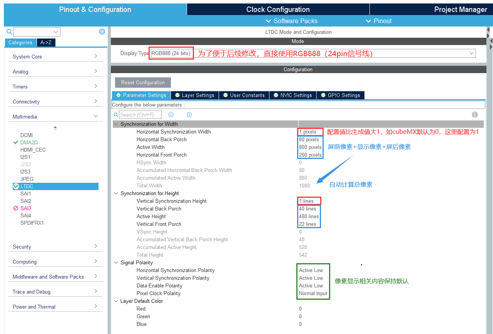

#### 1.4.2 layer设置

这个也没什么好说的了，直接如图所示吧

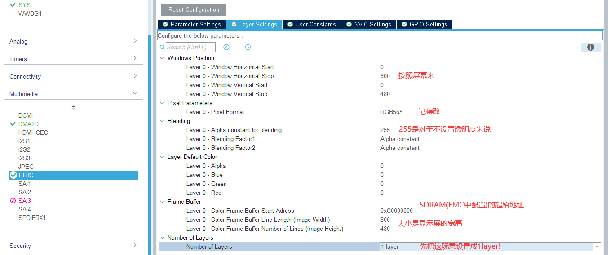

如果之前没有配置FMC，这里的buffer不要使用SDRAM的外设起始地址，请使用片内RAM地址

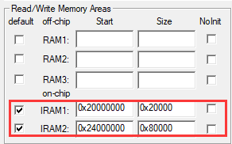

（按照800*480=384000=0x5DC00，应该是理论上够用的）

#### 1.4.3 中断设置

尽管LTDC的中断可以直接在LTDC中的NVIC setting中配置，但是还是同样建议去NVIC下配置，毕竟那面可以设置优先级

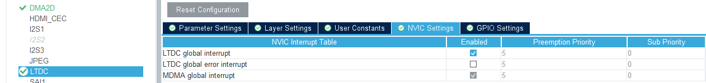

建议来这面

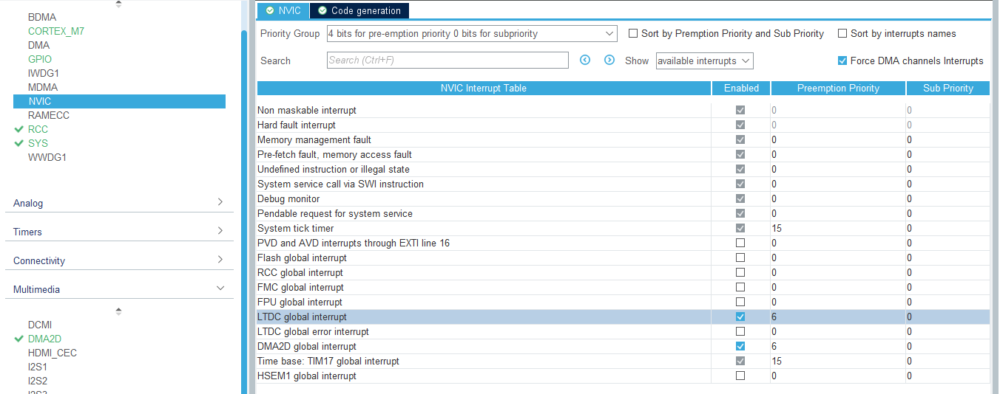

#### 1.4.4 时钟设置

记得回时钟树上把LTDC的时钟分频拉下来，

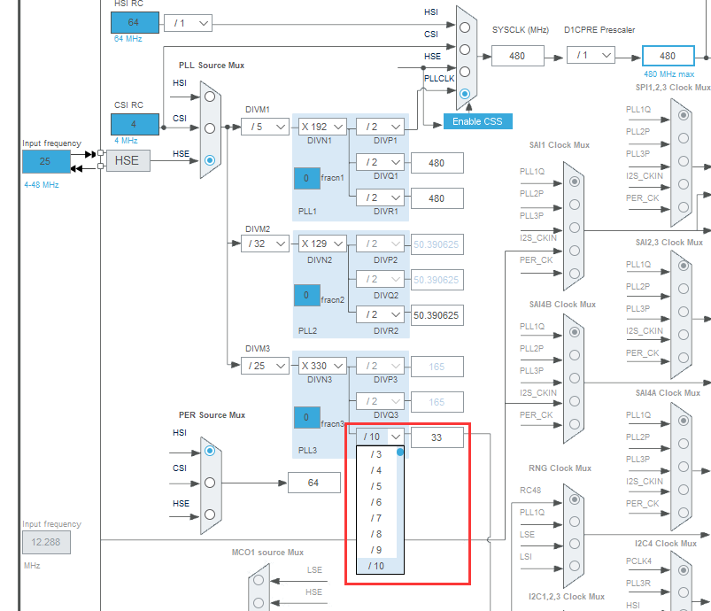

> 补充：帧率=33M/(1080*522) ≈ 58.53
>
> 每帧处理时间 1000/58.53 ≈17.085 ms  

#### 1.4.5 GPIO配置

如果是RGB888的颜色模式，就按照下图配置，对于565，不用客气，哪个没配置就直接不要了

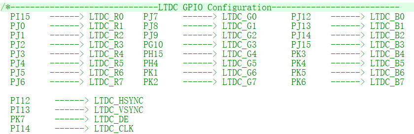

改引脚的同时记得把所有引脚的速度都调成最高

> PS：多个引脚可以多选一起设置，不要一个个修改了

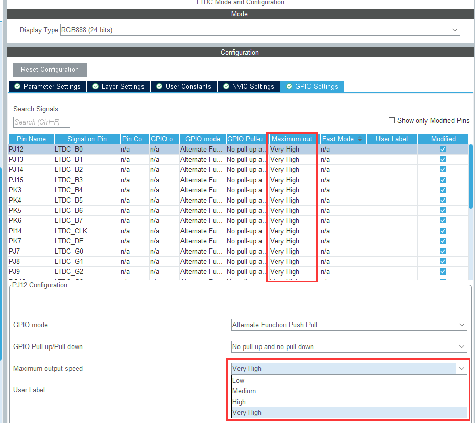

如果都配置好了，按照反客提供原理图，还有一个背光引脚需要手动配置，需要在GPIO中手动配置GPIO口**PH6**

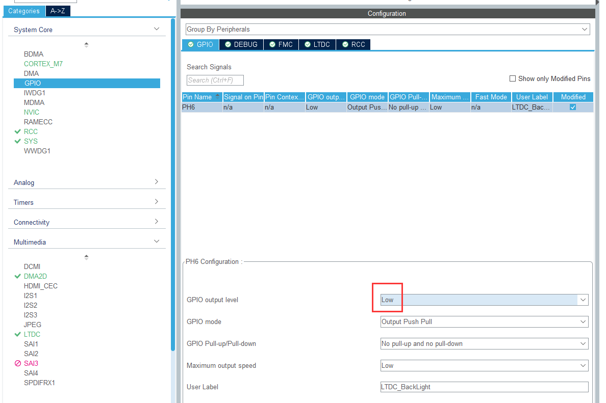

默认是背光, 因此output level是 low，以及别忘记自定义User Label 当然，这并不是特别重要

####   1.4.6 代码修改

生成代码

到LTDC的生成文件中,在初始化函数MX_LTDC_Init()最后将背光启动

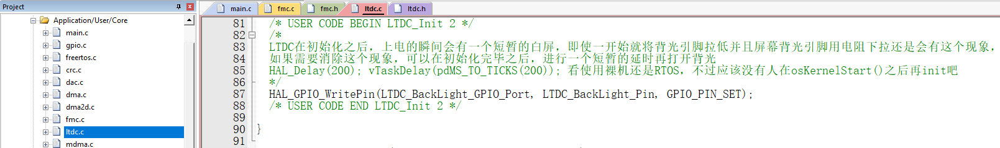

```C
 /* USER CODE BEGIN LTDC_Init 2 */
 //	HAL_Delay(200);
	HAL_GPIO_WritePin(LTDC_BackLight_GPIO_Port, LTDC_BackLight_Pin, GPIO_PIN_SET);
```

理论上这时候您再引入屏幕基础驱动，就可以在屏幕上画线了

### 1.5 配置IIC

这里就必须提到反客H750核心板的一个非常小可爱的地方了，他们FPC对应的触摸控制引脚，没有硬件IIC复用功能，只能软件IIC（我真是！服了！）那我们做的是：**直接搬运**

需要搬运反客例程中的：爱你卡芙卡的！他们这个文件命名还很容易和后续TouchGFX冲突！淦！

- touch_800x480.c
- touch_iic.c

这两个文件直接在反客的例程中拿出来并塞到我们自己的添加路径里（或者生成代码之后再添加）

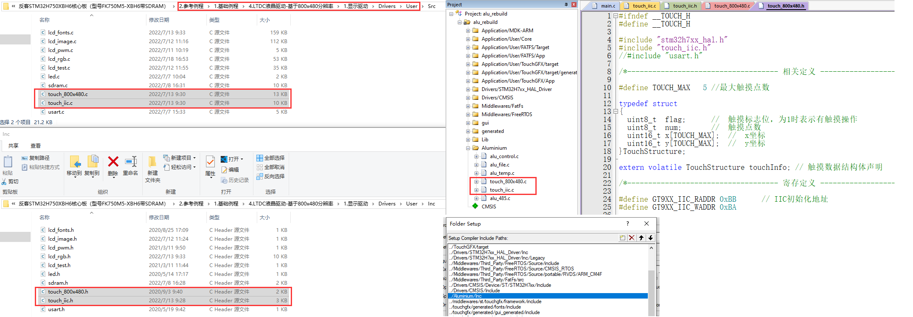

#### 1.5.1 配置GPIO

尽管可以不在cubeMX中配置，但还是建议cubeMX初始化一下GPIO，按照反客例程中设置的引脚配置（这里是怕cubeMX没设置，使用别的的时候没注意，把这个脚用了，然后cubeMX生成的代码和例程touch_iic.c中初始化的代码打架）

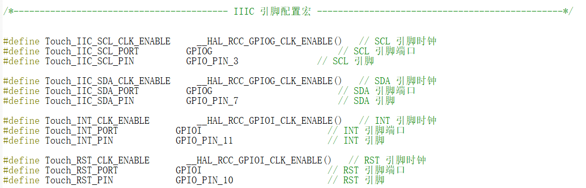

在GPIO中配置引脚如下图所示：

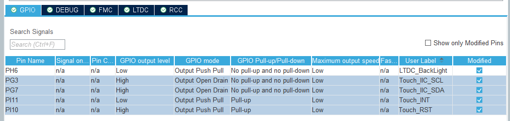

#### 1.5.2 代码修改

生成代码

然后在touch_800*480.文件 和 touch_iic.文件中，注释掉与**Touch_IIC_GPIO_Config()**相关内容

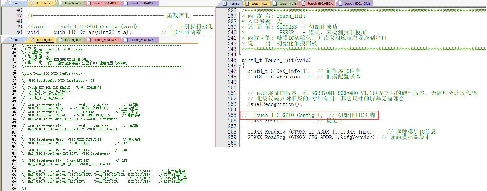

在main.c中引入软件IIC控制程序

引入文件（这里只需要引入touch_800x480就可以，软件IIC内容不用调用）

```c
/* USER CODE BEGIN Includes */
#include "touch_800x480.h"
```

屏幕触摸初始化（这个文件名是起的真拉跨）

```C
/* USER CODE BEGIN 2 */
Touch_Init();				// 触摸屏初始化	
```

好的，那么目前的代码应该就能够保证添加相应的驱动代码，即可正常控制屏幕

## 1.X(非必要)

如果你很急，那我知道你很急，但你先别急，假如您想确认目前的配置有没有问题，我建议移植反客的lcd_rgb.c和lcd_rgb.h等文件

将以上文件添加到生成的项目中（其实lcd_rgb.c和lcd_rgb.h这两个就足够了）

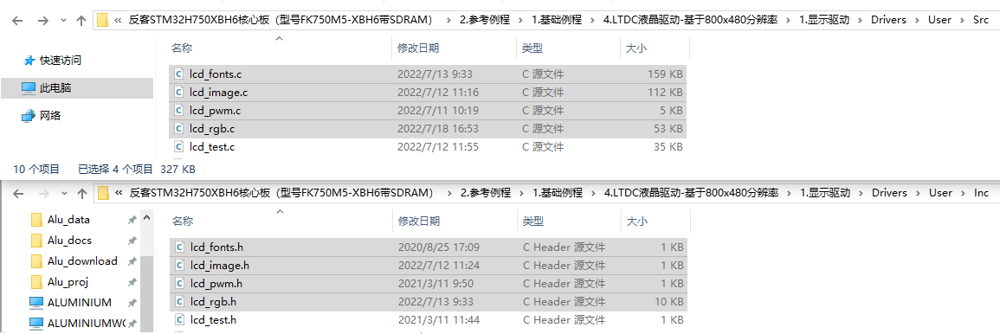

并注释MX_LTDC_Init()和HAL_LTDC_MspInit()，防止cubeMX自动生成一遍，这里再写一遍，导致编译出错


然后在main函数中添加lcd_rgb.h，并调用其中的函数即可

```
#include "lcd_rgb.h"
```

但是由于这个氧化铝已经放弃这个方法许久，这里就不继续了（反正他们的例程使用起来和中景园oled驱动也差不多）

而且，你如果真的只是为了使用这种方法控制屏幕，那你应该会直接去移植例程，而不是跟着这篇笔记配

那么，我们继续


