那么我们首先看一下加入touchGFX之后的工作流程：

- step1：cubeMX生成代码，如果配置了touchGFX，会类似mdk一样生成对应目录
    - step1.1：在keil中调整项目
    - step1.2：在touchGFX中设计界面、字体、容器和各种interaction
- step2：touchGFX生成代码，更新keil项目
    - step2.1：在keil中配置界面，生成烧录测试......


## 2 配置TouchGFX

### 2.1 配置CRC

默认开启就好

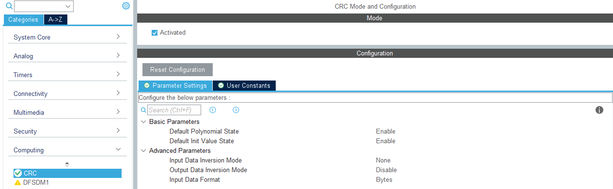

对应例程里生成的代码

```
  hcrc.Instance = CRC;
  hcrc.Init.DefaultPolynomialUse = DEFAULT_POLYNOMIAL_ENABLE;
  hcrc.Init.DefaultInitValueUse = DEFAULT_INIT_VALUE_ENABLE;
  hcrc.Init.InputDataInversionMode = CRC_INPUTDATA_INVERSION_NONE;
  hcrc.Init.OutputDataInversionMode = CRC_OUTPUTDATA_INVERSION_DISABLE;
  hcrc.InputDataFormat = CRC_INPUTDATA_FORMAT_BYTES;
```

### 2.2 配置freertos

[FreeRTOS - Market leading RTOS](https://www.freertos.org/zh-cn-cmn-s/index.html)

为了稳定性，我个人建议选择cmsis_1，v2倒也不是不可以，使用基本相同，只是一些函数名称不太一样（比如freertos的信号量收发，我还是随大流先）

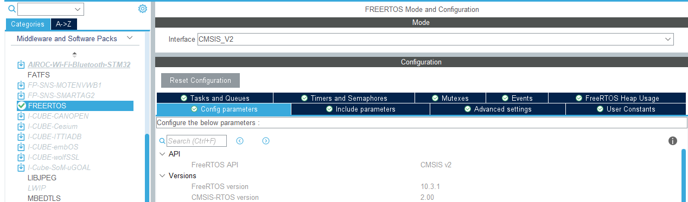

对于Config parameter和Include parameter使用默认就好，除了把堆栈大小调大，剩下的都不用动

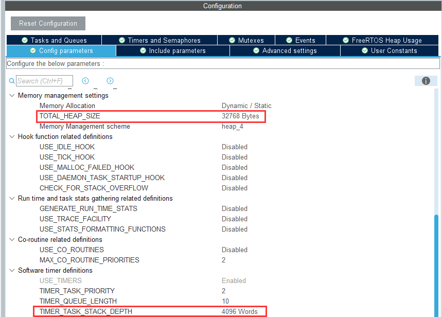

- **TOTAL_HEAP_SIZE**
    - 32768 RTOS内核可用的RAM总量
- **TIMER_TASK_STACK_DEPTH**
    - 4096 设置分配给定时器服务任务的栈的大小（以word为单位）

配置任务队列,信号量互斥量这些等后面另起一个笔记再说

### 2.3 配置TouchGFX

默认已经安装了该软件，并且在cubeMX的软件包中启用（不然你没办法点开TouchGFX的控制页，如果没安装请移步另一篇笔记），这里使用的是4.20.0版本，如果版本不同，可以选择在application中先取消选择，再选择X-CUBE TOUCHGFX的版本，当然，这个版本影响不大

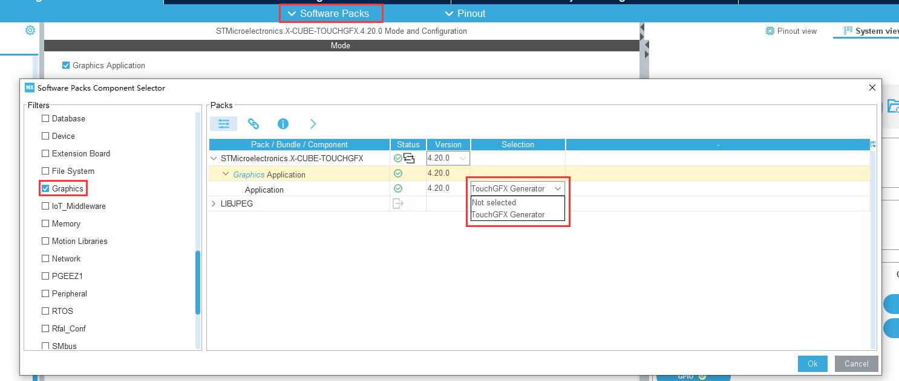

启动TouchGFX之后按照下面的配置去设置

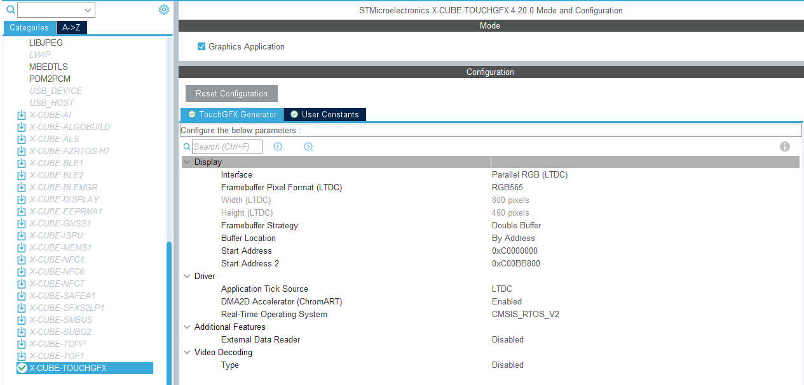

- **interface、Framebuffer Pixel Format (LTDC)  、Width 、Height**
    - 将接口设置为LTDC，颜色模式为RGB565（具体颜色模式跟随DMA2D配置来，好吧，你也没得选😇，颜色模式和尺寸会按照LTDC自动匹配过来）
- **Framebuffer Strategy、Buffer Location、Start Address、Start Address 2**
    - 启动双缓冲区		Framebuffer Strategy = Double buffer
        按照地址分配		Buffer Location = By Address
        两个缓冲区的起始地址:
        - SDRAM起始地址: 0xC0000000

        - SDRAM起始地址+480×800×2: 0xC00BB800    (长×宽×RGB565每个点长度)

- **Application Tick Source** 
    - 使用LTDC的时钟源
- **DMA2D Accelerator (ChromART)**  
    - 启动DMA2D加速
- **Real-Time Operating System**  
    - 如果之前已经配置了实时操作系统，那默认已经选好freertos了，如果之前没有配置，建议配置后再回来（我是不想每个while都刷新一下这玩意然后拿中断去调用我的主程序，至少对于我来说，还是开一个task舒服）


## 3 调整TouchGFX

添加TouchGFX配置后使用CubeMX生成代码，会在ioc目录下生成TouchGFX文件夹，包括.touchgfx配置文件

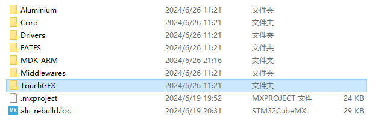

```
{ioc目录}/touchGFX/ApplicationTemplate.touchgfx.part
```

绘制图形步骤先行略过，后面有时间再补，绘制元素后生成代码

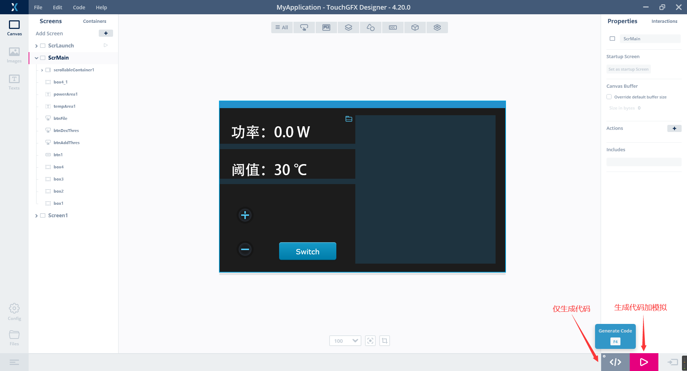

执行生成会在原有.μvproj基础上，生成界面相关文件并自动添加各个路径

### 3.1 基础配置

#### 3.1.1 使能MX_TouchGFX_Process()

生成代码之后会产生新的μvproj（啊不，礦proj😅）请按照提示选择reload加载新的项目文件，更新后会在项目树下自动添加与页面相关的gui、generated、Lib的页面配置文件，以及自动引入头文件目录

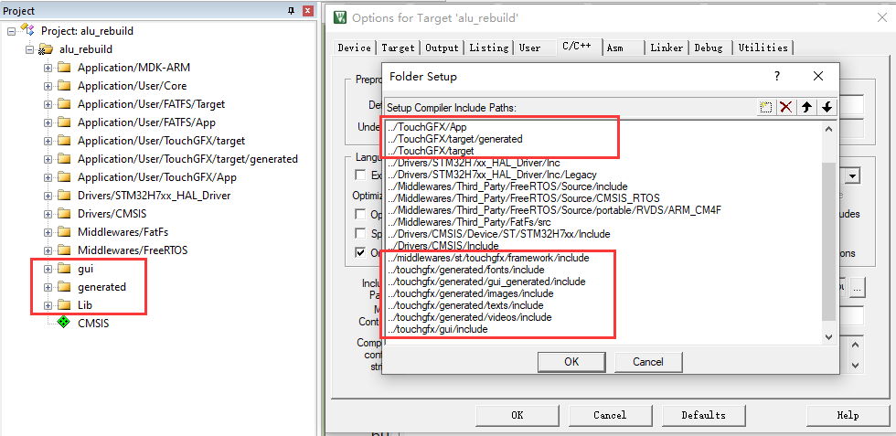

由于使用了FreeRtOS，还需要freertos.c的默认task中添加MX_TouchGFX_Process() 函数启动，我个人建议是给TouchGFX一个独立的Task，然后优先级拉低，让它自己慢慢玩去

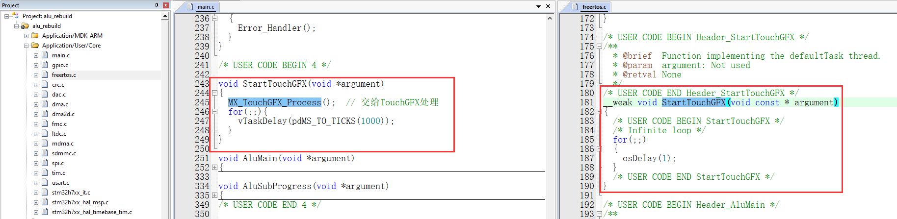

这个freertos相关内容后续会细说，现在只需要知道的是：在freertos.c文件中，找到函数：**void StartDefaultTask(void *argument)**（这个函数会默认创建，上图是我后续使用弱函数全放到main里，表达的内容是一个意思），并在其中的初始化阶段添加MX_TouchGFX_Process();

细节原理参考文档：[Generator用户指南 | TouchGFX Documentation 4.18](https://support.touchgfx.com/4.18/zh-CN/docs/development/touchgfx-hal-development/touchgfx-generator)（其实这么以看，我上面FreeRTOS的堆还是设置的太小了）

```C++
void StartDefaultTask(void *argument)
{
  /* USER CODE BEGIN StartDefaultTask */
	MX_TouchGFX_Process();
  /* Infinite loop */
  for(;;)  // 其实后面这个循环也可以删了，毕竟进到TouchGFX的循环里，下面就进不去了
  {
    vTaskDelay(pdMS_TO_TICKS(1000));
  }
  /* USER CODE END StartDefaultTask */
}
```

生成之后烧录应该就可以正常显示屏幕了

#### 3.1.2 添加触摸配置

如果想要使用触摸功能，还需要加入软件IIC的驱动代码

打开**Application/User/TouchGFX/target**中的**STM32TouchController.cpp**

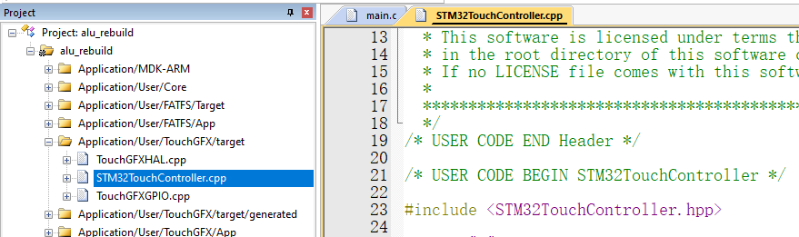

首先添加头文件，由于TouchGFX是C++代码，引入C的头文件时，必须加extern "C" 声明外部 C 函数的关键字

> 不然编译的时候明明有这个函数，但是就是调用不到可别来找我😇（但如果只需要结构体，当我没说）

```C++
extern "C" 
{         
	#include "touch_800x480.h"
}
```

再在STM32TouchController::sampleTouch方法中添加位置采集函数(代替原有return false)

```
	Touch_Scan();	// 调用触摸扫描
	if(touchInfo.flag == 1) {	// 如果检测到触摸
		x = touchInfo.x[0];		// 赋予坐标值
		y = touchInfo.y[0];
		return true;
	} else {
		return false;	
	}
```

目前的配置下，如果TouchGFX中包含交互控件，点击就可以正常切换Pressed image等贴图


### 3.2 touchGFX设计模式

本来打算直接介绍前后端内容如何传递的，但是感觉直接介绍会很懵，就还是先在3.2和3.3介绍一下基本内容再说怎么前向传递和反向传递吧

如果想在前后台传参需要以上几个步骤: model → presenter → view

参考：[Model-View-Presenter设计模式 | TouchGFX Documentation](https://support.touchgfx.com/zh-CN/docs/development/ui-development/software-architecture/model-view-presenter-design-pattern)（TouchGFX文档是真全）

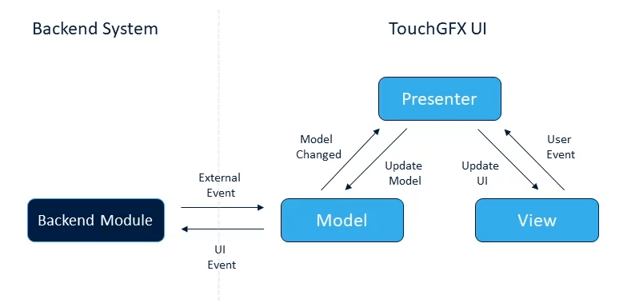

看起来是直线这么个流程,实际上类的继承关系是:

- 有基类:Model、ModelListener、Presenter、view

    - 子类{XXX}Presenter 同时继承 Presenter 和 ModelListener

    - 子类{XXX}ViewBase 按照{XXX}Presenter 的模板 继承 View 

        - > 即: 允许在子类{XXX}ViewBase中使用子类{XXX}Presenter的实例或功能

    - 子类{XXX}View 继承 {XXX}ViewBase

- 基类Model 和 基类ModelListener **相互使用指针指向对面实例化的对象**，俗称共轭父子，因此在model和modellistener中访问另一个类的方法时，**使用 -> 而不是 .**

    - **Model下有一个私有成员为:ModelListener的指针类型**

    - **ModelListener下有一个私有成员为:Model的指针类型**

最后的关系大概就如下面的图所示, 其中加粗的表示是非生成的基类, 不加粗的表示按照页面数量生成的子类,白色填充部分表示在传参中玩家需要修改的部分（卧槽我是不是用了“玩家”）

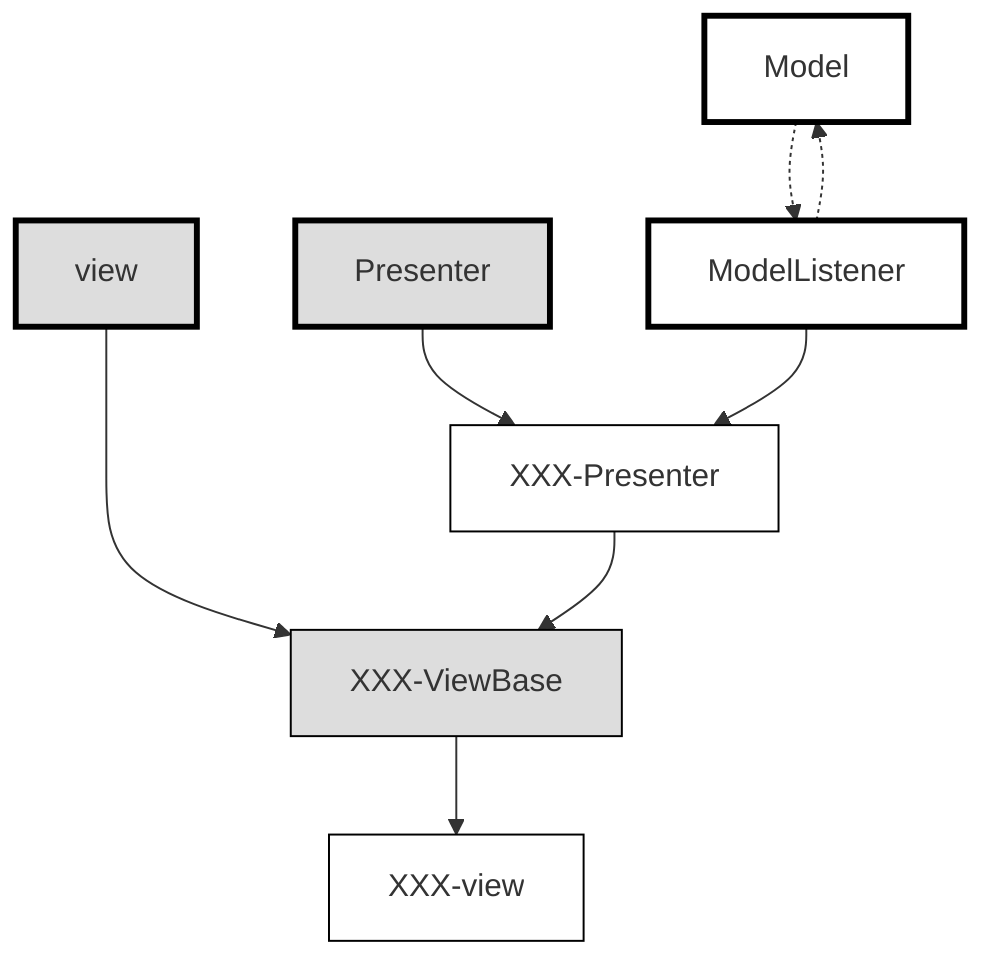

以上文件存储对应gui目录下，如果您设置了多个页面，您将看到1个Model和多个页面的Presenter和View

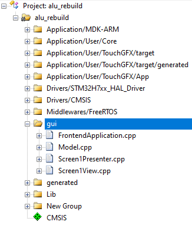

### 3.3 TouchGFX屏幕元素

屏幕元素在generated目录下, 对应设置界面的各个元素, 不建议手动修改,而是直接使用TouchGFX的可视化页面生成

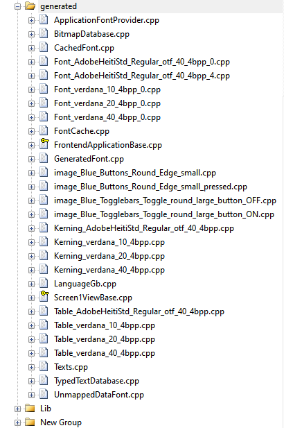

主要内容在{页面名}ViewBase.cpp中，各个页面元素位于该文件下方部分，也可以直接打开对应的hpp查看

```
    add(__background);
    add(box1);
    add(box2);
    add(button1);
    add(buttonWithLabel1);
    add(textArea1);
    add(image1);
```

### 3.4 TouchGFX参数传递

参数传递用到了3.2和3.3的内容，没仔细看的都给我划回去重看！！！

#### 3.4.1 从后端向屏幕传参

主要包括以下几个步骤:

- model调用ModelListener
- ModelListener指向{XXX}Presenter
- {XXX}Presenter中包含view的成员变量,调用{XXX}view
- 最后在{XXX}view里执行

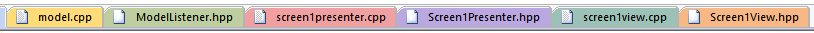

1. 在**model.cpp**中添加内容

model.cpp的头文件中（必须加这个**SIMULATOR**条件编译宏，表示：在非TouchGFX模拟的时候执行前后端交互的代码，因为TouchGFX的模拟器只能看到后生成的那三个项目目录，其他目录下的文件是看不到的）

```C++
#ifndef SIMULATOR
	#include "main.h"
#endif
```

model.cpp的void Model::tick()方法中


```C++
#ifndef SIMULATOR
    // 你需要的方法和类，比如
    modelListener->toggleLed();
#endif
```

2. 在**ModelListener.hpp**类的public中定义虚函数

```
virtual void toggleled() {}
```

3. 在Presenter中实现该函数(即再在{XXX}presenter.hpp中定义,在{XXX}presenter.cpp中声明)

**{XXX}presenter.hpp**

```
virtual void toggleLed();  // 其实加不加虚函数无所谓，反正又不会复写它
```

**{XXX}presenter.cpp**

```
void Screen1Presenter::toggleLed()
{
	view.toggleLed();
}
```

4. 在View中显示(在{XXX}view.cpp和{XXX}view.hpp中接入presenter并控制Screen1ViewBase的元素内容) 

**{XXX}view.hpp**

```
void toggleLed();
```

**{XXX}view.cpp**

```
void Screen1View::toggleLed()
{
// 添加对屏幕控件的操作 
xxx.自身属性
xxx.invalidate();  // 这个表示对元素刷新，比如更新了通配符、更换颜色，均需要刷新一下才能看到
}
```

需要修改屏幕元素中的内容在{XXX}ViewBase.cpp中寻找,在配界面时手动配置的元素，比如：

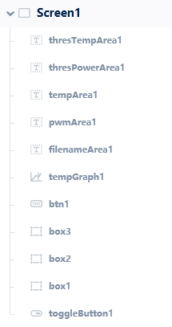

#### 3.4.2 从屏幕向后端传

主要包括以下几个步骤:

- touchGFX页面中,添加interactions函数
- {XXX}ViewBase调用该函数并指向{XXX}Presenter中的函数
- {XXX}Presenter中的函数指向model
- model下执行对应的硬件控制代码

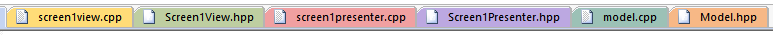

1. 添加interactions

先去{XXX}ViewBase.cpp中寻找在touchGFX中设置的interactions,名字是function name对应的名字

(设置的多的话建议去{XXX}ViewBase.hpp)中寻找

比如下图，使用toggleButton1的点击事件（我刚才是不是说了“事件”这个东西，误）触发一个类型名为**alu_back_func_demo**的虚函数（他们生成肯定是虚函数，需要我们后续override该方法，，，TouchGFX是这样的，ST只需要生成虚函数就可以了，可我们要在keil里考虑的就很多了......😋）

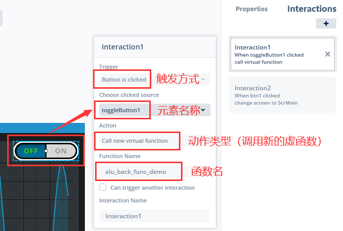

生成代码之后生成在对应文件下(当前,现在是空的)

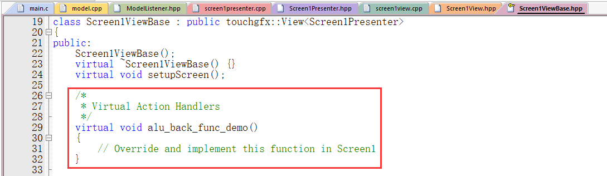

2. 然后在{XXX}view中添加虚函数,并在函数中使用presenter的指针

**{XXX}view.hpp**

```
virtual void alu_back_func_demo();
```

**{XXX}view.cpp**

```
void Screen1View::alu_back_func_demo()
{
	presenter->alu_back_test(toggleButton1.getState());
}
```

3. 回到presenter中创建该方法向model里传

**{XXX}presenter.hpp**

```
void alu_back_test(bool state);
```

**{XXX}presenter.cpp**

```
void Screen1Presenter::alu_back_test(bool state)
{
	model->alu_do_back_test(state);
}
```

4. 在model里设置控制后台内容的响应函数

**model.hpp**

```
void alu_do_back_test(bool state);
```

**model.cpp** 这里简单添加一个信号翻转的示例

```
void Model::alu_do_back_test(bool state)
{
#ifndef SIMULATOR
	if (state)
	{
		HAL_GPIO_WritePin(LED_GPIO_Port,LED_Pin,GPIO_PIN_SET);
	}
	else
	{
		HAL_GPIO_WritePin(LED_GPIO_Port,LED_Pin,GPIO_PIN_RESET);
	}
#endif
}
```

以上，便完成了从前端控制GPIO的过程（这个GPIO需要在CubeMX中设置一个，重命名为LED，PC13对应反客原理图上控制板载发光二极管的管脚）


