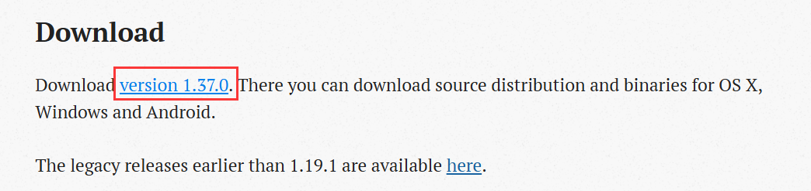
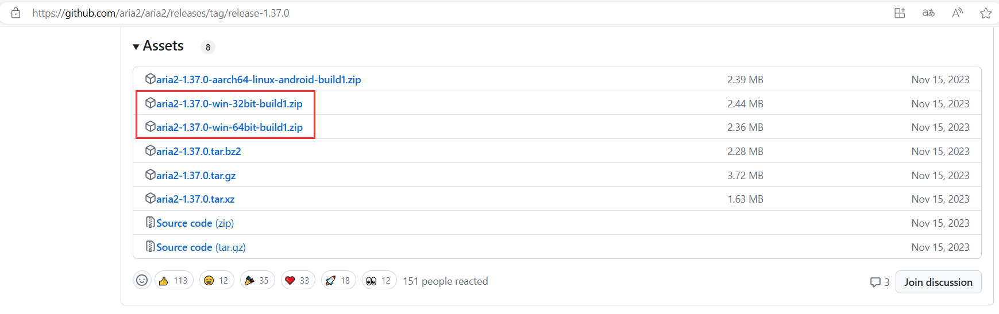
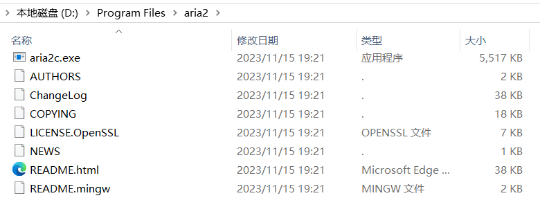
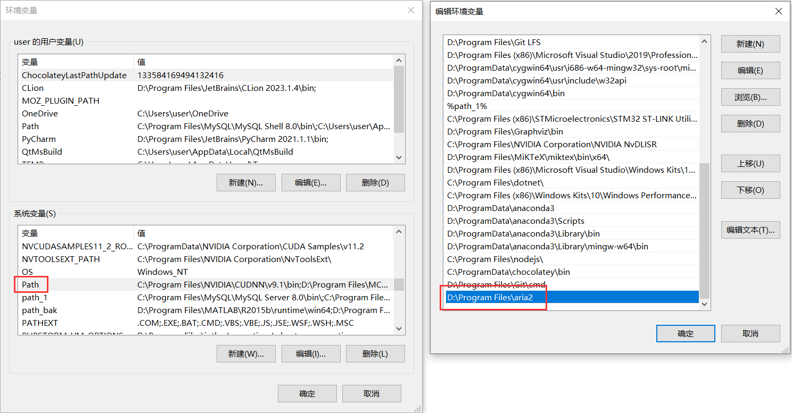
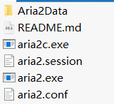
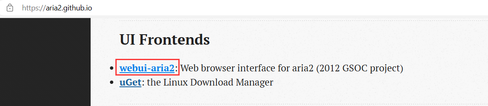
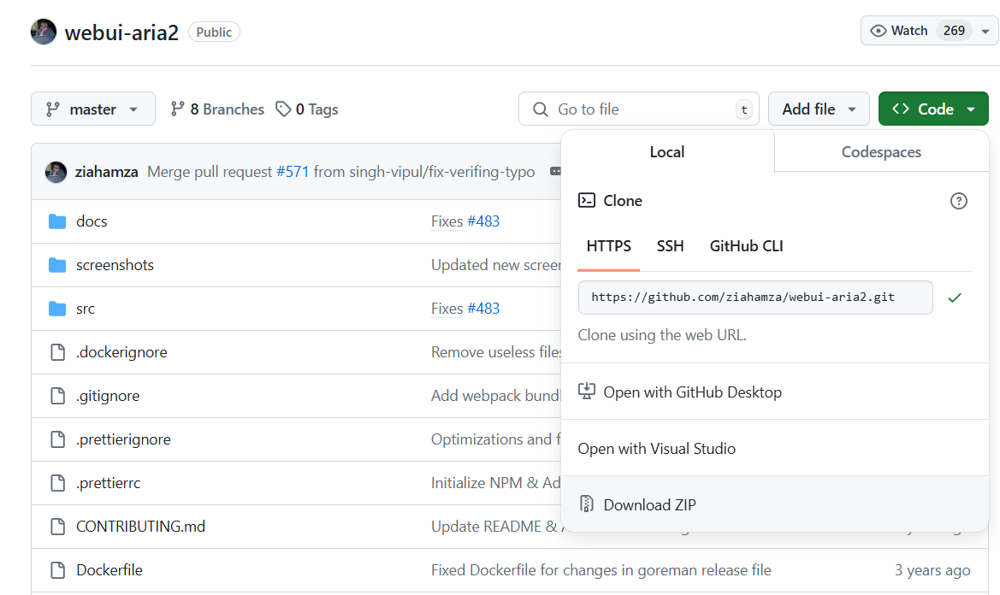
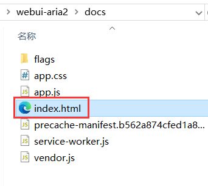
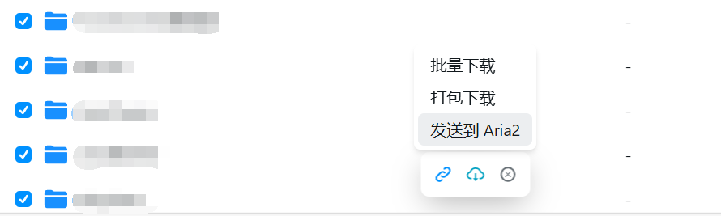
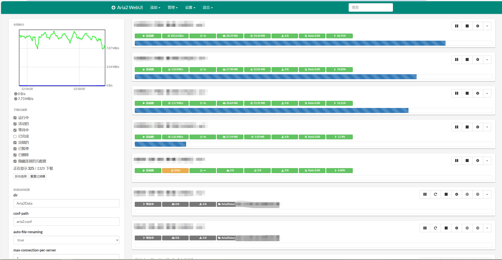

## Aria2的安装与使用

参考您的迅雷不允许你下载，以及度盘下载过慢

### 下载Aria2

先去[aria2官网](https://aria2.github.io/)，点击下载，并



进入github的[Release页](https://github.com/aria2/aria2/releases/tag/release-1.37.0)，点击下载



找一个文件夹解压，重命名（比如我这里是D:\Program Files\aria2）



并把文件添加到系统路径



### 配置Aria2

其实这时候就已经可以使用了，只需要在同名目录下创建并配置：

- aria2.conf           配置文件
- aria2.session     下载任务的会话文件

后执行以下代码启动，即可执行

```
aria2c.exe --conf-path=aria2.conf
```

但是以上内容需要写一大堆，我懒的写了，建议下载[Aria懒人配置包](https://aria2c.com/archiver/aria2.zip)

内部包括需要的配置文件和会话文件，多出来一个aria2.exe相当于执上面aria2c.exe命令的脚本，（想搞也可以自己创建，但我懒的整了）



至于配置参数，在aria2.conf里都有，主要修改一般只需要修改下面这几个就够了

```
# 文件的保存路径(可使用绝对路径或相对路径), 默认: 当前启动位置
dir=Aria2Data
# 最大同时下载任务数, 运行时可修改, 默认:5
max-concurrent-downloads=5
# 同一服务器连接数, 添加时可指定, 默认:1
max-connection-per-server=1
# 单个任务最大线程数, 添加时可指定, 默认:5
split=5
```

省流：**直接运行aria2.exe即可启动客户端**


### 配置aria2-webUI

但是命令行界面控制还是比较粗糙，回到[官网](https://aria2.github.io/)，找到下面的[webui-aria2](https://github.com/ziahamza/webui-aria2)



进入该项目，git clone 或下载压缩包



然后您下载之后，可以直接按照其说明

1. **启动aria2服务**

执行

```
aria2c.exe --enable-rpc --rpc-listen-all
```

或者直接启动

```
aria2.exe
```

2. **启动UI页面**

直接进入该项目下/doc/index.html，运行网页程序



即可启动页面，此时添加一些基于Alist驱动的公共网盘即可批量下载



至于这些网站在哪找，问别找，找别问



此贴暂时完结

还有[AriaNg](https://github.com/mayswind/AriaNg)这类非常牛逼的项目，但是以后有空再说吧，反正笔记挺多的

此贴使用的包，均可以在[此目录](https://github.com/AluminiumOxide/AluminiumOxide.github.io/download/aria2)下载