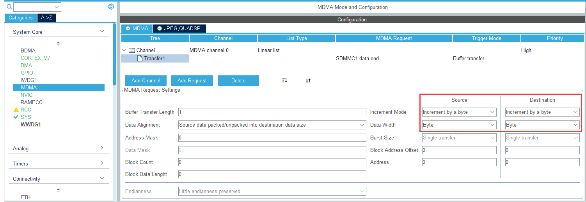
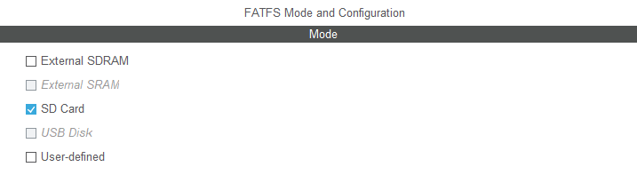
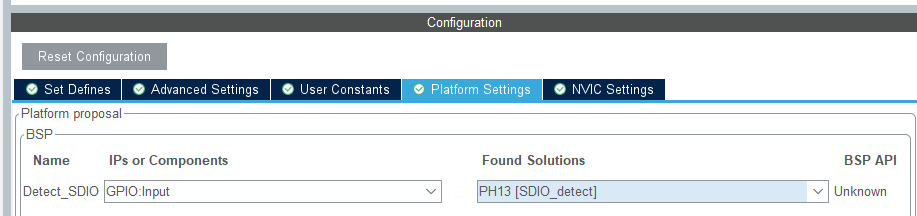

虽然但是目前的配置下，确实可以正常使用，但是为了使用，在此基础上再配置一些外设

## 4 添加FATFS

本来这个应该不能算作一个单独的章节的，但是由于这个750加了FreeRTOS之后太爱它的卡芙卡了，就单独出来一个独立的章节来说(误)

本章包括但不限于参考了以下他人的笔记：

> [STM32H743 用CubeMX 搭建 SDMMC+MDAM+FATFS+FreeRTOS 模板](https://blog.csdn.net/m0_55257015/article/details/120182101)
>
> [STM32H7 SDMMC+FATFS+USBMSC 虚拟U盘](https://blog.csdn.net/hjn0618/article/details/130383593)
>
> [STM32H7 SDMMC+FATFS+USBMSC+FREERTOS 虚拟U盘](https://blog.csdn.net/hjn0618/article/details/130486815)
>
> [STM32CubeMX FatFs文件系统使用（操作SD卡）](https://www.jianshu.com/p/28e79a0c85ff)
>
> [HAL库 CubeMX STM32采用SDIO实现对SD卡和NAND Flash的读写](https://blog.csdn.net/qq_42688853/article/details/136203827)
>
> [STM32L4，用CUBEMX生成代码，用了FREERTOS,DMA,FATFS,SDIO,FATFS用了信号量，有一个BUG，好多年了，新的库都还没改，忍不住](https://shequ.stmicroelectronics.cn/thread-631674-1-1.html)
>
> [STM32F7使用SDMMC外设移植FatFs遇到f_mount挂载成功，而f_open函数未运行的解决方法_f_open卡死](https://blog.csdn.net/Michael_3083/article/details/108054075)
>
> [紧急避坑！stm32cube+freertos+fatfs挂载正常, read等其他操作都返回错误3 not ready](https://cloud.tencent.com/developer/article/1734748)
>
> [STM32 和 FatFs 的硬故障](https://pcbartists.com/firmware/stm32-firmware/hard-fault-stm32-fatfs-solutions/?desktop_view=show)

### 4.1 freeRTOS修改

（再提一遍）由于笔者操作习惯，以及面向历史遗留的屎山代码编程，个人倾向于换成**CMSIS_v1**的版本


比如您使用CMSIS函数控制信号量，有时候编译报错只是函数版本不同，需要按照版本的不同修改成匹配您使用版本的函数：

| CMSIS_v1        | CMSIS_v2           |
| --------------- | ------------------ |
| osSemaphoreId   | osSemaphoreId_t    |
| osSemaphoreWait | osSemaphoreAcquire |

后文默认使用CMSIS_v1的函数

### 4.2 SDMMC配置

先选4bit的模式


捕获模式、节能模式、硬件流控制 和 外部收发器都忽略，默认给什么就是什么

#### 4.2.1 SDMMC clock divide factor 分频系数

1. 点开SDMMC看时钟树的排布，比如我这里SDMMC是锁相环1的DIVQ控制


2. 按照分频系数的提示，将频率压低到SD卡理论速度25MHz下，上面的分批系数设置为6，也就是对应240/(6*2)=20MHz

> 当然，实际上这个上限也是个软上限，10速卡说的是最少10MB而不是卡的最高速度
> 不过按照反客的例程，由于QSPI外部flash加载的缘故，建议分频系数尽量设置高一些（速度慢一些）（以及我没有测试进一步降低分频系数会不会使得Dcache正常工作，这部分内容之后再测）

#### 4.2.2 中断配置

使能SDMMC1全局中断，用于输出**sdmmc_dataend_trg**

（下图还有一个MDMA中断，那个是配置MDMA之后才有的，一会再配置）


#### 4.2.3 GPIO配置

GPIO按照自己的需求配置，我的板子就按照默认的来，引脚不用变动


然后H7这玩意在cubeMX里有一个极其呜呜伯的东西，**如果启动freertos的话，SDMMC默认使用DMA，但是这不会显示在你的SDMMC的配置中得到提示，你也无法在DMA里看到配置项**

因为对于H7来说，这玩意独立在**MDMA(Memory-to-Memory DMA)**中！！！

### 4.3 MDMA配置

MDMA相当于内存之间的直接访问，和DMA相比，不涉及外设

#### 4.3.1 SDMMC data end request

先添加请求，然后在MDMA请求中添加SDMMC1 data end数据传输结束事件


选择事件后将该MDMA通道的优先级改为最高（其实不改也行，反正也没配别的，没有冲突，仅建议开高）


点击该**变压器**（机翻笑话，你说的对，但是transformer是一款由炼丹人自主研发的异世界开放调参博彩游戏，您将在这里扮演一位调参小鬼，，，后面忘了），由于SDMMC设置的位宽是SD 4bit wide bus，因此在请求设置中，需要修改源和探的参数为：（但这个有没有必要还待考据）

增量模式：按Byte增 (即：按照4bit位宽增，这里只有bit、半字、字、双字，对应1,2,4,8数据长度)

数据宽度：Byte (4bit)



#### 4.3.2 中断配置

配置好了进NVIC扔给FreeRTOS的中断处理（最右面那列打勾，自动会把优先级压到freertos管理的中断控制区间(我这里是5-15，好吧，默认也是5-15)之内）

同时确保您的SDMMC中断也是开启状态


同时还需要注意一下freertos的全局中断优先级，在sys里选择（我使用的是TIM17，也就是**Time base TIM17 globa interrupt**的优先级一定要比FreeRTOS管理的5-15优先级高）


### 4.4 FatFS配置

再次建议FreeRTOS使用CMSIS_v1(因为FatFS中也会检测CMSIS版本，CMSIS_v2我之前遇到一堆问题)

对于FatFS，您可以理解为：SDIO(103系列)、SDMMC是后台逻辑，而FatFs是中间件，当年是跟着原子学的屎山（卧槽，原批）参考[他人的帖子](https://blog.csdn.net/Chuangke_Andy/article/details/108987394)，大概可以理解为：cubeMX这里自动帮我们按照SDMMC参数设置，自动配置了各种驱动层文件，以及ff.c中的各种f_xxx的接口，而不需要我们再进行配置，这里先不展开了


**FatFs是这样的，cubeMX只需要按默认配置就好了，而玩家们在这里整出来的bug可就多了......**

好的那么点开FatFs的SD Card，后面的大部分内容可以默认，不需要修改太多地方



##### 4.4.1 Set Defines


这里就不说各个参数含义了，反正选择后也有提示，有时间慢慢扒拉都能看懂

| 参数名                                 | 设置                                             |
| -------------------------------------- | ------------------------------------------------ |
| **USE_LABEL (Volume label functions)** | Enable                                           |
| CODE_PAGE (Code page on target)        | 改成中文                                         |
| USE_LFN (Use Long Filename)            | Enable with dynamic working buffer on the STACK. |
| MAX_SS (Maximum Sector Size)           | 疑似需要调大                                     |
| **FS_REENTRANT (Re-Entrancy)**         | **Enable  # 开了freertos必须把这玩意打开**       |

##### 4.4.2 advance setting

这个选项卡中的选项均没用，因为：**ᕕ(◠ڼ◠)ᕗ**

- 如果启用freertos，并按照前面配置设置（不过不配置SDMMC也没法点开FastFs中的SD Card这个选项）那么SDMMC已经被强制选上了**《并且不让你选别的》**
- 如果启用FreeRTOS，那么Use dma template也是默认开启的**《并且不让你选别的》**
- 使用板级支持包，默认已经开启了**《并且不让你选别的》**


##### 4.4.3 Platform setting

这个使能口其实选不选都可以，sd卡插入引脚检测，如果想配置，那就选一个引脚GPIO Input，然后绑定

如果插入了，这个引脚就会被拉低


实际上是无所谓的，关键是调不通也一般不会是这里的问题



#### 4.4.4 中断设置

中断这里也是离谱，如果你不配置MDMA，这个选项根本不显示！草！！！如果H7不配置之前的MDMA，cubeMX也不会提示你需要配置MDMA，然后f_mount就一直失败！


配置完generate code然后再touchGFX generate code

### 4.5 代码修改

把参数整理好之后在main添加代码，我这里写道alu_file.c和alu_file.h中了，反正之后都传gayhub，这里只列出主要代码，

#### 4.5.1 必要修改

sd_diskio.c

由于使用freertos默认开启DMA，并且SDMMC的MDMA使用4bit带宽（我其实没看懂，他们注释写的4byte？疑似书写错误）

激活SDMMC的DMA缓存维护 和 并且启用擦写缓冲区

```
#define ENABLE_SD_DMA_CACHE_MAINTENANCE  1
#define ENABLE_SCRATCH_BUFFER
```


#### 4.5.2 非必要修改（可忽略）

上面配完之后，f_xxx的函数就可以直接用了，至于后面这些应用层废料，反正网上一搜一堆

alu_file.h 是笔者自定义的宏和部分函数，之后在github上慢慢看，这里建议引入上面几个自定义宏

```C
extern FATFS    AluSD_FatFs;    // 文件系统对象
extern FRESULT  AluSD_statu;    // 操作结果

extern FIL	    AluFile;		// 文件对象
extern UINT 	AluFile_len;	//	数据长度

extern DIR      AluDir;         // 目录对象
extern FILINFO  AluFile_info;   // 文件结构体信息

void Alu_SD_mount(void);
void Alu_SD_write(BYTE WriteBuffer[],int Buffer_Size, const char* filename);
void Alu_SD_del_file(const char* filename);
```

忽略上述头文件的函数，这里再拿两个函数举例，复制到main文件头部（或者引入到main文件里）

```C
//	函数：FatFs_Check	功能：进行FatFs文件系统的挂载
void FatFs_Check(void)	//判断FatFs是否挂载成功，若没有创建FatFs则格式化SD卡
{
	BYTE work[_MAX_SS]; 
//	FATFS_LinkDriver(&SD_Driver, SDPath);  // 初始化驱动(但是实际上用不着，这个cubeMX的MX_FATFS_Init已经干了)
	AluSD_statu = f_mount(&AluFile,"0:",1);	//	挂载SD卡
	
	if (AluSD_statu != FR_OK)	//判断是否挂载成功	
	{
		AluSD_statu = f_mkfs("0:",FM_FAT32,0,work,sizeof work);		//格式化SD卡，FAT32，簇默认大小16K
	}
}

//	函数：FatFs_FileTest   功能：进行文件写入和读取测试
uint8_t  FatFs_FileTest(void)	//文件创建和写入测试
{
//FatFs 文件创建和写入测试
	BYTE 	WriteBuffer[] = "STM32H750_SD_test_汪!";	//要写入的数据
	UINT 	File_Num;		//	数据长度
	AluSD_statu = f_open(&AluFile,"0:FatFs_demo.txt",FA_CREATE_ALWAYS | FA_WRITE);	//打开文件，若不存在则创建该文件
	if(AluSD_statu == FR_OK)
	{
		AluSD_statu = f_write(&AluFile,WriteBuffer,sizeof(WriteBuffer),&File_Num);	//向文件写入数据
		if (AluSD_statu != FR_OK)	
		{
			f_close(&AluFile);	  //关闭文件	
			return ERROR;			
		}
	}
	f_close(&AluFile);	  //关闭文件	
	return SUCCESS;
}
```

main.c 在freertos启动前添加

```C
FatFs_Check();		    // 判断FatFs是否挂载成功，若没有创建FatFs则格式化SD卡
```

main.c 或 freertos.c的task中添加

```C
FatFs_FileTest();	// 文件创建和写入测试
```

即可完成文件系统挂载和读写测试


