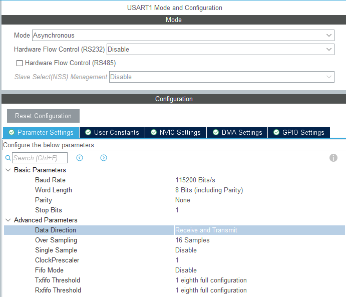
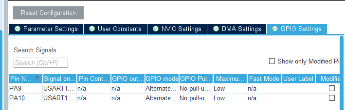
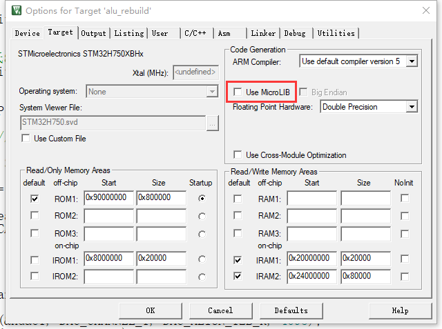
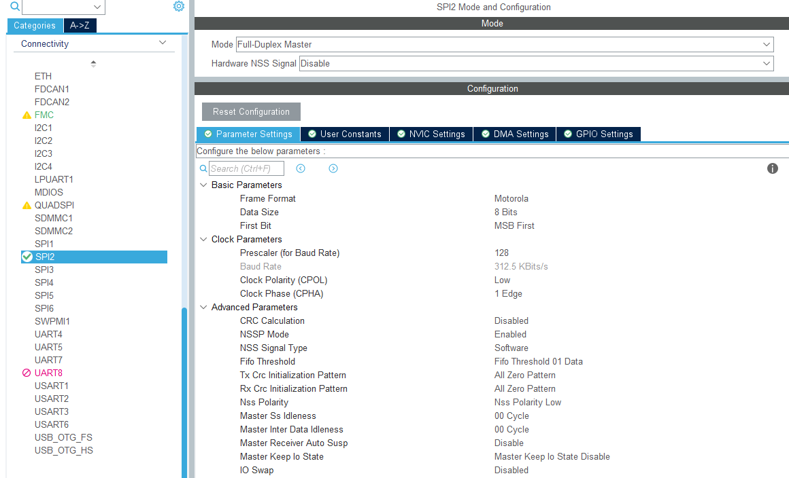
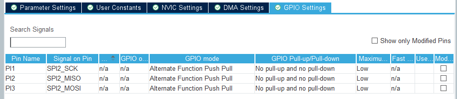
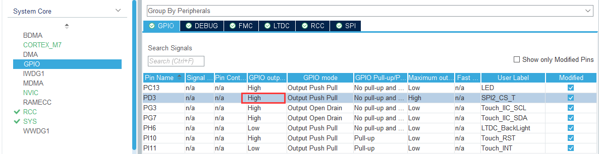
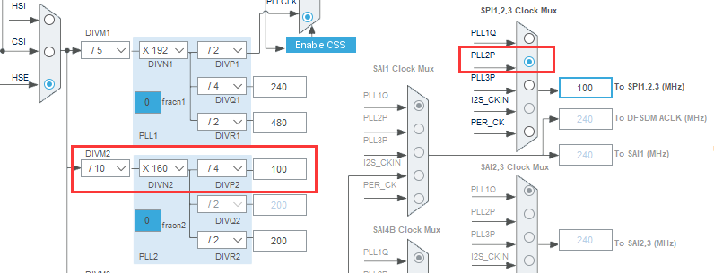
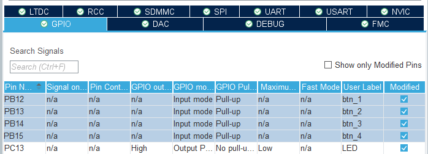
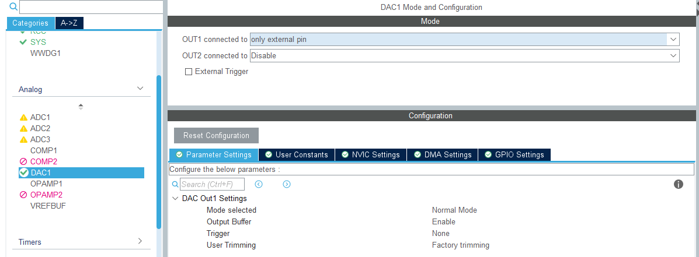
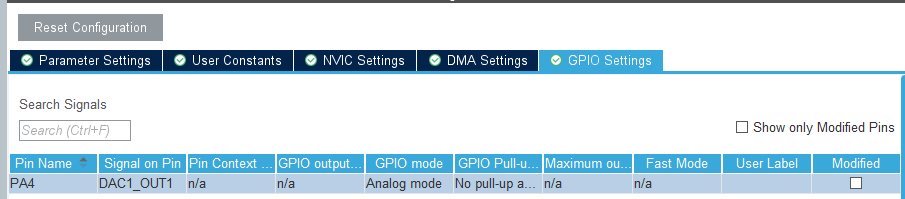

## 5 其他外设部分

这部分就不细说了，反正这类基础屎山网上一抓一大把，我写也是复制粘贴，你说的对，但是后面忘了

### 5.1添加USART

用于串口调试

注意：用了TouchGFX之后，串口可以开！但是printf千万别乱用！别用别用别用！会把FatFS卡住

#### 5.1.1 cubeMX配置

点开异步通信，没什么重要的波特率115200，8数据位，1校验位



然后修改GPIO到PA9和PA10



生成代码


#### 5.1.2 keil配置

为了不勾选MicroLIB还能正常使用（因为touchGFX是C++的你无法使用别的）



因此您需要在生成后的代码中，进行部分修改：

**usart.h**

```C
/* USER CODE BEGIN Includes */
#include "stdio.h"
```

**usart.c**

原理不细说了，参考[重定向理解_#pragma import(__use_no_semihosting)](https://blog.csdn.net/yqp1234564/article/details/122703142)

```C
/* USER CODE BEGIN 1 */ 

#pragma import(__use_no_semihosting)  // 关闭半主机模式
int _ttywrch(int ch)    
{
    ch=ch;
	return ch;
}         
struct __FILE 
{ 
	int handle; 

}; 
FILE __stdout;       

void _sys_exit(int x) 
{ 
	x = x; 
} 

int fputc(int ch, FILE *f)
{
	HAL_UART_Transmit(&huart1, (uint8_t *)&ch, 1, 100);	// 发送单字节数据
	return (ch);
}
```

补充：如果是AC6编译器请使用替换上述内容除了fputc()的所有内容

```C
// AC6编译器使用这段代码
__asm (".global __use_no_semihosting\n\t");
void _sys_exit(int x) 
{
  x = x;
}
//__use_no_semihosting was requested, but _ttywrch was 
void _ttywrch(int ch)
{
    ch = ch;
}
FILE __stdout;
```

然后就可以愉快地在task中添加printf了

```C
printf("STM32H750串口demo\r\n");
```


### 5.2 添加SPI

用于MAX6675通信

#### 5.2.1 CubeMX配置

这里就不用细说了,**全双工**,**8bit**的**MSB**,**128倍预分频值**(垃圾6675速度没法太快),其他的不用太管



GPIO口按照自身引脚需要设置，我这个就按默认来



回GPIO中设置片选引脚，默认高电平（但是实际上暂时并没有多个SPI，所以这个引脚就是个小卡乐咪)，不用管片选开始是不是关闭状态



还有一个是像之前一样配置SPI2,记得压低SPI的时钟



#### 5.2.2 keil配置

在keil项目中添加使用MAX6675的获得温度数据的方法，

**alu_temp.h**

```C
extern SPI_HandleTypeDef hspi2;    // 热电偶SPI通信
double alu_SPI_gettemp(void);
```

**alu_temp.c**

```C
double alu_SPI_gettemp(void)
{
		double temp_couple;        // 温度值
		uint16_t tmp;              // 临时值
// 开启片选
	  HAL_GPIO_WritePin(SPI2_CS_T_GPIO_Port, SPI2_CS_T_Pin, GPIO_PIN_RESET);
//  第1次读取数据(高8位)
		unsigned char txdata,rxdata;
		txdata = 0XFF;
		HAL_SPI_TransmitReceive(&hspi2,&txdata,&rxdata,1,1000);
		tmp = rxdata;
		tmp <<= 8;
// 第2次读取数据(低8位)
		HAL_SPI_TransmitReceive(&hspi2,&txdata,&rxdata,1,1000);		
		tmp |= rxdata;
// 关闭片选
		HAL_GPIO_WritePin(SPI2_CS_T_GPIO_Port, SPI2_CS_T_Pin, GPIO_PIN_SET);
		if (tmp & 4) {
			tmp = 4095; //未检测到热电偶
		} else {
			tmp = tmp >> 3;
		}
		temp_couple = tmp * 1024.0 / 4096 - 23.75;
		
		if (temp_couple >= 100)
			temp_couple = 100;
		else if (temp_couple <= 0)
			temp_couple = 0;
		
		return temp_couple;
}
```

**main.c**

```C
/* USER CODE BEGIN Includes */
#include "alu_temp.h"

/* USER CODE BEGIN 0 */
double K_Temperature;

/* USER CODE BEGIN 4 */
void AluMain(void *argument){
	for(;;) {    
        K_Temperature = alu_SPI_gettemp();
        printf("File %d: %s\n", i+1, sd_file_list.items[i]);
        vTaskDelay(pdMS_TO_TICKS(1000));
	}
}
```

### 5.3 添加GPIO

忙里偷闲，懒的说了，按键的配上就可以用



### 5.4 添加DAC

参考：[DAC接口使用（输出正弦波）](https://blog.csdn.net/qq_36347513/article/details/114940991)、[同相比例放大器 - 嘉立创EDA开源硬件平台、](https://oshwhub.com/Hatano/tong-xiang-bi-li-fang-tai-qi)、[LM741 参数+LM741 工作原理讲解](https://zhuanlan.zhihu.com/p/576978216)

用于输出自定义电流（之前计划和激光器的通信方式，在目前的项目中已弃置，但是配都配了，还是说一下吧）

#### 5.4.1 cubeMX配置

开启DAC



其他的不用调，添不添加DMA其实也无所谓了

然后GPIO为PA4输出



#### 5.4.2 keil配置

生成代码之后在main.c中添加DAC相关内容

引用hdac1

```C
/* USER CODE BEGIN 0 */
extern DAC_HandleTypeDef hdac1;
```

在task中使用

```C
/* USER CODE BEGIN 4 */
void AluSubProgress(void *argument)
{
	HAL_DAC_SetValue(&hdac1, DAC_CHANNEL_1, DAC_ALIGN_12B_R, 3000);
	HAL_DAC_Start(&hdac1,DAC_CHANNEL_1);
  for(;;){
    vTaskDelay(pdMS_TO_TICKS(20));
  }
}
```

设置0-4095 对应0-3.3V, 输出电压=3.3*(输入/4096)

后续使用LM741将0-3.3V,转0-5V，但是由于反正这个方法已经弃置了，那以后再补吧
