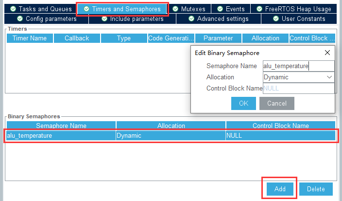
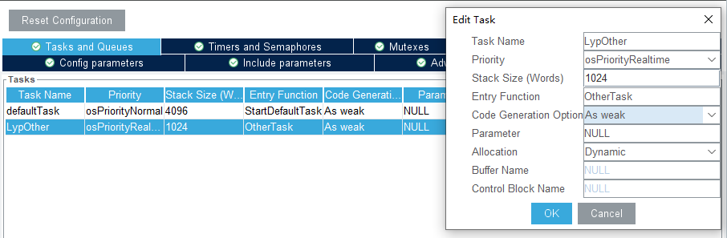
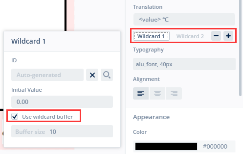
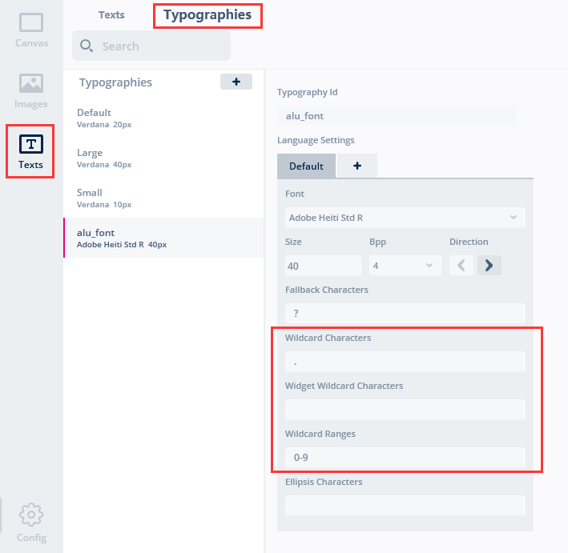
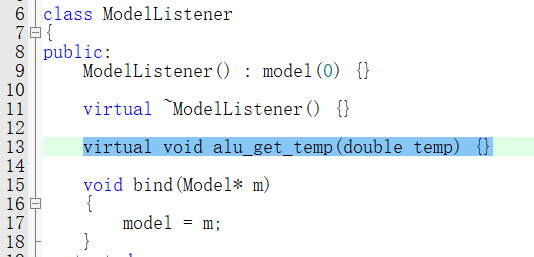

## 6 FreeRTOS与TouchGFX数据交互


### 6.1 FreeRTOS信号量>TouchGFX

之前只是在TouchGFX的前台和后台相互传递，并没有把RTOS和TOUCHGFX连成一个整体，这里来说一下使用信号量通信的方式

#### 6.1.1 FreeRTOS配置

创建二值信号量，重新生成代码：（名称自定义，动态分配），参考：[任务的创建与删除](https://blog.csdn.net/weixin_44793491/article/details/108186503)



以上配置后生成代码会在freertos.c中添加

```C
osSemaphoreId_t alu_temperatureHandle;
const osSemaphoreAttr_t alu_temperature_attributes = {
  .name = "alu_temperature"
};
```

创建一个task用于控制spi,个人建议都设置成弱函数(As weak),直接在main里搞定(懒的在freertos.c中来回引各种变量了)



| 参数名                 | 设置               | 描述                                             |
| ---------------------- | ------------------ | ------------------------------------------------ |
| Task Name              |                    | osThreadDef()和osThreadCreate()使用的临时名称    |
| Priority               | osPriorityRealtime | 任务优先级个人建议比给TouchGFX的Task优先级高     |
| Stack Size             | 1024               | Task栈的水位值(栈大小)（不够可能会导致Task卡死） |
| EntryFunction          |                    | Task的函数名（后面需要复写的函数名）             |
| Code Generation Option | As weak            | Task生成方式（是否使用弱函数）                   |
| Parameter              | NULL               | Task传入的参数/指针,一般为NULL                   |
| Allocation             | Dynamic            | Task创建方式（一般为动态创建）                   |

生成代码......

#### 6.1.2 TouchGFX配置

在TouchGFX界面中配置通配符并设置格式(如果是按照传文本的方式)



字体里同样要设置通配符都可能出现的类型,比如数值就只有0~9和小数点



然后回到CubeMX中再次配置

#### 6.1.3 keil编辑

**main.c**

在main.c中添加变量,并重写task **再补充一句：因为笔者使用的是CMSIS_v1，osSemaphoreId_t需要换成osSemaphoreId，model.cpp中也需要修改**

```C
/* USER CODE BEGIN 0 */
extern osSemaphoreId alu_temperatureHandle;
double K_Temperature = 0;
int temp_modify = 0;
```

main.c 中覆写的task（或者您的task没有些弱函数定义，那就在freertos.c中重写函数）

```C
/* USER CODE BEGIN 4 */
void OtherTask(void *argument)
{
/* Infinite loop */
  for(;;)
  {
		vTaskDelay(pdMS_TO_TICKS(250));  // 基础延时
		
		taskENTER_CRITICAL();		// 进临界区
		
		uint16_t tmp;
// 开启片选
	  HAL_GPIO_WritePin(SPI2_CS_T_GPIO_Port, SPI2_CS_T_Pin, GPIO_PIN_RESET);
//  第1次读取数据(高8位)
		unsigned char txdata,rxdata;
		txdata = 0XFF;
		HAL_SPI_TransmitReceive(&hspi2,&txdata,&rxdata,1,1000);
		tmp = rxdata;
		tmp <<= 8;
// 第2次读取数据(低8位)
		HAL_SPI_TransmitReceive(&hspi2,&txdata,&rxdata,1,1000);		
		tmp |= rxdata;
// 关闭片选
		HAL_GPIO_WritePin(SPI2_CS_T_GPIO_Port, SPI2_CS_T_Pin, GPIO_PIN_SET);
		if (tmp & 4) {
			tmp = 4095; //未检测到热电偶
		} else {
			tmp = tmp >> 3;
		}
		K_Temperature = tmp * 1024.0 / 4096 - 23.75 + temp_modify;

		osSemaphoreRelease(alu_temperatureHandle);
		
 	  taskEXIT_CRITICAL();	// 出临界区
  }
}
```

task内循环采集数据,为了保证采集数据，使用临界区防止其他task占用, 

中间相当于使用硬件SPI（和之前那个例程一样）

采集到K_Temperature之后 调用osSemaphoreRelease**为信号量添加一次许可**

**model.cpp**

头部加入需要的头文件, 并添加信号量和待传参数 **#ifndef SIMULATOR** 保证TouchGFX软件中的模拟代码不会冲突

```C
#ifndef SIMULATOR

#include "cmsis_os.h"
#include "main.h"
extern osSemaphoreId alu_temperatureHandle;
extern double K_Temperature;

#endif
```

在tick函数,哦不~方法中, 添加信号量检测代码(相当于每个次TouchGFX刷新都会更新一次代码)

注意:cmsis2不能用osSemaphoreWait**使用信号量一次许可**,得使用osSemaphoreAcquire,对于用户来说功能一样,参考 

> Semaphore:
>     - extended: maximum and initial token count
>         - replaced osSemaphoreCreate with osSemaphoreNew
>         - renamed osSemaphoreWait to osSemaphoreAcquire (changed return value)
>         - added: osSemaphoreGetName, osSemaphoreGetCount

该方法最终添加以下内容,将当前温度值传入modelListener的一个方法中

```C
#ifndef SIMULATOR
	if(osOK == osSemaphoreWait(alu_temperatureHandle,0))
	{
		if (K_Temperature >= 100)
			K_Temperature = 100;
		else if (K_Temperature <= 0)
			K_Temperature = 0;
		modelListener->alu_get_temp(K_Temperature);
	}
#endif
```

**ModelListener.hpp**

添加virtual void alu_get_temp(double temp) {}方法, 注意添加在public中




