## 6 FreeRTOS与TouchGFX数据交互


### 6.1 FreeRTOS信号量->TouchGFX

之前只是在TouchGFX的前台和后台相互传递，并没有把RTOS和TOUCHGFX连成一个整体，这里来说一下使用信号量通信的方式

#### 6.1.1 FreeRTOS配置

创建二值信号量，重新生成代码：（名称自定义，动态分配），参考：[任务的创建与删除](https://blog.csdn.net/weixin_44793491/article/details/108186503)

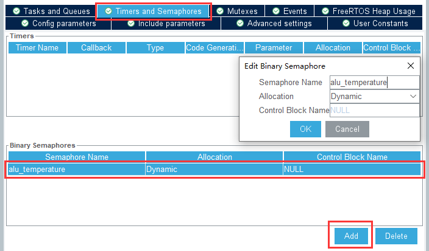

以上配置后生成代码会在freertos.c中添加

```C
osSemaphoreId_t alu_temperatureHandle;
const osSemaphoreAttr_t alu_temperature_attributes = {
  .name = "alu_temperature"
};
```

创建一个task用于控制spi,个人建议都设置成弱函数(As weak),直接在main里搞定(懒的在freertos.c中来回引各种变量了)

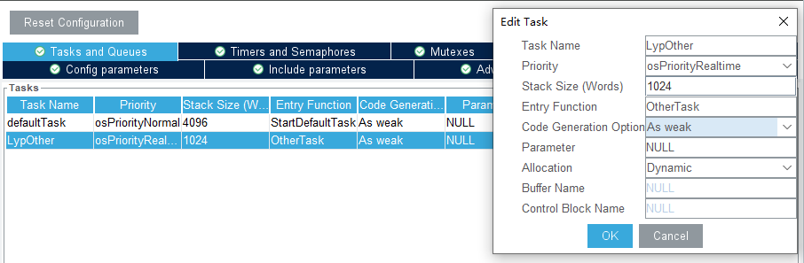

| 参数名                 | 设置               | 描述                                             |
| ---------------------- | ------------------ | ------------------------------------------------ |
| Task Name              |                    | osThreadDef()和osThreadCreate()使用的临时名称    |
| Priority               | osPriorityRealtime | 任务优先级个人建议比给TouchGFX的Task优先级高     |
| Stack Size             | 1024               | Task栈的水位值(栈大小)（不够可能会导致Task卡死） |
| EntryFunction          |                    | Task的函数名（后面需要复写的函数名）             |
| Code Generation Option | As weak            | Task生成方式（是否使用弱函数）                   |
| Parameter              | NULL               | Task传入的参数/指针,一般为NULL                   |
| Allocation             | Dynamic            | Task创建方式（一般为动态创建）                   |

生成代码......

#### 6.1.2 TouchGFX配置

**screen**

在TouchGFX界面中配置通配符并设置格式(如果是按照传文本的方式)

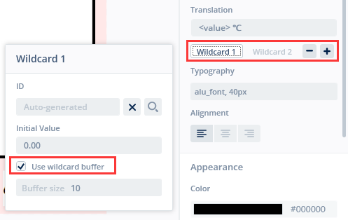

**text**

字体里同样要设置通配符都可能出现的类型,比如数值就只有0~9和小数点

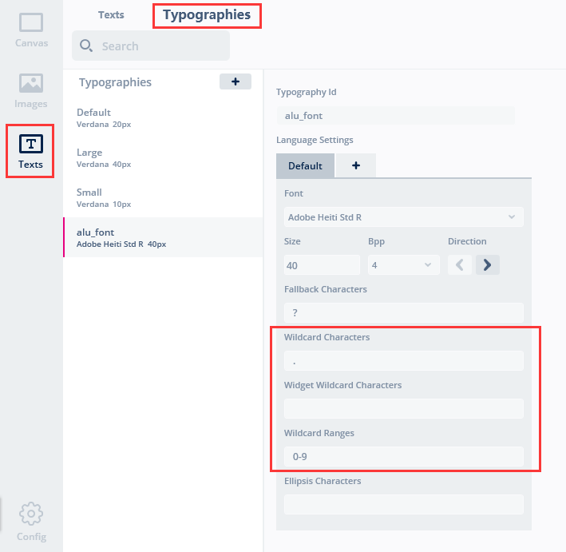

然后回到CubeMX中再次配置

#### 6.1.3 keil编辑

##### main.c

在main.c中添加变量,并重写task **再补充一句：因为笔者使用的是CMSIS_v1，osSemaphoreId_t需要换成osSemaphoreId，model.cpp中也需要修改**

```C
/* USER CODE BEGIN 0 */
extern osSemaphoreId alu_temperatureHandle;
double K_Temperature = 0;
int temp_modify = 0;
```

main.c 中覆写的task（或者您的task没有些弱函数定义，那就在freertos.c中重写函数）

```C
/* USER CODE BEGIN 4 */
void OtherTask(void *argument)
{
/* Infinite loop */
  for(;;)
  {
		vTaskDelay(pdMS_TO_TICKS(250));  // 基础延时
		
		taskENTER_CRITICAL();		// 进临界区
		
		uint16_t tmp;
// 开启片选
	  HAL_GPIO_WritePin(SPI2_CS_T_GPIO_Port, SPI2_CS_T_Pin, GPIO_PIN_RESET);
//  第1次读取数据(高8位)
		unsigned char txdata,rxdata;
		txdata = 0XFF;
		HAL_SPI_TransmitReceive(&hspi2,&txdata,&rxdata,1,1000);
		tmp = rxdata;
		tmp <<= 8;
// 第2次读取数据(低8位)
		HAL_SPI_TransmitReceive(&hspi2,&txdata,&rxdata,1,1000);		
		tmp |= rxdata;
// 关闭片选
		HAL_GPIO_WritePin(SPI2_CS_T_GPIO_Port, SPI2_CS_T_Pin, GPIO_PIN_SET);
		if (tmp & 4) {
			tmp = 4095; //未检测到热电偶
		} else {
			tmp = tmp >> 3;
		}
		K_Temperature = tmp * 1024.0 / 4096 - 23.75 + temp_modify;

		osSemaphoreRelease(alu_temperatureHandle);
		
 	  taskEXIT_CRITICAL();	// 出临界区
  }
}
```

task内循环采集数据,为了保证采集数据，使用临界区防止其他task占用, 

中间相当于使用硬件SPI（和之前那个例程一样）

采集到K_Temperature之后 调用osSemaphoreRelease**为信号量添加一次许可**

##### model.cpp

头部加入需要的头文件, 并添加信号量和待传参数 **#ifndef SIMULATOR** 保证TouchGFX软件中的模拟代码不会冲突

```C
#ifndef SIMULATOR

#include "cmsis_os.h"
#include "main.h"
extern osSemaphoreId alu_temperatureHandle;
extern double K_Temperature;

#endif
```

在tick函数,哦不~方法中, 添加信号量检测代码(相当于每个次TouchGFX刷新都会更新一次代码)

注意:cmsis2不能用osSemaphoreWait**使用信号量一次许可**,得使用osSemaphoreAcquire,对于用户来说功能一样,参考 

> Semaphore:
>     - extended: maximum and initial token count
>         - replaced osSemaphoreCreate with osSemaphoreNew
>         - renamed osSemaphoreWait to osSemaphoreAcquire (changed return value)
>         - added: osSemaphoreGetName, osSemaphoreGetCount

该方法最终添加以下内容,将当前温度值传入modelListener的一个方法中

```C
#ifndef SIMULATOR
	if(osOK == osSemaphoreWait(alu_temperatureHandle,0))
	{
		if (K_Temperature >= 100)
			K_Temperature = 100;
		else if (K_Temperature <= 0)
			K_Temperature = 0;
		modelListener->alu_get_temp(K_Temperature);
	}
#endif
```

##### ModelListener.hpp

添加virtual void alu_get_temp(double temp) {}方法, 注意添加在public中

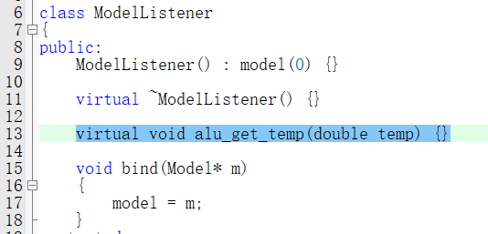

```
virtual void alu_get_temp(double temp);
```

##### Screen1Presenter.hpp

覆写该方法(其实这里virtual就可以不放了,反正没有子类继续override)

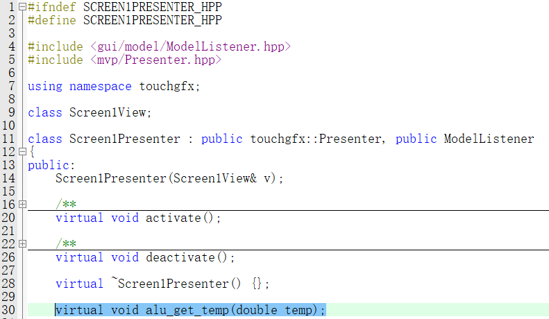

```
virtual void alu_get_temp(double temp);
```

##### Screen1Presenter.cpp

在源文件中将代码发送至对应view中:

```
void Screen1Presenter::alu_get_temp(double temp)
{
	view.alu_show_temp(temp);
}
```

##### Screen1View.hpp

在这里实现对应前台的方法(其实这里的virtual也可以不加)

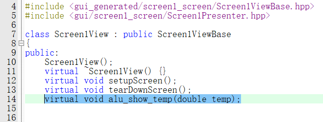

```
virtual void alu_show_temp(double temp);
```

##### Screen1View.cpp

源文件中实现先通过snprintf拼接至通配符,并且改变大小刷新内容

```c
void Screen1View::alu_show_temp(double temp)
{
	Unicode::snprintfFloat(tempArea1Buffer,TEMPAREA1_SIZE,"%.2f",temp);
	tempArea1.resizeToCurrentText();
	tempArea1.invalidate();
	// tempGraph1.addDataPoint((float)temp); 由于这里没说表格的事,那就当我没说吧
}
```

### 6.2 FreeRTOS信号量+动态列表->TouchGFX列表容器

好的~上面已经演示了如何直接传参,我们来说一下如何实例化容器,并使用一个char**二维数组给列表

看这个示例之前我强烈建议您参观:[列表布局 | TouchGFX Documentation](https://support.touchgfx.com/zh-CN/docs/development/ui-development/ui-components/containers/list-layout),此外,如果您仅是想传一个静态列表数据,请您直接在上连接看完后关闭本网页,也许您只需要网上被NDSX复制不下几十遍的屎山

本来代码部分应该后面讲,但是后面可能有涉及,那么先在前面说一下,现在有结构体

```c
typedef struct {   // 自定义动态文件列表
    char** items;  // 文件对象
    int size;      // 共有多少个文件
    int capacity;  // 数组容量
} AluDynList;    
```

以及函数

```c
void Alu_list_init(AluDynList* list);                       // 实例化动态列表
void Alu_list_add(AluDynList* list, const char* fileName);  // 为动态列表添加元素
void Alu_list_del(AluDynList* list, int index);             // 为动态列表删除元素
void Alu_sniff_files(AluDynList* list, const TCHAR *sniff_path);  // 遍历根目录文件
```

在alu_file.c中实现, 具体实现方法建议参考代码

使用举例:

```c
AluDynList sd_file_list;            // 实例化(算了不要在意细节)
/*......*/
Alu_list_init(&sd_file_list);       // 初始化
Alu_sniff_files(&sd_file_list,"/"); // 遍历根目录
/*创建与删除特定文件*/
Alu_list_add(&sd_file_list, "example.txt");
Alu_list_add(&sd_file_list, "sd.txt");
Alu_list_add(&sd_file_list, "alu.txt");
Alu_list_del(&sd_file_list,0);                           // 删除第1个
Alu_list_del(&sd_file_list,(int)(sd_file_list.size-1));  // 删除最后1个
Alu_list_del(&sd_file_list,(int)(sd_file_list.size-1));  // 删除最后1个
/*串口打印*/
for (int i = 0; i < sd_file_list.size; i++) {  
	printf("File %d: %s\n", i+1, sd_file_list.items[i]);
}
```

#### 6.2.1 FreeRTOS配置

由于我们打算在屏幕加载的时候触发这个函数,因此在切换屏幕后再执行就可以,与此相关的信号量暂时只有alu_screen,动态创建并重新生成代码

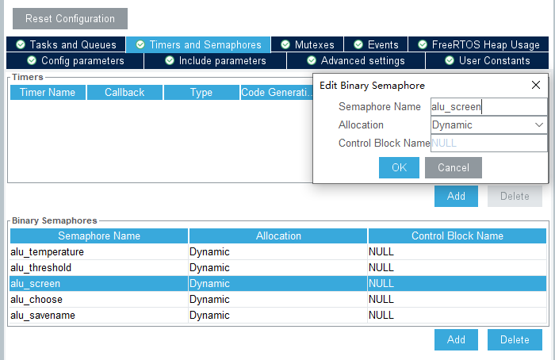

对应的任务也别忘记创建

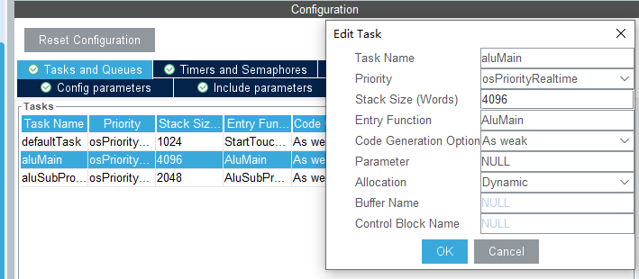

在任务中执行以下语句发送信号量:

```
osSemaphoreRelease(alu_screenHandle);
```

#### 6.2.2 TouchGFX配置

**Screen**

首先在touchGFX页面的一个页面上创建:滑动容器类和列表布局,并且讲列表布局塞到滑动容器类里面

这里其实创不创建滑动容器都一样,只不过我们是一个动态的char**二维数组,有多少个文件要显示不确定,因此最好是像示例中一样加载一个滑动窗口以免超出边界

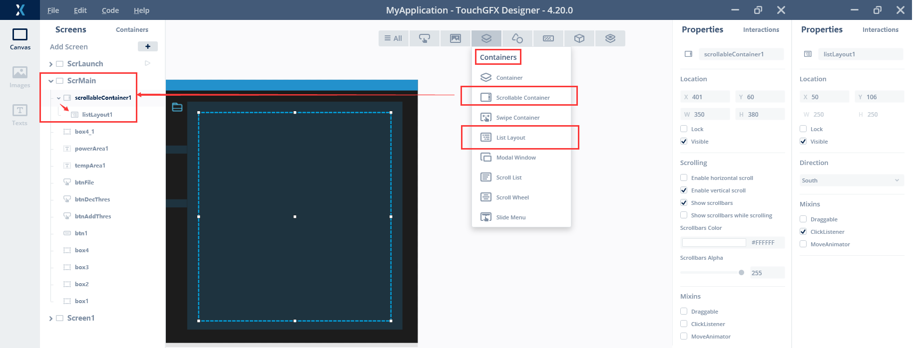

至于说listlayout和scrollablecontainer的参数,位置\可见\方向什么的暂时先不展开了(反正这种东西网上一抓一大把)

**container**

如果您按照TouchGFX的Listlayout例程里只想展示一些简单的元素,那其实可以不管这个,但是如果创建的列表对象元素比较复杂,那么还是建议使用容器实现

创建容器对象(和页面对象同级),这里创建了名为**FileNameContainer**的容器对象并且包含一个文本区域和边界框,文本区域中添加通配符,可以把文件名再拉大点,我这里纯属是百度当年抽风的字符长度是这个也写的14

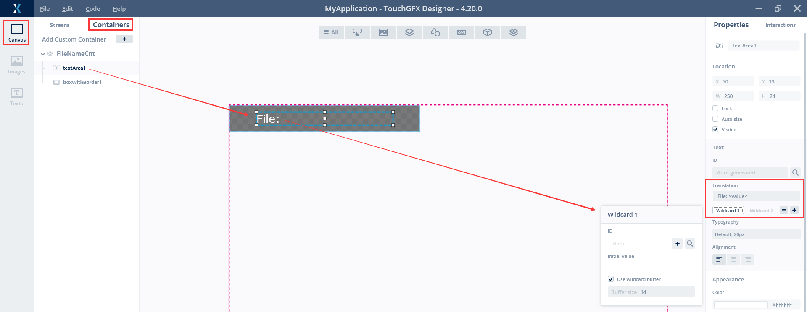

生成代码

#### 6.2.3 keil编辑

来到重点部分

##### main.c 

这里内容忽略了,动态数组将文件都存储之后,发送信号量就可以

#####  model.cpp

同上,引入文件

```C++
#ifndef SIMULATOR

#include "cmsis_os.h"
#include "main.h"

extern osSemaphoreId alu_screenHandle;         // 屏幕切换信号量
extern int           index_screen;             // 屏幕索引
extern AluDynList    sd_file_list;             // 文件列表

#endif
```

然后在void Model::tick()犯法内

```C++
	else if(osOK == osSemaphoreWait(alu_screenHandle,0)) // 更新页面
	{  
		modelListener->alu_to_screen(index_screen,&sd_file_list);
	}
```

##### model.hpp

由于这次的类型是自定义的,如果想传参,还需要引入这个结构体

```C++
#ifndef SIMULATOR
extern "C" 
{         
	#include "alu_file.h"
}
#else
	typedef struct {   // 自定义动态文件列表
		char** items;  // 文件对象
		int size;      // 共有多少个文件
		int capacity;  // 数组容量
	} AluDynList;  
#endif
```

我知道这样很不优雅,但是笨比TouchGFX的模拟器在模拟时无法看到keil这些目录的代码,因此必须加上条件编译宏,如果是物理场景直接引用头文件,如果是模拟器引用一个现定义的结构体

需要注意,引入头文件,如果后续要使用函数,必须得加入**extern "C"**, 否则没法正常使用(虽然这个例子不涉及,但是下一个例子涉及)

##### ModelListener.hpp

```C++
virtual void alu_to_screen(int index_screen, AluDynList* list) {}
```

##### {XXX}Presenter.hpp

需要注意! 这里{xxx}并不是SrcMain,srcMain的是往别的页面跳的!!!

包括但不限于创建的**ScrLaunch**还是**Screen1**

```C++
void alu_to_screen(int index_screen, AluDynList* list);
```

##### {XXX}Presenter.cpp

```C++
void XXXPresenter::alu_to_screen(int index_screen, AluDynList* list)
{
	view.alu_change_screen(index_screen, list);
}
```

##### {XXX}view.hpp

```C++
void alu_change_screen(int index_screen, AluDynList* list);
```

##### {XXX}view.hpp

```C++
void XXXView::alu_change_screen(int index_screen, AluDynList* list)
{
	if (index_screen==0){  // 跳转到ScrMain页面
		 application().gotoScrMainScreenNoTransition();
	}
}
```

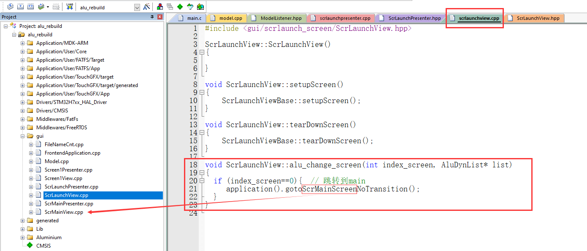

一切造物的工已经完毕,无疑之日已至......抱歉串台了,咱们继续

##### ScrMainView.hpp

好的那么现在回来了!那么刚才的跳转是为了什么呢?

为了触发页面启动方法**void ScrMainView::setupScreen()**

我们为了实现,首先引入FileNameCnt容器对象,并实例化为页面元素listElements

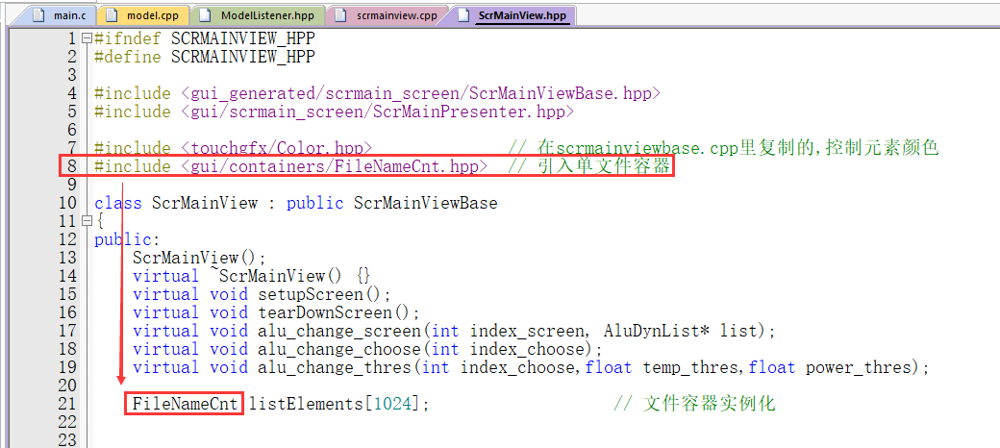

```C
#include <gui/containers/FileNameCnt.hpp>
FileNameCnt listElements[1024];
```

  但是这时候这个页面元素是空的,还需要手动添加内容,添加部分,就是在setupScreen() 方法内部实现的

##### ScrMainView.cpp

其实这里有点不礼貌了,其实不推直接拿全局变量来, 还是建议能传参的一个个都传参来view这面

(没错,你直接拿全局变量甚至都不用些presenter那些函数,信号量直接到view也可以)

```C++
#ifndef SIMULATOR
	extern AluDynList sd_file_list;   // 文件列表
#endif
```

然后就是页面启动函数中

```C++
void ScrMainView::setupScreen()  
{
    ScrMainViewBase::setupScreen();
    
	listLayout1.setHeight(0);
	for (int i = 0; i < sd_file_list.size; i++) {
		printf("File %d: %s\n", i+1, sd_file_list.items[i]);
		listElements[i].add_list(sd_file_list.items[i]);
		listLayout1.add(listElements[i]);
	}
}
```

listLayout1先将高度清空,

反复调用listElements的add_list方法,传入char*数组就可以了.......了?...哎???,这个方法哪来的?

##### FileNameCnt.hpp

当然是手动定义的,我们可以自定义页面的方法,也当然可以自定义容器的方法

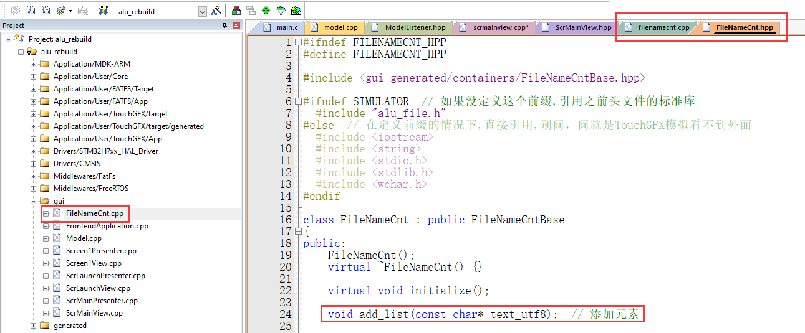

```C
void add_list(const char* text_utf8); 
```

##### FileNameCnt.cpp

然后是......算了,自己看注释吧,NDSC真的是一点也别想靠得住

```C++
/*
妈的傻逼TouchGFX它的字符全是unicode字符，直接传char*会乱码，需要传wchat_t*
因此需要使用<stdlib.h>因此会合usart.c中的重定向代码冲突,草!
传入UTF-8编码的字符串(char*)      char*    text_utf8  =  "data123"; 
转换UTF-16 的宽字符串(wchar_t*)   wchar_t* text_utf16 = L"data123"; 
使用snprintf转换进入给textArea1Buffer,刷新
*/
void FileNameCnt::add_list(const char* text_utf8)
{
    size_t len = mbstowcs(NULL, text_utf8, 0);
	wchar_t* text_utf16 = (wchar_t*)malloc((len + 1) * sizeof(wchar_t));
	mbstowcs(text_utf16, text_utf8, len + 1);
    touchgfx::Unicode::snprintf(textArea1Buffer,TEXTAREA1_SIZE,"%s",text_utf16);  
    textArea1.resizeToCurrentText();
    invalidate();
}
```

那么,这样就可以实例化列表了

### 6.3 动态列表<-TouchGFX列表容器

那么在上一节已经说了从task发信号修改TouchGFX页面元素的实现流程

这次来说一下TouchGFX的容器触发事件,返回内容修改

注意,如果您仅为了让页面元素触发事件的话,大可以放弃这一部分去看前面的**2.7节**,这里强调使用容器对象的事件

好的那么这次没有freeRTOS的配置,直接从TouchGFX开始

#### 6.3.1 TouchGFX配置

**screen**

那么这次还是原来的屏幕

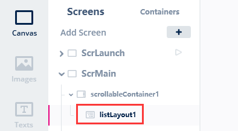

 **container**

在6.2节的container之上,为FileNameCnt加入了两个按钮,并替换图标(实际上只用到了btnDelete, btnOpen暂时还没加功能,反正都是一个意思,以后再说)

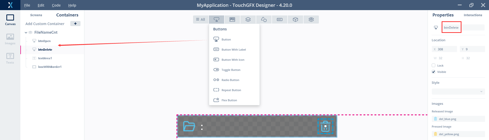

同时为该按键添加交互,并设置一个虚函数

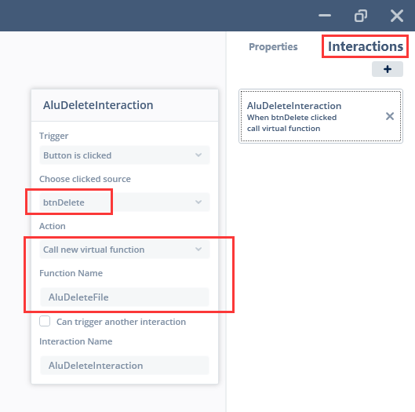

**生成代码......**

会在容器的同名基类中生成AluDeleteFile()虚函数,且源文件没有实现,按照提示:

> Override and implement this function in CustomListElement

需要后续在容器类中覆写

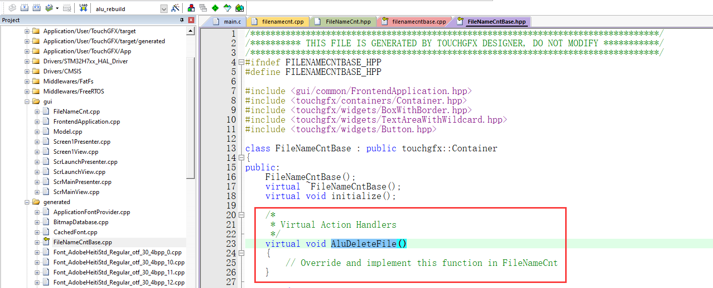

PS: 在基类中,会使用 回调函数声明+回调处理程序声明 调用该函数(这部分不细说了)

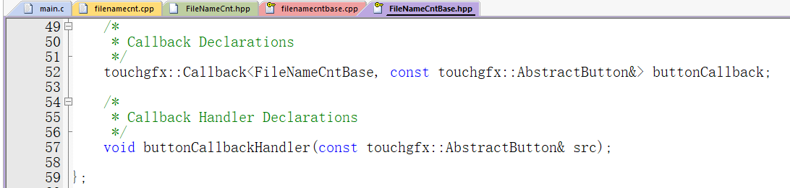

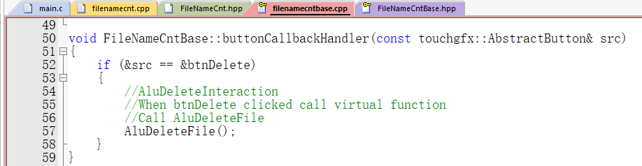

#### 6.3.2 keil编辑(回调相关)

好的,那么我们来回忆一下现在都有什么:

1个窗口类  1个容器类  1个容器基类

现在需要

- 在 容器类中 创建与基类相关的方法 和 与窗口类相关的方法
- 在 窗口类中 创建回调容器来相关的方法

实现起来大概是这个流程（这里的方法都是泛指的）：

- **1.声明回调函数**
    - 位于xxxview

    - BoxClicked()以及BoxClickedHandler

- **2.定义与初始化**
    - 位于xxxview构造函数实例化时添加初始化列表

- **3.将回调函数与控件进行绑定**
    - xxxview::setupScreen

    - xxx容器.setclickAction(BoxClickedHandler)

- **4.实现后续逻辑功能**
    - xxxview::BoxClicked()

    - 内部实现逻辑


##### FileNameCnt.cpp/hpp

在容器类中声明并实现**与基类相关的回调方法(红色)** 和 **与窗口类相关的回调方法(绿色)** 和 **与窗口类相关的回调对象(粉色)**

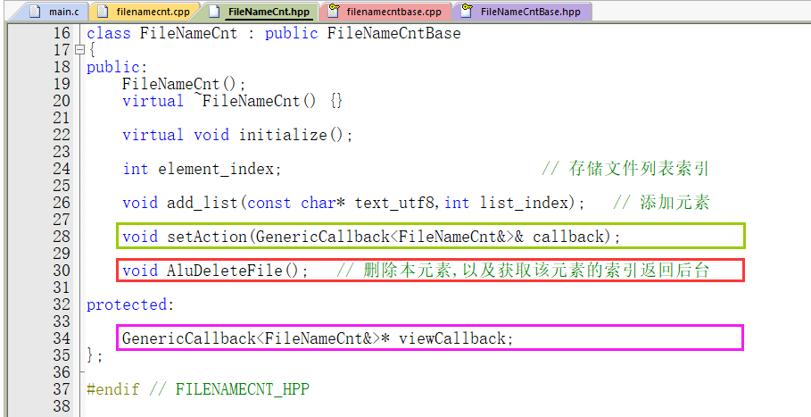


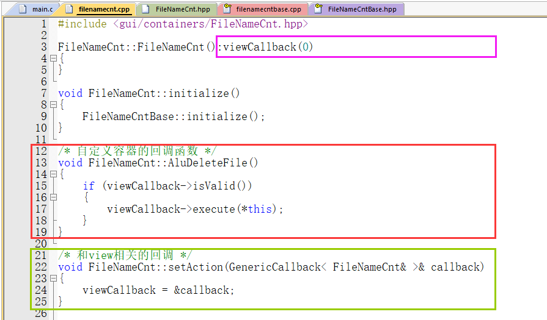

**与基类相关方法的内容与解释**

```C++
void CustomListElement::deleteAction()
{
    if (viewCallback->isValid())
    {
        viewCallback->execute(*this);
    }
}
```

viewCallback->isValid()                     检查回调函数是否已经初始化

viewCallback->execute(*this)         调用成员函数。除非isValid()返回true，否则不要调用execute方法。(即：指向对象和函数的指针已设置)。

**与窗口类相关方法的内容与解释**

> viewCallback定义在头文件受保护属性中（上方粉色框部分）
>
> 是一个GenericCallback<FileNameCnt&>*类型，
>
> 即：指向GenericCallback类型的指针，接受FileNameCnt类型的引用作为参数

```C++
GenericCallback<FileNameCnt&>* viewCallback;
```

在另一个自定义的方法中实现（上方绿色框部分）

```C++
void FileNameCnt::setAction(GenericCallback< FileNameCnt& >& callback)
{	
    viewCallback = &callback;
}
```

对于**viewCallback**的**列表初始化**，下面再说


##### ScrMainView.cpp/hpp

实例化窗口对象，类中定义了

属性 listCntClickCallback

方法 listCntClick()

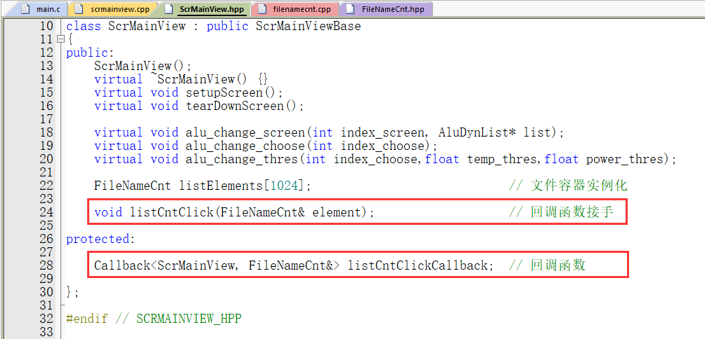

先实例化该方法

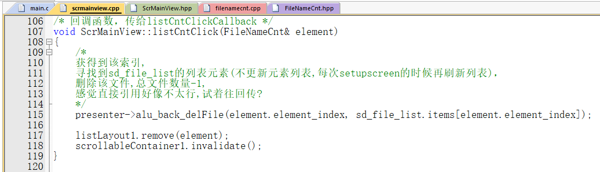

还需要实例化**listCntClickCallback**, 这里涉及到一些**初始化列表**的内容,参考:[c++中的初始化列表详解](https://blog.csdn.net/lws123253/article/details/80368047)、[C++的初始化列表和列表初始化](https://www.jianshu.com/p/19d5b1a39160)

> 当一个类使用另一个类进行构造时，可以省去另一个类重新构造的过程
>
> 此外必要的时候
>
> 1. **常量**成员，因为常量只能初始化不能赋值，所以必须放在初始化列表里面
> 2. **引用**类型，引用必须在定义的时候初始化，并且不能重新赋值，所以也要写在初始化列表里面
> 3. **没有默认构造函数的类**，因为使用初始化列表可以不必调用默认构造函数来初始化，而是直接调用拷贝构造函数初始化

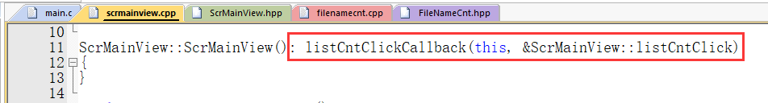

目的：**将listCntClick函数与当前对象(ScrMainView)绑定，以便在回调时调用该函数**

等效于直接在头文件里

```C++
// Callback that is assigned to each list element
Callback<ScrMainView, FileNameCnt&> listCntClickCallback{this, &ScrMainView::listCntClick};
```

总之表示：

在创建MainView对象时，listElementClickedCallback也会被按照这个格式初始化

**然后**

对容器类的对象listElements里的每个元素，添加刚才实例化的回调函数listElementClickedCallback

**最后**

在MainView::listElementClicked方法中执行操作

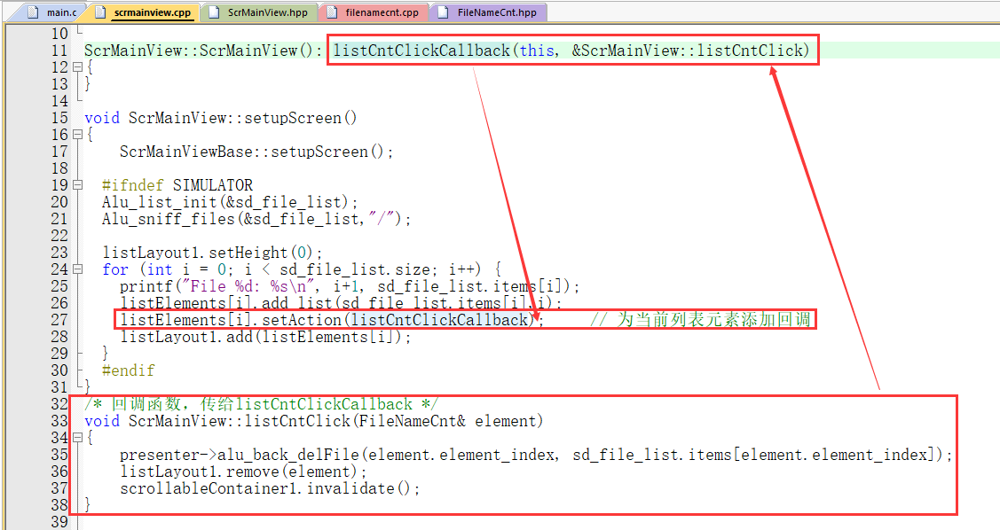


#### 6.3.3 keil编辑(堆料实现)

好的，完成上面那一打编辑，我们终于啊终于是：在触发元素时从 AluDeleteFile()  触发到 listCntClick()

也就是说我们编辑ScrMainView中的listCntClick方法就可以了

##### FileNameCnt.cpp/hpp

那么首先需要解决的是不知道列表元素的索引是几的问题：

我也不知道怎么获取列表容器的第几个元素，因此索性直接在容器中加一个元素element_index记录索引

并且在add_list对象中添加一个参数，使用该参数为element_index赋值

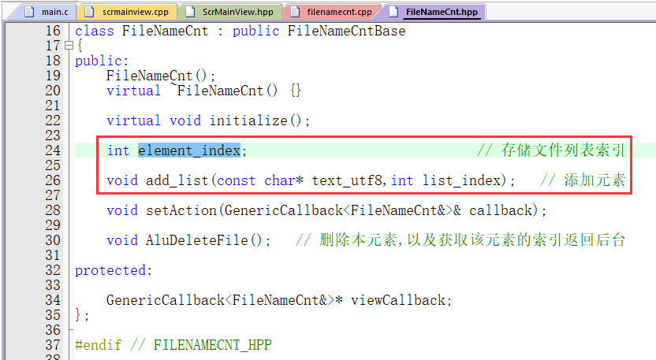

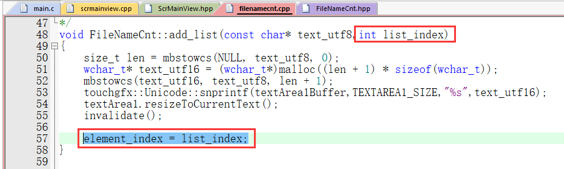

##### ScrMainView.cpp/hpp

容器实例化还是老样子

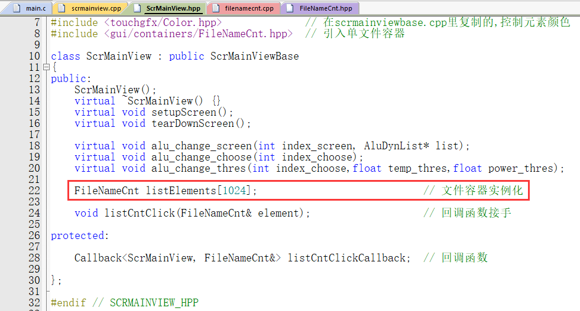

```
FileNameCnt listElements[1024];
```

页面初始化的代码也再放一遍，相比于上例更改了add_list参数和setAction

```C++
void ScrMainView::setupScreen()  
{
    ScrMainViewBase::setupScreen();
	#ifndef SIMULATOR
	Alu_list_init(&sd_file_list);
	Alu_sniff_files(&sd_file_list,"/");
	listLayout1.setHeight(0);
	for (int i = 0; i < sd_file_list.size; i++) {
		printf("File %d: %s\n", i+1, sd_file_list.items[i]);
		listElements[i].add_list(sd_file_list.items[i],i);
		listElements[i].setAction(listCntClickCallback);     // 为当前列表元素添加回调
		listLayout1.add(listElements[i]);
	}
	#endif
}
```

然后就是上面也提过的回调函数，这里因为直接传当前容器本身，可以直接访问改容器对象的各个参数

```C++
void ScrMainView::listCntClick(FileNameCnt& element)
{
		presenter->alu_back_delFile(element.element_index, sd_file_list.items[element.element_index]);
    listLayout1.remove(element);
    scrollableContainer1.invalidate();
}
```

相当于element.element_index是索引

sd_file_list.items[element.element_index]是索引对应的字符串


理论上在这里直接执行对应的文件删除函数就可以了，但是推荐再走一遍流程（重复内容不细说了）

##### ScrMainpresenter.hpp

```
virtual void alu_back_delFile(int file_index,const char * file_name);
```

##### ScrMainpresenter.cpp

```
void ScrMainPresenter::alu_back_delFile(int file_index,const char * file_name)
{
	model->alu_do_back_delFile(file_index, file_name);
}
```

##### model.hpp

嗯，前向是走ModelListener，反向是走model

前面需要添加引用结构体和外部函数的代码

```C++
#ifndef SIMULATOR
extern "C" 
{         
	#include "alu_file.h"
}
#else
	typedef struct {   // 自定义动态文件列表
		char** items;  // 文件对象
		int size;      // 共有多少个文件
		int capacity;  // 数组容量
	} AluDynList;  
#endif
```

并添加方法

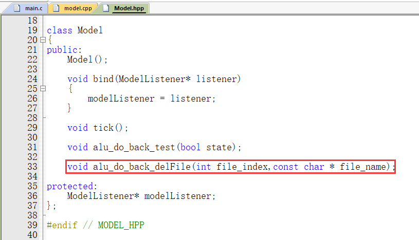

```
void alu_do_back_delFile(int file_index,const char * file_name);
```

##### model.cpp

```C++
void Model::alu_do_back_delFile(int file_index,const char * file_name)
{
#ifndef SIMULATOR
	printf("remove: %d ",file_index);
	printf("File: %s\n", file_name);
	Alu_SD_del_file(file_name);
#endif
}
```

以上，完毕
