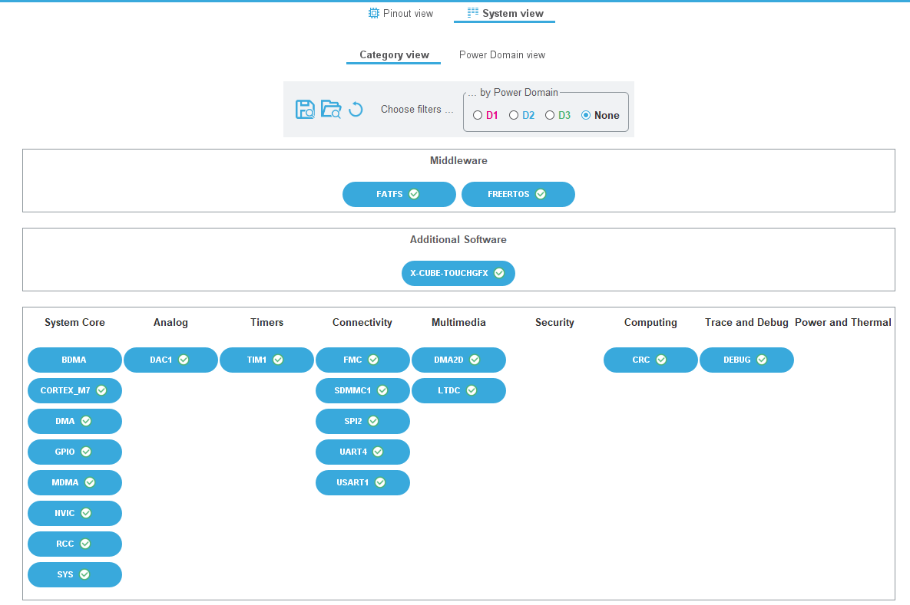
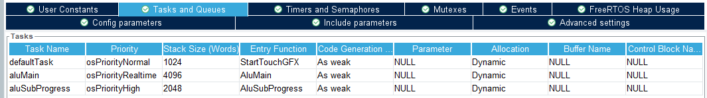
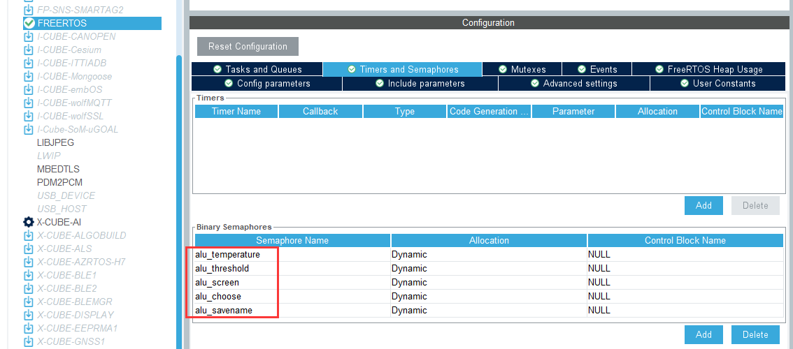
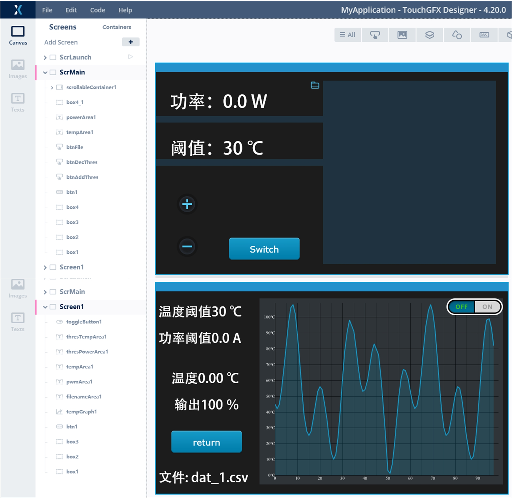
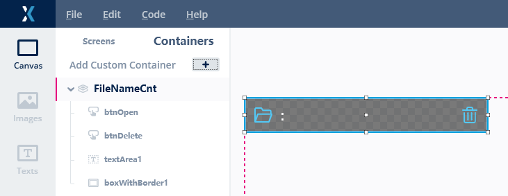
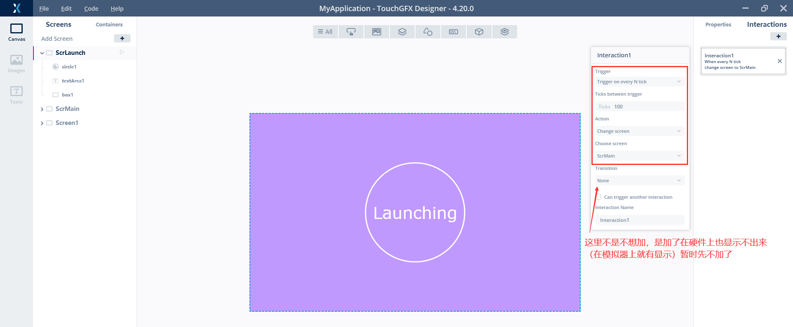
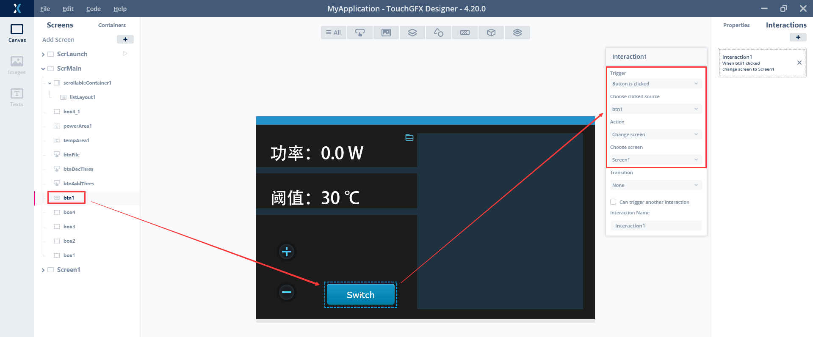
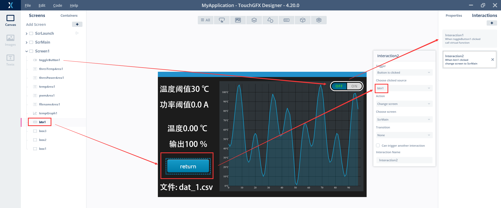
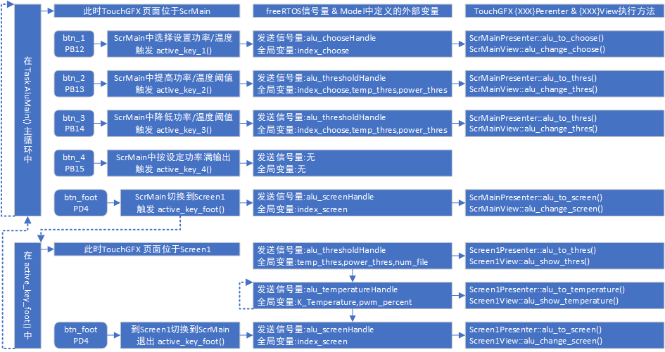
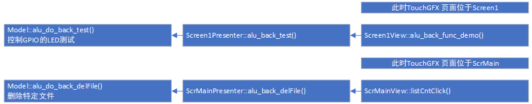

好的那么这一篇是番外篇，梳理一下按照目前配置的前后端交互

- USART4、PWM：MAX3485 控制激光器
- SPI2：MAX6675采集温度

因此现在包括但不限于



### FreeRTOS

**创建线程**



- StartTouchGFX给touchGFX的线程管理器，进touchgfx_taskEntry()再进HALSDL2::taskEntry()等待VSYNC
- AluMain作为主线程
- AluSubprogress本意是处理储存相关内容，实则没有用上

为了防止溢出，均调大了堆栈大小，并且为了直接再main里调，都用了弱函数。

**创建信号量**

用于片内与前面板通信



- alu_chooseHandle              选择是温度还是功率

- alu_temperatureHandle    温度设置信号量
- alu_thresholdHandle         阈值设置信号量
- alu_screenHandle              屏幕切换信号量
- alu_savenameHandle       保存文件名信号量

### TouchGFX

**创建页面**



- ScrLaunch为启动页，纯静态页面可跳过
- ScrMain为参数配置页
- Screen1为信息采集页面

**创建容器**



FileNameCnt按照FatFS遍历文件得到的结构体，在ScrMain页的scrollableContainer1显示文件

**创建交互**

SrcLaunch

创建屏幕切换交互，只要时间到了就换（跳转到SrcMain）



SrcMain

创建屏幕切换交互，由屏幕上的虚拟控件



Screen1

一个Toggle button应该是在前面的帖子已经说了，这里就不展开了

同时还有一个button用于触发页面切换



注：以上的这3个展开的都是不带回调函数的（ToggleButton添加了回调函数，但之前的章节已经介绍过，这里就不展开了）

### keil

先看一下前向信号逻辑，一会随时回来看



即：主线程中反复查看按钮状态，后执行逻辑并发送信号量，touchGFX收到信号量后执行对应页面的presenter和view的方法

然后是后向信号逻辑



包含两个页面元素触发的内容，一个是在Screen1中控制GPIO（之前也说过），一个是ScrMain中删除文件系统中特定文件

#### main.c

引用部分：添加外部文件

```C
/* USER CODE BEGIN Includes */
#include "touch_800x480.h"
#include "alu_file.h"
#include "alu_temp.h"
#include "alu_control.h"
/* USER CODE END Includes */
```

全局变量定义部分：sd_file_list这个结构体在alu_file.c中介绍

```C
/* USER CODE BEGIN 0 */
extern osSemaphoreId alu_chooseHandle;         // 选择是温度还是功率
extern osSemaphoreId alu_temperatureHandle;    // 温度设置信号量
extern osSemaphoreId alu_thresholdHandle;      // 阈值设置信号量
extern osSemaphoreId alu_screenHandle;         // 屏幕切换信号量
extern osSemaphoreId alu_savenameHandle;       // 保存文件名信号量
extern SPI_HandleTypeDef hspi2;
extern DAC_HandleTypeDef hdac1;


double K_Temperature   = 0;        // 温度值  0-150
float  pwm_percent     = 0;        // pwn比例 0-1000（实际上0~999更恰当,但是不影响）
int    temp_modify     = 0;        // 温度偏移 +0或+10
float  temp_thres      = 30;	   // 温度阈值 0-150
float  power_thres     = 0;        // 功率阈值 0-9.0

int    index_screen    = 2;        // 屏幕切换 0为SrcMain,1为Screen1,2为launch
int    index_choose    = 1;        // 阈值选择 0为调整温度阈值,1为调整功率阈值

AluDynList sd_file_list;           // 动态文件列表
int    num_file        = 0;        // 当前待创建文件索引
/* USER CODE END 0 */
```

main函数开始：此代码仅为了与外部flash进行QSPI通信，非750可删

```C
  /* USER CODE BEGIN 1 */
	SCB->VTOR = 0X90000000;       /* Vector Table Relocation in SDRAM */
  /* USER CODE END 1 */
```

main初始化部分：

```C
  /* USER CODE BEGIN 2 */
	Touch_Init();	    // 触摸屏初始化	
	Alu_SD_mount();     // 检测SD卡挂载
  /* USER CODE END 2 */
```

后将覆写的Task放置于main函数后：

```C
/* USER CODE BEGIN 4 */
void StartTouchGFX(void *argument){...}
void AluMain(void *argument){...}
void AluSubProgress(void *argument){...}
/* USER CODE END 4 */
```

对于**StartTouchGFX()**和**AluSubProgress()**就不细说了

```C
void StartTouchGFX(void *argument)
{
	MX_TouchGFX_Process();	// 交给TouchGFX的HALSDL2::taskEntry()等待VSYNC
  for(;;){
    vTaskDelay(pdMS_TO_TICKS(1000));
  }
}
```

对于**AluMain()**展开讲一下

AluMain的初始化部分：这个好说，直接看注释吧

```C
	// 1. 控制激光器,停止激光输出
	HAL_GPIO_WritePin(flag_485_GPIO_Port,flag_485_Pin,GPIO_PIN_SET);
	uint8_t alu_485_send[] = {0x55, 0x33, 0x01, 0x02, 0x00, 0x00, 0x00, 0x03, 0x00, 0x0D};
	HAL_UART_Transmit(&huart4,(uint8_t*)alu_485_send,10,0xFFFF);
	HAL_GPIO_WritePin(flag_485_GPIO_Port,flag_485_Pin,GPIO_PIN_RESET);
	// 2. 开启PWM
    HAL_TIM_PWM_Start(&htim1, TIM_CHANNEL_4);
	__HAL_TIM_SET_COMPARE(&htim1, TIM_CHANNEL_4, 1); // 0~999
	// 3. 遍历根目录文件到结构体 sd_file_list
	Alu_list_init(&sd_file_list);     // 初始化文件列表
	Alu_sniff_files(&sd_file_list,"/");  // 遍历根目录
	for (int i = 0; i < sd_file_list.size; i++) {
        printf("File %d: %s\n", i+1, sd_file_list.items[i]);
	}
	// 4. 坚定跟随华为sleep(5)的步伐，页面从ScrLaunch跳转到ScrMain
    vTaskDelay(pdMS_TO_TICKS(1000));
	index_screen = 0;
	osSemaphoreRelease(alu_screenHandle);  // 发送屏幕切换信号量更新,切换到SrcMain,更新文件列表
```

AluMain的循环部分：

```C
  for(;;)
  {
		vTaskDelay(pdMS_TO_TICKS(50));
	  
		btns_statu = btn_sniff_pressed();
	  
		if (btns_statu>0){
			printf("btn pressed %ld\n", btns_statu);
		}
		switch (btns_statu) {
		case 1: // 按键1
			index_choose = active_key_1(index_choose); // 选择设置功率还是温度
			break;
		case 2: // 按键2 提高阈值	
			active_key_2(index_choose, &temp_thres, &power_thres);   // 提高阈值
			break;
		case 4: // 按键3 降低阈值
			active_key_3(index_choose, &temp_thres, &power_thres);   // 降低阈值
			break;
		case 8: // 按键4 输出功率调节
			active_key_4(&huart4, &htim1, alu_485_send, power_thres);
			break;
		case 16: //脚踏
			active_key_foot(alu_485_send,temp_thres, power_thres);
			break;	
		}
  }
```

然后在各个函数里处理逻辑


