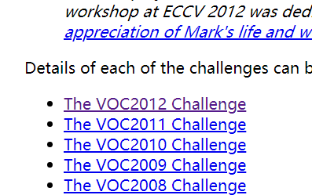
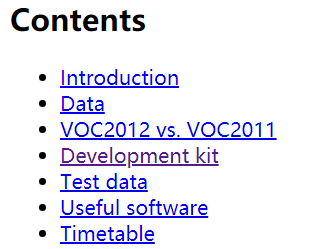
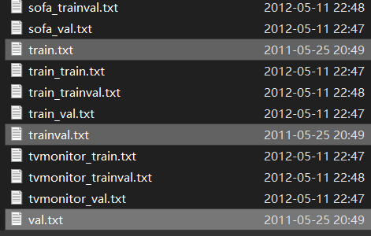
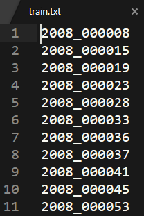
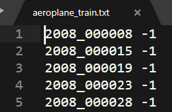

[](http://host.robots.ox.ac.uk/pascal/VOC/)

进入网址后进入[The VOC2012 Challenge](http://host.robots.ox.ac.uk/pascal/VOC/voc2012/index.html)/[Development kit](http://host.robots.ox.ac.uk/pascal/VOC/voc2012/index.html#devkit)/ [training/validation data](http://host.robots.ox.ac.uk/pascal/VOC/voc2012/VOCtrainval_11-May-2012.tar) 下载文件

- 
    
- 
    
- 
    

解压后\\VOCdevkit\\VOC2012下文件目录如下所示

1. voc数据集结构
2. └── VOCdevkit     #根目录
3.     └── VOC2012   #不同年份的数据集，这里只下载了2012的，还有2007等其它年份的
4.         ├── Annotations         **\# 存放xml文件，与JPEGImages中的图片一一对应，解释图片的内容等等**
5.         ├── ImageSets            #该目录下存放的都是txt文件，txt文件中每一行包含一个图片的名称，末尾会加上±1表示正负样本
6.         │   ├── Action # 人的行为动作图像信息
7.         │   ├── Layout # 人的各个部位图像信息
8.         │   ├── Main **\# 目标检测图像分类信息**
9.         │   └── Segmentation # 目标分割图像信息
10.         ├── JPEGImages         **#存放源图片**
11.         ├── SegmentationClass  #存放的是图片，语义分割相关（类别）
12.         └── SegmentationObject #存放的是图片，实例分割相关（目标）

其中主要用的是main文件夹下 其中train val trainval是对所有物体来说的



其中

- train.txt 含有5717个训练集
- val.txt 含有5823个测试集
- trainval是上面两个文件合起来

文件内容大致如下



其他文件是不同类的训练集和测试集，在每张图片后面都有-1 0 1 图片对应于\\VOC2012\\JPEGImages\\文件夹下的文件

- 1表示对应图片内该物体明显
- 0表示对应图片内该物体不明显
- \-1表示对应图片中没有该物体



在Annotation文件夹中存放了每张图片对应的标注xml文件，拿第一个举例子

```
<annotation>
	<folder>VOC2012</folder>
    数据集
	<filename>2007_000027.jpg</filename>
   文件名
	<source>
      源文件来源
		<database>The VOC2007 Database</database>
		<annotation>PASCAL VOC2007</annotation>
		<image>flickr</image>
	</source>
	<size>
                             文件宽高深度（RGB都是3位，要是灰度就是1位）
		<width>486</width>
		<height>500</height>
		<depth>3</depth>
	</size>
	<segmented>0</segmented>
    是否被分割过
	<object>
  一个检测目标有一个<object>
		<name>person</name>
   类别
		<pose>Unspecified</pose>
 前景背景
		<truncated>0</truncated>
 是否被截断
		<difficult>0</difficult>
 检测难易程度
		<bndbox>
             边界框（左上右下）
			<xmin>174</xmin>
			<ymin>101</ymin>
			<xmax>349</xmax>
			<ymax>351</ymax>
		</bndbox>
		<part>
            身体部分的位置信息
			<name>head</name>
			<bndbox>
				<xmin>169</xmin>
				<ymin>104</ymin>
				<xmax>209</xmax>
				<ymax>146</ymax>
			</bndbox>
		</part>
		<part>
			<name>hand</name>
			<bndbox>
				<xmin>278</xmin>
				<ymin>210</ymin>
				<xmax>297</xmax>
				<ymax>233</ymax>
			</bndbox>
		</part>
		<part>
			<name>foot</name>
			<bndbox>
				<xmin>273</xmin>
				<ymin>333</ymin>
				<xmax>297</xmax>
				<ymax>354</ymax>
			</bndbox>
		</part>
		<part>
			<name>foot</name>
			<bndbox>
				<xmin>319</xmin>
				<ymin>307</ymin>
				<xmax>340</xmax>
				<ymax>326</ymax>
			</bndbox>
		</part>
	</object>
</annotation>
```

一般流程是读main的train.txt,把每一行都读取，解析xml文件，再找对应图片
