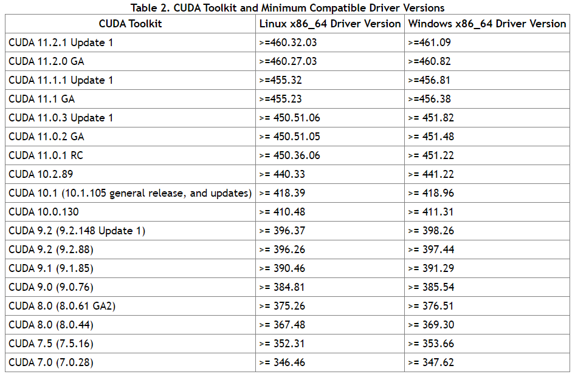

在安装cuda前，注意你能否安cuda不是根据NVIDIA的这个[GPU支持表](https://developer.nvidia.com/cuda-gpus)来的，能安什么版本cuda是按照你的驱动程序版本来的（详细打开NVIDIA面板的系统信息，显示里面的驱动程序版本）

比如上面这个图的驱动程序版本是417.35

然后查询[cuda版本](https://docs.nvidia.com/cuda/cuda-toolkit-release-notes/index.html)

看上面这个表，cuda从上向下兼容，所以说我当前cuda版本是只能安装cuda10.0的，但是mmdetection2.7对应的mmcv轮子只有9.2、10.1、10.2、11+，那这时候只能先更新驱动了

所以先去[更新驱动](https://www.nvidia.cn/geforce/drivers/)

选择自己的型号搜索，并点击最新的下载

下载好后解压临时文件安装显卡驱动，至于GeForce Experience安不安和都没事，反正我这渣XM150带不动游戏，直接精简安装就行

- 
    
- 
    
- 
    

随后根据对应的版本下载对应的cuda，上NVIDIA直接找[cuda工具包](https://developer.nvidia.com/cuda-toolkit-archive)，选择想用的版本下载，除非对网络及其有自信，不然尽量选择本地安装

重复和安装驱动一样的步骤

- 
    
- 
    
- 
    

不过这次

一定要选择自定义安装！

一定要选择自定义安装！

一定要选择自定义安装！

只勾选第一个cuda，并不安装后面的主目录所有软件！！！（至于我又安装了Geforce无视也可以）

其次在cuda的目录下不用安装 Visual Studio Integration！这个不取消大概率安装失败！（[想安装的具体可以参考这里](https://zhuanlan.zhihu.com/p/144311348)）并且下面Nsight System和Nsight Computer也不用安装，这俩和用cuda跑mmdetection没关系（尽管我点了）

NVIDIA我祝你身体健康，万事如意！

安装完打开命令行输入 nvcc -V 看看有没有，网上一大堆人说需要环境变量，但是不知道为啥我的环境变量在安装时就自动添加了，那就没我事了

然后来下载cudnn，找到[这里](https://developer.nvidia.com/rdp/cudnn-download)，大概率让你注册一个NVIDIA账号，反正也不绑定手机，拿一个邮箱注册就行（不过听说QQ邮箱不行，而且我的outlook邮箱也不行，但是谷鸽邮箱很快就收到信息了，别人说163也行，没有测试过）

- 
    
- 
    
- 
    

NVIDIA我祝你身体健康！！！

注册后点击同意选择版本即可（我选的10.2），如果想安装老版本，可以点击Archived cuDNN Releases进入老版本cudnn的下载界面

下载下来后是一个压缩包，解压后得到三个文件夹

复制这三个文件到cuda的安装目录下，一般的目录都是这个（其他版本的除了名字换了都一样） C:\\Program Files\\NVIDIA GPU Computing Toolkit\\CUDA\\v10.2

在C:\\Program Files\\NVIDIA GPU Computing Toolkit\\CUDA\\v10.2\\extras\\demo\_suite路径下打开cmd（或powershell）

运行.\\deviceQuery.exe

能正常显示如下结果说明安装成功（我已经看不下去了，XM150的2G储存过于鸡肋(ㄒ口ㄒ)）

