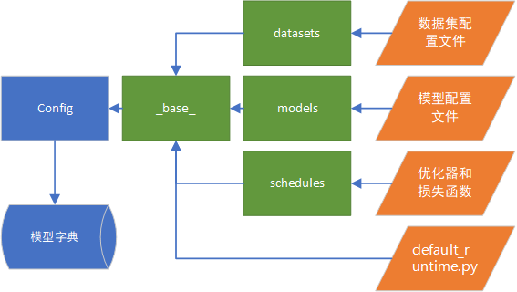
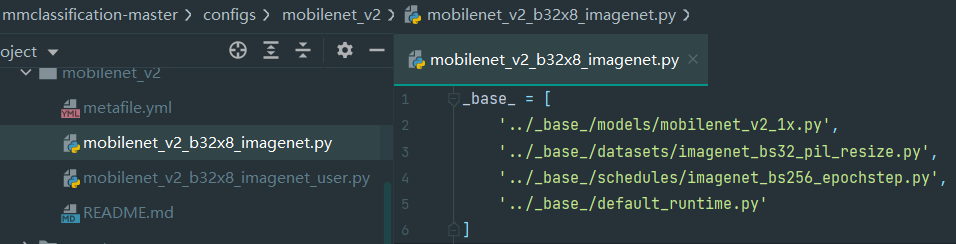
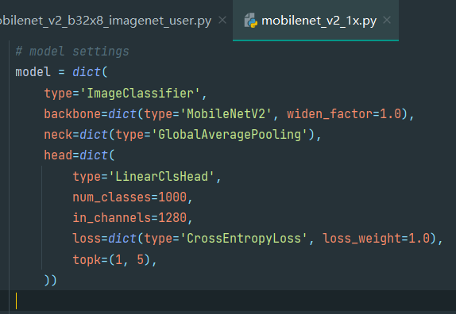
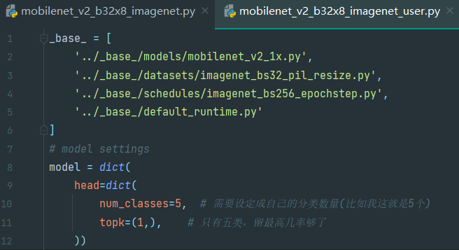

默认看到这篇文章时已把自己的数据配置成ImageNet数据集格式，如果没有配置可以回到这篇文章（或者您已下载好ImageNet数据集）

http://aluminium/allophane.com/index.php/2021/07/06/mmclassification\_mobilenetv2\_1\_pretreat/

下面开始配置config文件，众所周知，openmmlab是字典组成的，模型大概构成为以下结构

基本每个模型都是调用以上几个字典文件组成对应模型的字典，然后进行训练的，这些配置好的文件储存在configs文件夹下除了\_base\_的其他目录，本篇文章使用的MobileNetv2也是同理，如下图所示

不过建议，不要在原本的config下改，建议建立用户的config文件，以便后续更改，如上图该学渣在原config基础上建立了一个\_user 后缀的config文件  
下面开始更改

首先是models文件需要改分类数量，以及更改前n最大概率（因为只有5类，分完之后top5一定是100%，就只保留top1）上左图是base/models下的字典，右图是自己的config文件中更改内容，之后三个字典内容不再详述，下面列出代码，请自行在config中追加。

_\# model settings  
_model = _dict_(  
    head=_dict_(  
        num\_classes=5,  _\#_ _需要设定成自己的分类数量__(__比如我这就是__5__个__)  
_        topk=(1,),    _\#_ _只有五类，留最高几率够了  
_    ))

数据集更改部分，可适当调整samples\_per\_gpu和workers\_per\_gpu

_\# dataset settings_
dataset\_type = 'ImageNet'
data = _dict_(
    samples\_per\_gpu=16,
    workers\_per\_gpu=1,
    train=_dict_(
        type=dataset\_type,
        data\_prefix='data/cervical\_biopsy/train',   _\# 数据集路径
        # ann\_file='data/imagenet/meta/train.txt',            # 这玩意在训练集没必要，也没有_
        classes='data/cervical\_biopsy/classes.txt'      _\# 数据集标签的名称 （不改源码，的话必须换成自己的数据类文件，不然用imagenet的类文件搞事了）_
        ),
    val=_dict_(
        type=dataset\_type,
        data\_prefix='data/cervical\_biopsy/val',     _\# 测试集路径_
        ann\_file='data/cervical\_biopsy/val.txt',        _\# 验证目录_
        classes='data/cervical\_biopsy/classes.txt'      _\# 数据集标签的名称_
        ),
    test=_dict_(
        _\# replace \`data/val\` with \`data/test\` for standard test_
        type=dataset\_type,
        data\_prefix='data/cervical\_biopsy/test',
        _\# ann\_file='data/cervical\_biopsy/meta/test.txt',_
        ann\_file='data/cervical\_biopsy/test.txt',
        classes='data/cervical\_biopsy/classes.txt'      _\# 数据集标签的名称_
        ))
evaluation = _dict_(metric\_options={'topk':(1, )})  _\# 验证 需要改，因为不用top5了，改成top1_

迭代部分，适当更改学习率策略和epoch

_\# optimizer_
optimizer = _dict_(type='SGD', lr=0.01, momentum=0.9, weight\_decay=0.0001)  _\# 修改学习率和动量信息_
optimizer\_config = _dict_(grad\_clip=_None_)
_\# learning policy_
lr\_config = _dict_(policy='step', step=\[12,26,40\])  _\# 学习率下降策略，没必要这么多_
runner = _dict_(type='EpochBasedRunner', max\_epochs=44)  _\# epoch需要改_

默认运行方式部分，如果下载预训练模型的话，可以在本文第二张图里的md文件中寻找预训练模型的下载，如果不想使用迁移学习，可以直接写None，此外目前（至少到0.11.0版本）openmmlab系列产品不会默认打开TensorBoard，在安装时requirements也没有安装TensorBoard，如果想使用，需要提前在环境里安装

_\# checkpoint saving_
load\_from = 'checkpoints/mobilenet\_v2\_batch256\_imagenet\_20200708-3b2dc3af.pth'  _\# 放预训练模型路径,在动物园下载的pth_
log\_config = dict(
    interval=100,
    hooks=\[
        dict(type='TextLoggerHook'),
        dict(type='TensorboardLoggerHook')
    \])
