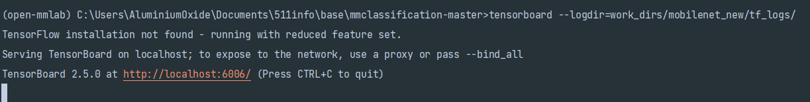
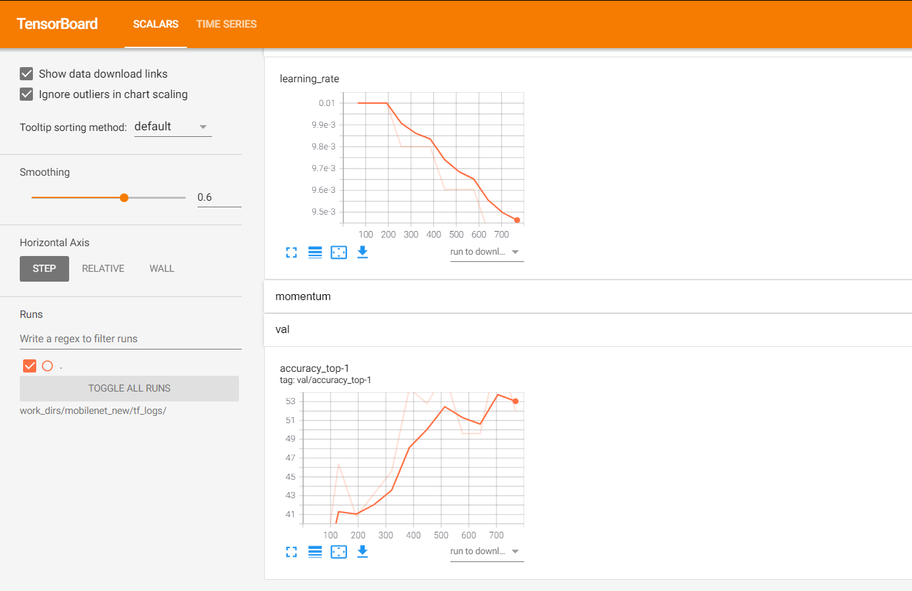

默认看到这篇文章时已配置好config文件，如果没有配置可以回到这篇文章

http://aluminium/allophane.com/index.php/2021/07/06/mmclassification\_mobilenetv2\_2\_config/

打开prompt激活对应环境进入mmcls目录，运行以下命令

```
python .\tools\train.py .\configs\mobilenet_v2\mobilenet_v2_b32x8_imagenet_user.py --work-dir work_dirs/mobilenet_new
```

如果你是和我一样，使用在windows环境下硬件编译的，那么可能遇到这个问题

```
'tail' 不是内部或外部命令，也不是可运行的程序
或批处理文件。
'gcc' 不是内部或外部命令，也不是可运行的程序
或批处理文件。


```

这两个命令不要担心，tail是linux命令，gcc是 GNU Compiler Collection，GNU编译器套件。个人感觉是多系统匹配的遗留问题，在build时已经安装cython了  
在网上有人复现了win下的tail命令，gcc报错可以通过安装minGW解决，不过即使你解决了以上两个问题，也会遇到

```
'head' 不是内部或外部命令，也不是可运行的程序
或批处理文件。
```

head也是Linux命令，这个，网上无人复现，无解，但是和以上两个错误不影响运行（我想万一真的复现了head命令，后面可能都提示会缺少ls命令(╯‵□′)╯︵┻━┻）


运行结束后在保存目录下会存在以下文件目录，

- tf\_logs是tensorboard保存的目录，如果没有在config里设置就不会有
- .log 存放本机信息，以及组合后的字典文件，这个文件在开始训练时就会出现，可以考虑训练后马上ctrl+C把程序cut掉，在用该文件代替原config文件
- .json文件里存放了训练的各种数据，包括但不限于损失、准确率、训练时间等信息(如果是单纯分类问题也没太多可计算的)
- .pth文件是训练出的模型文件

至于测试模型，可以通过demo下的image\_demo.py完成

```
python demo/image_demo.py {test_img} {config} {checkpoint}
```

至于json文件，可以通过tools下的analyze\_log.py完成？不好意思，这个只mmdet里有，mmcls的意义不大？就 没 有 了 ？（可以拿过来，也可以自己写）

不过可视化可以通过tensorboard文件实现，可以在prompt中输入以下命令启动，并进入http://localhost:6006/来查看训练信息

```
tensorboard --logdir=work_dirs/mobilenet_new/tf_logs/
```




