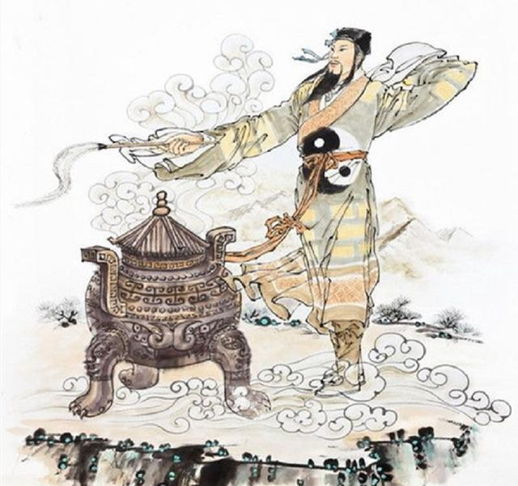
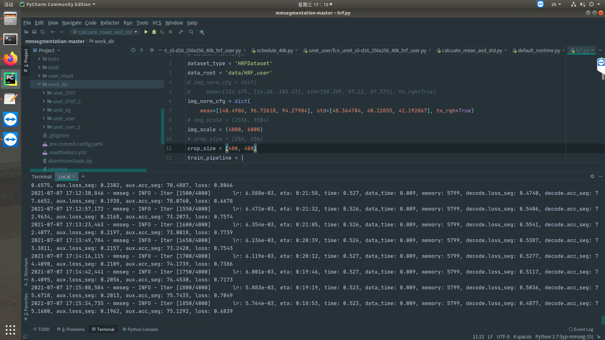

安装部分不再赘述，参考 [GitHub - open-mmlab/mmsegmentation](https://github.com/open-mmlab/mmsegmentation)

- 克隆已经配置好的pytorch + mmcv-full 环境
- 下载mmseg并在该目录下安装mmseg

数据预处理部分参考 [GitHub - AluminiumOxide/mmseg\_coco\_to\_HRF](https://github.com/AluminiumOxide/mmseg_coco_to_HRF)

- 获得label
- 转换label格式
- 划分数据集
- 计算均值和方差

修改配置文件 configs/unet/fcn\_unet\_s5-d16\_256x256\_40k\_hrf\_user.py  
（本例中用的）

../_base_/models/fcn\_unet\_s5-d16.py 修改如下，除非你计划直接多卡训练

```
norm_cfg = dict(type='SyncBN', requires_grad=True)
```

原代码

```
norm_cfg = dict(type='BN', requires_grad=True)
```

新代码

../_base_/datasets/hrf.py 至于其他的，因为划分时就是根据HRF搞的，没必要再设置路径

```
data_root = 'data/HRF'
img_norm_cfg = dict(
    mean=[123.675, 116.28, 103.53], std=[58.395, 57.12, 57.375], to_rgb=True)
img_scale = (2336, 3504)
crop_size = (256, 256)
```

```
data_root = 'data/HRF_user'
img_norm_cfg = dict(
    mean=[140.913467, 96.968079, 94.526963], std=[48.5695027, 40.4070963, 41.3742822], to_rgb=True) # 出的均值和方差*256
img_scale = (4000, 6000)  # 这是我的图片像素自行调整
crop_size = (400, 400) 对应总config也得改
```

../_base_/default\_runtime.py 建议打开tensorboard

```
# dict(type='TensorboardLoggerHook')
```

```
dict(type='TensorboardLoggerHook')
```

不过打开会提示你安装future和tensorboard，或者直接提前安装

```
pip install future tensorboard 
```

../_base_/schedules/schedule\_40k.py

```
# optimizer
optimizer = dict(type='SGD', lr=0.01, momentum=0.9, weight_decay=0.0005)
optimizer_config = dict()
# learning policy
lr_config = dict(policy='poly', power=0.9, min_lr=1e-4, by_epoch=False)
# runtime settings
runner = dict(type='IterBasedRunner', max_iters=4000)
checkpoint_config = dict(by_epoch=False, interval=4000)
evaluation = dict(interval=4000, metric='mIoU')
```



这部分就开始炼丹吧少年！！！

下一部分开始训练

```
python tools/train.py  configs/unet/fcn_unet_s5-d16_256x256_40k_hrf_user.py --work-dir work_dir/unet_new
```


