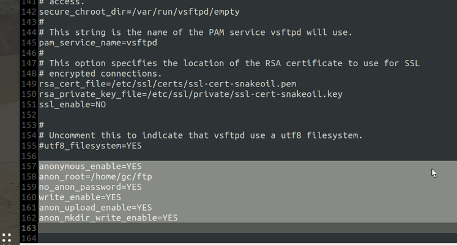
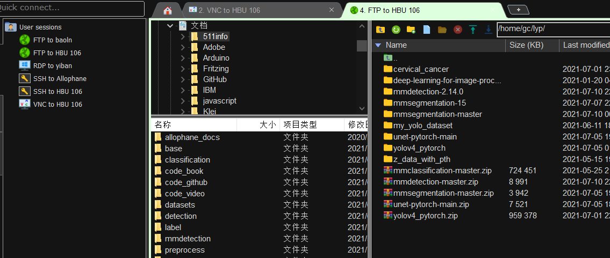

 安装ftp服务器

```
apt-get install vsftpd 
```

确认版本

```
vsftpd -v 
```

新建ftp目录并修改权限

```
mkdir ftp 
chmod 777 -R /home/<用户名>/ftp/
```

修改 vsftpd.conf 文件（我知道大部分人喜欢 vi 打开，但是因为我菜就不限制我打开方式了）

```
sudo gedit /etc/vsftpd.conf
```

下方追加内容，具体我觉得[这个博客](https://blog.csdn.net/lhq9220/article/details/6544755)写的很全了，我就不仔细写了

```
anonymous_enable=YES     
anon_root=/home/<用户名>/ftp
no_anon_password=YES
write_enable=YES
anon_upload_enable=YES
anon_mkdir_write_enable=YES
```

```
允许匿名用户登录
设置本地用户登录后进入到的目录
匿名用户登录时是否询问口令
启用可以修改文件的 FTP 命令
允许匿名用户上传文件
允许匿名用户创建目录
```



重启ftp服务与，查看自己的IP，理论上有两个，如果配置虚拟局域网了那应该有三个，除去本地回环地址， inet 后就是IP

```
sudo /etc/init.d/vsftpd restart
ifconfig
```

连接，略，使用相应FTP工具设置IP、用户名与密码开始建立连接（推荐用[MobaXterm](https://mobaxterm.mobatek.net/)这玩意真的是太好用了！包括建立VNC和SSH，最重要是这玩意免费！）


