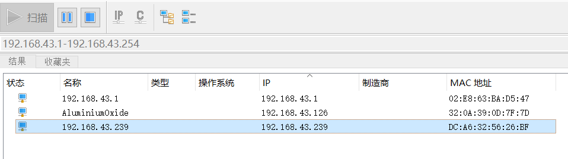

听说有个垃圾站长搞到一个4B上头了，然后就上头了。（其实是最近课程设计需要）

大概需要一下几个部分，先说怎么烧64位的

1 64位树莓派系统烧录及初始化  
2 树莓派下pip使用区别  
3 树莓派特供pytorch镜像获取  
4 待补

## 1 64位树莓派系统烧录

首先哈，如果直接去[树莓派官网](https://www.raspberrypi.org/)是默认给的3个系统镜像是没有64位的，（虽然树莓派4已经支持64位系统了，但估计是3B系列没法使用）如果想安装64位系统，网上有成堆镜像，但你敢用吗？"ㄟ( ▔, ▔ )ㄏ"


可以这么认为，虽然现在有64位树莓派，但是还是处于测试阶段，官方根本没放出来（除非你就是想用）那没办法了，来！


先复制链接地址，我这里是复制的  
https://downloads.raspberrypi.org/raspios\_full\_armhf/images/raspios\_full\_armhf-2021-05-28/2021-05-07-raspios-buster-armhf-full.zip

然后直接进入上级目录（不会吧，不会吧，不会真的有人不知道服务器端如果不写index.php就能直接看文件目录吧）


直接回到根目录找到 raspios\_arm64，再刷到里面 注意哈，不要下载2020-05-28的，我配置树莓派4B时，这玩意没法使用VNC链接（apt有问题而且它会不断说好了好了，然后重启）


我目前下载2021的两个版本都没出现问题，至于2020-08的我还没试，不爱翻网页的点击[这里](https://downloads.raspberrypi.org/raspios_arm64/images/)

下载镜像后就是镜像烧录工具，链接点击[这里](https://downloads.raspberrypi.org/imager/imager_latest.exe)


烧录镜像过程略过，建议用class10速的

然后有3.5寸屏幕的当我没说，要是没有建议先设置局域网，创建一个 wpa\_supplicant.conf 的文件，用记事本打开

```
country=CN
ctrl_interface=DIR=/var/run/wpa_supplicant GROUP=netdev
update_config=1

network={
	ssid="yours WALN name"
	psk="yours WALN password"
	priority=2
}
network={
	ssid="yours WALN name"
	psk="yours WALN password"
	priority=1
}
```

ssid设置的是你的WLAN名称，psk是WLAN密码，priority是优先级（越高越优先）  
我是直接手机热点（局域网），然后电脑和树莓派在该局域网里链接的，当然，您如果使用家用WLAN也可以

同时创建一个SSH的空文件，这个的目的是让树莓派开启SSH，我不能保证每个系统都默认把SSH开启，你要是不开也连不上

也就是现在您有这两个文件


把这两个文件直接扔到刚才烧好的系统的boot目录下，然后插入♂ 树莓派，这个boot目录相当于raspbian的boot目录  


之后当树莓派插卡槽右端的黄灯从闪烁到熄灭（只保留红灯常亮），表明raspbian系统正常启动，这时你的手机上的热点应该会有两个链接，没有请百度或查看残缺步骤

然后配置完先查看IP 打开cmd 输入ipconfig查看 无线局域网适配器 WLAN: 记住前24位（这里是192.168.43），然后使用IP扫描工具查找局域网下，从 前24位.2~前24位.254 的用户（爱看网关和广播地址也OK，我这忘了忽略网关地址了）然后树莓派的IP是192.168.43.239




直接使用SSH链接工具链接，我直接使用MobaXterm！


连接后默认用户是pi，默认密码是raspberry，后面建议至少改一下密码（不过是局域网，你怕被攻击个什么？）  
连接成功后，如果没问题，就会显示高贵的aarch64(￣▽￣)"


然后进行基本配置

```
sudo raspi-config
```

先打开VNC（如果不想图像界面，您甚至可以无视之前说的20年还是21年的版本，我那个20年的不用就是因为20年的无法正常开启VNC）  
interface option > P3 VNC | enable  
display option > 01 resolution | 选合适的分辨率（我个人感觉1366×768以上的都足够用了，也可以随意选一个，反正可以自己设置）  
Performance option > GPU | 看情况，不过即使是设置大也对pytorch完全没用就是了，人家是核显，且不是N卡核显，没法装cuda的！


然后重启，先用VNC viewer连接，依旧用之前SSH链接的用户名和密码链接后，打开VNC Server>options


在安全一栏，把Authentication换成VNC password，并设置你的密码（至于为啥这样？平民的MobaXterm没法用UNIX password链接）


然后切换到MobaXterm的VNC连接，用刚才设置的登录密码连接，完毕


```
sudo halt
```
