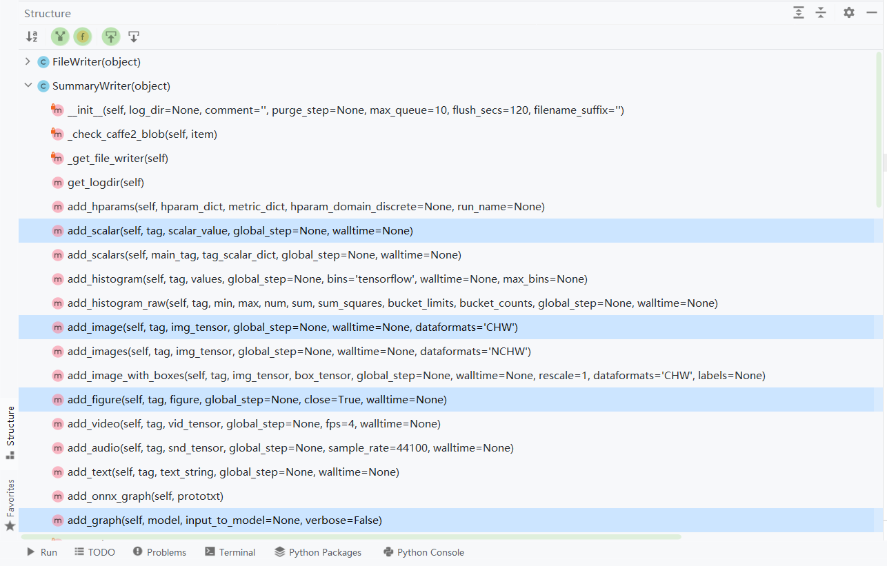
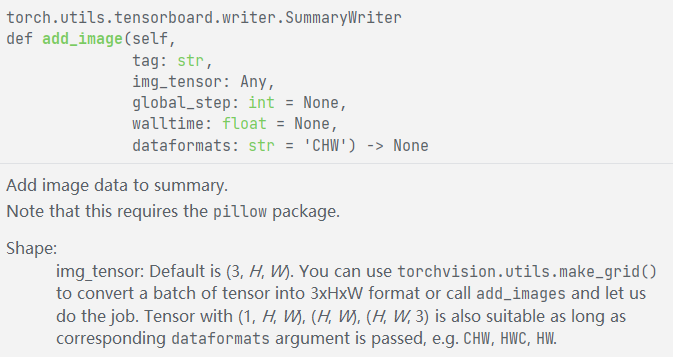
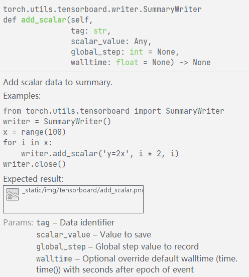
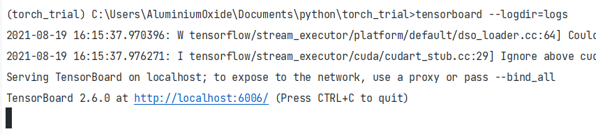
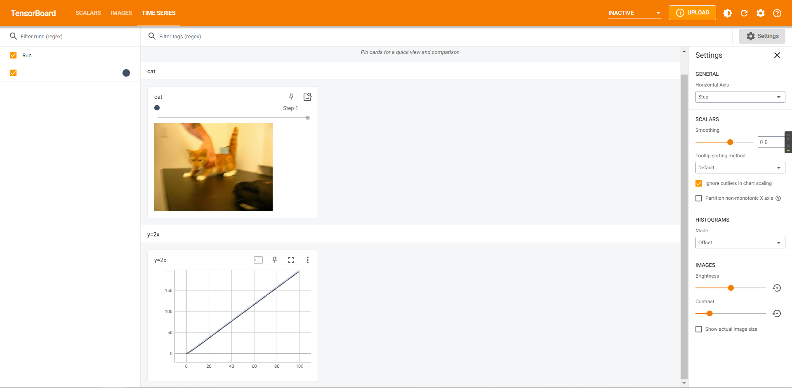

具体tensorboard安装就先略过,直接conda install tensorboard

在torch里使用tensorboard是在这里

```
from torch.utils.tensorboard import SummaryWriter
```


然后如果进入后打开structure可以查看该包内的对象和方法,比如说比较常用的这几个方法  
add\_scalar  
add\_image  
add\_graph  
等



说回来,想要使用tensorboard,先实例化,指定event文件的文件夹

```
writer = SummaryWriter("logs")
```

然后先说一下之后能用的格式Image、list、array、tensor以及这几个数据格式之间的转化关系(从行转列)，  
不过说一下哈，这个是在没有工具的前提下，有工具还有别的方法

<table><tbody><tr><td>&nbsp;</td><td>list/PIL_image</td><td>numpy.array</td><td>torch.tensor</td></tr><tr><td>list/PIL_image</td><td>&nbsp;</td><td>ndarray = np.array(list)</td><td>tensor=torch.Tensor(list)</td></tr><tr><td>numpy.array</td><td>list = ndarray.tolist()</td><td>&nbsp;</td><td>tensor = torch.from_numpy(ndarray)</td></tr><tr><td>torch.tensor</td><td>先转numpy再转list list = tensor.numpy().tolist()</td><td>ndarray = tensor.numpy()</td><td>&nbsp;</td></tr></tbody></table>

**\*gpu上的tensor不能直接转为numpy**

```
ndarray = tensor.cpu().numpy()
```

cv2和PIL.Image的转换其实是numpy.array和PIL的转换  
PIL.Image和plt.imshow的格式都是rgb，而cv2是bgr，要做格式转换

好了,说完了回来,给tensorboard添加图像,先加载再说

```
image_path = 'dataset/cat_vs_dog/train/cat/cat.0.jpg' # 图像目录
img_PIL = Image.open(image_path)  # 打开图片文件（PILimage）
img_array = np.array(img_PIL)    # 转成numpy格式
```

由于图片读取是HWC的,tensorboard默认是CHW的,

```
print(type(img_array))
print(img_array.shape)  # (374, 500, 3)
```

需要调整一下通道顺序

```
writer.add_image('cat', img_array, 1, dataformats='HWC')
```

以上参数分别是:标签名称、图像索引、图像格式，可以通过ctrl+q仔细查看



此外,添加一个plot ,使用add\_scalar方法

```
x = range(100)
for i in x:
    writer.add_scalar('y=2x', i * 2, i)
```



最后记得关闭summarywriter，当然，不关也没人管

```
writer.close()
```

最后完整的代码

```
from torch.utils.tensorboard import SummaryWriter
from PIL import Image
import numpy as np

writer = SummaryWriter("logs")

image_path = 'dataset/cat_vs_dog/train/cat/cat.0.jpg' # 图像目录
img_PIL = Image.open(image_path)  # 打开图片文件（PILimage）
img_array = np.array(img_PIL)    # 转成numpy格式
print(type(img_array))
print(img_array.shape)  # (374, 500, 3)
writer.add_image('cat', img_array, 1, dataformats='HWC')

x = range(100)
for i in x:
    writer.add_scalar('y=2x', i * 2, i)

writer.close()

```

运行后在文件夹下出现一个logs的文件夹，里面有event文件  
在命令行输入

tensorboard --logdir=logs



从而打开logs下记录的tensorboard文件  
点击链接正常进入可以查看


