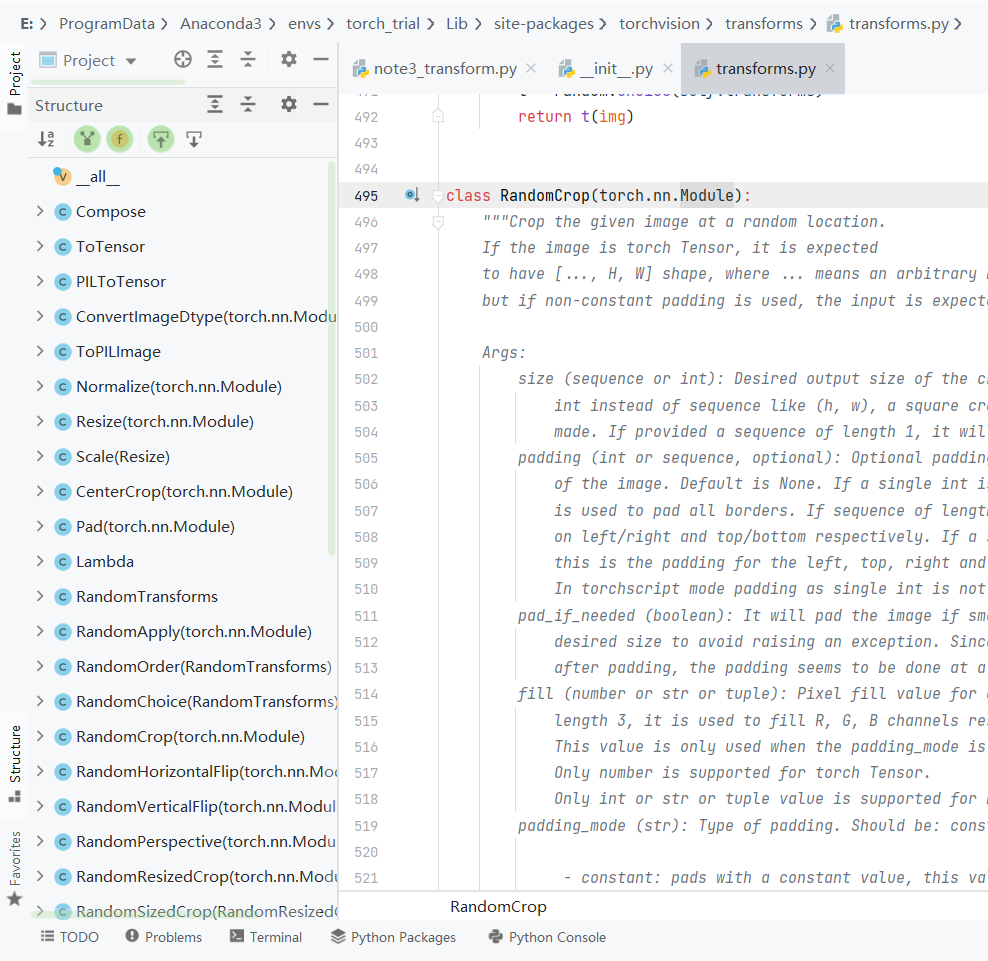
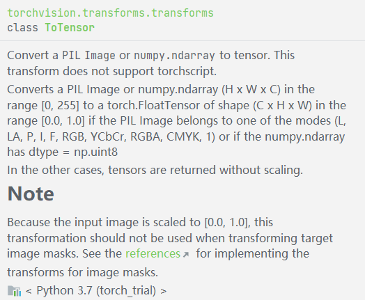
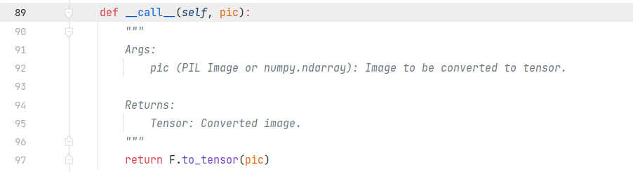
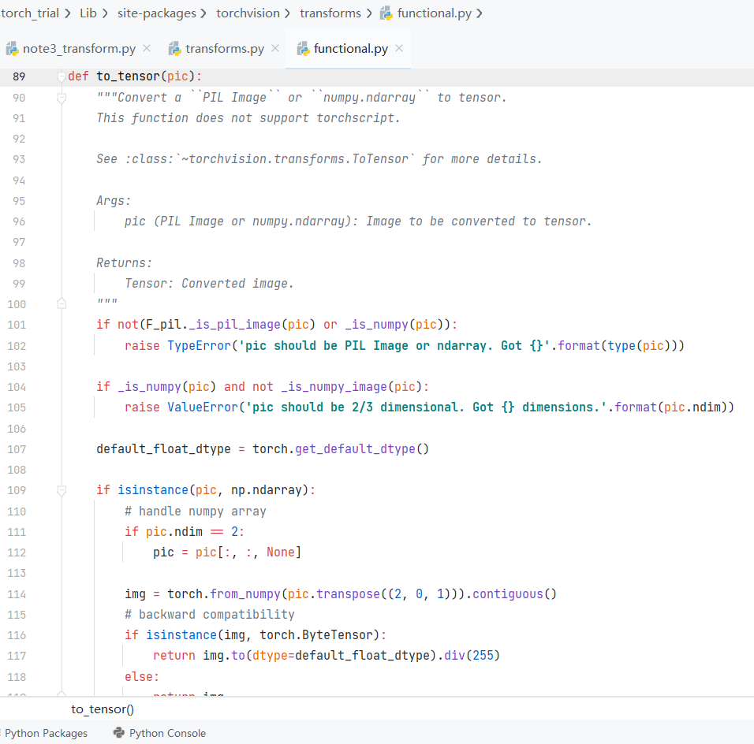
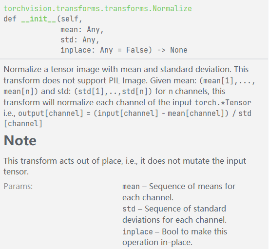
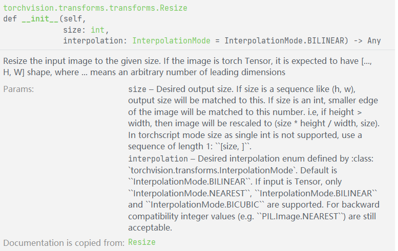
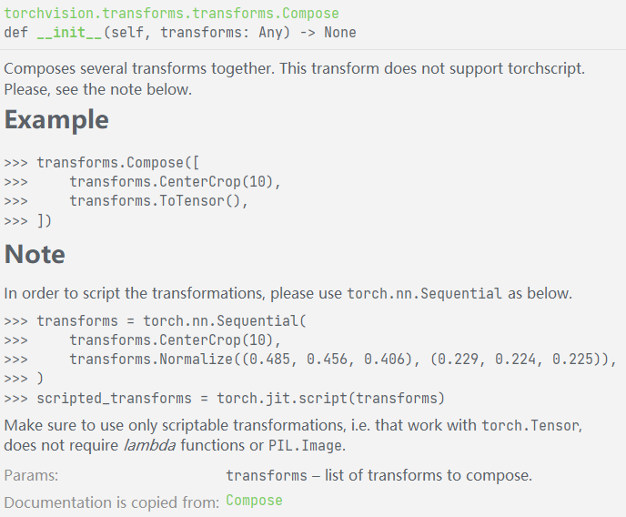
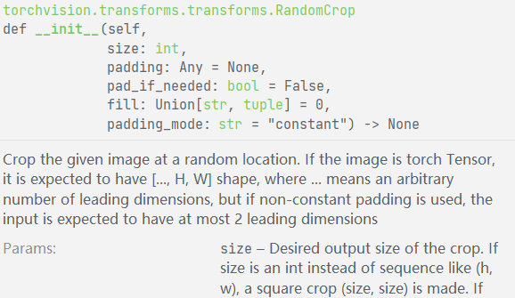

transforms提供了一系列变换的函数，辅助完成图像处理

```
from torchvision import transforms
from torch.utils.tensorboard import SummaryWriter
from PIL import Image
import cv2
```

先ctrl到transforms的文件里，并点开pycharm左下角的structure查看class层级结构



图左的类是transforms提供的图像变换功能，先准备图片和tensorboard

```
# 打开图片
img_path = 'dataset/cat_vs_dog/train/cat/cat.0.jpg'
img = Image.open(img_path)

# 创建event文件目录
writer = SummaryWriter('logs')
```

还记得2节里面说的转化方法不？来！使用transforms的ToTensor方法直接从PIL转tensor

```
# ToTensor使用
trans_totensor = transforms.ToTensor()
img_tensor = trans_totensor(img)
writer.add_image('img_tensor', img_tensor)
```



由于ctrl+Q提示的不完整，建议直接ctrl点击进入文件查看  
其中**\_\_call\_\_()**负责调用对象时接收参数



当然，这层类下还有一层functional的函数,这里有每个函数的具体实现流程，由于本人能力有限，不过多赘述



此外，还有很多函数，比如标准化

```
# Normalize
trans_norm = transforms.Normalize([0.5, 0.5, 0.5], [0.5, 0.5, 0.5])
img_norm = trans_norm(img_tensor)
writer.add_image('Normalize', img_norm)
```



又比如图像拉伸

```
# resize
trans_resize = transforms.Resize((512,512))
img_resize = trans_resize(img)
img_resize = trans_totensor(img_resize)
writer.add_image("resize", img_resize, 0)
```



然后在这里插一嘴吧，有一个compose类，可以将多个方法组合成一个，直接调用它就可以，比如下面把resize和ToTensor组合在一起

```
# compose
trans_resize_2 = transforms.Resize(512)
trans_compose = transforms.Compose([
    trans_resize_2,
    trans_totensor
])
img_resize_2 = trans_compose(img)
writer.add_image("resize",img_resize_2, 1)
```



然后提一下随机裁剪，由于这个描述实在太长，就不在这里完全展示了

```
# randomcrop
trans_random = transforms.RandomCrop((128,256))
trans_compose_2 = transforms.Compose([
    trans_random,
    trans_totensor
])

```

然后用个循环怼到tensorboard里

```
for i in range(10):
    img_crop = trans_compose_2(img)
    writer.add_image("randomcrop", img_crop, i)

```



用完了tensorboard不要忘了关

```
writer.close()
```
