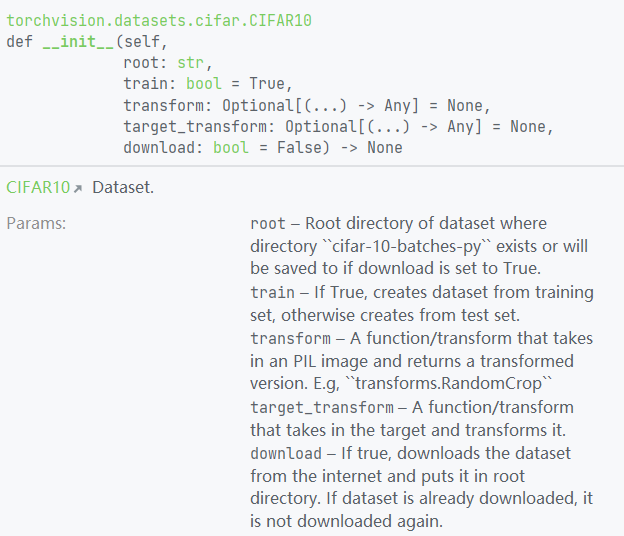

首先是加载标准数据集torchvision可以直接加载的数据集


建议去官网找doc>torchvision>dataset然后点击右面的数据集又详细的使用教程


比如这里的CIFAR10


当然,也可以直接ctrl+Q查看如何加载



加载代码如下

```
import torchvision
train_set = torchvision.datasets.CIFAR10(root='./CIFAR10', train=True, download=True)
test_set = torchvision.datasets.CIFAR10(root='./CIFAR10',train=False,download=True) 

img,target = test_set[0]
print(img.shape)
print(target) 
```

好的数据集已经加载了,现在如何接住这些数据呢?  
使用dataloader把数据加载成一批一批的

```
from torch.utils.data import DataLoader
```


但是,由于加载的数据需要是tensor,先修改一下之前的代码,类似下面这样加上ToTensor的变换

```
# 测试集
test_set = torchvision.datasets.CIFAR10(root='./CIFAR10',train=False, transform=torchvision.transforms.ToTensor(), download=False)
```

然后使用dataloader分批数据,每批64个.随机,不舍弃最后一组不完整的批

```
test_loader = DataLoader(dataset=test_set, batch_size=64, shuffle=True, num_workers=0, drop_last=False)
```

最后打开tensorboard搞个循环测试一下

```
writer = SummaryWriter('logs')
step = 0
for data in test_loader:
    imgs,target = data
    print(img.shape)
    print(target)
    writer.add_images("test_data",imgs, step)
    step = step+1
writer.close()
```

打开tensorboard会显示每批加载的数据


