## 5.1 torch.nn

最基本的需要了解module类，该类是所有网络的基类，你的模型都得继承它类似示例中的提示，继承并复写init和forward

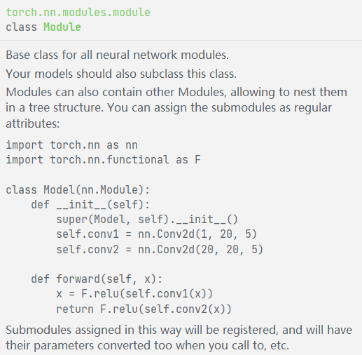

```
import torch
from torch import nn

class new_class(nn.Module):
    def __init__(self):
        super(new_class, self).__init__()

    def forward(self, input):
        return input+1
```

等一下,咱们先不填他写的那些层,在main里实例化模型从而看看能不能用

```
if __name__=='__main__':
    new_model = new_class()
    x = torch.tensor(1.0)
    output = new_model(x)
    print(output)
```

## 5.2卷积层

首先需要引入nn下的functional模块,基本所有神经网络运算都在这里了

```
import torch.nn.functional as F
```

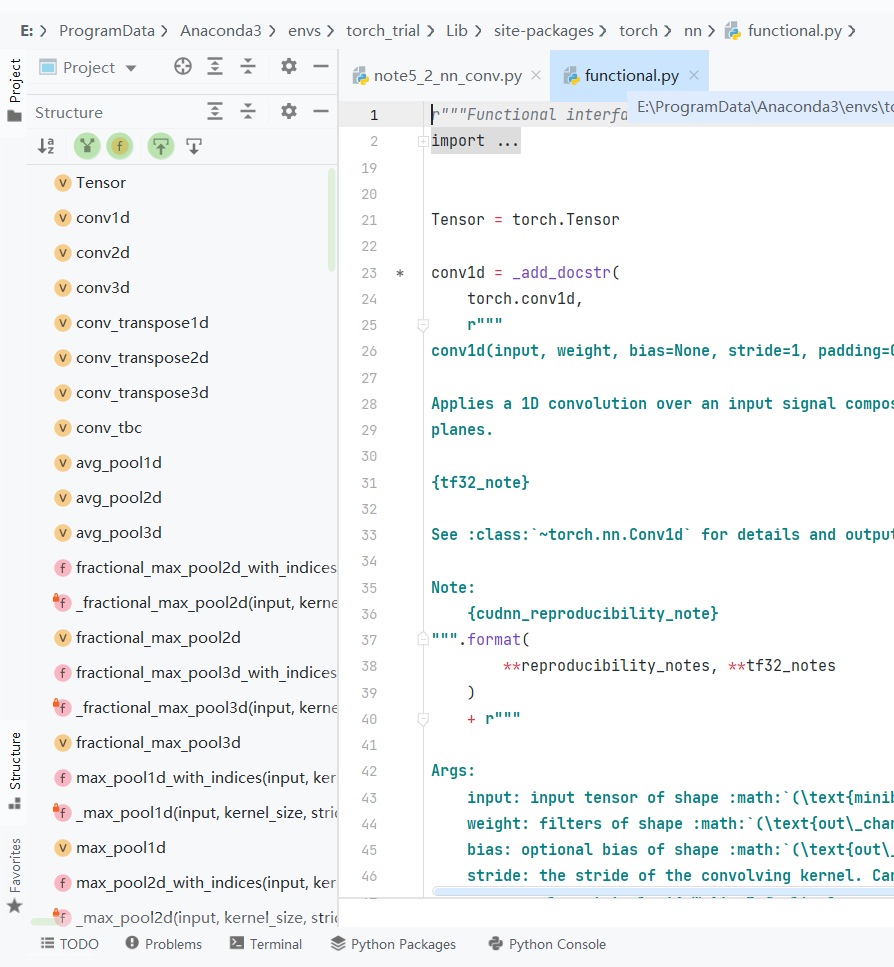

然后来看一下卷积运算conv2d,这里没写全,直接在functional里看

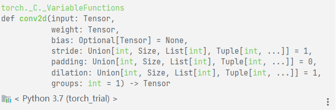

input和weight进行2d卷积,从自带的示例为例

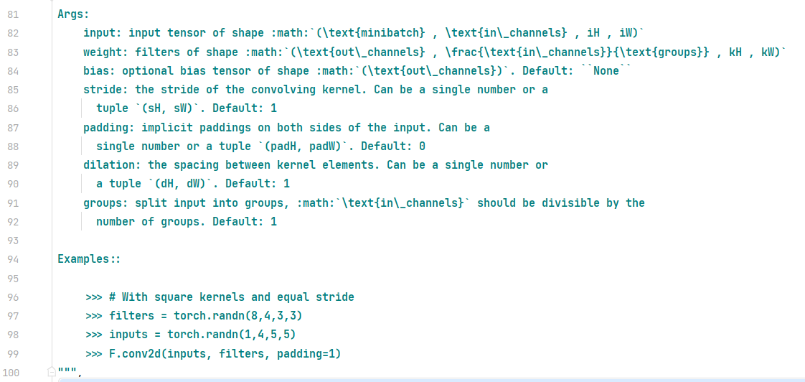

在console里运行可得

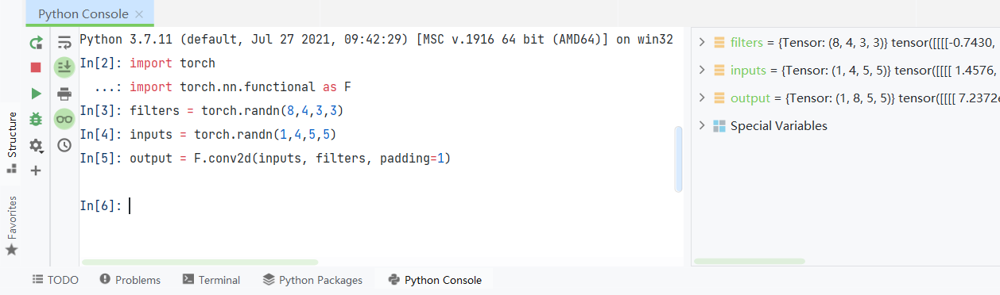

通过阅读82和83行代码可知

<table><tbody><tr><td>&nbsp;</td><td>&nbsp;</td><td>input_channel</td><td>H</td><td>W</td></tr><tr><td>input</td><td>训练批数</td><td>输入通道数</td><td>高度</td><td>宽度</td></tr><tr><td>weight</td><td>输出通道数</td><td>输入通道数</td><td>高度</td><td>宽度</td></tr></tbody></table>

从卷积的叉乘运算,可得,input和weight的输入通道必须一样,这里输入通道和输出通道可以看成输入图像的深度,大多数都是3层RGB(但是例子里是4层),每个卷积核也是相同层数,和输入进行卷积计算,输出卷积核数量输出通道的特征图

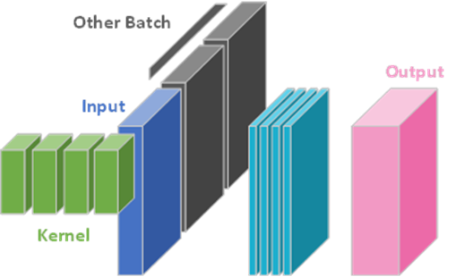

然后输出得到

<table><tbody><tr><td>output</td><td>训练批数</td><td>输出通道数</td><td>iH-wH+1</td><td>iW-wW+1</td></tr></tbody></table>

但是因为padding=1,在input周围添一圈0,相当于1H和iW都变成了iH+2,iW+2,故输出是5+2-3+1=5,如果取消padding的话,输出shape是(1,8,3,3)


问为什么通道一样的建议把欧姆社的线性代数再翻一遍,那么现在把之前的东西混起来走一波,运行以下代码获得,由于是随机卷积核,每次都不一样

```
import torch
import torch.nn.functional as F
from PIL import Image
from torchvision.transforms import transforms
import matplotlib.pyplot as plt

if __name__ == '__main__':
    img = Image.open('dataset/cat_vs_dog/train/cat/cat.0.jpg')  # 打开图像并展示
    plt.figure("input")
    plt.imshow(img)
    trans_totensor = transforms.ToTensor()  # 准备PIL和Tensor之间的转换
    trans_toPIL = transforms.ToPILImage()
    img_tensor = trans_totensor(img)  # PIL转Tensor并设置到对应形状
    img_tensor = torch.reshape(img_tensor, (1, 3, 374, 500))
    filters = torch.randn(1,3,3,3)  # 随机生成卷积核，为了简单，输出通道为1，输入通道和图像一致设置为3
    output = F.conv2d(img_tensor, filters, padding=1)
    output = torch.reshape(output, (1, 374, 500)) # 输出通道如果没reshape，是4维的，转成3维图像并变回PIL
    output = trans_toPIL(output)
    plt.figure("output")  # 输出图像
    plt.imshow(output)
    plt.show()
```

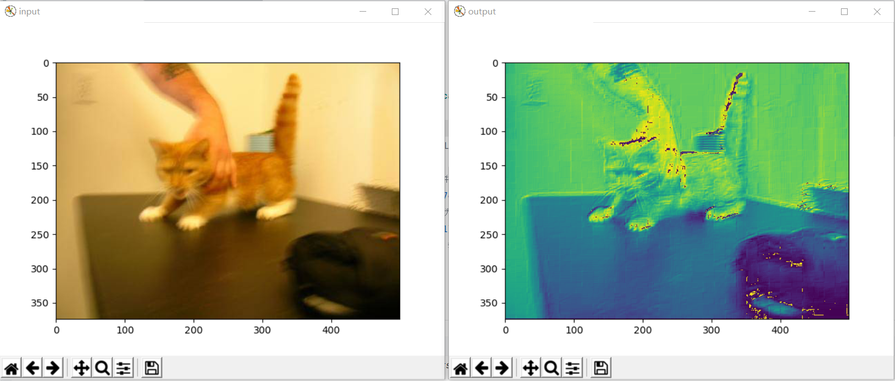

然后其他的参数bias、stride、paddin、dilation、groups建议到官网的这个[网址](https://pytorch.org/docs/stable/generated/torch.nn.Conv2d.html#torch.nn.Conv2d)下，寻找详细说明

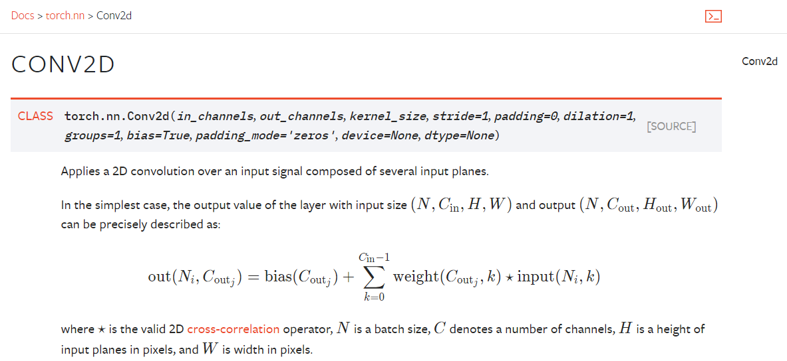

而且一般来讲,生成卷积核都是使用torch.nn.module下的Conv2d来实现，functional只是在调用nn.module的功能

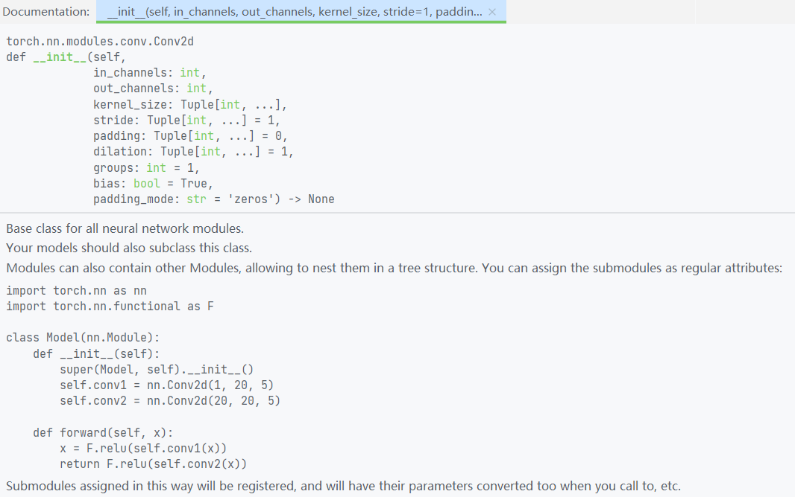

那么现在回来,根据上面那张图推荐的方式进行网络构建,这里只构建一个卷积层

```
import torchvision
from torch import nn
from torch.nn import Conv2d
from torch.utils.data import DataLoader
from torch.utils.tensorboard import SummaryWriter

dataset = torchvision.datasets.CIFAR10("./CIFAR10", train=False, transform=torchvision.transforms.ToTensor(),
                                       download=False)
dataloader = DataLoader(dataset, batch_size=64)

class Module(nn.Module):
    def __init__(self):
        super(Module, self).__init__()
        self.conv1 = Conv2d(in_channels=3, out_channels=1, kernel_size=3, stride=1, padding=1)

    def forward(self, x):
        x = self.conv1(x)
        return x


if __name__ == '__main__':
    module = Module()
    writer = SummaryWriter("logs")
    for step,data in enumerate(dataloader):
        imgs, targets = data
        output = module(imgs)
        print('input shape: {} output shape: {}'.format(imgs.shape,output.shape))

        writer.add_images("input", imgs, step)
        writer.add_images("output", output, step)

    writer.close()
```

最后在tensorboard里查看数据变化(由于tensorboard和matplotlab不一样,显示的是黑白的)


## 5.3池化层

首先先引入

```
from torch.nn import MaxPool2d
```

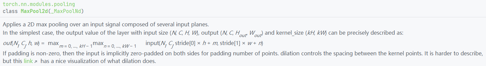

然后在上一篇代码的module类中添加

```
self.maxpool = MaxPool2d(kernel_size=3, ceil_mode=False)
```

forward方法中添加

```
x = self.maxpool(x)
```

从而得到

```
class Module(nn.Module):
    def __init__(self):
        super(Module, self).__init__()
        self.maxpool = MaxPool2d(kernel_size=3, ceil_mode=False)

    def forward(self, x):
        x = self.maxpool(x)
        return x
```

和之前的卷积运行代码一样,获得以下图像

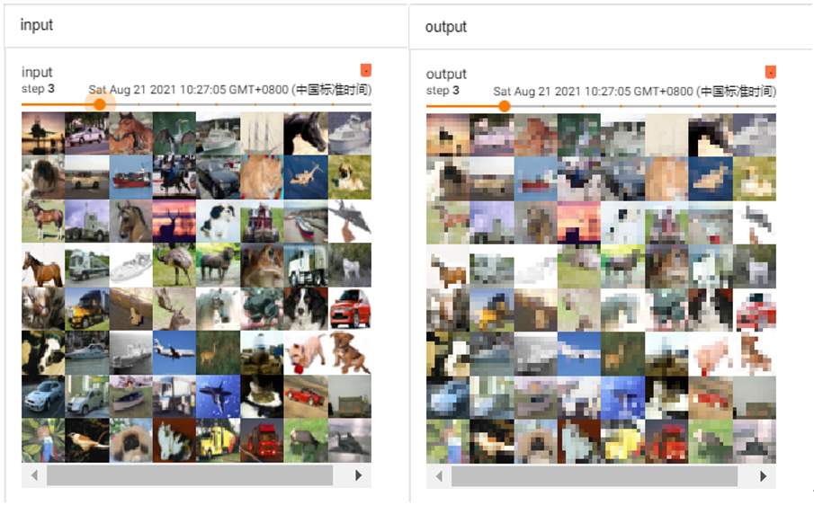

## 5.4激活函数

先引入库,这里拿sigmoid举例

```
from torch.nn import Sigmoid
```

如果想看都有什么激活函数,建议去官网这里查找

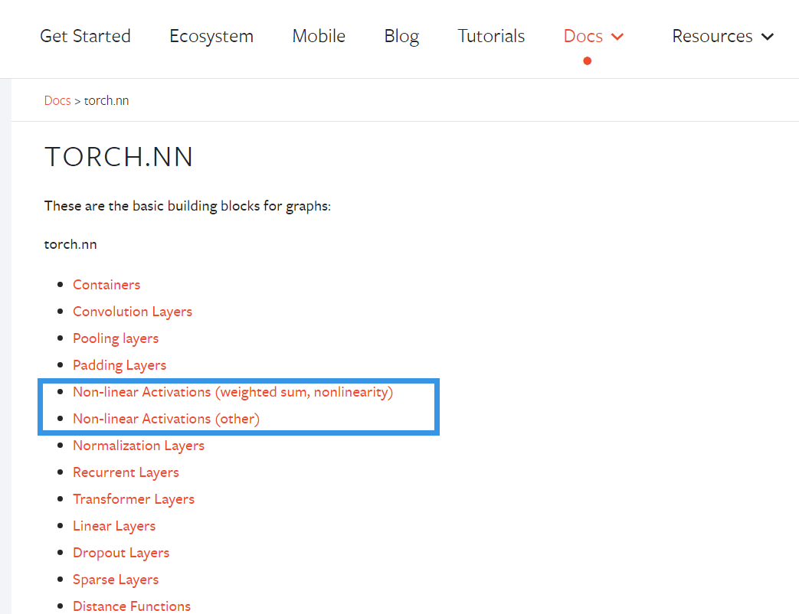

然后引入module库里

```
class Module(nn.Module):
    def __init__(self):
        super(Module, self).__init__()
        self.sigmoid = Sigmoid()
    def forward(self, x):
        x = self.sigmoid(x)
        return x
```

最后运行,得到如下结果

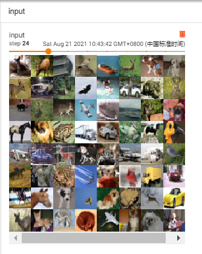

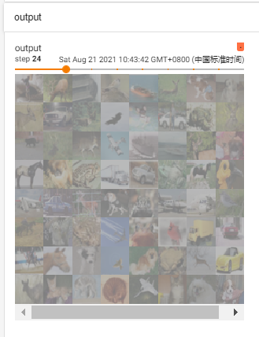

## 5.5线性层

不多说,先引入

```
from torch.nn import Linear
```

然后可以在[这里](https://pytorch.org/docs/stable/nn.html#linear-layers)找到更详细的

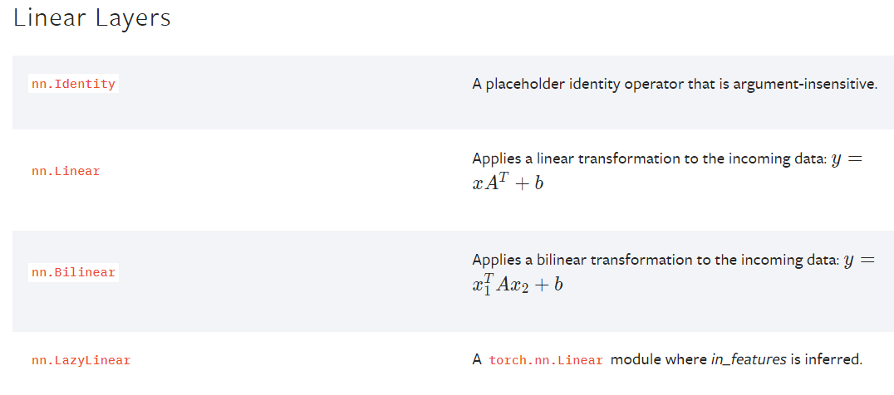

随后把线性层放入module里

```
class Module(nn.Module):
    def __init__(self):
        super(Module, self).__init__()
        self.linear = Linear(196608, 10) # 32*32*3*64

    def forward(self, x):
        x = torch.flatten(x)
        x = self.linear(x)
        return x
```

然后运行该模块

```
if __name__ == '__main__':
    module = Module()
    for step,data in enumerate(dataloader):
        imgs, targets = data
        output = module(imgs)
        print('input shape: {} output shape: {} which is {}'.format(imgs.shape,output.shape,output))
```

输出分类结果

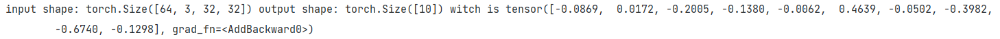

## 5.6顺序容器

sequential模块的作用是把不同的层组合起来,不用给自己继承的模块添加太多属性,先引入

```
from torch.nn import Sequential
```

至于具体的可以在这里查看

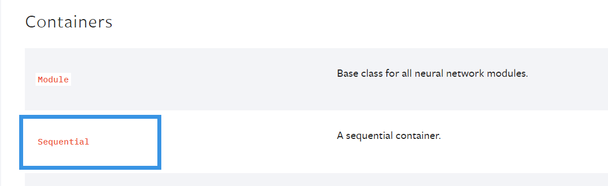

然后复现LeNet为例

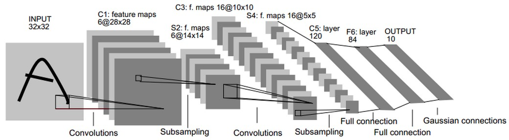

先是不使用seq的模块

```
# without sequential
class LeNet(nn.Module):
    def __init__(self):
        super(LeNet, self).__init__()
        self.conv1 = nn.Conv2d(3, 16, 5)
        self.pool1 = nn.MaxPool2d(2, 2)
        self.conv2 = nn.Conv2d(16, 32, 5)
        self.pool2 = nn.MaxPool2d(2, 2)
        self.fc1 = nn.Linear(32*5*5, 120)
        self.fc2 = nn.Linear(120, 84)
        self.fc3 = nn.Linear(84, 10)

    def forward(self, x):
        x = F.relu(self.conv1(x))    # input(3, 32, 32) output(16, 28, 28)
        x = self.pool1(x)            # output(16, 14, 14)
        x = F.relu(self.conv2(x))    # output(32, 10, 10)
        x = self.pool2(x)            # output(32, 5, 5)
        x = x.view(-1, 32*5*5)       # output(32*5*5)
        x = F.relu(self.fc1(x))      # output(120)
        x = F.relu(self.fc2(x))      # output(84)
        x = self.fc3(x)              # output(10)
        return x
```

然后使用seq构建

```
class LeNet_seq(nn.Module):
    def __init__(self):
        super(LeNet_seq, self).__init__()
        self.model = Sequential(
            Conv2d(3, 16, 5),
            MaxPool2d(2, 2),
            Conv2d(16, 32, 5),
            MaxPool2d(2, 2),
            Flatten(),  # 注意一下,线性层需要进行展平处理
            Linear(32*5*5, 120),
            Linear(120, 84),
            Linear(84, 10)
        )

    def forward(self, x):
        x = self.model(x)
        return x
```

最后调用测试

```
if __name__ == '__main__':
    LeNet = LeNet()
    LeNet_seq = LeNet_seq()
    input = torch.ones((64, 3, 32, 32))
    output_LeNet = LeNet(input)
    output_LeNet_seq = LeNet_seq(input)
    print('{} \n {}'.format(LeNet,output_LeNet.shape))
    print('{} \n {}'.format(LeNet_seq,output_LeNet_seq.shape))
```

可以看出二者的结构基本一致,(构建seq时我又加了一个展平模块,代替不使用seq时在forward里的view)

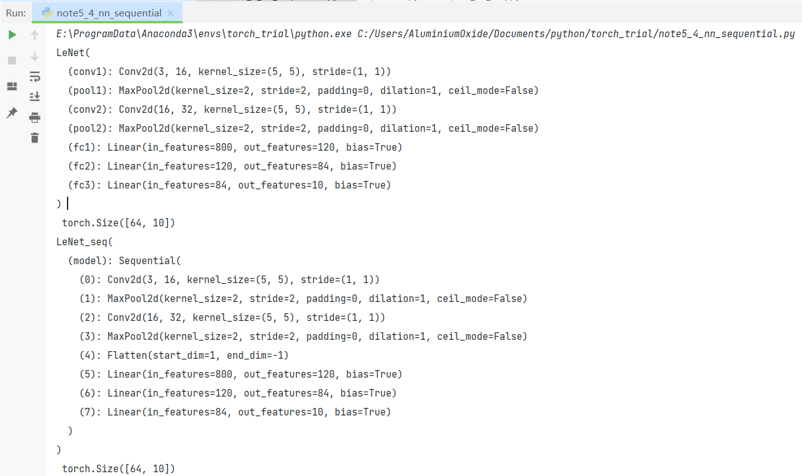

此外提一句,网络结构也可以使用tensorboard查看

```
writer = SummaryWriter('logs')
writer.add_graph(LeNet, input)
writer.close()
```

不再赘述

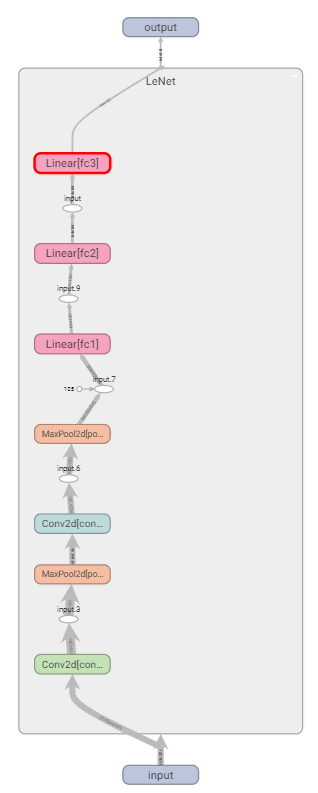
