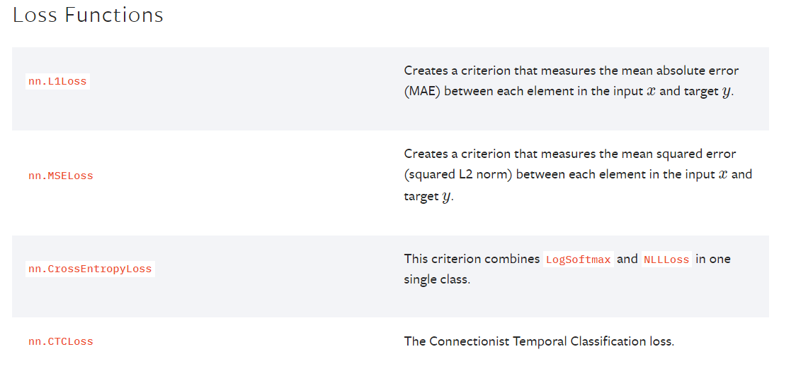
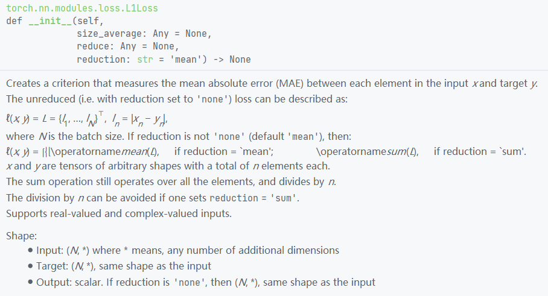
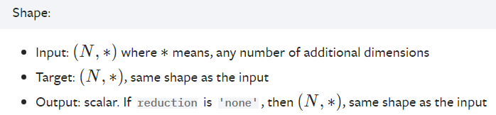
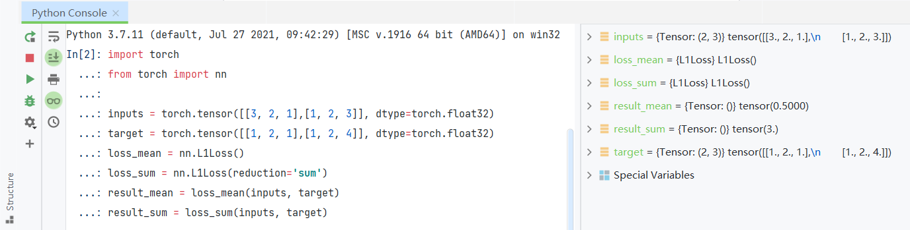
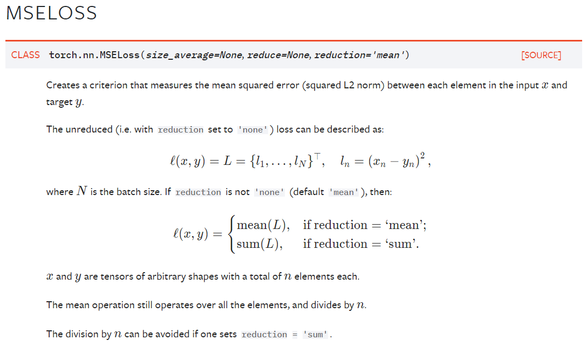
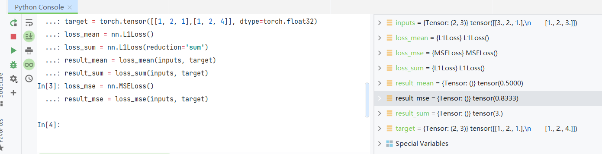
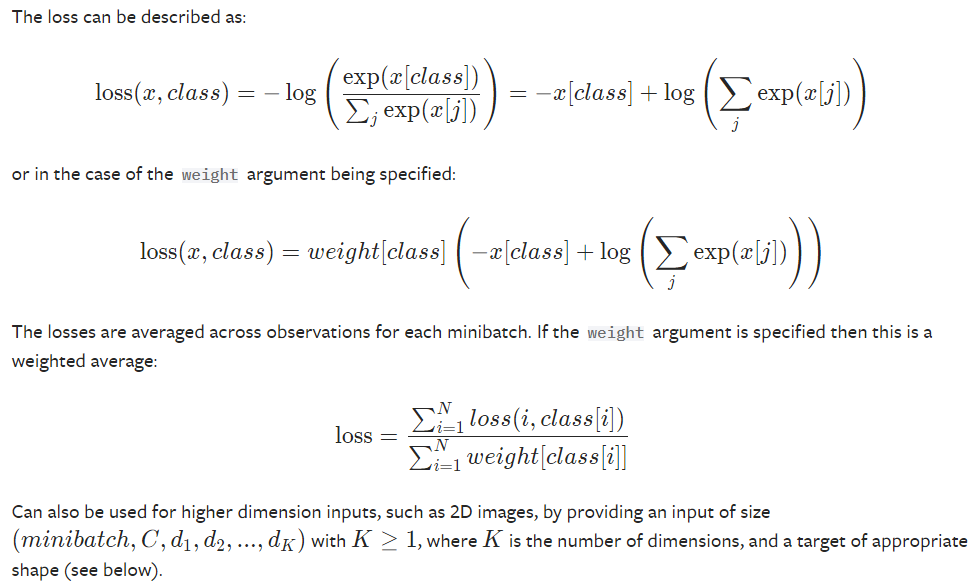
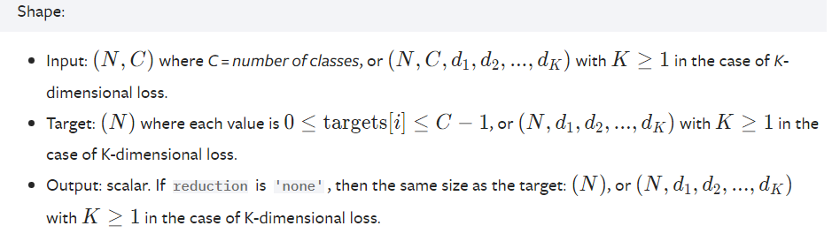
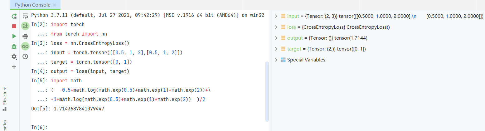
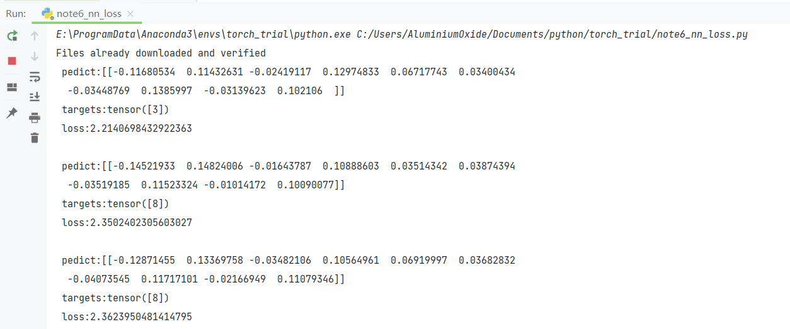

损失函数也在torch.nn下，具体可以参考文档，也可以参考官网



先根据L1Loss举例



我个人感觉这里的描述还是到官网的文档找比较好，公式看的比文档清楚



```
import torch
from torch import nn

inputs = torch.tensor([[3, 2, 1],[1, 2, 3]], dtype=torch.float32)
target = torch.tensor([[1, 2, 1],[1, 2, 4]], dtype=torch.float32)
loss_mean = nn.L1Loss()
loss_sum = nn.L1Loss(reduction='sum')
result_mean = loss_mean(inputs, target)
result_sum = loss_sum(inputs, target)
```

运行后可得，可以看出默认mean是0.5，sum是3



然后尝试一下MSELoss

```
loss_mse = nn.MSELoss()
```



追加在console运行

```
loss_mse = nn.MSELoss()
result_mse = loss_mse(inputs, target)
```

相当于 (2²+0+0+0+0+1²)/6=0.833



此外还有比较常用的交叉熵损失函数  
这个损失函数融合了 LogSoftmax 和 NLLLoss ,是分类问题中的常见损失函数  
大概是如下计算方式



输入的input和target也有要求,input要求C种分类的N个结果，  
target要求是0~C之间的N个整数,表示这N个结果对应的类别



这是官方教程提供的示例

```
loss = nn.CrossEntropyLoss()
input = torch.randn(3, 5, requires_grad=True)
target = torch.empty(3, dtype=torch.long).random_(5)
output = loss(input, target)
output.backward()

```

但是为了方便看还是自己写数吧

```
loss = nn.CrossEntropyLoss()
input = torch.tensor([[0.5, 1, 2],[0.5, 1, 2]])
target = torch.tensor([0, 1])
output = loss(input, target) 
""" same as:
import math
(  -0.5+math.log(math.exp(0.5)+math.exp(1)+math.exp(2))+\
-1+math.log(math.exp(0.5)+math.exp(1)+math.exp(2))  )/2
"""
```



使用之前的网络测试一下

```
import torchvision
from torch import nn
from torch.nn import Sequential, Conv2d, MaxPool2d, Flatten, Linear
from torch.utils.data import DataLoader

dataset = torchvision.datasets.CIFAR10("CIFAR10", train=False, transform=torchvision.transforms.ToTensor(),download=True)

dataloader = DataLoader(dataset, batch_size=1)


class Module(nn.Module):
    def __init__(self):
        super(Module, self).__init__()
        self.model = Sequential(
            Conv2d(3, 16, 5),
            MaxPool2d(2, 2),
            Conv2d(16, 32, 5),
            MaxPool2d(2, 2),
            Flatten(),  # 注意一下,线性层需要进行展平处理
            Linear(32*5*5, 120),
            Linear(120, 84),
            Linear(84, 10)
        )

    def forward(self, x):
        x = self.model(x)
        return x

if __name__ == '__main__':
    loss = nn.CrossEntropyLoss()
    module = Module()
    for data in dataloader:
        imgs, targets = data
        outputs = module(imgs)
        result_loss = loss(outputs, targets)

        print(' pedict:{}\n targets:{}\n loss:{}\n'.format(outputs.detach().numpy(),targets,result_loss))
```

然后得到类似以下输出


