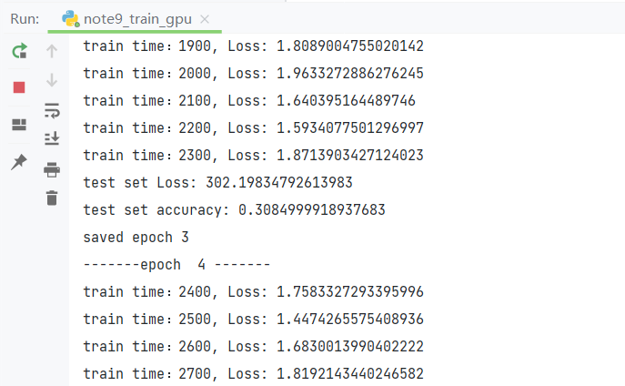
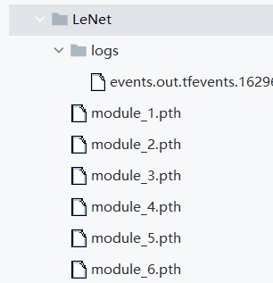
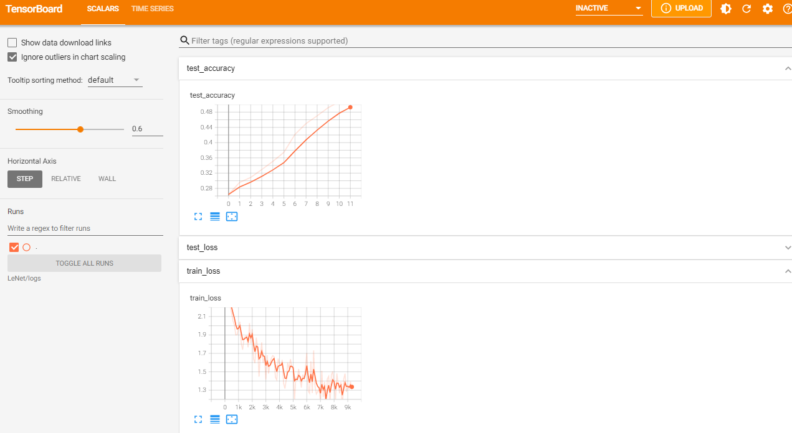

先引入库（事实上是在构建时引入的）note9\_train.py

```
import torchvision
from torch.utils.tensorboard import SummaryWriter

from note9_LeNet import *
from torch import nn
from torch.utils.data import DataLoader
```

其中note9\_LeNet中存放的是之前的模型文件，大多数情况也这么引入  
note9\_LeNet.py

```
import torch
from torch import nn

# 搭建神经网络
class Module(nn.Module):
    def __init__(self):
        super(Module, self).__init__()
        self.model = nn.Sequential(
            nn.Conv2d(3, 16, 5),
            nn.MaxPool2d(2, 2),
            nn.Conv2d(16, 32, 5),
            nn.MaxPool2d(2, 2),
            nn.Flatten(),  # 注意一下,线性层需要进行展平处理
            nn.Linear(32*5*5, 120),
            nn.Linear(120, 84),
            nn.Linear(84, 10)
        )

    def forward(self, x):
        x = self.model(x)
        return x
```

然后回到note9\_train.py加载数据集，还是拿CIFAR10开刀

```
train_data = torchvision.datasets.CIFAR10(root="CIFAR10", train=True, transform=torchvision.transforms.ToTensor(),download=True)
test_data = torchvision.datasets.CIFAR10(root="CIFAR10", train=False, transform=torchvision.transforms.ToTensor(),download=True)
```

然后存放到dataloader

```
# DataLoader 加载数据集
train_dataloader = DataLoader(train_data, batch_size=64)
test_dataloader = DataLoader(test_data, batch_size=64)
```

然后设置模型和参数

```
# 创建网络模型
module = Module()
# 损失函数
loss_fn = nn.CrossEntropyLoss()
# 优化器
learning_rate = 1e-2
optimizer = torch.optim.SGD(module.parameters(), lr=learning_rate)
# 训练的轮数
epoch = 12
# 储存路径
work_dir = './LeNet'
# 添加tensorboard
writer = SummaryWriter("{}/logs".format(work_dir))
```

然后开始训练  
两层循环，一层是epoch训练批数，另一层迭代dataloader

```
for i in range(epoch):
    print("-------epoch  {} -------".format(i+1))
    # 训练步骤
    module.train()
    for step, [imgs, targets] in enumerate(train_dataloader): 
        outputs = module(imgs)
        loss = loss_fn(outputs, targets)

        # 优化器
        optimizer.zero_grad()
        loss.backward()
        optimizer.step()

        train_step = len(train_dataloader)*i+step+1
        if train_step % 100 == 0:
            print("train time：{}, Loss: {}".format(train_step, loss.item()))
            writer.add_scalar("train_loss", loss.item(), train_step)

    # 测试步骤
    module.eval()
    total_test_loss = 0
    total_accuracy = 0
    with torch.no_grad():
        for imgs, targets in test_dataloader: 
            outputs = module(imgs)
            loss = loss_fn(outputs, targets)
            total_test_loss = total_test_loss + loss.item()
            accuracy = (outputs.argmax(1) == targets).sum()
            total_accuracy = total_accuracy + accuracy

    print("test set Loss: {}".format(total_test_loss))
    print("test set accuracy: {}".format(total_accuracy/len(test_data)))
    writer.add_scalar("test_loss", total_test_loss, i)
    writer.add_scalar("test_accuracy", total_accuracy/len(test_data), i)

    torch.save(module, "{}/module_{}.pth".format(work_dir,i+1))
    print("saved epoch {}".format(i+1))

writer.close()
```

然后加上GPU，分别需要在module、loss、img、traget上，也就是tensor上使用cuda()，修改部分

```
# 创建网络模型
module = Module()
if torch.cuda.is_available():
    module = module.cuda()
# 损失函数
loss_fn = nn.CrossEntropyLoss()
if torch.cuda.is_available():
    loss_fn = loss_fn.cuda()
```

以及dataloader取出数据后

```
if torch.cuda.is_available():
    imgs = imgs.cuda()
    targets = targets.cuda()
```

然后下面是note9\_train.py的全部代码

```
import torchvision
from torch.utils.tensorboard import SummaryWriter

from note9_LeNet import *
from torch import nn
from torch.utils.data import DataLoader

train_data = torchvision.datasets.CIFAR10(root="CIFAR10", train=True, transform=torchvision.transforms.ToTensor(),download=True)
test_data = torchvision.datasets.CIFAR10(root="CIFAR10", train=False, transform=torchvision.transforms.ToTensor(),download=True)

# 利用 DataLoader 来加载数据集
train_dataloader = DataLoader(train_data, batch_size=64)
test_dataloader = DataLoader(test_data, batch_size=64)


# 创建网络模型
module = Module()
if torch.cuda.is_available():
    module = module.cuda()
# 损失函数
loss_fn = nn.CrossEntropyLoss()
if torch.cuda.is_available():
    loss_fn = loss_fn.cuda()
# 优化器
learning_rate = 1e-2
optimizer = torch.optim.SGD(module.parameters(), lr=learning_rate)
# 训练的轮数
epoch = 12
# 储存路径
work_dir = './LeNet'
# 添加tensorboard
writer = SummaryWriter("{}/logs".format(work_dir))

for i in range(epoch):
    print("-------epoch  {} -------".format(i+1))
    # 训练步骤
    module.train()
    for step, [imgs, targets] in enumerate(train_dataloader):
        if torch.cuda.is_available():
            imgs = imgs.cuda()
            targets = targets.cuda()
        outputs = module(imgs)
        loss = loss_fn(outputs, targets)

        # 优化器
        optimizer.zero_grad()
        loss.backward()
        optimizer.step()

        train_step = len(train_dataloader)*i+step+1
        if train_step % 100 == 0:
            print("train time：{}, Loss: {}".format(train_step, loss.item()))
            writer.add_scalar("train_loss", loss.item(), train_step)

    # 测试步骤
    module.eval()
    total_test_loss = 0
    total_accuracy = 0
    with torch.no_grad():
        for imgs, targets in test_dataloader:
            if torch.cuda.is_available():
                imgs = imgs.cuda()
                targets = targets.cuda()
            outputs = module(imgs)
            loss = loss_fn(outputs, targets)
            total_test_loss = total_test_loss + loss.item()
            accuracy = (outputs.argmax(1) == targets).sum()
            total_accuracy = total_accuracy + accuracy

    print("test set Loss: {}".format(total_test_loss))
    print("test set accuracy: {}".format(total_accuracy/len(test_data)))
    writer.add_scalar("test_loss", total_test_loss, i)
    writer.add_scalar("test_accuracy", total_accuracy/len(test_data), i)

    torch.save(module, "{}/module_{}.pth".format(work_dir,i+1))
    print("saved epoch {}".format(i+1))

writer.close()
```

正式训练开始后





运行tensorboard –logdir=LeNet/logs



补：cuda也可以先设置设备

```
# 定义训练设备
device = torch.device("cuda:0")
```

然后使用to()方法给tensor调用cuda

```
module = module.to(device) 
loss_fn = loss_fn.to(device) 
imgs = imgs.to(device)
targets = targets.to(device) 
```

有关测试部分

```
import torch
import torchvision
from PIL import Image
from torch import nn
from note9_LeNet import *

image_path = "./dataset/cat_vs_dog/val/cat/cat.10000.jpg"
image = Image.open(image_path)
print(image)
image = image.convert('RGB')
transform = torchvision.transforms.Compose([
    torchvision.transforms.Resize((32, 32)),
    torchvision.transforms.ToTensor()
])
image = transform(image)
print(image.shape)

model = torch.load("LeNet/module_12.pth", map_location=torch.device('cpu'))
print(model)
image = torch.reshape(image, (1, 3, 32, 32))
model.eval()
with torch.no_grad():
    output = model(image)
print(output)

print(output.argmax(1))
```


