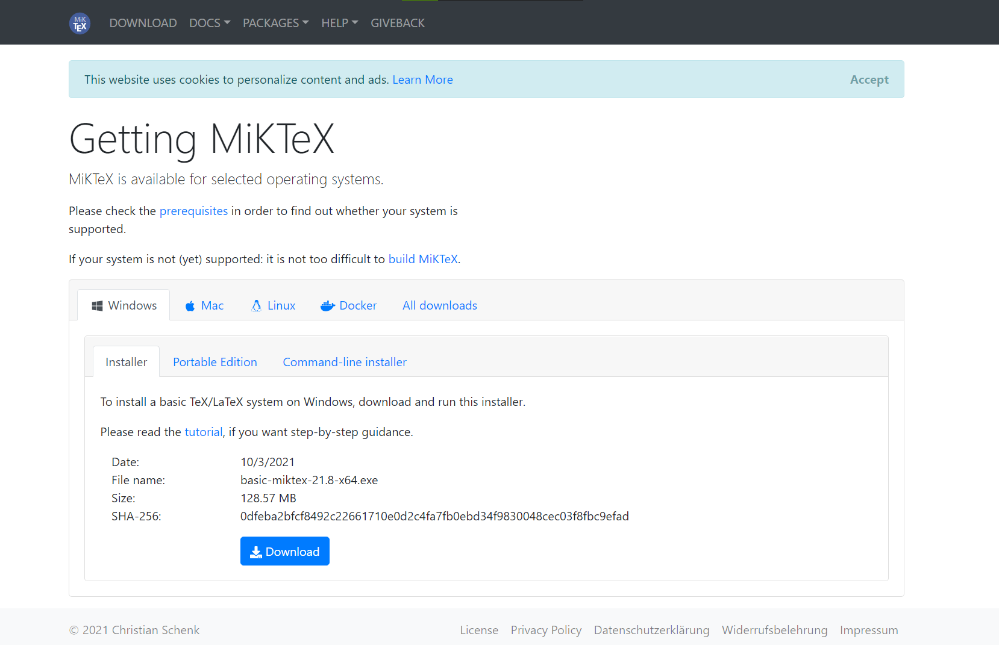
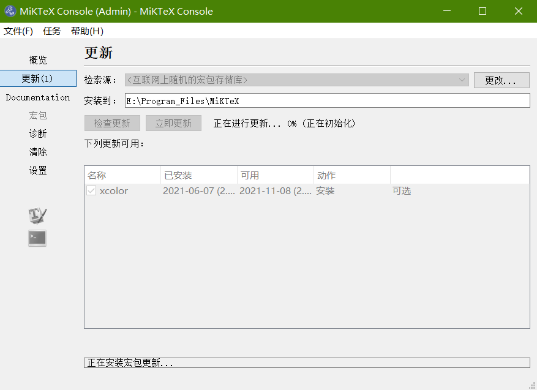
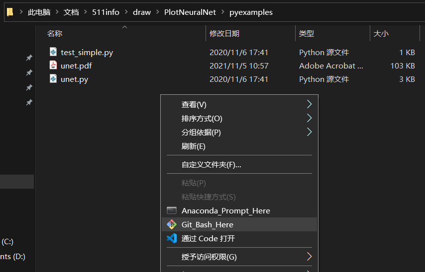
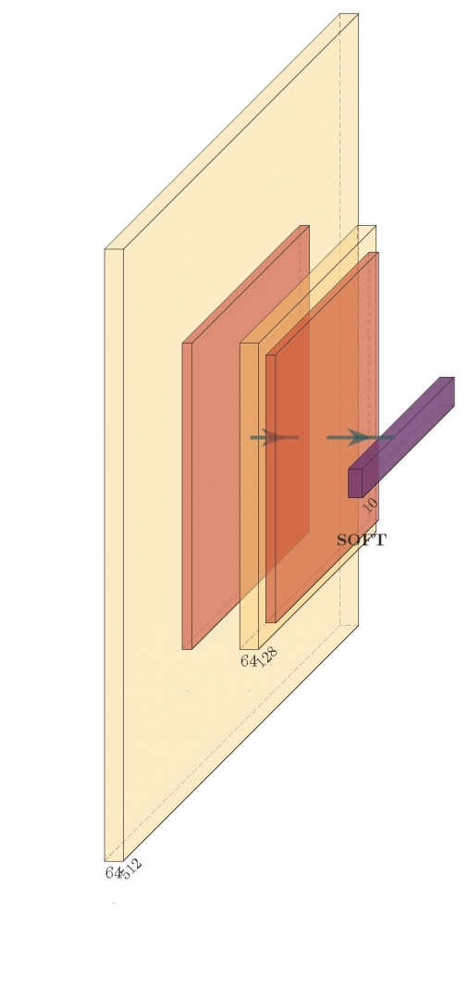

先按照GitHub上的[教程](https://github.com/HarisIqbal88/PlotNeuralNet)：

1. Download and install [MikTeX](https://miktex.org/download).
2. Download and install bash runner on Windows, recommends [Git bash](https://git-scm.com/download/win) or Cygwin([https://www.cygwin.com/](https://www.cygwin.com/))



直接下载安装



记得更新，然后这玩意本质上是拿latex进行绘图的！！！


然后git的下载与安装，不是重点，直接略过

下载它的项目后进入项目，再根据github上的提示进行操作

1. Execute the example as followed.

```
cd pyexamples/
bash ../tikzmake.sh test_simple
```



其实就是进入文件夹，再打开Git，运行 bash ../tikzmake.sh test\_simple

```
     bash <path to tikzmake.sh> <python file name in this dir>
```

     本质上就是bash Filename 作用:在当前bash环境下读取并执行FileName中的命令。该filename文件可以无"执行权限"

这个以后再说，我们先把基本用法说完，，，然后根据教程

```
$ mkdir my_project
$ cd my_project
vim my_arch.py
```

翻译过来就是：创建一个名为my\_project的新文件夹，进入该文件夹，创建一个名为my\_arch.py的python文件并打开

然后根据教程复制以下内容，并保存

```
import sys
sys.path.append('../')
from pycore.tikzeng import *

# defined your arch
arch = [
    to_head( '..' ),
    to_cor(),
    to_begin(),
    to_Conv("conv1", 512, 64, offset="(0,0,0)", to="(0,0,0)", height=64, depth=64, width=2 ),
    to_Pool("pool1", offset="(0,0,0)", to="(conv1-east)"),
    to_Conv("conv2", 128, 64, offset="(1,0,0)", to="(pool1-east)", height=32, depth=32, width=2 ),
    to_connection( "pool1", "conv2"),
    to_Pool("pool2", offset="(0,0,0)", to="(conv2-east)", height=28, depth=28, width=1),
    to_SoftMax("soft1", 10 ,"(3,0,0)", "(pool1-east)", caption="SOFT"  ),
    to_connection("pool2", "soft1"),
    to_end()
    ]

def main():
    namefile = str(sys.argv[0]).split('.')[0]
    to_generate(arch, namefile + '.tex' )

if __name__ == '__main__':
    main()
```

最后运行

```
bash ../tikzmake.sh my_arch
```

成功画出图如下所示（下个文章再仔细说怎么自己写）


