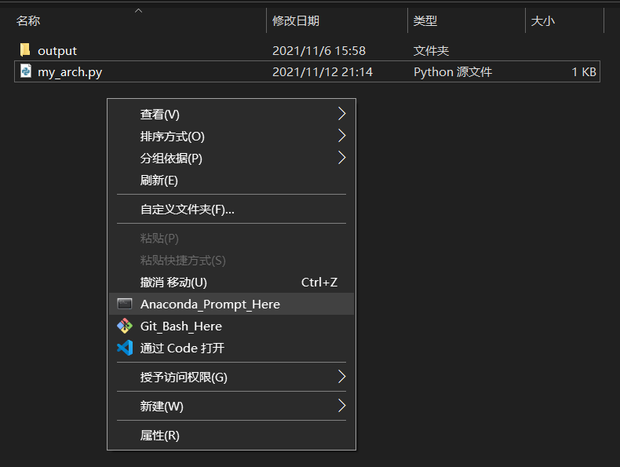

关于该思路，我们可以直接在prompt里试一下



```
python .\my_arch.py
```


同目录下增加my\_arch.tex

```
pdflatex my_arch.tex
```


同目录下增加my\_arch.aux、my\_arch.log、my\_arch.pdf

因此，直接在一个python文件里完成bash里的shell操作是完全可行的


现在，需要注意的就是保证上级目录存在layers目录下的tex文件和sty文件，就可以保证全部程序正常运行了

```
def main():
    # namefile = str(sys.argv[0]).split('.')[0]

    filename = os.path.basename(__file__).split('.')[0]  # 由于直接使用脚本运行，直接获取文件名更为合适

    to_generate(arch, filename + '.tex')

    os.system('pdflatex ' + filename + '.tex')  # 调用命令行，使用pdflatex命令，将tex生成为pdf
    os.remove(filename+'.log')  # 删除多余中间文件
    os.remove(filename+'.aux')  # 同上
    os.remove(filename+'.tex')  # 同上
```

同时，根据原有的python函数信息，我们也可以编辑自己的函数，（毕竟，，，它写这个函数，，，实在是太简单了，，，而且，，，可操作性，，，太差了！）


自己走完一遍，百度下居然没有一个人说这玩意！！！先吃鲸

pycore中的tikzeng.py是核心？？？这是核心？？？好家伙，核心是layer里的sty文件好吧！！！你家核心是咱们乱改的？？？

下个文章先分析一下，再开始魔改
